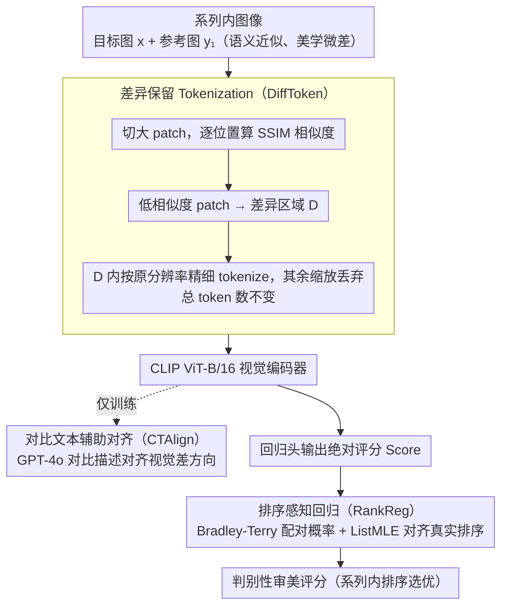

# Fine-grained Image Aesthetic Assessment: Learning Discriminative Scores from Relative Ranks

**会议**: CVPR 2026  
**arXiv**: [2603.03907](https://arxiv.org/abs/2603.03907)  
**代码**: [项目页面](https://yzc-ippl.github.io/FG-IAA/)  
**领域**: AIGC检测  
**关键词**: 细粒度美学, 相对排序, 差异保留tokenization, 排序回归, FGAesthetics

## 一句话总结

定义"细粒度图像美学评估"新任务，构建含32,217张图像/10,028个系列的FGAesthetics基准，提出FGAesQ模型：通过差异保留Tokenization（DiffToken）+ 对比文本辅助对齐（CTAlign）+ 排序感知回归（RankReg）从相对排序中学习判别性审美评分，在细粒度场景准确率0.779的同时保持粗粒度SRCC 0.770。

## 研究背景与动机

**领域现状**：图像美学评估（IAA）广泛应用于内容推荐、AI生成引导和智能摄影。现有数据集（AVA、TAD66K等）评估图像间差异显著的粗粒度美学，深度模型在此场景下已取得不错效果。

**核心痛点**：实际应用中常需从一系列语义相似但美学差异微妙的图像中挑选最佳——例如连拍照片选优、AIGC生成多样本选优、不同裁剪方案比较。现有IAA模型基于绝对评分独立评估，无法有效区分细微差异。具体挑战有二：(1) **语义干扰**——系列内图像语义高度相似，阻碍提取细粒度美学差异，尤其多数深度模型是为语义任务预训练的；(2) **差异微妙**——色彩、构图的细微变化要求模型具备鲁棒的判别性美学表征。

**现有局限**：已有细粒度相关数据集（SPS、Best Frame Selection）因未完全开源而限制了研究发展。现有模型在FGAesthetics上系列级准确率仅30%-50%，远低于粗粒度场景表现。

**切入角度**：不再独立评分，而是利用系列内图像的**相对排序关系**来学习判别性评分——粗粒度数据建立基础审美感知，细粒度数据校准回归空间以区分微妙差异。

## 方法详解

### 整体框架

这篇工作要解决的是一件很具体的事：从一串语义几乎一样、只有色彩或构图微妙差别的图像里挑出审美最优的那张——连拍选优、AIGC 同 prompt 多样本选优、同图不同裁剪方案比较都属于此类。现有 IAA 模型给每张图独立打一个绝对分，分与分之间挨得太近，根本区分不了这种细微差距。整篇工作有两根支柱：一个新基准 FGAesthetics 和一个模型 FGAesQ。

基准 FGAesthetics 刻意从三类来源采集，保证多样性：**Natural**（连拍照片或视频帧序列）、**AIGC**（同一 prompt 生成的多张图）、**Cropping**（同源图像的不同裁剪）。原始素材先过 Metrics → MLLMs → Human 三级过滤，确保系列内图像"看起来像、但分得出高下"，再由 10 位标注者两两比较给出排序标签，模糊到分不清的样本直接丢弃。最终得到 32,217 张图像、10,028 个系列，系列长度 2–10。

模型 FGAesQ 以 CLIP 的 ViT-B/16 作视觉编码器，走两阶段训练：先在粗粒度 AVA 上预训练打底，建立基本的审美感知；再在"粗粒度独立图 + 细粒度系列对"上交替联合训练——粗粒度批喂独立图和绝对评分，细粒度批喂系列内配对图和排序标签。三个模块各管一段：DiffToken 管输入表征、CTAlign 管特征对齐、RankReg 管评分校准。

### 关键设计

**1. 差异保留 Tokenization（DiffToken）：把 token 预算押在"决定排序的那几块"上**

系列内图像大部分区域几乎一样，真正决定审美高下的往往只是少数局部；如果对所有 patch 一视同仁地等分辨率 tokenize，这些关键细节会被大片相似区域稀释掉。DiffToken 的做法是先定位差异区域：把目标图 $x$ 和参考图 $y_1$ 切成大 patch，逐位置算 SSIM 相似度 $s_{i,j} = \text{SSIM}(P_{i,j}^x, P_{i,j}^{y_1})$，相似度低于阈值 $\tau = \text{percentile}(s, p)$ 的 patch 被挑出来组成差异区域集合 $D$——这些就是"美学决定性区域"。$D$ 内的 patch 按 ViT 原始分辨率精细 tokenize 以保留细节，其余区域缩放后随机丢弃，让总 token 数维持不变。之所以这样有效，是因为 LPIPS 分析显示系列内图像在 64×64 patch 级别感知相似度本就很低，美学差异天然集中在局部；混合分辨率相当于把算力压在关键区域，又用全局缩略 patch 保住整体构图。值得一提的是，推理时即便没有参考图、退化成常规 tokenize，模型仍能超越所有现有方法。

**2. 对比文本辅助对齐（CTAlign）：用"哪好哪不好"的语言给视觉表征指方向**

多数视觉编码器是为语义任务预训练的，并不知道该往"审美差异"这个方向去区分两张近乎相同的图。CTAlign 借文本来补这个方向感：用 GPT-4o 对带排序标签的图像对生成对比性推理描述 $T_1: x \leftarrow y_1$，描述里显式用对比词汇说清 $x$ 究竟好在哪；训练时最小化视觉嵌入之差与文本嵌入的余弦距离 $\mathcal{L}_{F\_align} = \cos(E_v(x) - E_v(y_1), E_t(T_1))$。文本在这里扮演人类理解美学差异的语义锚点，把"$x$ 比 $y_1$ 好在哪"翻译成视觉表征应当学到的区分方向。对齐只发生在训练阶段，推理时只跑图像编码器，不增加部署成本。

> ⚠️ 对比文本由 GPT-4o 生成，描述细节以原文为准。

**3. 排序感知回归（RankReg）：让绝对分的间距服从真实排序**

直接回归绝对分数在细粒度场景下判别力不足——同一系列的几张图分数挨得太近，排不出可靠的先后。RankReg 在回归头出绝对评分之后再加一道排序约束：用 Bradley-Terry 模型把配对优越关系写成概率 $P_{(x \succ y_1)} = \frac{e^{Score_x}}{e^{Score_x} + e^{Score_{y_1}}}$，收集系列内所有配对的概率分布 $\mathbf{P'}$，再以 ListMLE 损失把预测排序对齐到人工标注的真实排序。这条约束不只要求"谁高谁低"，还逼模型把评分间距拉开到足以反映微妙美学差距的程度——这正是单纯绝对回归学不到的判别性。

### 损失函数 / 训练策略

总损失靠一个二值指示器 $\delta$ 在粗细两端交替：$\mathcal{L} = \delta \cdot (\lambda \mathcal{L}_{F\_align} + \mathcal{L}_{F\_RR}) + (1 - \delta) \cdot \mathcal{L}_{C\_EMD}$，其中 $\lambda = 10$。粗粒度批用 EMD 损失维持基础审美感知，细粒度批用 CTAlign 对齐损失 + RankReg 排序损失校准判别空间；两端的动量更新系数分别为 0.615 和 0.8。训练流程为粗粒度预训练 3 epoch、联合训练 7 epoch，单卡 A800。

## 实验关键数据

### 主实验：FGAesthetics上IAA方法对比

| 方法 | 参数量 | Natural Pair Acc | Natural s-SRCC | AIGC Pair Acc | Cropping Pair Acc | Cropping s-SRCC |
|------|:---:|:---:|:---:|:---:|:---:|:---:|
| NIMA | 54.3M | 0.589 | 0.225 | 0.566 | 0.655 | 0.312 |
| MUSIQ | 78.6M | 0.607 | 0.233 | 0.535 | 0.731 | 0.495 |
| Charm | 85.7M | 0.672 | 0.404 | 0.616 | 0.707 | 0.432 |
| Q-Align | 8.20B | 0.711 | 0.496 | 0.646 | 0.738 | 0.487 |
| MUSIQ (FT) | 78.6M | 0.654 | 0.356 | 0.572 | 0.770 | 0.556 |
| Charm (FT) | 85.7M | 0.723 | 0.474 | 0.620 | 0.755 | 0.517 |
| **FGAesQ (w/o DiffToken)** | 86.3M | 0.773 | 0.664 | 0.688 | 0.764 | 0.537 |
| **FGAesQ (w DiffToken)** | **86.3M** | **0.779** | **0.729** | **0.709** | **0.774** | **0.590** |

### 消融实验：训练策略与模块贡献

| 配置 | 粗粒度SRCC | 粗粒度PLCC | 细粒度Pair | 细粒度Series |
|------|:---:|:---:|:---:|:---:|
| w/o Fine（仅粗粒度） | 0.713 | 0.726 | 0.578 | 0.364 |
| w/o Coarse（仅细粒度） | 0.031 | 0.050 | 0.565 | 0.299 |
| Coarse→Fine顺序训练 | 0.200 | 0.214 | 0.637 | 0.380 |
| w/o DiffToken | 0.751 | 0.760 | 0.666 | 0.423 |
| w/o CTAlign | 0.770 | 0.780 | 0.747 | 0.581 |
| w/o RankReg | 0.769 | 0.781 | 0.742 | 0.571 |
| **FGAesQ（完整）** | **0.770** | **0.781** | **0.753** | **0.600** |

### 关键发现

- FGAesQ仅86.3M参数即全面超越8.2B的Q-Align，Natural系列级SRCC 0.729 vs 0.496→提升47%
- 仅粗粒度训练→细粒度Series仅0.364；仅细粒度训练→粗粒度SRCC崩溃至0.031→两种粒度性质截然不同
- DiffToken贡献最大（Series从0.423→0.600），其次是RankReg和CTAlign
- Fine-tune现有模型在细粒度提升的同时导致粗粒度严重退化（Charm SRCC 0.777→0.470），FGAesQ通过交替训练同时保持两端性能
- 跨数据集泛化（ICAA17K、AADB、TAD66K）上FGAesQ也展现优势，尤其AADB上SRCC 0.562超越VILA的0.548

## 亮点与洞察

- **新任务定义**：正式定义"细粒度IAA"，填补了IAA领域在微妙差异判别上的空白
- **数据集设计精良**：三类图像来源确保多样性，Metrics-MLLMs-Human三级过滤+成对比较标注确保质量
- **DiffToken巧妙设计**：混合分辨率tokenization在不增加token总数的前提下提升关键区域感知，且推理时无参考图仍超越所有现有方法
- **粗细粒度平衡**：交替训练策略避免了fine-tuning导致的粗粒度灾难性遗忘

## 局限与展望

- DiffToken依赖参考图像计算差异区域→推理时需要系列上下文，独立图像评估时退化为常规tokenization
- 对比文本由GPT-4o生成→引入额外成本和可能的偏差
- 仅在ViT-B/16上验证，能否扩展到更大backbone待验证
- FGAesthetics系列长度最长10，更长序列的排序一致性评估未涉及

## 相关工作与启发

- **vs AVA/TAD66K等粗粒度基准**：独立评分+绝对MOS标签→FGAesthetics系列化+排序标签→本质不同的评估范式
- **vs MLLM方法（Q-Align/UNIAA）**：虽参数量大100倍但粗粒度感知能力不足以迁移到细粒度→说明细粒度判别需要专门设计
- **启发**：DiffToken的混合分辨率策略可迁移到其他需要关注细微差异的视觉任务（如医学影像对比、缺陷检测）；排序学习+回归联合训练范式可推广到quality assessment相关领域

## 评分

⭐⭐⭐⭐ (4/5)

综合评价：定义了有实际需求的新任务，数据集构建严谨，方法设计模块化且各有明确动机。DiffToken是亮点设计。但方法整体偏工程组合（DiffToken+CLIP+CTAlign+RankReg），关键创新集中在任务定义和数据集贡献上。

<!-- RELATED:START -->

## 相关论文

- [\[ACL 2026\] Beyond the Final Actor: Modeling the Dual Roles of Creator and Editor for Fine-Grained LLM-Generated Text Detection](../../ACL2026/aigc_detection/beyond_the_final_actor_modeling_the_dual_roles_of_creator_and_editor_for_fine-gr.md)
- [\[ACL 2025\] HACo-Det: A Study Towards Fine-Grained Machine-Generated Text Detection under Human-AI Coauthoring](../../ACL2025/aigc_detection/haco-det_a_study_towards_fine-grained_machine-generated_text_detection_under_hum.md)
- [\[AAAI 2026\] BAID: A Benchmark for Bias Assessment of AI Detectors](../../AAAI2026/aigc_detection/baid_a_benchmark_for_bias_assessment_of_ai_detectors.md)
- [\[ACL 2026\] From Scoring to Explanations: Evaluating SHAP and LLM Rationales for Rubric-based Teaching Quality Assessment](../../ACL2026/aigc_detection/from_scoring_to_explanations_evaluating_shap_and_llm_rationales_for_rubric-based.md)
- [\[ACL 2025\] Learning to Rewrite: Generalized LLM-Generated Text Detection](../../ACL2025/aigc_detection/learning_to_rewrite_generalized_llm-generated_text_detection.md)

<!-- RELATED:END -->
