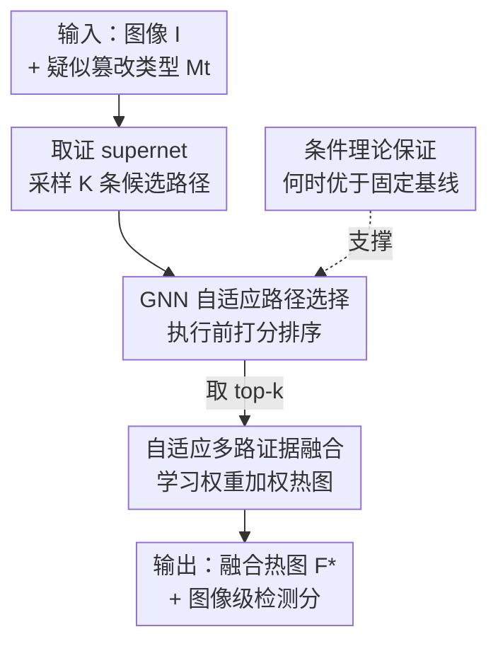

# FRAME: Forensic Routing and Adaptive Multi-path Evidence Fusion for Image Manipulation Detection

**会议**: CVPR 2026  
**arXiv**: [2605.12826](https://arxiv.org/abs/2605.12826)  
**代码**: https://github.com/kzhao5/FRAME (有)  
**领域**: 图像取证 / 篡改检测  
**关键词**: 图像篡改检测, 多路证据融合, 自适应路径选择, GNN, 取证 supernet

## 一句话总结
FRAME 把一堆传统取证算法（ELA、DCT、噪声、CFA、copy-move 等）组织成一个"取证 supernet"，对每张待检图像用 GNN 预测器挑出最合适的若干条"分析路径"并把它们的证据图融合，从而避免"单一检测器不通用 + 固定融合稀释信号"的老问题，在多个跨域测试集上同时把检测 AUC 和像素级定位刷到优于固定组合和端到端深度模型。

## 研究背景与动机

**领域现状**：图像篡改检测有两条路线。一条是传统手工取证算法——分析 JPEG 压缩不一致（ELA / DCT）、相机传感器噪声（PRNU）、CFA 插值痕迹、copy-move 重复区域等，它们可解释、原理清楚；另一条是深度学习检测器（TruFor、MMFusion、ManTraNet、CAT-Net 等），在更广篡改类型上精度更高。

**现有痛点**：传统算法每个只抓**一种**痕迹，输出（热图 / 二值掩码）往往含噪、碎片化、彼此矛盾，单看一个不稳定，多个又难以拼成一致结论；深度模型则是黑盒，决策难验证，且依赖大规模标注、对训练分布外的新篡改泛化差。

**核心矛盾**：现有"多线索融合"系统大多用**固定组合 / 固定路由**——对所有图像一视同仁地把所有算法等权相加。但不同篡改留下的取证痕迹不同（JPEG 拼接 vs copy-move 对算法的偏好完全不同），固定融合会**稀释**真正有用的专用信号，no single detector 对所有情况都可靠。

**本文目标**：让证据整合策略**随图像自适应**——给定图像和疑似篡改类型，自动选出最有用的几条分析路径再融合，而不是无脑全用。

**切入角度**：作者借用 NAS 里 **supernet** 的抽象——把每个取证算法当成可组合的模块单元，不同算法组合就是一条"候选分析路径"，于是"该用哪些算法"变成了"在 supernet 里搜哪条路径"的问题。

**核心 idea**：用一个学到的选择器（GNN）按图像上下文给候选路径打分、选 top-$k$、再用学到的权重融合它们的证据图，把"固定融合"换成"逐图自适应路由 + 融合"。

## 方法详解

### 整体框架

FRAME 把图像取证建模成"在模块化取证算法集合上做自适应路径选择"。输入是一张图像 $I$ 和疑似篡改类型 $M_t$；系统先从一个共享的取证模块池里采样 $K$ 条候选分析路径，用一个**离线训练好的 GNN 预测器**在执行前给每条路径打分（预测它在这张图上的 F1 / IoU 表现），选出 top-$k$ 条真正执行，再把它们输出的证据热图按学到的权重融合成最终热图 $F^*$，同时给出图像级检测分。

整条管线分两段：**离线训练**——对评估集里每张图采样 $K$ 条路径、实际跑出融合输出、和 ground truth 算分 $y$，构造 $\{(\mathcal{P}, I, M_t, y)\}$ 训练 GNN（最小化 MSE）；**在线推理**——采样候选路径、GNN 打分排序、执行 top-$k$、加权融合。关键好处是 GNN 只需看路径的图结构 + 图像特征 + 篡改元数据就能排序，**不必把每条路径在每张新图上都真跑一遍**。

### 关键设计

**1. 取证 supernet：把异质算法组织成可搜索的分析路径**

针对"固定组合稀释专用信号"这个痛点，FRAME 不再让所有算法等权贡献，而是借 NAS 的 supernet 抽象，把每个取证算法 $A_k$ 包成一个模块 $\mathcal{A}_k = \{alg_k(\cdot), \Theta_k\}$（$alg_k: \mathcal{I} \to \mathcal{O}_k$ 把图像映射成热图 / 掩码 / 分数）。整体定义为 supernet $\mathcal{S}_F = \{\mathbb{A}, \mathcal{C}_F\}$，其中 $\mathbb{A}$ 是模块集合、$\mathcal{C}_F$ 规定允许的组合方式，这诱导出一个有向无环图（DAG）：节点是模块、边是合法的数据流 / 融合操作。一条**分析路径** $\mathcal{P}_j = \{\mathcal{V}_j, \mathcal{E}_j\}$ 就是从这个 DAG 里采样出的子图（选哪些模块 + 怎么连），产出一张融合中间证据图 $F_j$。

与原版 NAS 不同的是，这里的"子网"不是要学的网络层，而是**现成、免训练**的手工取证算法（来自 pyIFD 工具箱）——supernet 在这里只是"自适应多路取证分析"的组织抽象，让证据整合策略可以随图像变，而不是被钉死成一个固定架构

**2. GNN 引导的自适应路径选择：执行前就预测哪条路径好**

痛点是 supernet 里路径组合爆炸，不可能对每张新图把所有路径都真跑一遍。FRAME 把"选路径"形式化为找最大化任务表现的 $\mathcal{P}^* = \arg\max_{\mathcal{P} \in \Pi(\mathcal{S}_F)} \mathrm{Perf}(\mathcal{P}, I, M_t)$，而这个量由一个 GraphSAGE 风格的轻量 GNN 预测器 $f_{\mathrm{GNN}}(\mathcal{P}, I, M_t)$ 估计——它吃路径的图表示（加上图像级特征 + 篡改元数据），吐一个标量分。训练时离线对每张图采 $K$ 条路径、实际跑出输出、和 GT 用 IoU / F1 算出真实得分 $y_{k,i}$，再让 GNN 回归这个分：

$$\mathcal{L} = \sum_{(\mathcal{P}_k, I_i, M_{t,i}, y_{k,i}) \in \mathcal{D}_{train}} \lVert f_{\mathrm{GNN}}(\mathcal{P}_k, I_i, M_{t,i}) - y_{k,i} \rVert^2$$

训练完后，GNN 就能**在执行前**给候选路径排序，省掉穷举评估。这一步正面回应"没有单个检测器对所有图都好"——选择器按图像上下文（图像内容、压缩历史、篡改类型）挑出当前最合适的路径，而不是用一套固定规则

**3. Top-$k$ 学习式证据融合：把碎片化输出拼成一致预测**

选出 top-$k$ 路径后，痛点变成"多个取证输出含噪、碎片、互相矛盾，怎么合成一张可信的图"。FRAME 用学到的权重做加权融合 $F^* = \sum_{i=1}^{k} w_i \cdot O_{(i)}$，得到既能做像素级定位、又能做图像级检测的统一热图。论文在消融里把融合方式从"均匀"→"softmax 加权"→"学习权重"逐级换，证明学习式融合最好（见消融表）。相比固定融合，它保留了每条路径的互补线索、又压住了噪声；相比 top-1 单路径，多路融合给了冗余鲁棒性——但 $k$ 不能太大，否则会混进低质量路径反而掉点

**4. 条件理论保证：刻画自适应选择"何时"真的优于固定基线**

作者没有止步于工程，而是给出两条**条件性严格改进**定理（聚焦 top-1 选择规则）。定义上下文 $X = (I, M, C)$、路径条件期望表现 $\mu(P, X)$、候选集 gap $g(X) = \mu_{(1)}(X) - \mu_{(2)}(X)$。在三类假设下——预测器在候选集上高概率一致准确（误差 $\le \varepsilon(N_{tr}, \delta)$）、Tsybakov/no-tie 条件 $\mathbb{P}(g(X) \le t) \le c_0 t^\alpha$ 控制"最优与次优路径靠太近"的频率、以及某基线在一个非可忽略子集上被证明次优（概率 $\ge p$、margin $\ge \gamma$）——只要打分误差足够小，例如 $\varepsilon(N_{tr}, \delta) < \left(\frac{p_{\mathrm{avg}} \gamma_{\mathrm{avg}}}{C_\alpha}\right)^{1/(\alpha+1)}$（$C_\alpha = 2^{\alpha+1} c_0$），就能以概率 $\ge 1-\delta$ 保证学到的选择器在期望表现上**严格优于**均匀全融合（定理 1）和最优单算法（定理 2）。直觉是：当上下文异质、固定基线在相当一部分图上系统性次优时，一个够准的上下文相关选择器一定能占到便宜。⚠️ top-$k$ 融合变体超出该理论保证范围，论文明确说它是经验扩展

## 实验关键数据

**协议**：只在 CASIA v2（8,831 训练 / 1,918 验证）上训练 GNN 选择器 + 融合模块（约 44,000 参数），在四个**外部**测试集上零样本评估泛化：CASIA v1（1,754 张，主基准）、Coverage（200 张，copy-move）、Columbia（363 张，仅图像级检测）、RealisticTampering（440 张，跨相机真实拼接）。深度基线全用官方预训练 checkpoint，不在 CASIA v2 上微调。主实验 $K=50$、$k=5$。

### 主实验（Table 1，跨四个测试集对比）

| 方法 | CASIA v1 Det.AUC | CASIA v1 F1/mIoU | Coverage Det.AUC | RealisticTamp. Det.AUC | Columbia Det.AUC |
|------|------|------|------|------|------|
| Best single pyIFD | 0.612 | 0.284 / 0.198 | 0.624 | 0.598 | 0.841 |
| Uniform-all pyIFD | 0.574 | 0.251 / 0.172 | 0.587 | 0.561 | 0.817 |
| Heuristic-$K$ + uniform | 0.628 | 0.302 / 0.214 | 0.638 | 0.612 | 0.856 |
| XGB-Ensemble (pyIFD) | 0.674 | 0.342 / 0.243 | 0.683 | 0.651 | 0.876 |
| ManTraNet | 0.651 | 0.337 / 0.241 | 0.663 | 0.638 | 0.897 |
| CAT-Net | 0.678 | 0.368 / 0.263 | 0.691 | 0.661 | 0.916 |
| TruFor（最强深度基线） | 0.724 | 0.408 / 0.294 | 0.718 | 0.687 | **0.924** |
| **FRAME (ours)** | **0.741** | **0.421 / 0.308** | **0.754** | **0.712** | 0.908 |

- 对**同源手工基线**：FRAME 在 CASIA v1 上比最强的 XGB-Ensemble 高 0.067 AUC / 0.079 F1 / 0.065 mIoU。RF→XGB 差距很小，但 XGB→FRAME 差距大得多，说明增益主要来自**逐图自适应路由**，而非"学一个更强的固定组合"。
- 对**深度基线**：FRAME 在 CASIA v1 / Coverage / RealisticTampering 三个需要定位的集上同时拿下最佳检测 AUC 和定位分；比 TruFor 在 CASIA v1 高 0.017 AUC、0.013 F1、0.014 mIoU。唯一例外是仅做检测的 Columbia，TruFor（0.924）略高于 FRAME（0.908）。
- 一个反直觉现象：朴素的 Uniform-all 融合（0.574）反而**不如** Best single（0.612），印证了"无脑全平均会稀释有用证据"的核心动机。

### 消融实验（Table 2，CASIA v1，逐级加组件）

| 配置 | $K$ | 选择 | 融合 | Det.AUC | F1 | mIoU |
|------|------|------|------|------|------|------|
| Uniform-all pyIFD | all | none | uniform | 0.574 | 0.251 | 0.172 |
| Heuristic-$K$ | 50 | heuristic | uniform | 0.628 | 0.302 | 0.214 |
| Top-1 selected | 50 | learned | none | 0.684 | 0.348 | 0.251 |
| Top-$k$ + uniform fusion | 50 | learned | uniform | 0.712 | 0.387 | 0.281 |
| Top-$k$ + softmax fusion | 50 | learned | softmax | 0.724 | 0.403 | 0.293 |
| **Top-$k$ + learned fusion (ours)** | 50 | learned | learned | **0.741** | **0.421** | **0.308** |

### 关键发现
- **学习式选择贡献最大**：从 Heuristic（0.628）到 Top-1 learned（0.684）一步就涨 0.056 AUC——选择器能挑出比启发式规则更强的路径，这是性能跃迁的主力。
- **融合是第二级增益**：learned 选择上加 uniform 融合再涨 0.028 AUC，softmax 再 +0.012，learned 融合再 +0.017；逐级递减但都正。完整模型比 Uniform-all 基线高 0.167 AUC / 0.170 F1 / 0.136 mIoU。
- **超参稳定且有甜点**：候选数 $K$ 从 5→50，AUC 0.698→0.741、F1 0.371→0.421、mIoU 0.264→0.308；但 $K=50→100$ 不再涨反而微跌，推理时间却从 9.23s 翻倍到 18.47s/图。融合数 $k$ 在 5 处最优，$k=10$ 时混入低质量路径反而掉点——多路融合好，但不是越多越好。

## 亮点与洞察
- **把 NAS 的 supernet 抽象迁到"免训练算法编排"上**：原版 supernet 搜的是网络层，这里搜的是现成手工取证算法的组合——一个很巧的概念挪用，让"该用哪些算法"这个老问题第一次有了可学习、可搜索的统一框架。
- **执行前打分省掉穷举**：GNN 看路径图结构就能预测表现，不必把每条路径真跑一遍，这是让"路径空间组合爆炸"变得可行的关键工程点，可迁移到任何"候选 pipeline 太多、逐个跑太贵"的场景。
- **理论给出了"自适应何时有用"的边界条件**：no-tie + 基线在子集上次优 + 选择器够准，三者凑齐才保证严格改进——这比"我们方法更好"的空泛叙述扎实得多，也诚实地把 top-$k$ 融合划在保证之外。
- **"全平均反而更差"是个值得记住的反直觉点**：在异质证据融合里，无差别平均会稀释专家信号，逐样本路由 > 固定组合，这个洞察对很多多专家 / 多工具系统都成立。

## 局限与展望
- **作者承认**：当前模块池针对的是传统编辑痕迹（拼接、copy-move、JPEG 重压缩），这些痕迹绑定相机成像管线，而 **AI 生成 / 扩散修复**的内容可能根本不留这类痕迹。不过因为 FRAME 是可扩展模块池而非固定架构，原则上可以接入针对生成痕迹的取证模块。
- **理论与实验有缝**：形式化保证只覆盖 top-1 选择，而实际用的是 top-$k$ 融合，后者的额外增益只能算经验观察，没有理论背书。
- **自己发现**：性能上限受限于 pyIFD 池里手工算法的天花板——FRAME 是"更聪明地组合现有算法"，并不会创造新的取证信号；若所有候选算法对某种新篡改都失明，再好的路由也救不回来。
- **元数据依赖**：方法吃"疑似篡改类型 $M_t$"作为上下文，但真实部署中篡改类型往往未知，论文未充分讨论 $M_t$ 缺失或错标时的鲁棒性。

## 相关工作与启发
- **vs TruFor / MMFusion / CAT-Net（端到端深度检测器）**：它们用一个大模型黑盒地学复杂视觉特征、靠大数据训练；FRAME 只训约 44k 参数的轻量选择器 + 融合器，编排免训练手工算法，可解释性更强、在需要定位的跨域集上更优，但在纯检测的 Columbia 上略逊于 TruFor。
- **vs RF/XGB-Ensemble（学习式固定组合）**：它们在拼接后的 pyIFD 输出上学一个**全局固定**组合；FRAME 学的是**逐图自适应**路由。实验显示 XGB→FRAME 的差距远大于 RF→XGB，证明增益来自"按图选路"而非"组合更强"。
- **vs NAS / supernet（思想来源）**：借用其"大网含多子网、搜最优配置"的抽象，但搜索对象从可训练网络层换成免训练取证算法，把架构搜索的范式平移到了"工具编排"。

## 评分
- 新颖性: ⭐⭐⭐⭐ 把 NAS supernet 抽象迁到取证算法编排、并配上条件理论保证，组合角度新颖
- 实验充分度: ⭐⭐⭐⭐ 四个跨域外部测试集 + 同源手工 / 学习式 / 深度三组基线 + 选择/融合消融 + $K$/$k$ 敏感性，覆盖较全；但篡改类型偏传统、未测 AI 生成内容
- 写作质量: ⭐⭐⭐⭐ 动机—方法—理论—实验逻辑清晰，诚实标注了 top-$k$ 超出理论范围
- 价值: ⭐⭐⭐⭐ 为"自适应多工具取证"提供了可学习框架和理论边界，对多专家融合类系统有迁移价值

<!-- RELATED:START -->

## 相关论文

- [\[CVPR 2026\] ReAlign: Generalizable Image Forgery Detection via Reasoning-Aligned Representation](realign_generalizable_image_forgery_detection_via_reasoning-aligned_representati.md)
- [\[CVPR 2026\] Quality-Aware Calibration for AI-Generated Image Detection in the Wild](quality-aware_calibration_for_ai-generated_image_detection_in_the_wild.md)
- [\[CVPR 2026\] PPM-CLIP: Probabilistic Prompt Modeling for Generalizable AI-Generated Image Detection](ppm-clip_probabilistic_prompt_modeling_for_generalizable_ai-generated_image_dete.md)
- [\[ACL 2026\] Frame In, Frame Out: Measuring Framing Bias in LLM-Generated News Summaries](../../ACL2026/aigc_detection/frame_in_frame_out_measuring_framing_bias_in_llm-generated_news_summaries.md)
- [\[ICML 2026\] CORE: Conflict-Oriented Reasoning for General Multimodal Manipulation Detection](../../ICML2026/aigc_detection/core_conflict-oriented_reasoning_for_general_multimodal_manipulation_detection.md)

<!-- RELATED:END -->
