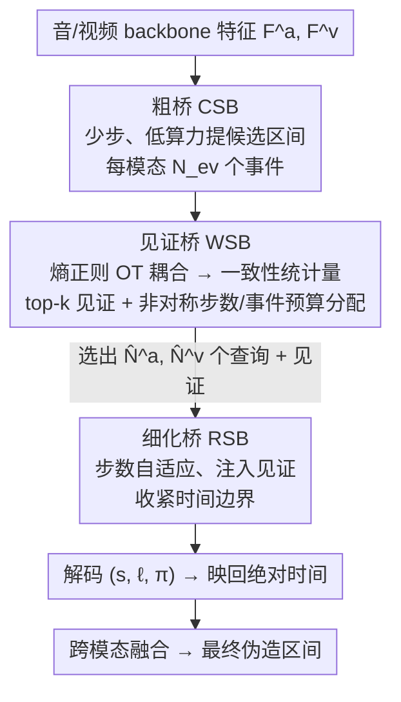

# Inconsistency-aware Multimodal Schrodinger Bridge for Deepfake Localization

**会议**: CVPR 2026  
**论文**: [CVF Open Access](https://openaccess.thecvf.com/content/CVPR2026/html/Xiong_Inconsistency-aware_Multimodal_Schrodinger_Bridge_for_Deepfake_Localization_CVPR_2026_paper.html)  
**代码**: 待确认  
**领域**: AIGC 检测 / 深度伪造取证  
**关键词**: 深度伪造定位, 薛定谔桥, 音视频取证, 跨模态一致性, 最优传输

## 一句话总结
IaMSB 把音视频深度伪造的「时间区间定位」重新表述成一个薛定谔桥（Schrödinger Bridge）生成问题——用桥的传输代价直接读出跨模态一致性分数，再据此把计算步数非对称地分配给更可疑的那个模态，从而在严格 IoU（AP@0.95）上比现有方法高 3~10%。

## 研究背景与动机

**领域现状**：音视频深度伪造定位要求输出区间级（interval-level）证据——伪造从第几秒到第几秒——作为可审计的取证依据，比视频级真假标签有用得多。当前主流是「对称融合」：用阶数不变、等深度的跨模态融合模块加时间细化头，把音、视频两路对等地融合后再定位。

**现有痛点**：现实中两个模态高度不对称。伪造可能是单侧的（只改了画面、音频是真的，或反之），也可能是异步的（音视频篡改不在同一时间）。对称融合在这种情况下会带来三个具体问题：(i) **负迁移**——干净（未伪造）的那一路把噪声注入伪造路，诱发误定位；(ii) **算力错配**——融合层太多会在干净模态上浪费计算，太少又让伪造模态收敛不动；(iii) **分辨率受限**——融合本身计算开销大（序列建模常是 $O(S^2)$），在算力约束下被迫牺牲时间分辨率，恰恰在最需要高精度定位的区间失准。

**核心矛盾**：跨模态融合既可能「帮忙」（互补证据）也可能「添乱」（噪声传播），而对称、均匀的融合无法区分这两种情况，更无法把有限的细化预算放在真正可疑的模态/时段上。

**本文目标**：在一个框架里同时做三件事——估计跨模态一致性、筛选真正有用的跨模态证据、把计算步数按需调度——并最终输出对齐的区间级定位。

**切入角度**：生成式解码器（扩散类）能显式控制推理步数预算、加速收敛，启发了「非对称融合」。但已有扩散式定位缺两样东西：一个能处理多模态异步的**步数调度器**，以及一个校准过的、时间局部的**跨模态差异度量**。作者发现薛定谔桥恰好补上这两块。

**核心 idea**：把定位建模成「把源分布传输到目标分布」的薛定谔桥。SB 作为随机控制问题，**不需要显式加噪/去噪循环**就能在两个端点分布间传输，并直接量化分布差异。于是桥的终端目标天然给出一个跨模态一致性分数（$O(1)$ 拿到），用它筛证据、分预算；同时把 SB 看成步数可控的扩散式解码器，对筛过的证据做步数自适应融合。这是首个把扩散/桥模型用于音视频深度伪造定位的工作。

## 方法详解

### 整体框架
输入是音频、视频两路 backbone 提取的 token 序列 $F^a, F^v$（各自有时间粒度 $\Delta t^a, \Delta t^v$）。模型为每个模态 $m\in\{a,v\}$ 的第 $k$ 个事件输出归一化起始时间 $s^m_k$、时长 $\ell^m_k$、置信度 $\pi^m_k$，再映回绝对时间轴。

IaMSB 是一个**级联三桥**结构：① **粗桥 CSB** 用极少步、低算力的更新为每个模态提出候选区间；② **见证桥 WSB** 做一次静态最优传输（OT）耦合，算出跨模态统计量、筛选「见证」证据，并把总步数预算和事件预算**非对称地**分配到两个模态；③ **细化桥 RSB** 对被选中的查询做步数可调的精细化，注入跨模态见证，在统一预算下输出对齐的精确区间。整条链的关键在于 WSB 这个瓶颈：一致性分数是 $O(1)$ 拿到的，细化桥才是 $O(T)$ 的——把昂贵计算只花在传输残差大（即更可疑）的地方。

### 关键设计

**1. 一致性即传输：用薛定谔桥的传输代价直接量化跨模态一致性，省掉额外对齐网络**

针对「需要一个校准的跨模态差异度量」这一缺口。SB 给定两端边缘分布 $\nu_0, \nu_1$，在以 Wiener 过程为参考测度 $R$ 的路径空间上求 $\min_Q \text{KL}(Q\|R)$ s.t. $Q_0=\nu_0, Q_1=\nu_1$，等价于一个受控扩散 $dZ_t = u_t(Z_t)dt + \sigma dW_t$，控制能量 $\mathcal{E}(Q)=\mathbb{E}_Q\int_0^1 \frac{\|u_t\|^2_2}{2\sigma^2}dt$。作者让 $\nu_0$ 编码一个稀疏区间先验、$\nu_1(\cdot|X)$ 编码观测对齐的后验（本模态或另一模态的 GT），桥用 $S$ 步传播子 $\Phi_S$ 把 $\nu_0$ 推到 $\nu_1$。关键在于这对 $(\mathcal{E}(Q), S^\star(\varepsilon))$——控制能量与「达到容差 $\varepsilon$ 所需最小步数」$S^\star(\varepsilon)=\min\{S: D(\Phi_S(\nu_0|X), \nu_1(\cdot|X))\le\varepsilon\}$——被当作跨模态资源分配与交互的显式尺度：一致的事件「更容易到达」（少步即可），不一致/单侧伪造则需更多步。这样一致性分数不再靠一个单独训练的对齐网络，而是从桥的传输几何里**免费**读出，且是校准的「可达性」。

**2. 耦合即瓶颈：静态熵正则 OT 当轻量隐式交互瓶颈，统一预算分配 + 抑制噪声传播**

针对负迁移（问题 i）和算力错配（问题 ii）。WSB 对两模态的粗事件做一次静态 SB——即熵正则最优传输耦合 $\Pi=\arg\min_{\Pi\ge0}\langle\Pi,C\rangle+\sum\Pi_{pq}\log\Pi_{pq}$，其中代价 $c_{pq}=\lambda_t|s^a_p-s^v_q|+\lambda_\ell|\ell^a_p-\ell^v_q|+\lambda_o(1-\text{IoU})+\lambda_\pi(\pi^a_p-\pi^v_q)^2$（$\lambda$ 均可学）。从耦合矩阵 $\Pi$ 导出一组统计量：加权残差 $R$、未匹配率 $U=1-T$、归一化耦合熵 $H$、区间不一致率 $C=1-\sum\Pi_{pq}\text{IoU}$。再对 $\tilde\Pi$ **按行只保留 top-k**（其余置零），把对侧潜变量收成见证集 $P^m$——这就是「瓶颈」：只让最相关的少量跨模态证据通过，从结构上**堵住**干净模态的噪声大批涌入伪造模态。统计量 $\Phi_w=[R,T,U,H,C]$ 进一步组合成方向性分数 $\hat S=[\hat S_{a|v}, \hat S_{v|a}]$，结合两模态先验控制能量差，经 softmax 得到权重 $(w_v, w_a)$，再把总步预算 $S_{tgt}$ 和事件预算 $N_{ev}$ 按整数近似**非对称分配**：$S^m_r=2\lfloor w_m S_{tgt}/2 + 0.5\rfloor$，$\hat N^m=2\lfloor w_m N_{ev}/2+0.5\rfloor$。WSB 只和事件交互、与时间无关，复杂度 $O(1)$。

**3. 级联 SB 定位器：粗桥提案 + 步数自适应细化桥收紧边界**

针对分辨率受限（问题 iii）。**粗桥 CSB** 用残差步更新 $Z^m_{t+1}=Z^m_t+\Delta u^m_c(U^m_t)$（其中 $U^m_t=\text{LN}(Z^m_t+\text{MHA}(Z^m_t, F^m, F^m))$，$\Delta=1/S_c$），固定跑 $S_c$ 步出 $N_{ev}$ 个候选；它复杂度 $O(N_{ev}L^m)$，比标准跨注意力 $O(L^aL^v)$ 便宜，且不牺牲任一模态的时间分辨率。**细化桥 RSB** 对 WSB 选中的查询 $\tilde Z^m_{out}$，先自注意力、再把对侧高置信见证 $\hat P^m$ 以交叉注意力注入 $R^m_{wit,n}=\text{MHA}(U^m_{t,2}[n], \hat P^m[n], \hat P^m[n])$，合并记忆后做残差推进，用步长 $\Delta=1/S^m_r$ 收紧边界。因为每个被选 token 恰好跑 $S^m_r$ 步，且步数由 WSB 按可疑度分配，算力被精准砸在传输残差大的边界上——这正是它在严格 IoU 上拉开差距的机制。三阶段每步成本都随时间长度**线性**缩放，整体把 $O(1)$ 的一致性分数和 $O(T)$ 的细化桥耦合起来。

### 损失函数 / 训练策略
定位损失含匹配、负样本、覆盖三项：$\mathcal{L}^m_{loc}=\sum_{(p,g)\in M^m}[(1-\text{EIoU})+H(p,g)+\text{BCE}(\pi^m_p,1)]+\sum_{k\in U^m}\text{BCE}(\pi^m_k,0)+\sum_g\exp(-\beta\max_p\text{IoU}(p,g))$（$H$ 为 Huber）。再加两项：**方向排序损失** $\mathcal{L}_{rank}=\max(0, m_0-(\hat S_{a|v}-\hat S_{v|a}))$ 给方向性不确定度施加可识别、校准的排序，把预算导向更难的一侧；**步数-价值正则** $\mathcal{L}_{svn}$ 用每模态实际预算 $\hat N^m S^m_r$ 加权，惩罚「多加一个 $\rho$ 步反而变差」的违例和跨模态不均衡。总损失 $\mathcal{L}=\sum_m\mathcal{L}^m_{loc}+\lambda_{rank}\mathcal{L}_{rank}+\lambda_{svn}\mathcal{L}_{svn}$，$\lambda_{rank}=\lambda_{svn}=0.2$。CSB 固定 2 步、$N_{ev}$ 绑定评测 AR@n；WSB 单次 Sinkhorn、top-16 见证；RSB 总步预算 $S_{tgt}=12$；编码器 ViT-S（视频 VideoMAE、音频 WavLM 初始化，大部分冻结）。

> 自定义统计量说明：$R$=加权传输残差，$U$=未匹配率，$H$=耦合熵，$C$=区间不一致率，$\hat S_{a|v}/\hat S_{v|a}$=方向性一致性分数（数值大表示该方向更可疑）。⚠️ 部分公式排版以原文为准。

## 实验关键数据

### 主实验
在 LAV-DF、TVIL（仅视觉单侧伪造）、AV-Deepfake1M（长片 + 部分伪造）三个基准上评测。核心指标是严格 IoU 下的 AP@0.95（边界精度）与不同提案预算下的 AR。

| 数据集 | 方法 | AP@0.5 | AP@0.95 | AR@10 |
|--------|------|--------|---------|-------|
| LAV-DF | UMMAFormer | 98.83 | 37.61 | 92.10 |
| LAV-DF | MMMS-BA | 97.56 | 39.02 | 89.42 |
| LAV-DF | RegQAV | 94.10 | 27.60 | 91.70 |
| LAV-DF | **IaMSB** | **99.33** | **55.92** | **94.68** |
| TVIL | UMMAFormer | 88.68 | 62.43 | 87.09 |
| TVIL | MMMS-BA | 96.87 | 28.43 | 88.61 |
| TVIL | **IaMSB** | **96.89** | **65.62** | **90.05** |

在 AV-Deepfake1M（更难的长片 + 部分伪造）上：

| 方法 | AP@0.75 | AP@0.90 | AP@0.95 | AR@5 |
|------|---------|---------|---------|------|
| DiMoDif | 75.95 | 28.72 | 5.43 | 76.64 |
| RegQAV | 81.86 | 41.98 | 12.57 | 85.97 |
| **IaMSB** | **82.03** | **45.15** | **23.01** | **86.03** |

最显著的提升集中在最严格的 AP@0.95：LAV-DF 上从次优 39.02 提到 55.92，AV-Deepfake1M 上从 12.57 几乎翻倍到 23.01——印证「把有限细化放对位置」直接决定边界精度。

### 消融实验
LAV-DF 官方协议下评四个变体（✓ 表示保留该桥）：

| CSB | WSB | RSB | AP@0.95 | AR@10 | 说明 |
|-----|-----|-----|---------|-------|------|
| ✓ | ✓ | ✓ | **55.92** | **94.68** | 完整模型 |
| – | ✓ | ✓ | 32.51 | 87.83 | 去粗桥，缺提案、召回受损 |
| ✓ | – | – | 22.07 | 85.25 | 仅 CSB，模态不均衡误差被放大 |
| ✓ | – | ✓ | 23.39 | 85.77 | 去 WSB，丢跨模态筛选 + 预算分配，全面退化 |

### 关键发现
- **WSB 是命门**：去掉它（无跨模态瓶颈与预算分配）AP@0.95 从 55.92 暴跌到 23.39，证明「选择性证据路由 + 非对称预算」才是高精度的来源，而非更多融合。
- **见证 top-k 不是越大越好**：$k$ 从 2→16 AP@0.95 升到峰值 55.92，再增到 32/64 反而降到 54.35/53.97——窄瓶颈欠曝光证据、宽瓶颈引入噪声，呼应「选择性交互优于无差别交换」（问题 i）。
- **粗步 $S_c$ 在 2 步即饱和**：$S_c$ 从 1→2 提升最明显（AP@0.95 52.87→55.92），再往上（3 步 55.98）落在实验方差内，故默认 2 步。
- **单侧 vs 异步场景行为不同**：LAV-DF 跨模态不一致明显，传输线索信息量大，非对称步数分配带来清晰的 AP@0.95 增益；TVIL 是纯视觉篡改、跨模态证据弱，预算分配主要提召回与中段 IoU。
- **成本可控**：单步 CSB 仅 0.428 GFLOPs、单次 OT 迭代 $3\times10^{-5}$ GFLOPs、单步 RSB 1.01 GFLOPs（avg 设置），把重计算严格限制在细化桥。

## 亮点与洞察
- **把"一致性度量"和"算力预算"统一在传输几何里**：薛定谔桥的「达到目标所需步数 $S^\star$」既是一致性分数又是预算信号，一举消掉了「单独训一个对齐网络 + 单独设计调度器」的两件事，这种「让度量自带调度语义」的思路很巧。
- **瓶颈作为防负迁移的结构手段**：top-k 稀疏耦合不是靠损失去"软约束"噪声，而是从信息通路上直接限流，比加正则更鲁棒，可迁移到任何「干净模态会污染脏模态」的多模态任务。
- **首个把扩散/桥模型用于音视频伪造定位**：相比把边界当「噪声查询去噪」的扩散式定位，SB 不需显式加噪去噪、且直接给出分布差异，定位问题的建模更省也更可控。

## 局限与展望
- **跨模态弱证据场景收益有限**：作者承认在 TVIL 这类纯视觉单侧篡改上，跨模态传输线索很弱，严格 IoU 的收紧更依赖视觉专用解码器，IaMSB 的优势主要落在召回。
- **均匀 top-k=16 引入冗余**：LAV-DF 上 AR@20 因固定 top-k 可能含冗余而被压低，提示需要更自适应的 $k$。
- **长片注意力仍是 $O(S^2)$ 瓶颈**：尽管把重计算压到细化桥，序列长度大时注意力开销仍主导，激进降采样又会侵蚀高 IoU 边界精度——这是它缓解但未根除的张力。
- **改进思路**：让见证 top-k 随传输残差自适应、把 SB 的连续时间性质用到长片分段调度上。

## 相关工作与启发
- **vs UMMAFormer / MMMS-BA（对称融合）**：它们用等深度跨模态注意力强化耦合，但在模态不均衡/异步下会传播噪声、且把算力均摊到各段；IaMSB 用 OT 瓶颈选择性交互 + 非对称预算，专攻严格 IoU。
- **vs RegQAV（查询式解码）**：RegQAV 用 register token 稳定查询解码、在固定提案预算下收紧边界；IaMSB 不固定预算，而是按可疑度自适应分配步数，故 AP@0.95 领先更多。
- **vs DiMoDif（话语级不一致）**：DiMoDif 借语义冲突筛假设；IaMSB 在分布传输层面量化不一致，粒度更细、且与算力调度耦合。
- **vs 扩散式边界发现**：标准 score-based 扩散把边界当去噪查询；SB 提供熵正则传输与校准的进度度量，天然把检测置信度和计算预算耦合起来。

## 评分
- 新颖性: ⭐⭐⭐⭐⭐ 首个把薛定谔桥用于音视频伪造定位，「传输代价即一致性即预算」的统一视角很有想法。
- 实验充分度: ⭐⭐⭐⭐ 三基准 + 结构/敏感性/成本全套消融；但 top-k 冗余、长片 $O(S^2)$ 等已知短板留待解决。
- 写作质量: ⭐⭐⭐ 思路有深度，但记号密集、公式排版（缓存）凌乱，可读性偏低。
- 价值: ⭐⭐⭐⭐ 严格 IoU（AP@0.95）大幅提升对取证场景的"可审计边界"意义直接，且把生成式桥引入伪造定位开了新方向。

<!-- RELATED:START -->

## 相关论文

- [\[CVPR 2026\] Quality-Aware Calibration for AI-Generated Image Detection in the Wild](quality-aware_calibration_for_ai-generated_image_detection_in_the_wild.md)
- [\[CVPR 2026\] Learning Forgery-Aware Lip Representations Without Forgery Priors](learning_forgery-aware_lip_representations_without_forgery_priors.md)
- [\[ICML 2026\] CORE: Conflict-Oriented Reasoning for General Multimodal Manipulation Detection](../../ICML2026/aigc_detection/core_conflict-oriented_reasoning_for_general_multimodal_manipulation_detection.md)
- [\[ACL 2026\] GigaCheck: Detecting LLM-generated Content via Object-Centric Span Localization](../../ACL2026/aigc_detection/gigacheck_detecting_llm-generated_content_via_object-centric_span_localization.md)
- [\[CVPR 2026\] Locate-Then-Examine: Grounded Region Reasoning Improves Detection of AI-Generated Images](locate-then-examine_grounded_region_reasoning_improves_detection_of_ai-generated.md)

<!-- RELATED:END -->
