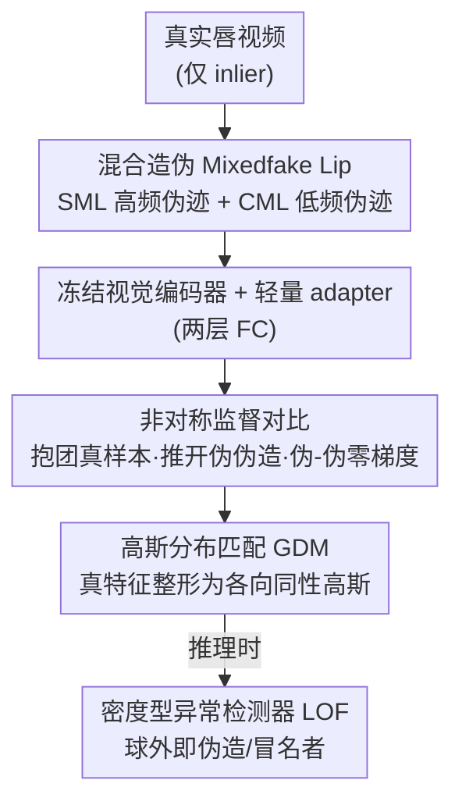

# Learning Forgery-Aware Lip Representations Without Forgery Priors

**会议**: CVPR 2026  
**论文**: [CVF Open Access](https://openaccess.thecvf.com/content/CVPR2026/html/Chen_Learning_Forgery-Aware_Lip_Representations_Without_Forgery_Priors_CVPR_2026_paper.html)  
**代码**: 原文未提供  
**领域**: 伪造检测 / 唇语认证 / 单类表示学习  
**关键词**: 视觉说话人认证、TFG 伪造、无伪造先验、非对称对比学习、高斯分布匹配

## 一句话总结
针对说话人认证系统被个性化"说话人脸生成"(TFG)伪造攻破的问题，本文提出一个**只用真实视频训练、完全不依赖任何伪造样本**的检测器：靠真帧混合伪造 + 非对称对比 + 高斯正则把真实唇动特征压成一个紧致球面，把球外一切（伪造和冒名者）当离群点，在 8 种现代伪造、10 个 SOTA 对比下把错误率压低 10% 以上。

## 研究背景与动机

**领域现状**：视觉说话人认证（Visual Speaker Authentication, VSA）用嘴唇动态而非全脸来验证身份——既保留了身份区分度，又比全脸少暴露隐私。现代 VSA 在内容识别之后接一个"冒名检测器"，本质是一个在已知真/假视频上做监督训练的分类器，干净场景下准确率常报到 99% 以上。

**现有痛点**：生成模型进步太快。个性化 TFG（如 ER-NeRF、MimicTalk、PersonaTalk）能从一段短参考视频甚至单图，渲染出嘴型与语音精准同步的逼真说话人脸。这类伪造在特征空间里和目标用户的真样本**纠缠在一起**，比人类冒名者或通用伪造离真身份更近，靠"已知伪造先验"根本切不开。监督分类器因此有两个硬伤：① 过拟合到已知冒名者，对任意贴近真样本的未知伪造束手无策；② 一旦缺乏有效伪造先验，决策边界会系统性地偏向极少数已知冒名者，面对快速演化的个性化 TFG 直接崩盘。

**核心矛盾**：检测器的能力被绑死在"伪造先验是否丰富且有代表性"上，而伪造分布是开放、无界、不断演化的——用有限、有偏的假样本去界定一个无限的离群空间，注定泛化不动。

**本文目标**：放弃伪造先验这条路，转而**精确建模真样本的紧致边界**，把任何落在边界外、带有异常特征统计的样本（无论是未见伪造还是人类冒名者）都判为离群。

**切入角度**：一个关键观察——同一用户的真样本方差极小；而伪造再像，也因生成痕迹保留着细微偏离。于是只要把真特征压成一个足够紧、结构良好的分布，"球外即假"就成立。

**核心 idea**：彻底丢掉会引入系统性偏置的伪造先验，用"真帧混合造伪 + 非对称对比 + 高斯正则"协同雕刻一个紧致的真样本特征空间，再用密度型异常检测器把离群样本剔除。

## 方法详解

### 整体框架
方法是一个三段协同的表示学习管线，**只在原有 VSA 视觉编码器后接一个轻量 adapter（两层全连接）做训练，编码器本体冻结**，因此新用户注册时适配代价极小。第一段不靠任何深度生成器，直接对真实唇帧做混合，造出两类"伪伪造"样本来撑开训练空间；第二段用非对称监督对比损失把真样本（inlier）抱团、把伪伪造推开，但**不约束伪造与伪造之间的关系**；第三段再加一个高斯分布匹配正则，把真特征整形成各向同性高斯，便于后续做密度建模。训练目标是 $L = L_{asym} + \gamma L_{gdm}$。推理时换上密度型异常检测器（如 LOF）建模真样本分布，球外样本一律拒绝。

### 关键设计

**1. 混合造伪：不用生成器，靠真帧混合模拟伪造痕迹**

痛点很直接：真实世界能拿到的离群样本只有"其他用户"，变化有限、对检测帮助小；而真去训各种 TFG 生成器既不现实也跟不上演化。本文借鉴单类分类里"虚拟离群点"的思路，**只对真实唇帧做混合**造出 mixedfake lip，针对性模拟伪造视频里典型的高频/低频伪迹。混合公式为 $I^{mix}_t(i,j) = \alpha_t(i,j)\, I^{A}_t(i,j) + (1-\alpha_t(i,j))\, I^{S}_t(i,j)$，其中 $I^S$ 是原始真帧、$I^A$ 是增强或另一来源帧、$\alpha\in[0,1]$ 控制注入痕迹的强度。两种类型分工互补：**Self-Mixed Lip (SML)** 对单条真视频每帧施加时间上一致参数、至少三种链式强增强（旋转/错切/色调分离等）再合成，模拟局部生成失败导致的高频伪迹——纹理跨帧不一致、唇缘扭曲、抖动、光照突变；**Cross-Mixed Lip (CML)** 则随机取两个不同 inlier 样本融合，模拟全局不一致带来的低频伪迹——过度平滑的过渡、迟滞或弱化的唇动。这一步把"造伪"从依赖深度生成器降级成廉价的帧级混合，却覆盖了 TFG 伪迹的主要谱段。

**2. 非对称监督对比：只约束真样本，不强加伪造的结构**

由于伪造不遵循固定生成模式，会在隐空间里围绕真样本不规则散布，常规监督对比（SupCon）会强行给负样本也安排一个"结构化布局"，而这个假设在伪造侧根本不成立，反而损害判别、引发过拟合。本文把目标改成**只盯 inlier**：拉近真-真、推开真-伪，但**把伪造-伪造样本对从损失里剔除**（贡献零梯度），从而不强迫五花八门的伪造彼此一致。损失定义为 $L_{asym} = -\sum_{i:y_i=1}\frac{1}{|\mathcal{I}_i|}\sum_{j\in\mathcal{I}_i}\log\frac{\exp(z_i^\top z_j/\tau)}{\sum_{k\in\mathcal{B}\setminus\{i\}}\exp(z_i^\top z_k/\tau)}$，其中 $z_i$ 是 $\ell_2$ 归一化特征、$\mathcal{I}_i$ 是除锚点外的全部 inlier、$\mathcal{B}$ 是整个 batch。这个非对称损失作用在前述 adapter（类比大模型里的 adapter tuning）上，且**训练后保留 adapter**，因为它的输出就是最终隐空间——这点和 SupCon 用完就丢投影头不同。

**3. 高斯分布匹配 (GDM)：把真特征整形成可解析的各向同性高斯**

光靠对比损失，真样本虽更紧致，但分布仍缺乏显式结构约束，密度建模不稳。本文额外引入标准高斯作为 inlier 的目标原型，给它一个单峰、紧致、解析可处理的结构。做法是借 InfoMax 思路最大化表示 $f(X)$ 与其加噪版 $f(X)+Z$ 的互信息：由于 $I(f(X); f(X)+Z) = h(f(X)+Z) - h(Z)$ 且 $h(Z)$ 固定，最大化互信息等价于抬高 $f(X)+Z$ 的熵；又因最大熵定理下高斯在给定协方差时熵最大，该目标隐式把表示推向高斯（Proposition 1 给出 $I \le \frac{d}{2}\log(1+\frac{1}{\sigma^2})$ 的上界，等号在 $f(X)\sim\mathcal{N}(0,I)$ 时成立）。直接估互信息在高维不可行，于是用 Donsker–Varadhan 变分表示落成 InfoNCE 形式的 GDM 损失 $L_{gdm} = -\frac{1}{N}\sum_i\log\frac{\exp(\langle z_i/\tilde{z}_i\rangle\tau)}{\sum_j\exp(\langle z_i/\tilde{z}_j\rangle\tau)}$，其中 $\tilde{z}_i = z_i + \epsilon_i,\ \epsilon_i\sim\mathcal{N}(0,\sigma^2 I)$。当上界逼近理论最大值时，特征分布被正则到标准高斯，下游密度型检测器的泛化随之提升。⚠️ 公式 5 中 $\langle z_i/\tilde{z}_j\rangle$ 的具体内积/温度写法以原文为准。

### 损失函数 / 训练策略
总目标 $L = L_{asym} + \gamma L_{gdm}$，$\gamma$ 为权衡系数（默认 1）。优化器 Adam，学习率统一 0.0001，训练损失连续 10 个 epoch 不降则停；每个训练集随机取 500 个 clip 训练。仅更新 adapter，编码器用预训练的 AV-HuBERT。推理用密度型异常检测器（LOF/IF/OC-SVM/EE 均可），每个身份的阈值在训练集上按 1% 漏检率（FNR）标定。

## 实验关键数据

评测两个核心指标：**AUC**（ROC 曲线下面积，越高越好，衡量整体可分性）与 **HTER**（Half Total Error Rate，半总错误率 = 错误接受率与错误拒绝率的均值，越低越好，弥补 AUC 不反映实际阈值选择难度的短板）。基准为自建 **TFG-Suite**：8 种伪造方法（个性化 PersonaTalk / ER-NeRF / MimicTalk，零样本 TalkLip / Wav2Lip / IP-LAP / FOMM，外加换脸 SimSwap），覆盖 TFG-GRID、TFG-Lombard，及真实场景数据集 AVLips。'HM' 指人类冒名攻击，是 VSA 的基础开集条件。

### 主实验

| 数据集 | 方法 | 平均 AUC↑ | 平均 HTER↓ |
|--------|------|-----------|-----------|
| TFG-GRID | OpenSet（最强 baseline） | 95.26 | 11.20 |
| TFG-GRID | DO2HSC | 95.21 | 8.51 |
| TFG-GRID | **本文** | **99.83** | **2.13** |
| TFG-Lombard | OpenSet（最强 baseline） | 95.76 | 11.19 |
| TFG-Lombard | **本文** | **99.91** | **1.86** |

在 TFG-GRID 上，本文对最难的个性化伪造 PersonaTalk（AUC 99.92）、ER-NeRF（99.95）、MimicTalk（99.99）几乎全歼，而 VSA 专用基线如 SA-DTH 在 PersonaTalk 上仅 59.38、TD-VSA 仅 46.78——印证了"靠低层线索的检测器在个性化 TFG 前会崩"。

真实场景 AVLips 上更能区分方法的鲁棒性（只列本文三种变体与最强基线）：

| 配置 | HM AUC↑/HTER↓ | fake AUC↑/HTER↓ | 平均 AUC↑/HTER↓ |
|------|----------------|------------------|------------------|
| OpenSet（最强基线） | 98.90 / 13.98 | 88.35 / 43.54 | 93.62 / 28.76 |
| 本文 V（仅视觉、仅真样本训练） | 95.24 / 11.11 | 98.71 / 6.61 | 96.97 / 8.86 |
| 本文 V + HM（注入部分他人样本作离群） | 99.35 / 5.00 | 99.33 / 6.68 | 99.34 / 5.84 |
| 本文 AV（拼接视听特征） | 99.80 / 1.97 | 99.88 / 2.07 | **99.84 / 2.02** |

默认 V 变体完全不用人类冒名数据；V+HM 注入固定比例他人样本作离群、显著提升抗 HM 攻击；AV 变体把同维视听特征拼接做优化对象，表现最佳，说明方法对模态扩展友好。

### 消融实验

| 消融维度 | 配置 | PersonaTalk AUC↑ | ER-NeRF | MimicTalk | 说明 |
|----------|------|------------------|---------|-----------|------|
| 造伪方式 | w/ 旋转伪离群 | 78.27 | 88.31 | 99.70 | 旋转 baseline 有效但远逊 |
| 造伪方式 | w/ 本文 SML+CML | 99.92 | 99.95 | 99.99 | 混合造伪显著占优 |
| 对比目标 | 交叉熵 | 73.09 | 62.83 | 86.54 | 监督分类开集崩 |
| 对比目标 | SimCLR | 59.48 | 85.83 | 98.77 | 缺真样本分布约束 |
| 对比目标 | SupCon | 65.90 | 75.20 | 97.03 | 给负样本强加结构不成立 |
| 对比目标 | SupCon+SimCLR | 59.10 | 84.78 | 98.99 | 仍不如非对称 |
| 对比目标 | 本文非对称 | 99.92 | 99.95 | 99.99 | 只约束 inlier 最优 |

### 关键发现
- **三个组件缺一不可，且彼此互补**：混合造伪负责"撑开训练空间"，非对称对比负责"只抱真样本"，GDM 负责"把真特征整形成可建模的高斯"。GDM 在 AVLips 上对 LOF/IF/OC-SVM/EE 四种异常检测器都一致降低错误率，说明它带来的是"普适的可建模性"而非对某个检测器调优。
- **最难的是个性化 TFG**：所有基线在 PersonaTalk/ER-NeRF 上掉点最猛（多数 AUC 跌到 60~80），而本文几乎不掉，正面验证了"无伪造先验、纯真样本建模"的泛化优势。
- **SupCon 反而不如非对称**：因为它默认给负样本（伪造）也安排结构化布局，与伪造的不规则分布不符，错配反而引发过拟合——这是"少强加假设"带来收益的直接证据。

## 亮点与洞察
- **范式反转**：把"学伪造"改成"学真实、球外即假"。当伪造空间无限且演化时，建模有限的真样本边界比追逐无限的伪造更稳——这套思路可迁移到任何开集/单类安全检测（活体、反欺诈、异常入侵）。
- **零生成器造伪**：用真帧的 SML/CML 混合就能模拟高/低频伪迹，绕开了"必须先有强生成器才能训检测器"的死循环，部署和维护成本骤降。
- **只训 adapter**：冻结编码器、只更新两层 FC，新用户注册近乎零成本，工程落地友好；这与大模型 adapter tuning 同构，迁移成本低。
- **理论接地的高斯正则**：通过 InfoMax→最大熵→高斯 的链条，把"特征该长成什么样"从经验调参变成有上界保证的目标，是把异常检测和表示学习缝合的漂亮一手。

## 局限与展望
- **依赖混合造伪能覆盖真实伪迹谱**：SML/CML 模拟的是高/低频伪迹，若未来出现既不属高频也不属低频的新型伪迹（如语义级时序不一致），混合造伪可能撑不开对应方向，需要重新设计混合算子。
- **仅视觉默认配置抗 HM 略弱**：默认 V 变体不用任何他人样本，对人类冒名（HM）的 HTER（11.11）明显高于伪造检测，需靠 V+HM 注入他人样本补偿——说明"纯真样本"对"另一个真人"这种离群仍偏保守。
- **阈值按身份标定**：每个身份阈值在训练集上按 1% FNR 标定，对训练样本数量与分布敏感；样本极少的新用户其边界估计可能不稳，原文把训练效率/耗时对比放在附录，正文难判其在极小样本下的鲁棒性。⚠️ 部分超参（如增强链长度、$\gamma$ 敏感性）原文正文未充分展开。

## 相关工作与启发
- **vs 监督分类 / SA-DTH / CIDE / TD-VSA**：它们靠已知真假做经验风险最小化，干净场景准确率高但开集泛化差、缺先验即崩；本文不用伪造先验，只建模真样本边界，对个性化 TFG 不掉点。
- **vs SupCon**：SupCon 给所有类（含伪造）都强加结构化布局，与伪造的不规则分布错配；本文只对 inlier 施加吸引、对伪-伪零梯度，是对单类安全场景更贴切的"非对称"改造。
- **vs 音视频一致性检测（SpeechForensics / AVH-align）**：它们靠视听不一致找伪造，但对保留真音轨的换脸（SimSwap）失效，且依赖音频可用；本文仅视觉即可工作，并能可选扩展到 AV 变体取得最佳。

## 评分
- 新颖性: ⭐⭐⭐⭐⭐ "无伪造先验、纯真样本建模 + 零生成器造伪"是对伪造检测范式的实质反转。
- 实验充分度: ⭐⭐⭐⭐ 8 种伪造 × 10 个 SOTA × 3 数据集 + 三组消融到位，但极小样本/新型伪迹的鲁棒性未充分压测。
- 写作质量: ⭐⭐⭐⭐ 动机—方法—理论链条清晰，GDM 有命题支撑；个别公式符号（式 5）需对照原文。
- 价值: ⭐⭐⭐⭐⭐ 直击 VSA 被个性化 TFG 攻破的现实痛点，范式可迁移到广义开集安全检测。

<!-- RELATED:START -->

## 相关论文

- [\[CVPR 2026\] ReAlign: Generalizable Image Forgery Detection via Reasoning-Aligned Representation](realign_generalizable_image_forgery_detection_via_reasoning-aligned_representati.md)
- [\[CVPR 2026\] Inconsistency-aware Multimodal Schrodinger Bridge for Deepfake Localization](inconsistency-aware_multimodal_schrodinger_bridge_for_deepfake_localization.md)
- [\[CVPR 2026\] Quality-Aware Calibration for AI-Generated Image Detection in the Wild](quality-aware_calibration_for_ai-generated_image_detection_in_the_wild.md)
- [\[CVPR 2026\] Fine-grained Image Aesthetic Assessment: Learning Discriminative Scores from Relative Ranks](fine-grained_image_aesthetic_assessment_learning_discriminative_scores_from_rela.md)
- [\[ACL 2025\] Learning to Rewrite: Generalized LLM-Generated Text Detection](../../ACL2025/aigc_detection/learning_to_rewrite_generalized_llm-generated_text_detection.md)

<!-- RELATED:END -->
