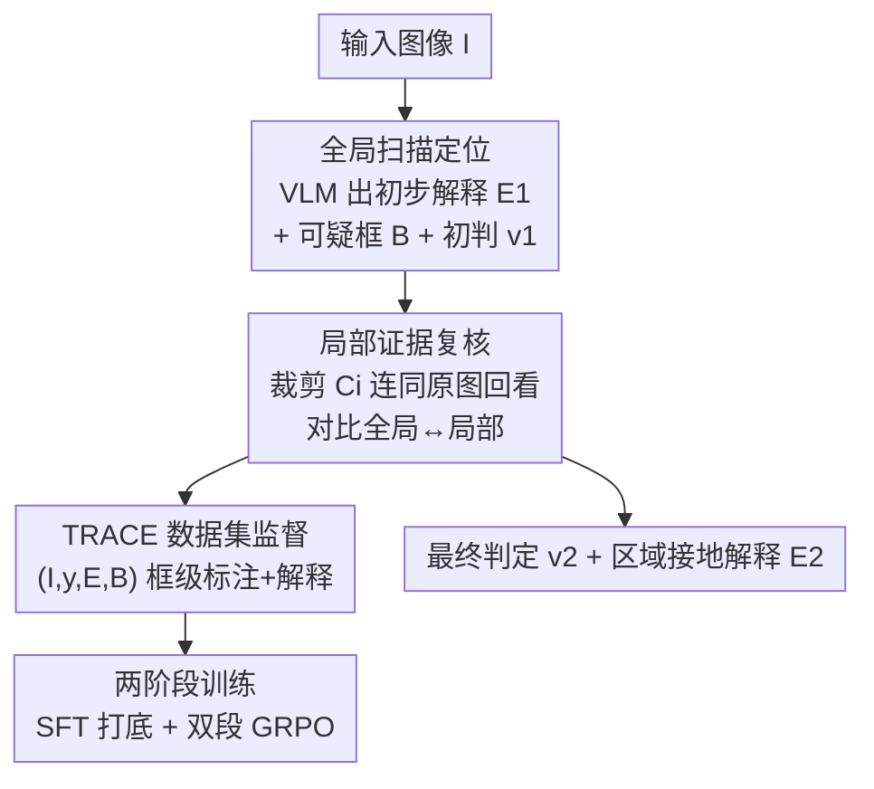

# Locate-Then-Examine: Grounded Region Reasoning Improves Detection of AI-Generated Images

**会议**: CVPR 2026  
**论文**: [CVF Open Access](https://openaccess.thecvf.com/content/CVPR2026/html/Ji_Locate-Then-Examine_Grounded_Region_Reasoning_Improves_Detection_of_AI-Generated_Images_CVPR_2026_paper.html)  
**代码**: 待确认  
**领域**: AIGC检测 / 多模态VLM  
**关键词**: AI生成图像检测、区域定位、VLM取证推理、GRPO强化学习、可解释取证

## 一句话总结
LTE 让视觉语言模型先"全局扫描定位可疑区域"再"放大裁剪复核给出最终判定"，把一次性分类升级为两阶段的区域接地（region-grounded）推理，并配套构建带框级标注与取证解释的 TRACE 数据集，在准确率、鲁棒性和可解释性上同时获得提升。

## 研究背景与动机

**领域现状**：AI 生成图像检测主流是分类式做法（CNNSpot、DIRE、NPR 等），在精选数据集上准确率很高。近年涌现的视觉语言模型（VLM）把检测重构成视觉问答或图像描述任务，能给出自然语言解释，提供语义级分析。

**现有痛点**：纯分类器决策过程不透明、跨生成器泛化差——在 A 架构生成图上训练的模型，遇到没见过的生成器就掉点。而 VLM 路线为了冲高准确率，往往外挂分割头或分类头（如 FakeShield 接 SAM、LEGION 在视觉编码器后接 MLP），反而把 VLM 退化成被动的特征提取器，浪费了它本身的常识推理能力。

**核心矛盾**：更根本的问题在于这些方法都只做"一次全局扫描"——视觉编码器把整张图压成有限的 token，注意力摊在全图上，那些**决定性的细微取证线索**（微小文字瑕疵、拼接缝、周期性纹理、高光边缘）在下采样和池化中被削弱。没有"回看局部、放大验证"的机制，高质量合成图上的判断就很不稳定，模型容易凭先验臆断而非像素证据下结论。

**本文目标**：给 VLM 装上"定位可疑区域 → 放大复核 → 修正判定"的能力，让每个决策都锚定到具体的局部视觉证据上。

**切入角度**：作者类比人类取证专家——先扫一眼全图提出假设，再拿"放大镜"盯着最可疑的几处细看。最具信息量的取证线索通常集中在小区域里，无论 VLM 还是人都需要聚焦、高分辨率的检视才能发现。

**核心 idea**：用"先定位再检视"（Locate-Then-Examine）的两次查询，把全局语义推理和局部高分辨率检视结合起来，让模型在全局不确定时主动回看最可能藏有决定性线索的区域。

## 方法详解

### 整体框架
LTE 是一个基于 VLM 的两阶段取证框架。输入一张待检图像 $I$，输出"真/AI 生成"的最终判定 $v_2$ 加上区域接地的解释 $E_2$。两阶段分别由对同一个 VLM 的两次查询实现：**Query 1（全局扫描定位）** 让模型通读全图，产出初步解释 $E_1$、一组可疑边界框 $B=\{b_1,\dots,b_n\}$ 和初步判定 $v_1$；**Query 2（局部证据复核）** 把每个可疑框裁剪出来 $C_i=\mathrm{Crop}(I,b_i)$，连同原图一起喂回 VLM，让它对比全局上下文与局部细节，输出修正后的解释 $E_2$ 和最终判定 $v_2$。

为了让 VLM 学会这种行为，作者构建了 **TRACE 数据集**（带框级标注 + 取证解释的 20,000 张图），并用"SFT 打底 + 两段 GRPO 强化"的两阶段训练把 Qwen-2.5-VL 调成 LTE 专家。

### 关键设计

**1. 两阶段"定位—检视"取证推理：把一次性分类拆成两次查询**

这是全文核心，直接针对"单次全局扫描削弱细微线索"的痛点。**Query 1** 用具备 grounding 能力的 VLM 全局分析，**按固定顺序**输出三样东西：初步解释 $E_1$、可疑框集合 $B=\{b_1,\dots,b_n\}$（每个 $b_i=(x_1,y_1,x_2,y_2)$）、初步判定 $v_1\in\{\text{real},\text{generated}\}$。可疑区域聚焦两类目标：(i) 生成模型本身就难处理的区域，如人脸、手、动物的爪/姿态；(ii) 图像特有、难以复现的细节，如裁判球衣上的 logo、小字。**Query 2** 对每个 $b_i$ 裁剪得到 $C_i$，再把原图 $I$ 与裁剪集合 $\{C_i\}_{i=1}^n$ 一起输入，形成"双输入"对比机制，产出锚定具体证据的修正解释 $E_2$ 和最终判定 $v_2$。裁剪 token 注入了细粒度视觉信息，就像取证专家用放大镜，让模型能在放大复核中纠正先前误判。实验证实 LTE 机制相比单轮变体额外带来 7B +3.6%、32B +5.8% 的准确率增益。

**2. TRACE 数据集与跨 VLM 自动标注流水线：用两个专家模型互相把关**

两阶段流水线需要真假图都有定位信息作监督，但 VLM 天生不会"先定位再检视"。作者设计 $(I,y,E,B)$ 元组的标注流水线：第一步 **解释生成** 用 GPT-4o 对已知标签的图产出聚焦具体视觉证据的取证解释；第二步 **空间接地** 用 Qwen-2.5-VL 从解释里抽取边界框，凑成 $(I,y,E,B)$。裁剪 $C$ 则由 $(I,B)$ 确定性导出。关键在于 **数据净化（Data Purification）**：Qwen-2.5-VL 有时会给出覆盖 >50% 画面的大框（对应全局缺陷而非局部瑕疵），或退化成目标检测把整个主体框住。净化分两层——其一做"解释—区域一致性检查"：GPT-4o 对每图生成两份独立解释算语义相似度，分歧大的丢弃；Qwen-2.5-VL 也对每图接地两次，框只在两次 IoU 重叠超过阈值时保留；解释提到某线索却没有任何框覆盖的样本剔除。这种跨 VLM 交叉验证削弱了单模型偏差。其二删掉面积超 50% 或框住整个主体的框。最终 TRACE 含 10,000 真 + 10,000 AI 图，99.5% 至少有一个框、平均每图 3.24 个框；真图等量取自 ImageNet/COCO，假图等量来自 GPT-Image-1 与 Gemini 2.5 Flash Image。

**3. SFT + 双段 GRPO 的分阶段奖励设计：把"会定位"和"会判定"分开奖励**

训练借鉴 DeepSeek-Math 的两阶段范式。**SFT 阶段** 全参数（视觉编码器、投影层、语言模块）微调，确立基础能力并教模型输出符合规定的结构化格式。**强化学习阶段** 用 GRPO（Group Relative Policy Optimization）分两段、对两次查询分别设计奖励。Query 1（生成假设）重格式合规与定位精度：格式奖励 $R_F=1$ 当输出含合法 `<verdict>` 标签；定位奖励用 IoU，$R_{IoU}=\frac{1}{|B|}\sum_i \max_j \mathrm{IoU}(b_i,\hat b_j)$，奖励空间对齐精准的框。Query 2（精炼假设）重判定正确与解释质量：分类奖励 $R_C=\mathbb{1}[v_2=y]$；解释质量用 BLEU-2，$R_{BLEU}=\mathrm{BLEU2}(E',E_{ref})$，鼓励生成贴合语境的解释。把奖励按两次查询拆开，是为了让"先把可疑区域找准"和"再把判定与解释做对"各司其职——消融显示去掉 BLEU 奖励后解释质量指标明显下滑，且把"Query 1 里判定正确就给奖励"会拖累最终判定（见消融表 Dual Verdict Reward 的 C-Acc 仅 0.473）。

## 实验关键数据

设置：基座为 Qwen-2.5-VL 的 7B 与 32B Instruct 变体，8×A100 训练；SFT 学习率 $2\times10^{-5}$，GRPO 学习率 $10^{-5}$、组大小 $G=4$，DeepSpeed ZeRO-3。自定义指标：**Acc.** 最终判定准确率；**I-Acc.** 初判（Query 1）准确率；**C-Acc.** 修正判定准确率（⚠️ 框级/修正环节准确率，以原文为准）；**C-Cases(%)** 经复核后判定被改写的样本比例。

### 主实验
TRACE 测试集上 LTE 全面超越各类基线，32B 准确率 0.972、7B 也有 0.942；相比未训练的原始 VLM 基线提升超 30%。

| 方法 | Acc. ↑ | BLEU-2 ↑ | ROUGE-L ↑ | IoU ↑ | 说明 |
|------|--------|----------|-----------|-------|------|
| LTE-32B | **0.972** | 0.211 | 0.327 | 0.359 | 完整两阶段 |
| LTE-7B | 0.942 | 0.209 | 0.291 | 0.316 | 小模型也强 |
| E+G-32B（单轮） | 0.914 | 0.149 | 0.295 | 0.254 | 有定位无复核 |
| E-32B（单轮，仅解释） | 0.869 | 0.153 | 0.315 | — | 无定位 |
| Base-32B（未训练） | 0.587 | 0.043 | 0.079 | — | 原始 VLM |
| FakeShield | 0.801 | 0.056 | 0.067 | 0.096 | 外挂 SAM |
| LEGION | 0.654 | 0.058 | 0.054 | 0.061 | 编码器+MLP |

跨域（OoD）泛化上，LTE 在 MMFR / SynthScars / FakeClue 三个外部基准上稳定领先（SynthScars 上 LEGION 因在其上训练故不算 OoD）：

| 数据集 | LTE-32B Acc. | LTE-7B Acc. | FakeShield Acc. | LEGION Acc. |
|--------|--------------|-------------|-----------------|-------------|
| MMFR | **0.893** | 0.892 | 0.710 | 0.193 |
| SynthScars | 0.852 | 0.826 | 0.765 | 0.861* |
| FakeClue | **0.903** | 0.871 | 0.733 | 0.254 |

（*LEGION 在 SynthScars 上训练，非 OoD，不公平对比。）

### 消融实验
| 配置 | Acc. | C-Acc. | IoU | 说明 |
|------|------|--------|-----|------|
| LTE-32B（Full） | 0.972 | 0.956 | 0.359 | 完整模型 |
| SFT-32B（无 GRPO） | 0.715 | 0.584 | 0.105 | 去掉强化学习，崩盘 |
| No BLEU Reward-32B | 0.929 | 0.871 | 0.296 | 去掉解释奖励，解释质量与精度双降 |
| Dual Verdict Reward-32B | 0.944 | 0.473 | 0.260 | Query 1 也奖励判定 → 修正准确率塌陷 |
| Random Cropping-32B | 0.842 | 0.421 | — | 随机裁剪替代定位，C-Cases 飙到 19.6% |
| Largest 3 Bboxes-32B | 0.924 | 0.919 | — | 只取最大 3 框，逊于自适应定位 |

### 关键发现
- **去 GRPO 是最致命的**：只做 SFT 的 32B 准确率从 0.972 暴跌到 0.715，说明强化学习阶段的分段奖励才是把"定位—检视"行为真正训出来的关键。
- **随机裁剪验证了"定位"的必要性**：把可疑框换成随机裁剪后，被复核改写的样本比例（C-Cases）从 ~10% 飙到 19.6%、准确率掉到 0.842，证明 Query 1 的定位质量直接决定 Query 2 复核能否纠错。
- **框数与模型容量相关**：训练后 LTE-32B 平均每图出 3.58 个框、7B 只出 1.95 个，大模型倾向更细粒度的多区域检视。论文还指出误分类率（misclassification）相比单轮分别下降 7B 38.2%、32B 67.4%。

## 亮点与洞察
- **把"用图思考"落到取证场景**：不是再加一个分割/分类头，而是让 VLM 通过两次查询、裁剪回看，主动复核自己的假设——这套"reason and think with images"的范式可迁移到任何需要细粒度证据的视觉判别任务。
- **跨 VLM 互检的数据净化很实用**：用 GPT-4o 出解释、Qwen 出框，再用"双次一致性 + IoU 重叠 + 解释—框覆盖"三道关卡过滤，是一套低成本造高质量接地标注的可复用配方。
- **奖励分段是关键 trick**：把定位精度（IoU）放在 Query 1、判定+解释质量（分类 + BLEU）放在 Query 2，避免让一个奖励同时背两个目标——消融里 Dual Verdict Reward 让 C-Acc 塌到 0.473，反证了这一点。

## 局限与展望
- 框架依赖基座 VLM 的 grounding 能力，可疑框由模型自己产出，Query 1 定位失败会直接拖累 Query 2 复核（随机裁剪消融已显示这一脆弱性）。
- TRACE 的真假图来源较集中（真图 ImageNet/COCO，假图 GPT-Image-1 / Gemini），面对全新生成器或对抗后处理时的鲁棒性仍需更多验证。
- 两阶段两次查询 + 多框裁剪带来额外推理开销；解释质量用 BLEU 作奖励，可能偏向贴近参考文本的表述而非"最正确"的解释，是奖励设计的潜在偏差。

## 相关工作与启发
- **vs FakeShield / LEGION**：它们靠外挂模块（SAM 分割掩码 / 编码器后接 MLP）做定位，把 VLM 当被动特征提取器；LTE 用 VLM 自身的 grounding + 迭代复核做空间接地，TRACE 上准确率 0.972 vs FakeShield 0.801 / LEGION 0.654，且解释质量（BLEU/ROUGE）大幅领先。
- **vs 单轮 VLM 检测（VQA / captioning 改写）**：单轮方法只做一次全局扫描，细微线索被下采样削弱；LTE 的两阶段复核在同一基座上额外加 3.6%~5.8% 准确率，验证"渐进式视觉推理"的价值。
- **vs DeepSeek-Math（方法论来源）**：借用其 SFT + GRPO 两阶段范式，但把奖励扩展到取证特有的格式/IoU/分类/BLEU 四类，并按两次查询分段，是对该范式在多模态取证上的具体实例化。

## 评分
- 新颖性: ⭐⭐⭐⭐ 把"先定位再检视"的人类取证直觉落成两阶段 VLM 推理 + 配套接地数据集，思路清晰但组件多为已有技术的巧妙组合。
- 实验充分度: ⭐⭐⭐⭐⭐ TRACE 内测 + 三个 OoD 基准 + 丰富消融（奖励、裁剪策略、框数），充分支撑各设计。
- 写作质量: ⭐⭐⭐⭐ 动机和流水线讲得清楚，部分自定义指标（C-Acc / C-Cases）定义需结合原文确认。
- 价值: ⭐⭐⭐⭐ 同时提升准确率、鲁棒性和可解释性，区域接地的解释对取证落地很有实用价值。

<!-- RELATED:START -->

## 相关论文

- [\[CVPR 2026\] ReAlign: Generalizable Image Forgery Detection via Reasoning-Aligned Representation](realign_generalizable_image_forgery_detection_via_reasoning-aligned_representati.md)
- [\[CVPR 2026\] Quality-Aware Calibration for AI-Generated Image Detection in the Wild](quality-aware_calibration_for_ai-generated_image_detection_in_the_wild.md)
- [\[ACL 2026\] AEGIS: A Holistic Benchmark for Evaluating Forensic Analysis of AI-Generated Academic Images](../../ACL2026/aigc_detection/aegis_a_holistic_benchmark_for_evaluating_forensic_analysis_of_ai-generated_acad.md)
- [\[CVPR 2026\] PPM-CLIP: Probabilistic Prompt Modeling for Generalizable AI-Generated Image Detection](ppm-clip_probabilistic_prompt_modeling_for_generalizable_ai-generated_image_dete.md)
- [\[ICML 2026\] CORE: Conflict-Oriented Reasoning for General Multimodal Manipulation Detection](../../ICML2026/aigc_detection/core_conflict-oriented_reasoning_for_general_multimodal_manipulation_detection.md)

<!-- RELATED:END -->
