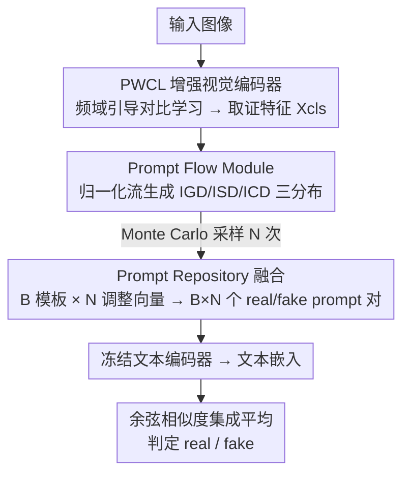

# PPM-CLIP: Probabilistic Prompt Modeling for Generalizable AI-Generated Image Detection

**会议**: CVPR 2026  
**论文**: [CVF Open Access](https://openaccess.thecvf.com/content/CVPR2026/html/Wang_PPM-CLIP_Probabilistic_Prompt_Modeling_for_Generalizable_AI-Generated_Image_Detection_CVPR_2026_paper.html)  
**代码**: https://github.com/bandaidssssss/PPM_CLIP  
**领域**: AIGC检测 / 多模态VLM  
**关键词**: AI生成图像检测, CLIP, 概率提示, 归一化流, 频域对比学习

## 一句话总结
PPM-CLIP 把"判别一条静态决策边界"的 AIGC 检测范式换成"生成式概率推理"——用归一化流为每张图生成一族自适应 prompt（多个假设），再对全部假设的余弦相似度取平均消噪做判定，并配一个频域引导的 patch 对比学习让 CLIP 编码器盯住高频伪造痕迹，在 Ojha / GenImage / DRCT 上的跨生成器泛化显著超过 SOTA。

## 研究背景与动机

**领域现状**：AI 生成图像检测主流分两路——像素级方法学低层伪影（空域/频域/重建误差），语义级方法借 CLIP 等 VLM 抓高层不一致，近来一些工作还在文本 prompt 上做文章（学自适应文本特征引导检测）。

**现有痛点**：无论像素级还是语义级，本质都被**判别范式**束缚：学一条单一、静态的决策边界。像素级方法会"记住"训练时见过的生成器特定伪影，换个新生成器就崩；语义级方法即便精心设计 prompt 对，特征空间仍纠缠（论文 Figure 1 用 PCA 显示单一边界根本分不开 real/fake）。

**核心矛盾**：图像生成是个高速演化、极其多样的生态，而"单一静态模板"天生无法覆盖这种多样性——逼模型找一条最优分割，它就只能去记一组固定的生成器指纹，遇到未见过的生成器必然性能崩塌。判别范式把复杂多变的伪造分布**压成一条刚性边界**，缺乏处理分布漂移的能力。

**本文目标**：在跨生成器（训练于某生成器、测试于未见生成器）场景下做到鲁棒泛化，不再依赖单一模板。

**切入角度**：模仿人类专家——专家鉴别真伪不是找唯一完美线索，而是从多个不同视角推理。那就别学一条边界，而是为每张图**生成一族假设**：单个假设可能不可靠，但集成的共识能把噪声边际化掉。

**核心 idea**：用条件生成模型（归一化流）为输入图像生成"一个 prompt 分布"而非匹配固定模板，对采样出的多个 prompt 假设做集成投票；再用频域对比学习把视觉编码器对高频伪造痕迹的敏感度补上，让这些假设落在富含取证细节的特征空间上。

## 方法详解

### 整体框架
PPM-CLIP 以 CLIP ViT-L/14 为骨干，由两个协同模块组成。一条视觉通路：输入图像经**PWCL（Patch-Wise Contrastive Learning）增强的视觉编码器**得到富含细粒度取证细节的特征 $X_{cls}$。一条文本通路：**PPM（Probabilistic Prompt Modeling）**用归一化流的 Prompt Flow Module 生成三类语义分布的自适应调整向量，与一个可学习的 **Prompt Repository**（B 个模板对）动态融合，得到 $B\times N$ 个图像自适应的 real/fake prompt 对，过冻结文本编码器拿到两组文本嵌入。最终把 $X_{cls}$ 与两组文本嵌入的余弦相似度逐对算概率、再**集成平均**，谁的平均相似度高就判谁。

### 关键设计

**1. PWCL：用频域引导的 patch 对比学习，让编码器盯住高频伪造痕迹**

针对"标准 CLIP 编码器只看高层语义、忽略数字伪造的细微痕迹"这个痛点，PWCL 用频域线索把编码器的注意力引到局部 patch 的高频模式上（高频是公认的伪造指标）。具体地，把 RGB 图像切成不重叠 patch $\{p_1,\dots,p_n\}$，用 AIDE 的方法对每个 patch 算频率分数 $G_m$（对 DCT 系数按多组频带滤波器加权求和：$G_m=\sum_k 2^k\sum_c\sum_{i,j}F_{i,j}^{(k)}\log(|p_m^{dct}(i,j,c)|+1)$，其中 $F^{(k)}$ 是第 $k$ 个频带的 0/1 指示）。按分数排序，用选择比 $\alpha$ 把 patch 分成高频集（top $n\times\alpha$）和低频集：高频集里分数最高的当 anchor、其余为正样本，低频集全部为负样本。再用带间隔 $m$ 的距离对比损失 $\mathcal{L}_{con}=\sum_{e_p\in\mathcal{P}}\|e_a-e_p\|_2^2+\sum_{e_n\in\mathcal{N}}\max(0,\,m-\|e_a-e_n\|_2^2)$ 把 anchor 拉近高频正样本、推远低频负样本，从而逼编码器学出聚焦高频伪造痕迹的判别表示。消融显示去掉 PWCL 掉点最狠（99.6→80.0），可见它是整个生成式推理的"地基"。

**2. Prompt Flow Module：用归一化流生成三层语义分布的自适应 prompt**

这是把"静态模板"换成"生成式分布"的核心。受归一化流启发，PFM 用不同条件输入生成三种互补分布，构成分层语义表示：**IGD（图像通用分布）** 以单个可学习向量 $X_g$ 为条件，捕捉所有 prompt 共有的粗粒度属性（如句法结构）；**ISD（图像特定分布）** 直接以视觉特征 $X_{cls}$ 为条件，提供描述当前图像独有视觉证据的细粒度细节；**ICD（图像类别分布）** 以两个可学习向量 $X_r/X_f$ 为条件、且共享权重编码器处理，逼模型把"real / fake"学成同一表示空间里的对立语义极。流程上先从基分布 Monte Carlo 采样 $N$ 次（用重参数化保证离散采样后梯度可回传），再过 $K$ 个可学习可逆变换 $\Phi_{i+1}=\Phi_i+u\,h(w^\top\Phi_i+b)$，最终对数密度 $\log q_K(\Phi_K)=\log q_0(\Phi_0)-\sum_k\log|1+u_k^\top\phi(\Phi_k)|$。PFM 输出 $N$ 组紧凑调整向量 $\{\varphi^g_n,\varphi^s_n,\varphi^r_n,\varphi^f_n\}$。消融里把 PFM 退成静态 prompt，准确率从 99.6 掉到 92.1，印证"确定性表示不足以覆盖多样伪影"。

**3. Prompt Repository + 集成推理：模板库 × 流样本生成 B×N 假设、平均消噪**

PFM 只产长度为 1 的"调整量"，还需稳定的全长模板做骨架，这由 Prompt Repository 提供：B 个可学习模板对，每个由三段可学习向量拼成 $g_b^r=[\mathbf{G}_{b,1..L_g}][\mathbf{S}_{b,1..L_s}][\mathbf{C}^r_{b,1..L_c}]$（Generic 通用上下文 / Specific 内容骨干 / Class-Indicative 类别概念，real/fake 各一套 $\mathbf{C}$）。**动态融合**就是把流产出的调整向量广播加到对应 token 段上：$g_{b,n}^r=[\mathbf{G}+\varphi^g_n][\mathbf{S}+\varphi^s_n][\mathbf{C}^r+\varphi^r_n]$，于是 B 个模板对被扩成 $B\times N$ 个图像自适应 prompt 对，几乎零推理开销。**推理时**对全部 $B\times N$ 对各算 real 概率 $P_i^r=\frac{\exp(s_i^r/\tau)}{\exp(s_i^r/\tau)+\exp(s_i^f/\tau)}$（$s_i$ 为 $X_{cls}$ 与文本嵌入的余弦相似度），再平均 $\bar P^r=\frac{1}{BN}\sum_i P_i^r$——单个假设可能不可靠（Figure 1c），但集成共识把噪声边际化、收敛到稳健判定（Figure 1d）。去掉 Repository 掉到 88.9，说明稳定结构先验对引导流优化是必要的。

### 损失函数 / 训练策略
训练时为效率每张图只做一次 Monte Carlo 采样，分类损失 $\mathcal{L}_{cls}$ 用随机抽一个 prompt 对的预测概率与标签算交叉熵。总目标为加权和 $\mathcal{L}=\mathcal{L}_{cls}+\lambda_{con}\mathcal{L}_{con}+\lambda_{ort}\mathcal{L}_{ort}+\lambda_{kl}\mathcal{L}_{kl}+\lambda_{rec}\mathcal{L}_{rec}$：$\mathcal{L}_{ort}$ 是模板间文本嵌入的正交损失（促 prompt 多样）；$\lambda_{kl}\mathcal{L}_{kl}+\lambda_{rec}\mathcal{L}_{rec}$ 共同构成负 ELBO 的加权近似——$\mathcal{L}_{kl}$ 把三类分布的后验 $q_K$ 拉近简单先验做正则，$\mathcal{L}_{rec}$ 仅作用于 ISD，用简单解码器把 $\Phi_K^s$ 还原成 $X_{rec}$ 并与 $X_{cls}$ 算 MSE，确保 ISD 保住条件输入的关键信息。实现上对视觉编码器 12–23 层加 LoRA（$r{=}4$），训练 1 epoch、Adam、lr $1\times10^{-4}$、batch 48；默认 $B{=}2$、流长 $K{=}10$、推理采样 $N{=}4$、$\alpha{=}0.5$、间隔 $m{=}1.0$。

## 实验关键数据

> 自定义口径：**mAcc** = 跨多个（未见）生成器子集的平均准确率，是衡量"跨生成器泛化"的核心指标；**N** = 推理时 Monte Carlo 采样次数，决定集成假设数量。三个基准均为"训练于某生成器、测试于未见生成器"的跨域设置。

### 主实验
在 Ojha（跨架构泛化）、GenImage（跨生成器鲁棒）、DRCT（高保真重建/局部修补攻击）三个基准上与 SOTA 比较（准确率 %）。

| 基准 | 任务挑战 | 本文 mAcc | 最强基线 | 提升 |
|------|---------|----------|---------|------|
| Ojha | 跨架构（GAN→Diffusion） | **98.8** | COD 97.5 / UnivFD 86.9 | +1.3 / +11.9 |
| GenImage | 跨 8 生成器 | **99.6** | LOTA 98.9 / CoD 96.2 | +0.7 |
| DRCT | 重建 + 局部修补 | **95.72** | DRCT 91.35 / UnivFD 83.46 | +4.37 |

最能说明问题的是 DRCT 的 "DR Variants"（修补攻击）子集：全局伪影几乎不存在时，UnivFD 等传统检测器塌到接近随机（约 51%），而 PPM-CLIP 仍保持 87.80%（SDv1/v2-DR）——得益于 PPM 抓高层语义不一致、PWCL 逼编码器盯细粒度异常的协同（Grad-CAM 显示本文精准定位伪造区高频痕迹，原始 CLIP 却看向无关语义）。

### 消融实验
GenImage 上逐模块用零张量替换（mAcc %）：

| 配置 | mAcc | 说明 |
|------|------|------|
| Full model | 99.6 | 完整模型 |
| w/o Prompt Flow（退静态 prompt） | 92.1 | 确定性表示不足以覆盖多样伪影 |
| w/o Prompt Repository | 88.9 | 缺稳定结构先验，流优化失稳 |
| w/o PWCL | 80.0 | 掉点最狠：编码器只看物体语义、丢了取证细节 |
| 频域选择 → 随机选择 | 95.0 | 显式频率引导是必要的 |

三类分布的交互（Table 7）显示：单用 ISD 92.6、ICD 91.3、IGD 92.1，ISD+IGD 升到 98.0、ISD+ICD 96.3，三者全开才到 99.6——ISD 抓视觉方差、ICD 做判别"语义转向"、IGD 提供粗粒度先验稳住，缺一不可。

### 关键发现
- **PWCL 贡献最大**：去掉它从 99.6 暴跌到 80.0，远超去掉 PFM（→92.1）或 Repository（→88.9），说明"先把编码器的取证敏感度补上"是生成式推理能work的前提。
- **集成规模可换精度**：采样 $N$ 从 2→10，mAcc 从 98.6 升到 100.0，但显存（3200→7976 MB）和 FPS（50.5→18.8）相应变差；$N{=}4$ 是精度/开销的平衡点。
- **正则要"温和"**：$\lambda_{kl}$ 最优在 0.001（太大过度正则会压掉建模复杂伪影所需的方差），$\lambda_{rec}/\lambda_{con}\approx0.5$、$\lambda_{ort}{=}1.0$、$\alpha{=}0.5$ 都体现"辅助目标当温和正则、别压过主分类任务"。

## 亮点与洞察
- **范式转换很巧**：把检测从"判别一条静态边界"重构成"生成—评估多个假设"，用归一化流建模 prompt 分布、再用集成共识消噪，直接命中"单一模板覆盖不了演化中的生成器生态"这一泛化瓶颈。
- **生成 + 判别初步统一**：PPM 先建模伪造分布再做概率推理，给"生成式能力如何服务判别任务"提供了一个可落地的样例，思路可迁移到其它需要跨域泛化的检测任务。
- **分层 prompt 设计有解释性**：IGD/ISD/ICD 各司其职（通用先验 / 图像证据 / 类别转向），t-SNE 可视化确认三者捕捉不同信息、ICD 把隐空间解耦成线性可分簇——这种"可视化对齐设计意图"很有说服力。

## 局限与展望
- **推理开销随集成放大**：高精度（$N{=}10$ 达 100%）以显存翻倍、FPS 砍到约 1/3 为代价，实时/大批量部署需在 $N$ 上折中。
- **依赖频域高频假设**：PWCL 把伪造痕迹等同于高频 patch；对刻意抑制高频或经强压缩/后处理的伪造图，这一先验可能失效（⚠️ 论文未测重压缩鲁棒性）。
- **DR 子集仍有短板**：DRCT 的 "DR"（diffusion 重建）整体子集里仍有明显掉点（如某 DR 变体 56.67%），说明对高保真重建攻击的鲁棒性尚未完全解决。
- 改进方向：自适应决定采样次数 $N$（按假设方差早停）、把频域引导扩展到多尺度而非单一 DCT 频带、探索更强的流变换以提升 prompt 分布表达力。

## 相关工作与启发
- **vs UnivFD**: UnivFD 在冻结 CLIP 特征上接一个静态线性分类器，学到一条绑死 GAN 伪影的刚性边界，遇到 Diffusion（LDM 仅 75.7%）就崩；PPM-CLIP 改成生成式分布 + 集成，Ojha mAcc 从 86.9 提到 98.8。
- **vs FatFormer**: FatFormer 学单一 prompt 对，在 Stable Diffusion 上高、但 ADM（75.9%）、BigGAN（55.8%）骤降，暴露"单模板覆盖不了漂移的伪影分布"；本文用 $B\times N$ 个自适应假设覆盖整个伪造线索分布。
- **vs C2P-CLIP / 自适应 prompt 类方法**: 它们仍在判别框架内学固定/自适应的 prompt 向量，本质是确定性映射；PPM-CLIP 把 prompt 升级成"可采样的概率分布"，用概率推理拥抱不确定性，这是与判别范式的根本区别。

## 评分
- 新颖性: ⭐⭐⭐⭐⭐ 把 AIGC 检测从判别边界换成归一化流的概率提示生成 + 集成推理，范式层面的创新。
- 实验充分度: ⭐⭐⭐⭐⭐ 三大基准全面领先，组件/分布交互/采样规模/超参消融都齐，证据扎实。
- 写作质量: ⭐⭐⭐⭐ 动机—方法—实验逻辑清晰、可视化到位，但 PPM 内部公式密集、初读门槛较高。
- 价值: ⭐⭐⭐⭐ 跨生成器泛化与抗修补攻击的鲁棒性很有实用价值，集成开销是落地时需权衡的点。

<!-- RELATED:START -->

## 相关论文

- [\[CVPR 2026\] ReAlign: Generalizable Image Forgery Detection via Reasoning-Aligned Representation](realign_generalizable_image_forgery_detection_via_reasoning-aligned_representati.md)
- [\[CVPR 2026\] Quality-Aware Calibration for AI-Generated Image Detection in the Wild](quality-aware_calibration_for_ai-generated_image_detection_in_the_wild.md)
- [\[CVPR 2026\] Locate-Then-Examine: Grounded Region Reasoning Improves Detection of AI-Generated Images](locate-then-examine_grounded_region_reasoning_improves_detection_of_ai-generated.md)
- [\[CVPR 2026\] FRAME: Forensic Routing and Adaptive Multi-path Evidence Fusion for Image Manipulation Detection](frame_forensic_routing_and_adaptive_multi-path_evidence_fusion_for_image_manipul.md)
- [\[CVPR 2026\] Fine-grained Image Aesthetic Assessment: Learning Discriminative Scores from Relative Ranks](fine-grained_image_aesthetic_assessment_learning_discriminative_scores_from_rela.md)

<!-- RELATED:END -->
