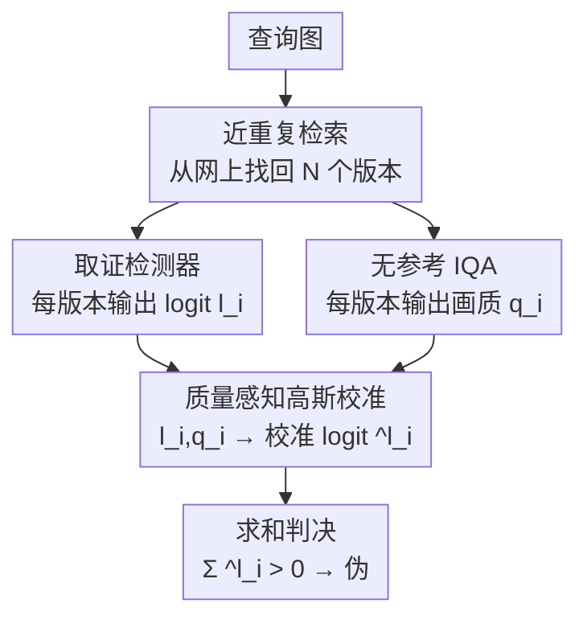

# Quality-Aware Calibration for AI-Generated Image Detection in the Wild

**会议**: CVPR 2026  
**arXiv**: [2604.15027](https://arxiv.org/abs/2604.15027)  
**代码**: https://grip-unina.github.io/QuAD/ (有)  
**领域**: AIGC检测 / 图像取证  
**关键词**: AI生成图像检测, 近重复图像, 质量感知校准, IQA, 贝叶斯融合

## 一句话总结
针对同一张图在网络传播中产生的多个画质各异的"近重复版本"，本文提出 QuAD：用无参考 IQA 估计每个版本的画质，再用画质作条件对取证检测器的 logit 做高斯校准并加权融合，让低画质版本少说话、高画质版本多说话，平均把六个 SOTA 检测器的平衡准确率提升约 8 个百分点。

## 研究背景与动机
**领域现状**：现有 AI 生成图像检测器（取证检测器）几乎都假设输入是"一张干净的待检图"，在这张图上输出一个真/伪分数。为了对抗社交网络的压缩、缩放，主流的鲁棒性手段是训练时做 JPEG/blur 数据增强，或建模社交平台的噪声分布。

**现有痛点**：真实世界里同一张病毒式传播的图会在网上出现大量"近重复"（near-duplicate）版本——每次转发都可能重压缩、缩放、裁剪，画质越来越差，取证赖以判断的细微统计痕迹被一步步抹掉。结果是**同一个检测器在同一张图的不同版本上给出截然不同的分数**，到底该信哪个版本？

**核心矛盾**：一种自然想法（沿用前人 [16]）是"只信最早上传/最大尺寸的那张，因为它处理最少"。但作者指出这条路并不可靠：最早出现的不一定是真原图，时间戳会因转发延迟/篡改而失真，最大尺寸的图也可能是先被重度处理再上采样的；而很多更早的祖先版本可能已经从网上消失了。另一个极端——把所有版本的分数简单平均——同样会被那些被重度压缩的劣质副本带偏，反而增加不确定性。

**本文目标**：把问题从"单图检测"升级为"跨多个版本的联合推理"——在一组画质未知、来源混杂的近重复里，自动判断每个版本的分数有多可信，并据此融合出一个更可靠的最终判决。

**切入角度**：作者观察到 Fig.3 的关键事实——无参考 IQA（如 LoDa）估计出的画质，与图像经历的后处理强度高度相关（压缩、下采样、模糊越重，画质分越低）；同时 Fig.6 显示，劣化越重，检测器对真/伪的 logit 分布越重叠、越不可分。于是"画质"恰好是一个可观测的、与"分数可信度"挂钩的代理变量。

**核心 idea**：用画质作条件，把检测器的 logit 校准成"考虑了可信度的对数似然比"，再求和判决——低画质处真伪高斯分布几乎重叠，校准后贡献趋近 0；高画质处分布分得开，贡献大。这样既用上了全部版本的信息，又自动压低了不可靠副本的话语权。

## 方法详解

### 整体框架
QuAD（Quality-Aware calibration with near-Duplicates）是一个推理时的融合流程，不重新训练检测器。给定一张待查图，先从网上检索它的全部近重复版本 $X_1,\dots,X_N$；对每个版本同时跑两件事——一个现成的取证检测器输出 logit $l_i$（估计该版本真/伪的对数后验似然比），一个无参考 IQA 模块输出画质指数 $q_i$。核心环节是"质量感知校准"：用一组事先在开发集上拟合好的高斯模型，把原始 $l_i$ 转成校准后的 $\hat{l}_i$，这个校准值的绝对大小反映了在画质 $q_i$ 下真/伪分布的可分程度。最后把所有 $\hat{l}_i$ 相加，大于 0 判为伪。整条链路里唯一需要"学"的只有 8 个描述高斯均值/方差随画质线性变化的系数。

### 关键设计

**1. 近重复检索 + 双通道打分：把"一张图"变成"一组证据"**

这是把单图检测改造成多版本推理的脚手架。对查询图，作者用 Google Cloud Vision API 在网上检索它的全部近重复实例，得到一组 $\{X_1,\dots,X_N\}$。每个实例并行送进两个通道：取证检测器给出 logit $l_i$，定义为 $l_i=\log\frac{P(y=1\mid X_i)}{P(y=0\mid X_i)}$（$y=1$ 为伪、$y=0$ 为真）；无参考 IQA 给出画质指数 $q_i$。注意这里的"质量"专指图像的劣化程度（被压/缩/裁了多少），**不是**生成内容的视觉逼真度，也不直接当作真伪指示器。最朴素的融合（naive）是在条件独立、等先验假设下直接对 logit 求和判决 $\sum_i l_i>0$——这正是贝叶斯地组合多份证据，但问题在于劣质副本的 $l_i$ 同样被无差别地加了进来。

**2. 质量感知的高斯校准：用画质把 logit 重写成"考虑可信度的似然比"**

这是全文的核心。痛点是 naive 求和把所有 logit 一视同仁，而劣化越重的版本（小 $q_i$）真/伪分布越重叠、$l_i$ 越不可信。作者的做法是：在画质条件下，分别为真、伪图建模 logit 的条件分布为高斯——
$$l_i\mid q_i,y=1\sim\mathcal{N}(\mu_1(q_i),\sigma_1^2(q_i)),\quad l_i\mid q_i,y=0\sim\mathcal{N}(\mu_0(q_i),\sigma_0^2(q_i))$$
均值和方差都随画质变化。于是判决规则中的每一项不再是原始 $l_i$，而是这两个高斯的对数似然比，即校准后的 $\hat{l}_i$：
$$\hat{l}_i=\frac{(l_i-\mu_0(q_i))^2}{2\sigma_0^2(q_i)}-\frac{(l_i-\mu_1(q_i))^2}{2\sigma_1^2(q_i)}+\log\frac{\sigma_0(q_i)}{\sigma_1(q_i)}$$
最终判决是 $\sum_i\hat{l}_i>0$。这一步的妙处在于：$\hat{l}_i$ 的绝对值天然反映了在该画质点上两个高斯分得有多开——低画质处两高斯几乎重合，$\hat{l}_i$ 趋近 0，自动被"软屏蔽"；高画质处分得很开，$\hat{l}_i$ 大，主导融合结果。相比"只挑最高画质那张"（丢信息）或"全体平均"（被劣质副本带偏），它在用上全部版本的同时按可信度连续加权，是一种比硬选择/硬平均都更细腻的中间路线。

**3. 画质的线性参数化 + 极大似然拟合：只学 8 个系数**

要让上式可用，得知道 $\mu_j,\sigma_j$ 如何随画质 $q_i$ 变。作者假设最简单的线性关系：
$$\mu_j(q_i)=a_j\cdot q_i+b_j,\quad \log\sigma_j^2(q_i)=\alpha_j\cdot q_i+\beta_j,\quad j\in\{0,1\}$$
（方差取对数线性以保正）。这样整个校准器只有 8 个系数 $(a_0,b_0,\alpha_0,\beta_0,a_1,b_1,\alpha_1,\beta_1)$，用极大似然在约 50% 的 AncesTree 数据上一次性估出，剩下一半留作评测。轻量到几乎不增加推理成本，且因为拟合关注的是"生成痕迹随画质的统计漂移"而非图像内容（数据集里真伪图语义对齐），所以在分布外的真实数据上也能迁移。

### 损失函数 / 训练策略
QuAD 本身不训练检测器，也不训练 IQA。唯一的"学习"是用极大似然策略在 AncesTree 开发集（约一半数据）上估计 8 个高斯系数；其余一半用于评测。检测器和 IQA 模块都是现成、冻结的，QuAD 作为一层即插即用的后处理校准/融合套在它们外面。

## 实验关键数据

### 主实验
评测指标为平衡准确率（balanced Accuracy，bAcc，越高越好）与负对数似然（NLL，越低越好，衡量置信度校准）。在 6 个 SOTA 检测器（DMID、CoDE、D3、B-Free、DRCT、CO-SPY）上对比多种聚合/排序基线。

AncesTree（受控在体数据集，六检测器平均）：

| 策略 | 用几张 | bAcc↑ | NLL↓ |
|------|--------|-------|------|
| random（单张随机，实践常态） | 1 | 70.7 | 0.97 |
| naive（全部平均） | all | 73.2 | 0.75 |
| oracle L1（只用最高画质首层，理想上界） | L1 | 78.8 | 0.66 |
| LoDa 排序取 top-10 | 10 | 77.6 | 0.66 |
| **QuAD（本文）** | all | **81.6** | **0.43** |

QuAD 不仅超过全体平均（+8.4 bAcc，NLL 0.75→0.43），还反超只能在受控环境下取到的 oracle 首层（78.8）。

ReWIND（真实病毒图，六检测器平均）：

| 策略 | 用几张 | bAcc↑ | NLL↓ |
|------|--------|-------|------|
| naive（全部平均） | all | 63.0 | 1.27 |
| Date（按上传日期取最早，前人 [16] 思路） | 1 | 67.3 | 1.29 |
| LoDa top-10 | 10 | 66.0 | 1.13 |
| **QuAD（系数迁移自 AncesTree）** | all | **70.3** | **0.63** |
| **QuAD\*（系数在 ReWIND 上 leave-one-out 重估）** | all | **71.4** | **0.57** |

即使校准系数只在小规模、合成的 AncesTree 上拟合，迁移到完全未知劣化历史的真实病毒图上仍稳定领先（70.3 vs naive 63.0、Date 67.3），NLL 几乎腰斩。

### 消融实验

| 配置 | bAcc↑ | 说明 |
|------|-------|------|
| QuAD + LoDa 校准 | 81.6 | 默认 IQA |
| QuAD + TReS 校准 | 81.5 | 换 IQA 几乎不变 |
| QuAD + QCN 校准 | 81.4 | 换 IQA 几乎不变 |
| 按压缩质量因子(QF)排序 top-10 | 72.6 | 排序型基线，远逊于校准 |
| 按图像尺寸排序 top-20 | 71.1 | 最大尺寸≠最可信 |

### 关键发现
- **校准融合 > 硬排序选择**：把全部版本校准后求和（81.6）明显优于任何"按某指标排序只取前 K 个"的策略，也优于受控环境才有的 oracle 首层（78.8）——证明丢弃信息（只选最优）不如按可信度软加权。
- **画质比尺寸/压缩因子更可靠**：Fig.8 显示按图像尺寸、压缩质量因子排序都不可靠（最大的图可能是先重度处理再上采样的），而 IQA（尤其 LoDa）才是与可信度真正相关的排序量。
- **对 IQA 选择不敏感**：LoDa/TReS/QCN 三种 IQA 给出的平均准确率 81.6/81.5/81.4 几乎一致，说明方法稳健性来自校准框架本身而非某个特定 IQA。
- **少量近重复也管用**：Fig.8 右图显示，即便只能取回个位数的近重复，QuAD 仍优于朴素聚合，覆盖了"近重复稀少"的现实场景。
- **失败点**：ReWIND 上唯独 CO-SPY 出现轻微下降，作者归因于 AncesTree 开发集不足以覆盖真实世界的全部劣化变异；在 ReWIND 上重估系数（QuAD\*）即可进一步涨到 71.4。

## 亮点与洞察
- **把"该信哪张图"转成"按可信度加权所有图"**：这是认知层面的转变——不再纠结于检索出最干净的原图（往往已不可得），而是承认所有版本都有用、只是可信度不同，用统计的方式连续加权。这种"软选择代替硬选择"的思路可迁移到任何"多来源证据可信度不均"的融合问题。
- **用可观测的画质做不可观测的可信度的代理**：劣化历史不可知，但劣化结果（画质）可由现成 IQA 测出，且与检测器分布可分性强相关。这个"找一个可观测代理变量来校准黑盒分数"的范式很通用。
- **极致轻量、即插即用**：整套校准只有 8 个线性系数、推理时零额外网络，套在任意冻结检测器外面就涨点，落地成本极低。
- **两个互补数据集填补空白**：AncesTree（13.6 万张、退化树可控）用于大规模拟合分析，ReWIND（约 1 万张真实病毒近重复）用于贴近现实的评测——后者是首个从网上真实检索近重复版本的真伪混合数据集。

## 局限性 / 可改进方向
- **依赖近重复检索质量**：作者承认整条链路建立在能检索到近重复之上；漏检、误检（把无关图当近重复）如何影响最终性能尚未系统分析，未来工作要研究过滤无关样本的策略。
- **高斯/线性假设较强**：logit 条件分布建为高斯、均值方差对画质线性依赖，都是为可解可拟合做的简化；真实分布若严重偏离，校准会失准（CO-SPY 在 ReWIND 上的退化可能与此相关）。
- **条件独立与等先验假设**：贝叶斯求和假设各近重复在标签下条件独立、真伪先验相等，实际网络转发链高度相关，作者也承认这"实践中不满足、只是让问题可解"。
- **未考虑对抗场景**：恶意者可故意构造近重复来误导检测器，本文未涉及，列为未来方向；同时计划扩展到 AI 生成视频。

## 相关工作与启发
- **vs 鲁棒性数据增强 [26,27]**: 他们在训练时加 JPEG/blur 增强或建模社交平台噪声来让单图检测更抗劣化，本文不改检测器、不碰训练，而是在推理时跨多版本融合——两者正交，QuAD 可叠加在任何已增强的检测器上。
- **vs FOSID [16]（检索辅助选最早上传）**: 前人同样面对多版本场景，但策略是"选一张最可能未被处理的（最早/原始）实例"，受限于原图常已不可得、时间戳不可靠；本文不做硬选择，而是联合分析全部近重复、按画质校准加权，实验上反超其"按日期取最早"基线（70.3 vs 67.3）。
- **vs 用 IQA 做取证的工作 [15,24]**: Jiang 等把 IQA 分数当判别特征区分真假脸、Song 等用 IQA 在训练时做课程学习增广低质样本；本文不同——IQA 只在推理时用来校准每个近重复的检测器分数并决定其融合权重，且明确声明 IQA 不作真伪指示器，只测劣化程度。

## 评分
- 新颖性: ⭐⭐⭐⭐⭐ 首个系统处理"网络近重复多版本融合"的取证方法，把单图检测问题重构为可信度加权的多证据推理。
- 实验充分度: ⭐⭐⭐⭐⭐ 6 个 SOTA 检测器 × 多种排序基线 × 两个数据集（含 13.6 万合成 + 1 万真实），并验证对 IQA 选择不敏感、跨域迁移稳定。
- 写作质量: ⭐⭐⭐⭐ 动机层层递进、公式清晰，贝叶斯推导和高斯校准讲得透；图表略多需对照阅读。
- 价值: ⭐⭐⭐⭐⭐ 即插即用、零重训练就给现成检测器涨约 8 个点，直击事实核查/记者的真实痛点，且开源数据与代码。

<!-- RELATED:START -->

## 相关论文

- [\[CVPR 2026\] PPM-CLIP: Probabilistic Prompt Modeling for Generalizable AI-Generated Image Detection](ppm-clip_probabilistic_prompt_modeling_for_generalizable_ai-generated_image_dete.md)
- [\[CVPR 2026\] ReAlign: Generalizable Image Forgery Detection via Reasoning-Aligned Representation](realign_generalizable_image_forgery_detection_via_reasoning-aligned_representati.md)
- [\[CVPR 2026\] Locate-Then-Examine: Grounded Region Reasoning Improves Detection of AI-Generated Images](locate-then-examine_grounded_region_reasoning_improves_detection_of_ai-generated.md)
- [\[CVPR 2026\] Inconsistency-aware Multimodal Schrodinger Bridge for Deepfake Localization](inconsistency-aware_multimodal_schrodinger_bridge_for_deepfake_localization.md)
- [\[CVPR 2026\] FRAME: Forensic Routing and Adaptive Multi-path Evidence Fusion for Image Manipulation Detection](frame_forensic_routing_and_adaptive_multi-path_evidence_fusion_for_image_manipul.md)

<!-- RELATED:END -->
