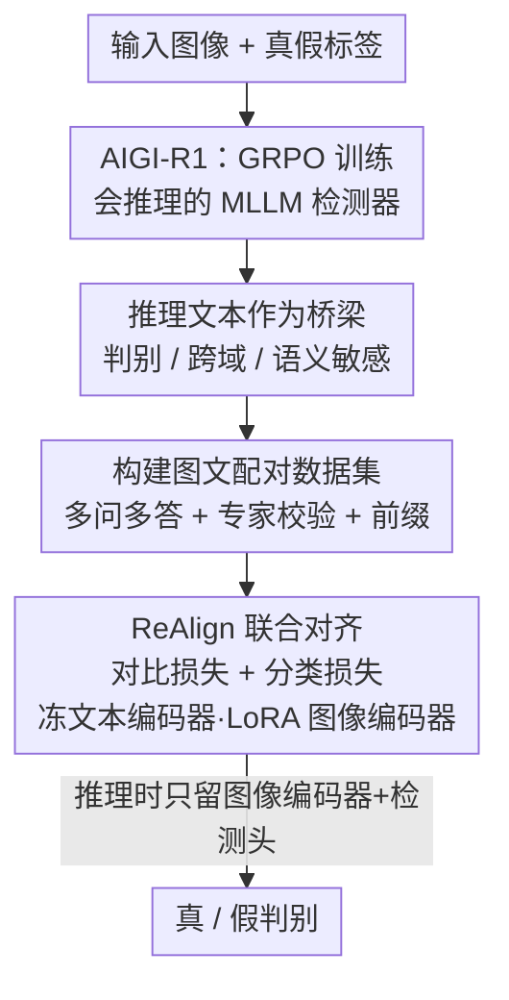

# ReAlign: Generalizable Image Forgery Detection via Reasoning-Aligned Representation

**会议**: CVPR 2026  
**arXiv**: [2605.16080](https://arxiv.org/abs/2605.16080)  
**代码**: 无  
**领域**: AIGI 检测 / 图像取证  
**关键词**: AIGI 伪造检测、推理文本表示、GRPO、对比对齐、CLIP 蒸馏

## 一句话总结
ReAlign 先用 GRPO 训出一个会"讲理由"的多模态大模型 AIGI-R1，再把它生成的推理文本作为"桥梁"，通过对比学习把推理文本空间蒸馏进一个轻量 CLIP 检测器，让小模型同时继承大模型的跨域泛化和语义错误敏感性，推理时只用图像编码器即可，在 AIGCDetectBenchmark / AIGI-Holmes / 自建 UltraSynth-10k 上都拿到 SOTA（mAcc 96.14% / 99.44% / 97.09%）。

## 研究背景与动机
**领域现状**：AI 生成图像（AIGI）泛滥，检测真伪成刚需。现有检测器分两派——非 LLM 派（CNN/ViT，如 AIDE、UniFD、PatchCraft）直接抽图像特征做二分类；LLM 派（FakeShield、ForgeryGPT、AIGI-Holmes）把图像编码进语言空间、边判断边给文字解释。

**现有痛点**：两派各有死穴。非 LLM 派擅长抓低级伪影（纹理不连续、噪声、频域异常），但是黑盒、参数小容易过拟合训练分布，遇到没见过的生成器就泛化崩盘；LLM 派靠世界知识能识别语义/常识层面的破绽（逻辑不通的物体），可对细微低级伪影不敏感，而且参数大、推理慢、部署贵，没法上移动端。

**核心矛盾**：低级伪影敏感性 ↔ 语义理解 + 泛化性，这两组能力分别长在两派身上，难以兼得；更尴尬的是——LLM 输出的那段"解释文字"到底对检测有没有实质贡献，此前并无清楚证据。

**本文目标**：拆成两个子问题——(1) 弄清 LLM 生成的推理文本对检测的内在价值到底是什么；(2) 能否把两派优点统一进一个既轻量又泛化的框架。

**切入角度**：作者通过实验发现，强化学习（GRPO）优化的 LLM 产出的推理文本，本身构成了一个高质量表示空间，具备三个性质——判别性（与"真/假"概念强语义相关）、跨域泛化（不同数据集的文本表示高度重叠、抹平了视觉模态的分布漂移）、语义错误敏感（对语义不一致敏感、对低级伪影细节不敏感）。既然 LLM 的检测能力本质来自这个推理文本空间，那就不必在推理时背着整个 LLM。

**核心 idea**：用"推理文本表示"当桥梁，把 GRPO 大模型的泛化性与语义敏感性，通过对比对齐蒸馏进一个轻量 CLIP 检测器——训练时借文本对齐，推理时只留图像编码器。

## 方法详解

### 整体框架
ReAlign 的整条管线分四步串行：(a) 先用 GRPO 把多模态大模型训成 **AIGI-R1**，让它在 `<think>` 标签里生成检测推理、`<answer>` 标签里给真假判断；(b) 用训好的 AIGI-R1 对每张图生成多样的推理文本，配上对应图像，构成**图文配对数据集**；(c) 在这批图文对上**联合训练** ReAlign（一个 CLIP 检测器），用对比损失把图像特征拉向推理文本空间、同时用分类损失保持判别力；(d) 推理时只用图像编码器 + 检测头出结果，完全甩掉 LLM 和推理文本生成过程。

关键在于：推理文本只在**训练阶段**作为对齐目标出现，是把 LLM 能力"灌"进小模型的载体；一旦对齐完成，文本空间的泛化性和语义敏感性已经被编码进图像编码器，推理时不再需要它，从而做到轻量高效。

### 关键设计

**1. AIGI-R1：用 GRPO 训出会推理的检测器，造出高质量推理文本空间**

这一步解决的是"桥梁从哪来"的问题——要蒸馏，先得有一段判别性强、泛化好的推理文本。作者受 DeepSeek-R1 启发，用 Group Relative Policy Optimization（GRPO）做基于结果的强化学习来优化 MLLM。GRPO 是 PPO 的改进：不再用 critic 估值，而是对同一问题采样一组候选回答、按相对奖励排名来优化，省掉了价值建模、训练更稳，尤其适合监督稀缺、靠对比判优劣的任务。优化目标为

$$\max_{\pi_\theta}\;\mathbb{E}_{o\sim\pi_\theta(q)}\big[R_{\text{total}}(q,o)-\beta\cdot \mathrm{KL}[\pi_\theta(o|q)\,\|\,\pi_{\text{ref}}(o|q)]\big],$$

其中总奖励 $R_{\text{total}}=R_{\text{det}}+R_{\text{format}}$，检测奖励 $R_{\text{det}}^{(i)}=1$ 当输出判断 $o^{(i)}$ 等于真值 $\text{det}_{\text{gt}}$ 否则为 0，$R_{\text{format}}$ 约束 `<think>/<answer>` 标签格式，$\beta$ 控制与参考模型的 KL 偏移。训练时直接拿图像的 real/fake 标签当答案真值，问题固定为"这张图是 AI 生成还是相机拍的？请分析并给判断"，配一套引导模型观察细节的 system prompt。相比 SFT 的 next-token 监督，这种结果驱动的 RL 被证明能激发更强的泛化——这正是 ReAlign 泛化性的源头。

**2. 推理文本作为桥梁：三个被验证的性质，决定它值得被蒸馏**

作者没有把"推理文本有用"当作想当然，而是实验验证了它的三个性质，正好对应两派死穴的互补。**判别性**：把图像的 caption（Qwen2.5-VL 生成）和 AIGI-R1 的推理文本分别对"real""fake"两个类标算语义相似度 $s_{\text{real}}, s_{\text{fake}}$，再投到 2D 平面（x 轴为偏向某类的方向 $s_{\text{real}}-s_{\text{fake}}$，y 轴为与真假概念的相关度 $s_{\text{real}}+s_{\text{fake}}$）——推理文本沿 x 轴真假两簇极化更明显、y 轴整体更高，说明它判别信号更强、更贴近真假判别空间，而 caption 则大面积重叠。**跨域泛化**：用 t-SNE 看 StarGAN 与 SDXL 两数据集——视觉特征几乎完全分成两团（模态分布漂移大），但 AIGI-R1 的推理文本却高度重叠，说明文本表示有域不变性，能抹平跨数据集的分布鸿沟。**语义错误敏感**：非 LLM 的 AIDE 擅长抓纹理失真等伪影、却识别不了违反常识/逻辑的语义伪造，AIGI-R1 正好相反。三性质合起来论证：推理文本空间恰好补上了非 LLM 检测器缺的那一半能力，所以拿它当对齐目标是有依据的。

**3. 构建图文配对数据集：让对齐目标既多样又干净**

光有 AIGI-R1 还不够，要喂对比学习就得有高质量图文对。对每张图，作者输入多个不同问题、生成多个对应回答，并调节预测时的 seed 与 temperature 进一步增加回答多样性；生成后请人类专家核验、修正输出（去掉错判/胡说的样本）；再抽出 `<think>...</think>` 里的推理文本，按图像标签在前面加一句前缀"This is a real/fake image."。最终把精炼后的伪造描述文本与对应图像配对，得到一个带强伪造语义特征的图文数据集。多问多答 + 温度扰动保证了文本多样性（对比学习需要负样本丰富），专家校验保证了对齐目标不被噪声污染。

**4. ReAlign 对齐框架：冻文本、LoRA 图像编码器，联合对比 + 分类**

最后一步是把推理文本空间真正"灌"进 CLIP。ReAlign 由图像编码器、文本编码器、检测头三个模块组成，图像/文本编码器都用预训练 CLIP-ViT-L/14-336 初始化。关键取舍是：**冻结文本编码器**（保住 CLIP 原有的通用语义理解，不让它被小数据带偏），只用 **LoRA** 高效微调图像编码器（让图像特征向推理文本表示对齐、同时保留通用语义感知），图像编码器后接一个两层 MLP 检测头做二分类、全参训练。这样图像特征被拉进了那个判别性强、域不变的文本空间，等于隔空继承了 AIGI-R1 的能力，而推理时只需图像编码器 + 检测头、彻底丢掉 LLM——又轻又泛化的关键就在这套"冻文本 + LoRA 图像 + 联合训练"的配置上（消融显示全参微调、顺序优化、纯分类损失都明显更差）。

### 损失函数 / 训练策略
对比损失用对称交叉熵，以图到文 $\mathcal{L}_{i\to t}$ 为例：

$$\mathcal{L}_{i\to t}=-\frac{1}{N}\sum_{i=1}^{N}\log\frac{\exp(\mathbf{v}_i\cdot\mathbf{t}_i)}{\sum_{j=1}^{N}\exp(\mathbf{v}_i\cdot\mathbf{t}_j)},$$

其中 $\mathbf{v}_i$、$\mathbf{t}_i$ 分别是伪造图像与其对应伪造文本的编码向量；文到图 $\mathcal{L}_{t\to i}$ 对称，合成 $\mathcal{L}_{\text{contrastive}}=\frac{1}{2}(\mathcal{L}_{i\to t}+\mathcal{L}_{t\to i})$，作用是把语义一致的图文对拉近、错配对推开，建立一致的跨模态嵌入空间。分类损失即标准 BCE（Eq.1）。最终目标为两者加权和

$$\mathcal{L}=\mathcal{L}_{\text{contrastive}}+\alpha\cdot\mathcal{L}_{\text{classification}},\quad \alpha=8.$$

实现细节：AIGI-R1 在 8×A800-80G 上训，学习率 $1\times10^{-6}$、$\beta=0.04$，走 R1-V 训练框架；ReAlign 用 CLIP-ViT-L/14-336 初始化，文本编码器冻结、图像编码器 LoRA（rank=6, alpha=6）、检测头全参，在单张 RTX 3090 上训 10 epoch、学习率 $1\times10^{-4}$。

## 实验关键数据

### 主实验
三个 benchmark 上 ReAlign 全部 SOTA，mAcc 均超越上一最强基线，且推理只需轻量图像编码器：

| 数据集 | 指标 | ReAlign | 之前最强（非 LLM/LLM） | 提升 |
|--------|------|---------|------------------------|------|
| AIGCDetectBenchmark（18 生成器） | mAcc | **96.14%** | AIDE 92.77% / AIGI-R1 91.77% | +3.37% / +4.37% |
| AIGI-Holmes（含 Infinity/FLUX 等新模型） | mAcc | **99.44%** | AIDE 97.00% / RINE 96.20% | +2.44% |
| UltraSynth-10k（自建，5 个 SOTA 闭源生成器，跨域测试） | mAcc | **97.09%** | AIDE 81.08% / AIGI-R1 96.42% | +16.01% / +0.67% |

UltraSynth-10k 是作者新建的难 benchmark（1 万张真假图，覆盖 Qwen-Image / Seedream / GPT-4o / Gemini / HunYuan-Image 等先进闭源生成器），所有方法在 AIGI-Holmes 上训、**零接触这些生成器**直接测泛化。值得注意的是：在该跨域设定下，纯 LLM 的 AIGI-R1 拿到 96.42%、甚至在 Seedream / Gemini 上反超 ReAlign，直接印证了"推理 LLM 泛化强"这一 ReAlign 能力的源头。

### 消融实验

**对齐文本消融（Tab.4，UltraSynth-10k）**——验证"推理文本"才是泛化关键：

| 配置 | 对齐文本 | mAcc | 说明 |
|------|---------|------|------|
| Ours | 推理文本 + 类标前缀 | **97.09%** | 完整设置 |
| (a) | 类标 + image caption | 91.63% (−5.46%) | 用 caption 换推理文本，明显掉点 |
| (b) | 仅推理文本 | 96.87% (−0.22%) | 前缀只带来微弱增益 |
| (c) | 仅 image caption | 88.32% (−8.77%) | caption 远不如推理文本 |
| (d) | 仅类标 | 91.33% (−5.76%) | 无推理文本 |

**训练配置消融（Tab.5，UltraSynth-10k）**——验证"联合优化 + LoRA"的取舍：

| 配置 | 训练策略 | 微调方式 | mAcc | 说明 |
|------|---------|---------|------|------|
| Ours | 联合 | LoRA | **97.09%** | 完整模型 |
| (a) | 联合 | 全参 | 94.69% (−2.40%) | 全参微调反而掉点 |
| (b) | 顺序 | 全参 | 79.07% (−18.02%) | 顺序 + 全参最差 |
| (c) | 顺序 | LoRA | 84.08% (−13.01%) | 顺序优化大幅落后联合 |
| (d/e) | — | Freeze / LoRA（仅分类损失） | 89.15% / 93.68% | 去掉对齐机制即掉点 |

### 关键发现
- **推理文本是泛化与语义敏感的真正来源**：把对齐目标从推理文本换成 caption（−5.46%）或纯类标（−5.76%），都明显掉点；caption-only 比 reasoning-only 低 8.77%，说明不是"有文本就行"，而是 GRPO 推理文本独有的判别性 + 域不变性在起作用。类标前缀只贡献约 0.22%，几乎可忽略。
- **联合优化远胜顺序优化**：顺序优化比联合低 13.01%——在分类约束下图像编码器才能从文本表示里高效学到检测相关信息；若先对齐再分类，两个目标脱节。
- **LoRA 优于全参**：全参微调掉 2.40%，因为 LoRA 在增强假样本检测的同时保住了 CLIP 通用语义感知，全参容易把通用先验冲掉、过拟合。
- **越新越难的生成器越能拉开差距**：UltraSynth-10k 上 ReAlign 比次优 AIDE 高约 16 个点，说明它的优势在面对现代高保真闭源生成器时最突出。

## 亮点与洞察
- **把"LLM 的解释文字到底有没有用"这个悬而未决的问题做实了**：作者没停在"加 LLM 涨点"，而是用三个可视化实验（极化散点、t-SNE、伪造类型对比）把推理文本的判别性/域不变性/语义敏感性量化出来，再据此设计方法——动机扎实、不是拍脑袋。
- **"训练借文本、推理甩文本"的蒸馏范式很巧**：推理文本只在对齐阶段当目标，推理时只剩图像编码器，等于把大模型的泛化"离线"烤进小模型，兼顾了 LLM 的能力和小模型的部署成本——这套"用推理表示当蒸馏桥梁"的思路可迁移到任何"大模型强但贵、小模型弱但快"的判别任务。
- **冻文本 + LoRA 图像编码器的取舍有说服力**：消融显示全参/顺序优化都更差，印证了"保住 CLIP 通用语义先验 + 只轻调图像侧"是对齐成功的关键，而非简单地堆参数。
- **自建 UltraSynth-10k 填补了 benchmark 滞后于生成技术的空白**：覆盖 GPT-4o、Gemini、Seedream 等最新闭源生成器，给跨域泛化提供了更真实的压力测试。

## 局限与展望
- **依赖人类专家校验**：图文对构建要靠专家核验修正 AIGI-R1 的输出，规模化扩展时这步是瓶颈，且引入主观性。
- **两阶段训练成本前置**：虽然推理轻量，但前置要先 GRPO 训一个 8×A800 级别的 AIGI-R1，整体训练开销并不低，只是把成本从推理挪到了训练。
- **低级伪影敏感性未必完全补齐**：方法核心是把语义/泛化能力灌进 CLIP，但 LLM 派天生对低级伪影不敏感、CLIP 图像编码器是否真把"纹理级伪影"也学好了，论文主要靠端到端精度佐证、缺乏对低级伪影检测的专门拆解。
- **UltraSynth-10k 为作者自建**，评测协议与生成器选择由作者把控，跨工作可比性有待第三方验证。
- 改进思路：用自动一致性筛选（如多答投票/置信度过滤）替代人工校验降本；显式加入频域/伪影分支补强低级敏感性。

## 相关工作与启发
- **vs AIDE / UniFD / PatchCraft（非 LLM 派）**：他们靠固定低级视觉特征（频域、梯度、像素相关）做判别，伪影检测准但遇到没见过的生成器泛化差；ReAlign 借推理文本注入语义与域不变性，跨域设定（UltraSynth-10k）上比 AIDE 高约 16 个点。
- **vs FakeShield / ForgeryGPT / AIGI-Holmes（LLM 派）**：他们直接在推理时跑大模型出解释，泛化强但慢、贵、对低级伪影不敏感；ReAlign 只在训练时用 LLM 的推理文本做对齐，推理时甩掉 LLM，既继承泛化又轻量。
- **vs AvatarShield / Sofake（推理 MLLM 检测）**：同样用 RL/推理 MLLM 做伪造判别，但 ReAlign 进一步证明推理文本可作为"可蒸馏的表示空间"并落地为轻量检测器，而非把推理本身留在推理链路里。
- **vs C2P-CLIP / UniGenDet（CLIP + 对比学习路线）**：都在 CLIP 上做对比学习增强判别，但 ReAlign 的对比目标是 GRPO 大模型产出的伪造推理文本（带强语义先验），而非类引导提示或生成-检测协同信号，泛化来源不同。

## 评分
- 新颖性: ⭐⭐⭐⭐ 把"推理文本"明确定义为可验证、可蒸馏的桥梁表示，并落成"训练借文本、推理甩文本"的轻量范式，角度新颖。
- 实验充分度: ⭐⭐⭐⭐⭐ 三个 benchmark + 自建跨域 UltraSynth-10k，两组消融把推理文本价值与训练配置拆得很清楚。
- 写作质量: ⭐⭐⭐⭐ 动机—性质验证—方法链条清晰，可视化论证扎实；个别公式/记号需对照原文。
- 价值: ⭐⭐⭐⭐ 在 AIGI 检测这一高需求方向给出兼顾泛化与部署成本的实用方案，蒸馏思路可迁移。

<!-- RELATED:START -->

## 相关论文

- [\[CVPR 2026\] PPM-CLIP: Probabilistic Prompt Modeling for Generalizable AI-Generated Image Detection](ppm-clip_probabilistic_prompt_modeling_for_generalizable_ai-generated_image_dete.md)
- [\[CVPR 2026\] Learning Forgery-Aware Lip Representations Without Forgery Priors](learning_forgery-aware_lip_representations_without_forgery_priors.md)
- [\[CVPR 2026\] Quality-Aware Calibration for AI-Generated Image Detection in the Wild](quality-aware_calibration_for_ai-generated_image_detection_in_the_wild.md)
- [\[CVPR 2026\] Locate-Then-Examine: Grounded Region Reasoning Improves Detection of AI-Generated Images](locate-then-examine_grounded_region_reasoning_improves_detection_of_ai-generated.md)
- [\[CVPR 2026\] FRAME: Forensic Routing and Adaptive Multi-path Evidence Fusion for Image Manipulation Detection](frame_forensic_routing_and_adaptive_multi-path_evidence_fusion_for_image_manipul.md)

<!-- RELATED:END -->
