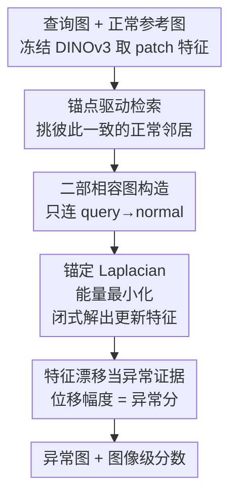

# Anomaly as Non-Conformity via Training-Free Graph Laplacian Energy Minimization

**会议**: CVPR 2026  
**arXiv**: [2605.28428](https://arxiv.org/abs/2605.28428)  
**代码**: 无（截至笔记时未公开）  
**领域**: 工业异常检测 / 少样本异常检测 / 训练无关方法  
**关键词**: 异常检测, 图 Laplacian, 非一致性, 训练无关, 少样本

## 一句话总结
ANoCo 把异常检测从"这个 patch 像不像正常的"重新定义成"把这个 patch 拉回正常流形要花多大代价"，用一个锚定的二部图 Laplacian 能量最小化把每个查询 patch 往正常流形上拉，**拉动的位移幅度本身**就是异常分——无需训练、无消息传递、闭式解，在 MVTec-AD / VisA 的 1/2/4-shot 上全面刷新 SOTA。

## 研究背景与动机
**领域现状**：工业少样本异常检测（few-shot）主流是"训练无关 + 检索"范式：用冻结的特征提取器（ViT / DINO）把图片切成 patch 取特征，建一个正常 patch 的 memory bank，测试时对每个查询 patch 做最近邻检索，**用与最近正常 patch 的相似度低不低**来判异常（PatchCore、SPADE、PaDiM 这条线）。

**现有痛点**：相似度打分是**逐 patch 独立**的——它隐含假设"只要查询 patch 跟某些正常 patch 像，它就正常"。但少样本场景里正常样本本身就有多种模态（光照、纹理、加工公差），$k$-NN 很容易给一个异常 patch 检索出一组"各自看着都挺像、但凑在一起互相矛盾"的正常邻居，于是异常被错误接受。换句话说：**局部可信、全局不一致**的异常，独立相似度根本看不出来。

**核心矛盾**：有人试过用图来建模 patch 间关系，但这些图方法（GNN 消息传递、Laplacian 平滑、同质性假设）都在**强迫相连节点趋同**。这对表示学习/半监督分类是好事，对异常检测却是灾难——平滑会把异常偏差抹平、把证据在节点间扩散，"鼓励图上平滑"恰好抹掉了异常检测最需要的那个信号。

**本文目标**：既要利用图建模 patch 与正常流形的**结构关系**，又不能让平滑机制把异常证据抹掉；还得保持训练无关、可解释、低复杂度。

**切入角度**：作者把问题换了个问法——不问"这个 patch 像不像正常"，而问"**把它改造成符合正常流形有多难**"。如果一个 patch 本来就在正常流形上，几乎不用动；如果它是异常，要把它拉回去就得大幅形变。

**核心 idea**：把图 Laplacian 从"平滑算子"重新解读为"**非一致性算子（non-conformity operator）**"——固定（锚定）正常参考节点，对查询 patch 解一个凸的锚定 Laplacian 能量最小化，**不要优化后的特征本身，只要那个把它拉回去所需的位移幅度**，用位移当异常分。

## 方法详解

### 整体框架
ANoCo（Anomaly as Non-Conformity）接收若干张正常参考图（$K\le 4$）和一张待测查询图，输出图像级异常分 $S(I_q)$ 和稠密异常图 $\mathcal{A}_q$。整条管线只做一次"线性求解"级别的计算，无任何可学习参数。流程是三段串行：先对每个查询 patch 做**锚点驱动检索**，挑出一小撮既像它、又彼此一致的正常参考 patch；再在查询 patch 与被选中的参考 patch 之间建一张**二部相容图**（刻意删掉 query–query、normal–normal 的边）；然后把参考节点冻结，对查询特征解一个**锚定 Laplacian 能量最小化**，得到闭式更新后的查询特征 $\tilde{\mathbf{F}}_q$；最后比较原始特征和更新后特征，**用特征漂移幅度当异常证据**得到异常图与图像级分数。

### 关键设计

**1. 锚点驱动检索：先定一个"主旋律"，再挑跟它合拍的邻居**

痛点是朴素 $k$-NN 按"跟查询像不像"（$s_{ij}=\cos(\mathbf{f}^q_i,\mathbf{f}^r_j)$）单独检索邻居，结果在多模态正常分布下会混进一堆"各自像查询、彼此却矛盾"的参考 patch，让正常流形的局部代表变得不连贯。ANoCo 的做法是分两步：先为第 $i$ 个查询 patch 选出**最相似的那个正常 patch 作为锚点** $\mathbf{f}^r_{j^\star(i)}$（$j^\star(i)=\arg\max_j s_{ij}$）；再要求其它入选邻居不仅像查询、还得**跟锚点也合拍**——计算锚点与各正常 patch 的相似度 $a_{ij}=\cos(\mathbf{f}^r_{j^\star(i)},\mathbf{f}^r_j)$，把参考按 $s_{ij}$ 降序排，只保留前缀里满足 $a_{ij}>s_{ij^\star(i)}$ 的那些，构成查询专属的稀疏邻居集 $\mathcal{N}(i)$。这样挑出来的是一组"以锚点为中心、互相一致"的正常参考，避免了用零散且互相冲突的局部匹配把异常 patch 误判为正常，让后续图建在一个连贯的正常流形代理上

**2. 二部相容图：刻意只连 query→normal，掐断异常自我强化的回路**

痛点是传统图方法允许 query–query、normal–normal 边，平滑时异常 patch 会从同图里的其它异常 patch 那借到"支持证据"互相加分，证据被稀释、偏差被抹平。ANoCo 只在每个查询 patch $i$ 和它的锚点一致邻居 $j\in\mathcal{N}(i)$ 之间连边，**显式删除所有 query–query 和 normal–normal 的边**——异常 patch 之间无法互相传话。边权也不只看方向：注意到余弦相似度丢掉了模长信息，作者额外乘一个**模长相容因子** $\alpha_{ij}=\frac{2\lVert\mathbf{f}^q_i\rVert_2\lVert\mathbf{f}^r_j\rVert_2}{\lVert\mathbf{f}^q_i\rVert_2+\lVert\mathbf{f}^r_j\rVert_2}$（两者模长接近时大、相差大时小），得到边权 $w^{\mathrm{QR}}_{ij}=s_{ij}\,\alpha_{ij}$，其余位置置零。由于没有 query–query 边，Laplacian 的查询块 $\mathbf{L}_{qq}=\mathbf{D}_q$ 是严格对角的，每个查询 patch 的更新彼此**解耦**，这正是后面能闭式逐元素求解的结构前提

**3. 锚定 Laplacian 能量最小化：把正常参考冻成"硬约束"，只让查询动**

痛点是普通 Laplacian 平滑会同时移动所有节点、抹掉异常。ANoCo 把全局特征写成 $\tilde{\mathbf{F}}=[\tilde{\mathbf{F}}_q;\mathbf{F}_r]$，其中参考特征 $\mathbf{F}_r$ **被钳死（锚定）不动**，只优化查询特征。目标函数由两项组成——流形一致性能量 $E_{\text{lap}}=\tilde{\mathbf{F}}^\top\mathbf{L}\tilde{\mathbf{F}}$（沿边惩罚不一致，鼓励查询往相连的正常参考靠拢）和稳定正则 $E_{\text{reg}}=\sum_i\lambda_i\lVert\tilde{\mathbf{f}}^q_i-\mathbf{f}^q_i\rVert_2^2$（防止查询特征漂得太远而退化），合起来

$$E(\tilde{\mathbf{F}})=\tilde{\mathbf{F}}^\top\mathbf{L}\tilde{\mathbf{F}}+\sum_{i=1}^{N_q}\lambda_i\lVert\tilde{\mathbf{f}}^q_i-\mathbf{f}^q_i\rVert_2^2.$$

因为参考被固定，这是个关于查询特征的**严格凸二次型**，对应线性系统 $(\mathbf{L}_{qq}+\mathbf{\Lambda}_q)\tilde{\mathbf{F}}_q=\mathbf{\Lambda}_q\mathbf{F}_q-\mathbf{L}_{qr}\mathbf{F}_r$。又由设计 2 保证 $\mathbf{L}_{qq}$ 是对角阵、$\mathbf{\Lambda}_q$ 正对角，二者之和可逆，于是

$$\tilde{\mathbf{F}}_q=(\mathbf{L}_{qq}+\mathbf{\Lambda}_q)^{-1}(\mathbf{\Lambda}_q\mathbf{F}_q-\mathbf{L}_{qr}\mathbf{F}_r),$$

每个查询 patch 只需一次稀疏的 query→reference 聚合 $\mathbf{L}_{qr}\mathbf{F}_r$ 再逐元素除以对角项——**无迭代、无大矩阵求解、无消息传递**，整体是可并行的 $O(N_q d)$ 闭式操作。把参考锚定成高刚度流形是关键：它保证"该动的只有查询"，正常流形不会被异常带跑

**4. 特征漂移当异常证据：不要优化后的特征，只要"拉回去花了多大力"**

这是全文最反直觉、也最核心的一步。绝大多数基于优化的方法会把优化后的特征当成预测/重建结果用，ANoCo 偏偏**丢掉** $\tilde{\mathbf{f}}^q_i$ 本身，只看从 $\mathbf{f}^q_i$ 到 $\tilde{\mathbf{f}}^q_i$ 的**位移幅度**——因为正常 patch 本就贴着流形、几乎不用动，异常 patch 要符合流形就得大幅形变，位移大小天然编码了"非一致程度"。每个 patch 的异常能量定义为

$$E_i=\lVert\tilde{\mathbf{f}}^q_i-\mathbf{f}^q_i\rVert_2^2\,\bigl(1-\cos(\tilde{\mathbf{f}}^q_i,\mathbf{f}^q_i)\bigr),$$

既量幅度（$\ell_2$ 平方）又量方向改变（$1-\cos$）。所有 patch 的 $E_i$ 拼成稠密异常图，图像级分数 $S(I_q)$ 由 patch 维度 **max-pooling** 得到。由于异常分来自"自己被改造的代价"、而非"从别的 patch 借来的支持"，同一测试图里其它异常 patch 无法替它背书——这正是它比独立相似度更鲁棒的根因

## 实验关键数据

### 主实验
骨干网络统一用冻结的 DINOv3-L/16（取第 18 层中层表示），在 MVTec-AD 和 VisA 上比 SPADE / PatchCore / WinCLIP / PromptAD / KAG-Prompt / INP-Former。下表取 **1/2/4-shot 图像级 AUROC** 与几个像素级指标对比（数字为论文 Table 1）：

| 设置 | 方法 | MVTec Img-AUROC | MVTec Px-PRO | VisA Img-AUROC | VisA Px-PRO |
|------|------|-----------------|--------------|----------------|-------------|
| 1-shot | PatchCore (CVPR'22) | 83.4 | 79.7 | 81.6 | 82.6 |
| 1-shot | WinCLIP (CVPR'23) | 93.1 | 87.1 | 83.8 | 85.1 |
| 1-shot | INP-Former (CVPR'25) | 96.6 | 92.6 | 91.4 | 89.5 |
| 1-shot | **ANoCo (本文)** | **97.9** | **95.4** | **92.7** | **94.9** |
| 2-shot | INP-Former (CVPR'25) | 97.0 | 93.1 | 94.6 | 91.8 |
| 2-shot | **ANoCo (本文)** | **98.4** | **96.0** | 93.3 | **94.7** |
| 4-shot | INP-Former (CVPR'25) | 97.6 | 92.9 | **96.4** | 93.1 |
| 4-shot | **ANoCo (本文)** | **98.7** | **96.2** | 95.2 | **95.7** |

MVTec-AD 三个 shot 设置下 ANoCo 全面领先，且像素级 PRO（定位）提升尤其明显（1-shot 95.4 vs INP-Former 92.6）。VisA 上图像级分数 2/4-shot 略逊于 INP-Former，但**定位指标（PRO）始终最佳**，作者强调 VisA 的主要收益在定位的稳定性。

### 消融实验
Table 2（1-shot）逐步把"距离度量 → 图能量"演进，验证三个组件的增量贡献：

| 配置 | MVTec Img-AUROC | MVTec Px-PRO | VisA Img-AUROC | VisA Px-PRO |
|------|-----------------|--------------|----------------|-------------|
| $k$-NN (L2) | 87.7 | 91.2 | 72.2 | 88.3 |
| $k$-NN (Mahalanobis) | 93.1 | 92.8 | 77.0 | 94.0 |
| $k$-NN + 非二部图 | 93.7 | 92.2 | 86.3 | 90.2 |
| $k$-NN + 二部图 | 95.8 | 94.4 | 90.5 | 94.2 |
| **ANoCo（锚点驱动 + 二部图）** | **97.9** | **95.4** | **92.7** | **94.9** |

骨干消融（Table 3，1-shot）显示在同一骨干下 ANoCo 普遍领先：WideResNet50 上 MVTec Img-AUROC 89.7（PatchCore 83.4），CLIP-B 上 95.0（WinCLIP 93.1），DINOv2-B 上 97.3（INP-Former 96.6）；尤其 DINOv3-L 下 ANoCo 1-shot（97.9）远超 $k$-NN full-shot（83.7），说明增益来自方法而非单纯堆骨干/样本。

### 关键发现
- **二部结构是定位提升的主力**：从"非二部图"到"二部图"，VisA 图像级 AUROC 从 86.3 跳到 90.5，印证了"掐断 query–query / normal–normal 边能防止异常自我强化"的论点。
- **锚点驱动检索锦上添花**：在二部图基础上换成锚点驱动检索，MVTec 图像级再涨 2.1 个点（95.8→97.9），对稀疏采样的多模态正常分布更鲁棒。
- **VisA 图像级偶有落后但定位最稳**：2/4-shot 图像级略逊 INP-Former，作者把卖点放在 PRO 定位与稳定性上，结论需结合任务侧重看，不宜只比单一图像级 AUROC。

## 亮点与洞察
- **把"平滑算子"反用成"非一致性算子"是真正的概念创新**：同一个图 Laplacian，别人用它让节点趋同（平滑/半监督传播），本文锚定正常节点后只让查询动、并把"动了多少"当信号——一次数学重解释把异常检测的痛点（平滑会抹掉异常）直接变成了优势。
- **"丢掉优化结果、只留优化代价"反直觉但极优雅**：大多数优化式方法盯着重建/预测误差，ANoCo 证明"满足约束所需的形变幅度"本身就是更干净的异常度量，物理含义清晰（拟合正常流形要花的能量）。
- **极致轻量**：无可学习参数、无消息传递、无采样、无迭代，复杂度等价于一次稀疏线性求解（$O(N_q d)$、逐 patch 解耦可并行），训练无关、即插即用，工程落地友好。
- **可迁移思路**：把"检索-检验"两个角色分离（检索只用来搭正常流形参考、不直接打分）这个解耦，可借鉴到其它 OOD / 新颖性检测任务——避免用"检索到相似项"直接当"正常"的常见陷阱。

## 局限与展望
- **依赖强骨干**：主结果建在 DINOv3-L/16 上，骨干消融里换成 WideResNet50 后绝对分数明显回落（MVTec Img-AUROC 89.7），方法收益与底层特征质量耦合较深。
- **VisA 图像级未全面碾压**：2/4-shot 图像级 AUROC 落后 INP-Former，说明"非一致性度量"在某些类别的全局判别上并非总优于专门的表示学习方法，优势更集中在定位。
- **超参与设计细节披露有限**：正则权重 $\lambda_i$ 取共享标量、第 18 层中层表示的选择、检索前缀长度等关键超参的敏感性分析放在补充材料，正文未给出消融，复现时需留意。
- **max-pooling 取图像级分数偏激进**：单 patch 最大能量决定整图分数，对单点噪声/伪异常可能敏感，可探索更鲁棒的聚合（如 top-k 均值）。

## 相关工作与启发
- **vs PatchCore / SPADE / PaDiM（memory + 最近邻）**：它们逐 patch 独立按相似度打分，假设"存在相似正常 patch 即正常"；ANoCo 保留 memory 范式，但用图能量评估查询对正常流形的**联合一致性**，专治"局部像、全局不一致"的漏检。
- **vs 基于 GNN / Laplacian 平滑的图异常检测**：那些方法靠同质性/拓扑正则让相连节点趋同，会把异常偏差平滑掉；ANoCo 反其道——锚定正常、只动查询、用位移当证据，把 Laplacian 当非一致性算子而非平滑先验。
- **vs 基于重建/优化的异常检测**：传统优化式方法把异常当重建残差或编码复杂度；ANoCo 不重建输入、不学全局模型，而是解一个"向固定正常流形投影"的 Laplacian 约束问题，用查询更新幅度本身当分，是"流形不相容"而非"重建误差"的解读。
- **vs INP-Former（当前强基线）**：INP-Former 靠表示学习在 VisA 图像级略胜，ANoCo 训练无关却在 MVTec 全设置和大部分定位指标上反超，体现"换问法（非一致性）+ 轻量闭式解"的性价比优势。

## 评分
- 新颖性: ⭐⭐⭐⭐⭐ 把图 Laplacian 从平滑算子重解释为非一致性算子、并用"优化诱导的特征漂移"当异常分，是干净且少见的概念创新
- 实验充分度: ⭐⭐⭐⭐ 两大基准 × 三个 shot × 六指标 + 组件/骨干消融较完整，但关键超参敏感性放在补充、VisA 图像级未全面领先
- 写作质量: ⭐⭐⭐⭐ 动机推导清晰、公式自洽、三段式管线讲得明白；个别 OCR 残留与符号略影响阅读
- 价值: ⭐⭐⭐⭐⭐ 训练无关、无参数、闭式解、即插即用，对工业少样本异常检测落地价值高

<!-- RELATED:START -->

## 相关论文

- [\[CVPR 2026\] LayoutAD: Exploring Semantic-Geometric Misalignment Reasoning for Scene Layout Anomaly Detection](layoutad_exploring_semantic-geometric_misalignment_reasoning_for_scene_layout_an.md)

<!-- RELATED:END -->
