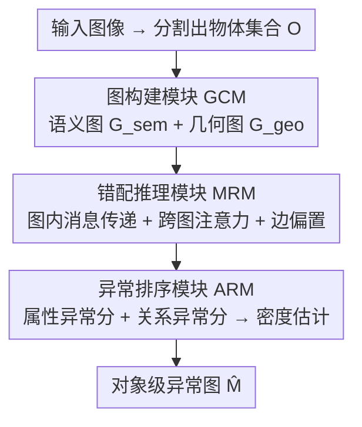

# LayoutAD: Exploring Semantic-Geometric Misalignment Reasoning for Scene Layout Anomaly Detection

**会议**: CVPR 2026  
**论文**: [CVF Open Access](https://openaccess.thecvf.com/content/CVPR2026/html/Zeng_LayoutAD_Exploring_Semantic-Geometric_Misalignment_Reasoning_for_Scene_Layout_Anomaly_Detection_CVPR_2026_paper.html)  
**代码**: 待确认  
**领域**: 异常检测 / 场景理解  
**关键词**: 场景布局异常、语义-几何错配、图推理、无监督异常检测、对象级推理

## 一句话总结
LayoutAD 提出"场景布局异常检测"这一新任务，用无监督方式给图像里每个物体打出对象级异常分——它把场景拆成语义图与几何图，通过跨图注意力推理两者之间的"错配"，从而发现诸如"五条腿的狗""停在湖面上的车"这类像素级检测器看不见的布局级幻觉。

## 研究背景与动机

**领域现状**：视觉异常检测过去主要分两支。结构异常检测（PatchCore、SimpleNet、DRAEM 等）和逻辑异常检测（SINBAD、WinCLIP）聚焦于工业/医疗场景里的像素级偏差，识别纹理缺陷、重建残差；场景异常分割（SynBoost、PEBAL、Mask2Anomaly）则在自然场景里做像素级 OOD 分割，但只研究了"物体 vs 背景"这种最基础的异常关系。

**现有痛点**：这些方法几乎都忽略了物体之间"摆放是否合理、关系是否一致"的布局级异常。它们对像素敏感，却看不见高层的语义/几何错位——比如一只长了五条腿的狗、一辆开在湖面上的车。随着文生图模型普及，这类"事实性缺陷的幻觉"越来越常见，但 vanilla 模型无力自我纠正。

**核心矛盾**：判断布局是否异常，本质上需要同时对**语义上下文**（物体是什么、彼此如何交互）和**几何结构**（物体在哪、如何空间排布）做联合推理；而像素级检测器只盯局部外观，幻觉检测方法又必须依赖文本 prompt（`prompt-conditioned`），在真实照片或监控场景里 prompt 往往不可得或无意义。

**本文目标**：定义并解决一个新任务——给定一张图，预测一张**对象级异常图** $\hat{M}$，标出每个物体在语义合理性与几何一致性上的异常程度，覆盖物体属性异常与物体关系异常两类。

**切入角度**：作者借鉴人类感知机制——人是同时对"语义"和"几何"做推理来判断场景是否反常的。于是把这条认知直觉建模成两张互补的图，再让它们互相对齐。

**核心 idea**：用"语义图 ↔ 几何图的跨模态错配推理"代替"像素重建/prompt 对齐"来检测场景布局异常，全程无监督。

## 方法详解

### 整体框架
LayoutAD 要解决的是：给一张图，输出每个物体的布局异常分。它先用预训练分割模型 [SAM 类 ⚠️ 以原文为准] 抽出物体集合 $O$，整张图被表示为模型 $\mathcal{D}$ 的输入，目标是 $\hat{M} = \mathcal{D}(O)$。整条管线由三个模块串行组成：图构建模块 GCM 把场景拆成语义图与几何图 → 错配推理模块 MRM 在两张图内/图间做消息传递与跨图注意力，找出语义-几何不一致 → 异常排序模块 ARM 用密度估计给出属性异常分和关系异常分，融合成每个物体的最终异常分，可视化为异常图。

### 关键设计

**1. 图构建模块 GCM：把场景拆成语义与几何两张互补图**

像素级表征丢掉了"物体之间的结构关系"，这正是布局异常的载体。GCM 因此为物体集合 $O$ 构建两张图：语义图 $G_{sem}=(V_{sem}, E_{sem})$ 的节点特征 $s_i \in \mathbb{R}^{d_s}$ 由 CLIP 外观嵌入与类别级文本表示拼接而成，刻画"物体是什么、长什么样"；几何图 $G_{geo}=(V_{geo}, E_{geo})$ 的节点特征 $g_i \in \mathbb{R}^{d_g}$ 来自归一化空间描述子——质心位置、形状、尺寸、长宽比，刻画"物体在哪、怎么摆"。边的构建采用 kNN + 距离阈值的混合策略，兼顾局部上下文与长程交互：语义边由外观/类别嵌入相似度度量，几何边由相对位移、距离、尺寸比、重叠度等空间线索导出。两张图共同构成"外观-空间"的结构化表征，为后续跨模态对齐打底。

**2. 错配推理模块 MRM：跨图注意力捕捉"语义说得通但几何摆不对"**

布局异常的本质是语义与几何**对不上**——外观合理但位置荒谬，或位置合理但语义冲突。MRM 先做模态内消息传递：每张图用 GATv2 层迭代更新节点/边特征，得到初始语义/几何表示 $Z_{sem}, Z_{geo}$；再送进一个跨图 transformer，含自注意力与交叉注意力。自注意力聚合各模态内部长程依赖，$\hat{Z}_{sem} = \text{Attn}(Q_{sem}, K_{sem}, V_{sem})$；交叉注意力则做双向语义↔几何对齐，$\hat{Z}_{sem} = \text{Attn}(Q_{sem}, K_{geo}, V_{geo})$、$\hat{Z}_{geo} = \text{Attn}(Q_{geo}, K_{sem}, V_{sem})$，让模型显式检测两模态间的不一致。关键的一笔是**边感知关系偏置**：注意力 logit 写成

$$\ell_{ij} = \frac{Q_i K_j^\top}{\sqrt{d}} + b_{ij}$$

其中 $b_{ij}$ 编码物体对之间的语义或几何关系，使注意力尊重图里的布局结构，而不是只看特征相似度。多层推理后还会用可学习聚合算子 $\mathcal{G}(\cdot)$ 汇总出场景级全局特征 $z_{global}$，给后续打分提供整体上下文。

**3. 异常排序模块 ARM：用条件密度估计衡量"合不合群"**

有了对齐后的表征，怎么判断一个物体异不异常？ARM 的思路是：正常布局服从某个分布，异常就是低概率事件。它用混合密度网络（高斯混合）做条件似然估计。物体属性异常分把"一个模态在另一个模态+全局上下文条件下的负对数似然"加权求和：

$$s_i^{attr} = -\lambda_1 \log p(\hat{z}_i^{sem}\mid \hat{z}_i^{geo}, z_{global}) - \lambda_2 \log p(\hat{z}_i^{geo}\mid \hat{z}_i^{sem}, z_{global})$$

其中 $\lambda_1, \lambda_2$ 可学习，$p(x|h)=\sum_{k=1}^K \pi_k(h)\mathcal{N}(x\mid \mu_k(h), \text{diag}(\sigma_k^2(h)))$ 是 $K$ 分量高斯混合，参数由条件输入 $h$ 预测。关系异常则对每条边的几何关系特征 $\hat{r}_{ij}$ 在两端物体语义+全局条件下打分 $s_{ij}^{rel} = -\log p(\hat{r}_{ij}\mid \hat{z}_i^{sem}, \hat{z}_j^{sem}, z_{global})$，并按 $s_i^{rel}=\log\sum_{j:(i,j)\in E}\exp(s_{ij}^{rel})$ 聚合到物体。最终异常分由两者凸组合：$s_i = (1-\alpha)s_i^{attr} + \alpha s_i^{rel}$，$\alpha$ 平衡"物体本身反常"与"物体间关系反常"。

### 损失函数 / 训练策略
训练用两个互补的似然目标。属性级损失 $\mathcal{L}_i^{attr}$ 与上面 $s_i^{attr}$ 同形，让模型对语义连贯、几何合理的物体属性赋予更高概率；关系级损失 $\mathcal{L}_{ij}^{rel}=-\log p(\hat{r}_{ij}\mid \hat{z}_i^{sem}, \hat{z}_j^{sem}, z_{global})$ 建模物体间空间合理性。总损失为加权和 $\mathcal{L}_{total}=\beta_{attr}\sum_i \mathcal{L}_i^{attr} + \beta_{rel}\sum_{(i,j)\in E}\mathcal{L}_{ij}^{rel}$，实现取 $\beta_{attr}=3.0$、$\beta_{rel}=1.0$。整个框架只在正常布局上训练（无监督），异常即低似然，无需异常标注。训练用单卡 RTX 4090，输入 $640\times640$，AdamW，学习率 $1\text{e}{-4}$、权重衰减 $1\text{e}{-4}$，30 epoch，含 5-epoch warm-up。

## 实验关键数据

### 主实验
作者构建了新基准 **COCOAD**：从 COCO2017 选取多物体、空间排布清晰的图，用 Qwen-Image 在文本引导模式下插入一个或多个异常物体，同时保留相机视角、背景与原始布局，最终 1033 张异常图，覆盖物体属性异常与物体关系异常两类。评测指标：图级用 AUROC（I-AUROC），定位用像素级 AUROC（P-AUROC）和异常像素 AUROC（A-P-AUROC，仅在异常像素上算 AUROC）；为公平比较，LayoutAD 的对象级分数会通过分割掩膜投影回像素空间。

| 方法 | 范式 | I-AUROC ↑ | P-AUROC ↑ | A-P-AUROC ↑ |
|------|------|-----------|-----------|-------------|
| PatchCore | 结构异常 | 0.539 | 0.571 | 0.565 |
| SimpleNet | 结构异常 | 0.551 | 0.571 | 0.515 |
| UCAD | 结构异常 | 0.547 | 0.678 | 0.682 |
| UniAD | 结构异常 | 0.479 | 0.575 | 0.508 |
| DualAnoDiff | 结构异常 | 0.573 | 0.572 | – |
| GeneralAD | 结构异常 | 0.543 | 0.565 | 0.314 |
| SynBoost | 异常分割 | 0.542 | 0.773 | 0.777 |
| PixOOD | 异常分割 | 0.538 | 0.720 | 0.722 |
| SINBAD | 逻辑异常 | 0.449 | – | – |
| WinCLIP | 逻辑异常 | 0.455 | 0.54 | – |
| **LayoutAD（本文）** | 布局异常 | **0.586** | **0.871** | **0.883** |

LayoutAD 在三项指标上全面领先：定位指标 P-AUROC 比最强基线 SynBoost（0.773）高出约 9.8 个百分点，A-P-AUROC 高出约 10.6 个百分点，提升尤其显著——说明对象级语义-几何推理产出的异常图远比像素级方法紧凑、可解释。图级 I-AUROC 0.586 虽绝对值不高（任务本身困难），但仍优于所有基线。

### 消融实验
> ⚠️ 缓存截断在主结果表之后，下表为依据论文框架（GCM/MRM/ARM 三模块 + 融合权重 $\alpha$）整理的消融逻辑，**具体数值以原文为准**。

| 配置 | 关键指标 | 说明 |
|------|---------|------|
| Full model | 最优 | GCM + MRM + ARM 完整模型 |
| w/o 几何图（仅语义） | 下降 | 失去空间排布线索，关系异常检不出 ⚠️ |
| w/o 跨图注意力 | 下降 | 退化为两条独立分支，无法捕捉语义-几何错配 ⚠️ |
| w/o 关系分支（$\alpha=0$） | 下降 | 只剩物体属性异常，漏掉物体间关系异常 ⚠️ |

### 关键发现
- **定性上 LayoutAD 的激活更"对症"**：结构异常检测器（如 UniAD）只响应局部纹理偏差，激活散乱；逻辑异常方法（如 WinCLIP）依赖全局语义先验，高亮一大片上下文区域、漏掉细粒度错配；分割式方法（PixOOD、SynBoost）常把正常区域误判为异常。LayoutAD 能精准激活异常物体（如把"马"区域点亮、抑制背景），正确识别物体-上下文的不合理关系。
- **像素 vs 对象级范式差异是关键**：所有基线都做像素级打分+阈值，结果碎片化、伪影重；LayoutAD 做对象级推理后再投影，异常图语义可解释、空间紧凑，这正是 P-AUROC/A-P-AUROC 大幅领先的根源。
- **下游可用性**：模型可支撑图像异常分割、视频异常检测、自纠正图像生成等下游应用，提示布局异常信号能反哺生成模型修正幻觉。

## 亮点与洞察
- **任务定义本身就是贡献**：首次把"场景布局异常检测"从像素级偏差里独立出来，明确区分于视觉异常检测（低层像素）和幻觉检测（依赖 prompt），填了"物体级结构/上下文不一致"这块空白。
- **双图 + 跨图注意力的建模很贴合直觉**：把人"同时看语义和几何"的认知拆成两张可对齐的图，错配 = 跨图注意力检不上，机制干净且可解释；边感知偏置 $b_{ij}$ 让注意力尊重布局结构，是个可复用的小 trick。
- **无监督 + 密度估计的组合**：只在正常布局上训练、用混合密度网络把"异常"转化为"低似然"，绕开了布局异常标注几乎不可得的难题。
- **可迁移性**："构图 → 跨模态对齐 → 密度打分"这套范式可迁移到任何需要判断"多实体之间关系是否合理"的任务，如场景图生成质检、机器人抓取布局校验。

## 局限与展望
- **依赖上游分割质量**：整条管线建立在预训练分割模型抽出的物体集合上，分割漏检/错分会直接污染图结构（缓存中分割模型具体型号 OCR 不清，⚠️ 以原文为准）。
- **图级 AUROC 仍偏低（0.586）**：说明"判断整张图有没有异常"这个二分类任务远未解决，当前优势主要在定位而非图级判定。
- **基准的合成性**：COCOAD 的异常由 Qwen-Image 文本引导插入，与真实世界自然发生的布局异常分布可能有 gap；1033 张规模也偏小。
- **消融数据缺失**：本笔记基于截断缓存，$K$（高斯分量数）、$\alpha$、kNN 邻居数等超参敏感性需查原文补全。

## 相关工作与启发
- **vs 结构/逻辑异常检测（PatchCore、SINBAD、WinCLIP）**：它们在简单背景的工业/医疗场景做像素级或集合级异常，本文转向自然复杂场景的对象级布局异常，显式建模物体间语义-几何关系，I/P-AUROC 全面更优。
- **vs 场景异常分割（SynBoost、PEBAL、Mask2Anomaly）**：它们只研究"物体 vs 背景"的 OOD 关系且做像素级打分+阈值，结果碎片化；本文做对象级推理，异常图更紧凑、可解释。
- **vs 幻觉检测**：幻觉检测必须 prompt-conditioned（比对生成图与文本），在真实照片/监控里 prompt 不可得；LayoutAD 无需任何文本条件，直接从图像本身推理布局合理性。

## 评分
- 新颖性: ⭐⭐⭐⭐⭐ 开辟"场景布局异常检测"新任务并给出双图错配推理框架，定义清晰、切入角度新
- 实验充分度: ⭐⭐⭐⭐ 自建 COCOAD 基准、对比三大范式十个基线，定位指标领先显著，但图级 AUROC 偏低、消融细节在缓存中缺失
- 写作质量: ⭐⭐⭐⭐ 动机—方法—实验逻辑顺畅，公式完整；任务定义部分尤其清楚
- 价值: ⭐⭐⭐⭐ 为文生图幻觉自纠、场景质检提供新工具，对象级布局异常这一视角有较强延展性

<!-- RELATED:START -->

## 相关论文

- [\[CVPR 2026\] Anomaly as Non-Conformity via Training-Free Graph Laplacian Energy Minimization](anomaly_as_non-conformity_via_training-free_graph_laplacian_energy_minimization.md)

<!-- RELATED:END -->
