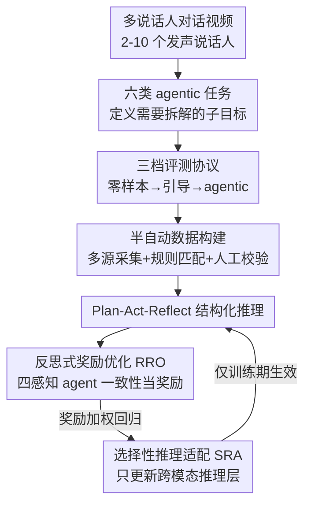

# AMUSE: Audio-Visual Benchmark and Alignment Framework for Agentic Multi-Speaker Understanding

**会议**: CVPR 2026  
**论文**: [CVF Open Access](https://openaccess.thecvf.com/content/CVPR2026/html/Chowdhury_AMusE_Audio-Visual_Benchmark_and_Alignment_Framework_for_Agentic_Multi-Speaker_Understanding_CVPR_2026_paper.html)  
**代码**: 无（论文未公开）  
**领域**: 音视频多模态 / Benchmark / Agent / 对齐RLHF  
**关键词**: 多说话人理解, 音视频Benchmark, Agentic评测, 反思式奖励, 数据高效对齐

## 一句话总结
本文提出 AMUSE——一个面向「多说话人、对话密集」场景的音视频 Benchmark（6 个 agentic 任务 × 零样本/引导/agentic 三种评测模式），揭示了 GPT-4o、Qwen3-Omni 等主流 MLLM 在「谁在说、何时说、跨场景因果」上的系统性短板；并配套提出 RAFT 对齐框架（反思式奖励 + 选择性参数适配），用极少标注就把开源模型在该 Benchmark 上的准确率最高提升 39.52%（相对）。

## 研究背景与动机
**领域现状**：以 GPT-4o、Qwen3-Omni 为代表的多模态大模型（MLLM）在图像理解、指令跟随、跨模态推理上进步显著，正从「被动感知」走向「会议助手、对话伴侣、讨论主持人」这类真实 agent 角色。这些角色天然处在多人、有时间线的交互里。

**现有痛点**：现有评测要么测感知和单轮推理（MMBench / MME / MMMU），要么测语言质量却不把推理归因到具体说话人（M3Exam / Video-ChatGPT）；连长程对话评测（MMRC / MMLU-Pro）也默认「单一旁白」，忽略了说话人切换和共享上下文。结果是：MLLM 能否在多说话人场景里维持说话人身份、解析跨轮依赖、做结构化推理，几乎无人系统评测过。

**核心矛盾**：现有所谓的「agency」评测局限在工具调用、网页 agent 环境控制、纯文本模态，没人回答「这种自主性如何迁移到多人、音视频对话里」。而多说话人理解的本质就是 agentic——必须把高层任务拆成 grounding、关联、预测、总结等子目标分步执行，这恰恰是当前评测缺失的维度。

**本文目标**：(1) 造一个真正考验多说话人 agentic 推理的 Benchmark；(2) 提供能在该 Benchmark 上有效提升模型的对齐方法，且要数据/参数高效。

**切入角度**：作者认为这些任务「内在就是 agentic 的」，所以评测必须显式区分模型有多少自主性——给不给感知提示、给不给工具说明，会暴露出模型到底是真理解还是靠脚手架。于是设计了零样本→引导→agentic 三档递进协议。

**核心 idea**：用「三档自主性 × 六类多说话人任务」的评测矩阵把 MLLM 的多说话人推理能力照出原形，再用「让模型用自身感知一致性当奖励、只更新跨模态推理层」的 RAFT 把短板补上。

## 方法详解
AMUSE 这篇工作有两个互补部分：前半是 **Benchmark**（任务定义 + 评测协议 + 数据构建），后半是 **RAFT 对齐框架**。Benchmark 给出诊断，RAFT 给出处方。下面先讲清 Benchmark 的设计（这是一篇 benchmark 论文的重心），再讲 RAFT 的训练机制。

### 整体框架
输入是一段对话密集的多说话人视频（10–50 秒，含 2–10 个可见且发声的说话人）；AMUSE 围绕它定义六类任务，并用三档评测协议逐档抽走脚手架来测自主性。RAFT 则在训练期介入：模型先调用感知工具（人脸检测、说话人定位、语音转写）抽取多模态线索，在「推理–行动–反馈（Plan-Act-Reflect）」循环里产出结构化回答，由四个感知 agent 的一致性打分构成奖励，反过来只更新跨模态推理层。

### 关键设计

**1. 六类 agentic 多说话人任务：把「多人理解」拆成可诊断的能力维度**

针对「现有 benchmark 测不出多说话人推理」的痛点，AMUSE 设计了六个任务，覆盖时间、因果、身份三类推理：① **音视频对话总结（AVDS）**——在保留说话人角色和内容归属的前提下总结多人对话，难在密集交互、重叠话语、角色纠缠；② **音视频说话人关联（AVSA）**——把每句话映射到对应的可见说话人，难在重叠发声/打断时要靠音素、唇动、视线、时序模式做细粒度跨模态消歧；③ **下一说话人预测（NSP）**——预测下一个发言者，考验对轮替动态的社交推断（视线转移、停顿、韵律）；④ **说话人重识别（SRID）**——跨不连续片段匹配同一说话人，要求外观/视角/光照/情绪变化下的模态不变嵌入；⑤ **说话人时序定位（STG）**——定位活跃说话人的时间区间与身份，需在重叠/间歇语音下同步声学、唇动、面部动态；⑥ **跨场景叙事链接（CSNL）**——连接不同场景的事件/话语推断因果时序关系，是认知最难的一类。这六类任务共同把「多说话人理解」从一句模糊的能力分解成可分别打分的子能力。

**2. 零样本 / 引导 / agentic 三档评测协议：用自主性梯度照出模型对脚手架的依赖**

这是 benchmark 最核心的设计动机——区分「真理解」和「靠提示」。**零样本**只给原始视频+问题，是模型内在多模态理解的下界；**引导**额外给预算好的感知线索（人脸裁剪、活跃说话人时间戳、ASR 转写）并配显式步骤提示（如「先用转写确定谁在说，再总结」），测模型整合结构化线索、跟随任务分解的能力；**agentic** 最难：抽掉所有关于工具可用性和中间步骤的提示，外部模块（人脸检测、说话人定位、语音转文字）运行时仍可访问，但模型必须靠自身推理隐式发现并调用它们。表 2 还细化了每个任务可用哪些辅助元数据（人脸裁剪 FC / 语音段 VS / 转写 TR / 唇同步 LS），不同任务给的线索不同。三档下来，「性能随自主性递减」这一结论本身就是 benchmark 的主要发现。

**3. 半自动数据构建 + 多源采集：保证多说话人场景的真实复杂度**

样本从 AVA-ActiveSpeaker、VoxCeleb2、FriendsMMC、AMI Meetings 及网络抓取的脱口秀/访谈/播客中筛取，聚焦多人对话。构建流程结合元数据与规则匹配做半自动配对，再人工检查标注一致性。最终 AMUSE 含 **2,100 个样本**：STG/AVDS/AVSA/NSP/SRID 各 400，CSNL 100（人工采集的跨场景实例）；平均每段 38.7 秒，覆盖 23 小时以上标注内容、350+ 唯一身份，平均每段说话人数 3.1、重叠率 0.28——是现有 benchmark 中说话人密度最高、且唯一同时具备音视频 + 6 个 agentic 任务 + 时间/因果/身份三类推理的（表 1）。这保证了评测难度来自真实的多人重叠，而非人造拼接。

**4. RAFT 对齐框架：让模型用自身感知一致性当奖励、只更新跨模态推理层**

诊断之后是处方。RAFT（Reasoning-Acting-Feedback Training）把输入建模为多模态流 $x=\{x^{(a)},x^{(v)},x^{(t)}\}$（音/视/文），输出为结构化的 $y=\{p,a,r\}$（Plan-Act-Reflect 三阶段），优化目标兼顾奖励与对齐：$\theta' = \arg\max_\theta \mathbb{E}_{(x,y)\sim D}[R(x,y) - \lambda L_{align}(x,y)]$。其中结构对齐项用最大似然 $L_{align}(x,y)=-\log \pi_\theta(y\mid x)$，迫使每个推理阶段和其上下文依赖一致。

它由两个子模块组成。**反思式奖励优化（RRO）**：不另设 critic，而是让模型用自身的反思反馈+教师引导分（grounding 准确率、说话人一致性、文本连贯性）算序列级奖励 $r_i$。关键的感知奖励 $r_i = f_{perceptual}(\text{Sync},\text{Face},\text{Speech},\text{Diarization})$ 聚合四个感知 agent 的一致性分数，把反馈锚在感知正确性而非纯文本相似度上。对 $K$ 个采样候选 $\{y_i\}$ 做奖励加权回归更新：$\nabla_\theta J_{RRO}=\sum_{i=1}^K w_i \nabla_\theta \log\pi_\theta(y_i\mid x)$，权重 $w_i=\frac{\exp(\beta(r_i-\bar r))}{\sum_j \exp(\beta(r_j-\bar r))}$ 是对奖励减均值的 softmax——作者发现相比 GRPO 的线性加权，softmax 训练更稳。再加一个多模态时序一致性损失 $L_{temp}=\sum_t(\|f_a(t)-f_v(t)\|_2^2 + \gamma\|f_t(t)-f_r(t)\|_2^2)$ 防跨模态漂移。总目标 $L_{RAFT}=L_{align}+\alpha L_{temp}-\beta J_{RRO}$。**选择性推理适配（SRA）**：因数据有限，只对跨模态推理层加 adapter（不同于通用 LoRA 全量微调），把更新限制在跨模态推理路径上，提升可解释性与收敛速度、同时压低算力。两者合起来就是「自我反思打分 + 精准只调推理层」的数据/参数双高效配方。

### 损失函数 / 训练策略
最终训练目标 $L_{RAFT}=L_{align}+\alpha L_{temp}-\beta J_{RRO}$ 三项分别负责：结构对齐（Plan-Act-Reflect 连贯）、时序一致（跨模态同步 grounding）、反思奖励（感知正确性驱动）。RRO 模块只在训练期生效，推理时模型独立运行。消融显示三项缺一不可，其中反思项对解决多说话人歧义贡献最大。

## 实验关键数据

### 主实验
评测覆盖闭源（GPT-4o、GPT-4o-mini、REKA）与开源（Unified-IO2-5B、CREMA、Video-SALMONN、VITA-8B、Qwen2.5-Omni-7B、Qwen3-Omni）模型，并设人类上界。文本质量用 BLEU@4 / METEOR / CIDEr / GPT-as-Judge，分类任务用 Top-1 Acc，时序任务用 tIoU 和 Off-by-One Acc，CSNL 用人工连贯性评分（0–10）。

音视频对话总结（AVDS）BLEU 结果，开源模型经 RAFT 后大幅获益：

| 模型 | 零样本 | 引导 | agentic | agentic+RAFT |
|------|--------|------|---------|--------------|
| 人类（上界） | 86.04 | – | – | – |
| GPT-4o（闭源） | 43.52 | 49.21 | 44.41 | – |
| Qwen2.5-Omni-7B | 44.92 | 46.06 | 42.07 | 51.54 |
| Qwen3-Omni | 45.08 | 48.08 | 45.07 | **54.54** |

分类类任务准确率（%），RAFT 让 Qwen3-Omni 的 agentic 成绩从 46.98 提到 54.22：

| 模型 | AVSA agentic | AVSA +RAFT | NSP agentic | NSP +RAFT | SRID agentic | SRID +RAFT |
|------|------|------|------|------|------|------|
| Qwen2.5-Omni-7B | 44.46 | 48.89 | 43.54 | 52.33 | 52.19 | 58.62 |
| Qwen3-Omni | 46.98 | **54.22** | 45.02 | **56.73** | 54.51 | **62.53** |

说话人时序定位（STG）与跨场景叙事链接（CSNL），RAFT 在时序精度和叙事连贯上提升最显著：

| 模型 | STG tIoU agentic | +RAFT | CSNL Acc agentic | +RAFT | CSNL 连贯性 agentic | +RAFT |
|------|------|------|------|------|------|------|
| Qwen2.5-Omni-7B | 42.53 | 52.08 | 40.50 | 53.80 | 5.24 | 6.28 |
| Qwen3-Omni | 45.59 | **54.04** | 41.04 | **57.26** | 5.02 | **7.11** |

### 消融实验
| 配置 | 关键现象 | 说明 |
|------|---------|------|
| Full RAFT | 最优 | 完整框架 |
| w/o 对齐 / 时序 / 反思 | 全面下降 | 三项任一移除都掉点（图 6a） |
| w/o 反思项 | 掉点最多 | 反思项对解决多说话人歧义贡献最大 |
| 逐阶段加 SRA + 反思 | 渐进提升 | 体现渐进专精与自我纠错（图 6b） |
| 优化策略对比 | RAFT > GRPO > PPO/DPO | RAFT 在 STG 上 agentic 分最高（图 5） |

### 关键发现
- **性能随自主性单调下降**：从零样本→引导→agentic，几乎所有 MLLM 的准确率和连贯性持续下滑，说明它们依赖外部结构而非内部时序建模——这本身是 benchmark 想揭示的核心结论。
- **过度依赖引导提示**：GPT-4o、Qwen3-Omni 在引导模式有竞争力，但去掉指令后轮次归因、时序流大幅退化，说明提示脚手架目前在替代鲁棒的多模态表征。
- **任务敏感度不同**：AVDS、STG、CSNL 从引导到自主下滑最陡（多模态融合+长程说话人跟踪叠加难度）；NSP 和 AVSA 更稳（短期对话线索更易捕捉）。
- **RAFT 效果**：平均带来 +6.7 BLEU、+1.1 METEOR、+6.8 CIDEr，GPT 人对齐分最高 +1.5；在自主设置下提升最明显。经 RAFT 后多个开源模型追平甚至反超闭源，证明「agentic 理解是可学的，不是天生的」。

## 亮点与洞察
- **「自主性梯度」是这套 benchmark 最聪明的地方**：用零样本/引导/agentic 三档同题对比，直接量化出模型对脚手架的依赖度——一个模型引导模式很强但 agentic 暴跌，说明它没有内化多模态表征。这个评测思路可迁移到任何「是否真自主」的 agent 评测。
- **用感知一致性当内生奖励，绕开了多说话人场景缺标注的难题**：RRO 让四个感知 agent（Sync/Face/Speech/Diarization）的互相一致性充当奖励信号，把反馈锚在感知正确性而非文本相似度上，这对没有大量人工偏好标注的多模态对齐很实用。
- **softmax 奖励加权比 GRPO 线性加权更稳**：一个可直接复用的训练 trick——奖励减均值后做 softmax 归一，作者实测训练更稳定。
- **SRA 只调跨模态推理层**：相比全量 LoRA，只更新跨模态推理路径既省算力又提可解释性，是「数据少时如何精准微调」的好范例。

## 局限与展望
- 作者承认 RAFT 当前聚焦多说话人音视频任务，未来才推广到更广推理/具身环境。
- ⚠️ 论文方法描述里部分公式记号（如 $L_{align}$ 推导处 $y=k^*$、Eq.4 引用编号）排版略乱，块公式以原文为准；SRA 仅一段文字描述，adapter 具体插入位置和参数量未给细节。
- 自评（GPT-as-Judge、人工连贯性）占比较高，主观指标存在评测者偏差；agentic 模式下「模型隐式调用工具」的成功率本身没单列，难判断失败是推理错还是没调对工具。
- 数据虽达 350+ 身份、23 小时，但语言/文化多样性、非英语场景覆盖未讨论，real-world 泛化仍待验证。

## 相关工作与启发
- **vs 感知类 benchmark（MMBench / MME / MMMU）**：它们测单轮感知与推理，AMUSE 把评测拉到多说话人、跨轮、需归因到具体说话人的场景，并显式分自主性档位。
- **vs 多说话人数据集（AVA-ActiveSpeaker / VoxConverse / AMI / Friends-MMC）**：前者多为感知-only（活跃说话人检测、说话人分离），AMUSE 唯一同时覆盖音视频 + 6 个 agentic 任务 + 时间/因果/身份三类推理，且重叠率（0.28）和平均说话人数（3.1）最高（表 1）。
- **vs 偏好对齐方法（PPO / DPO / GRPO）**：RAFT 用 softmax 奖励加权回归替代 GRPO 的线性加权，并加入感知一致性奖励和多模态时序一致损失，在 STG 上 agentic 分超过三者（图 5）。

## 评分
- 新颖性: ⭐⭐⭐⭐ 「自主性梯度评测 + 感知一致性内生奖励」组合切入多说话人 agentic 这一空白方向，角度新。
- 实验充分度: ⭐⭐⭐⭐ 9 个开/闭源模型 × 6 任务 × 3 模式 + 优化策略/组件消融，覆盖全面；但部分依赖主观指标。
- 写作质量: ⭐⭐⭐ 任务和协议讲得清楚，但 RAFT 公式排版凌乱、SRA 细节偏薄，复现性打折。
- 价值: ⭐⭐⭐⭐ 提供了多说话人 agentic 推理的诊断平台 + 数据高效对齐配方，对会议助手/多人对话应用有实际参考价值。

<!-- RELATED:START -->

## 相关论文

- [\[CVPR 2026\] Multi-speaker Attention Alignment for Multimodal Social Interaction](multi-speaker_attention_alignment_for_multimodal_social_interaction.md)
- [\[CVPR 2026\] EgoAVU: Egocentric Audio-Visual Understanding](egoavu_egocentric_audio-visual_understanding.md)
- [\[ICML 2026\] MECAT: A Multi-Experts Constructed Benchmark for Fine-Grained Audio Understanding Tasks](../../ICML2026/audio_speech/mecat_a_multi-experts_constructed_benchmark_for_fine-grained_audio_understanding.md)
- [\[ICLR 2026\] MMSU: A Massive Multi-task Spoken Language Understanding and Reasoning Benchmark](../../ICLR2026/audio_speech/mmsu_a_massive_multi-task_spoken_language_understanding_and_reasoning_benchmark.md)
- [\[ACL 2026\] MSU-Bench: Musical Score Understanding Benchmark](../../ACL2026/audio_speech/musical_score_understanding_benchmark_evaluating_large_language_models39_compreh.md)

<!-- RELATED:END -->
