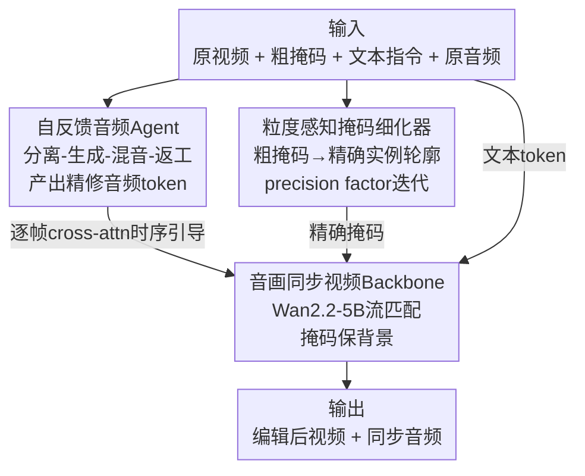

# Audio-sync Video Instance Editing with Granularity-Aware Mask Refiner

**会议**: CVPR 2026  
**论文**: [CVF Open Access](https://openaccess.thecvf.com/content/CVPR2026/html/Zheng_Audio-sync_Video_Instance_Editing_with_Granularity-Aware_Mask_Refiner_CVPR_2026_paper.html)  
**代码**: https://hjzheng.net/projects/AVI-Edit/ （项目页，无开源代码）  
**领域**: 视频编辑 / 扩散模型 / 视听同步  
**关键词**: 音视频同步编辑、实例级编辑、掩码细化、音频Agent、流匹配  

## 一句话总结
AVI-Edit 在预训练视频扩散 backbone 上做"音视频同步的实例级编辑"——用一个**粒度感知掩码细化器**把用户给的粗糙掩码（甚至是 bounding box）逐步细化成精确实例轮廓，再用一个**自反馈音频 Agent**（分离-生成-混音-返工流水线）调出与编辑后画面在时序上对齐的伴随音频，在视觉质量、条件遵循和音视频同步上全面超过现有方法。

## 研究背景与动机
**领域现状**：视频编辑（改某个人的外观、替换某个物体等）是内容创作的重要工具。Sora-2、Veo3 这类商用模型表明，逼真的伴随音频是"沉浸感"的关键，因此自然产生了一个需求：在做实例级视频编辑时，能不能把原视频的**音视频同步关系**也一起保住或改对。

**现有痛点**：绝大多数视频编辑模型（dual-branch encoder、辅助条件那一类）只盯着视觉特征，编辑完画面就把原本的音画同步关系破坏了。少数引入音频的工作各有缺陷：AvED 用跨模态对比做同步，但只停留在**场景级对齐**；Object-AVEdit 能做物体级控制，但它"反演-重生成"的范式天生缺乏**时序可控性**（没法指定某个声音事件精确发生在第几秒）。

**核心矛盾**：实例级编辑要同时满足三件事——空间上要**精确框住**目标实例（不能污染背景）、时间上音频要和画面**逐帧对齐**、还要支持人声/非人声等多样场景。现有方法要么空间不准（用户给的掩码本来就粗糙），要么音频只能给全局语义、给不了细粒度时序，三者凑不齐。

**本文目标**：构建一个能做"音视频同步 + 实例级 + 细粒度时空可控"编辑的统一框架，并为这个新任务配一套数据集。

**切入角度**：作者把难点拆成两个可被专门攻克的子问题——空间精度交给一个"会把粗掩码越改越准"的细化模块，时序音频交给一个"会自己评估并返工修正"的音频 Agent，二者都建立在同一个音画同步的视频 backbone 之上。

**核心 idea**：用**粒度感知掩码细化器**解决空间不准、用**自反馈音频 Agent**解决音频时序控制，把它们插进预训练视频扩散 backbone（Wan2.2-5B），实现音画同步的实例级编辑。

## 方法详解

### 整体框架
AVI-Edit 的输入是：一段原视频、一个**粗糙的实例掩码** $m$（指明要编辑哪个实例）、一段**文本指令** $y$（指明怎么改）、以及原始伴随音频 $a_{orig}$。输出是编辑后的视频和与之同步的音频。整个系统由三块组成，串成一条流水线：先由**自反馈音频 Agent** 把原音频整理成"留下背景音 + 生成目标音"的精修音频 token；同时**粒度感知掩码细化器（GAMR）** 把粗掩码迭代细化成精确实例轮廓；最后**音画同步视频 backbone** 拿着精修音频、精确掩码和文本，在潜空间里做流匹配生成，得到编辑结果。掩码外的背景区域用原始干净 latent 直接保留，保证只动目标实例。

为支撑训练与评测，作者还构建了 **AVISET** 数据集（71k 训练 / 1k 验证 / 1k 测试，约 197 小时、720P/24FPS），每段都过滤到"只含一个主要发声实例"，并标注实例掩码、场景级文本，测试集额外提供"原始-编辑"配对指令。

### 关键设计

**1. 音画同步视频 Backbone：在预训练视频 DiT 里塞进逐帧音频通道**

这一块解决"怎么让视频生成同时听话于文本、音频和掩码，还不破坏背景"。作者在 Wan2.2-5B 的扩散 Transformer 上做微调，用**流匹配（flow matching）** 目标训练：把干净 latent $z=E(x)$ 与高斯噪声 $\epsilon$ 线性插值成概率路径 $\hat z_t = tz + (1-t)\epsilon$（$t\in[0,1]$，$\hat z_0=\epsilon$，$\hat z_1=z$），模型 $v_\theta$ 学习预测速度场 $v_t = z-\epsilon$，损失为

$$\mathcal{L}_{fm}=\mathbb{E}\big[\,\lVert v_\theta(z_t,t,\hat m,y,a,c)-v_t\rVert^2\,\big].$$

为了只编辑目标、保住背景，它用下采样掩码 $\hat m$ 把噪声路径和原始干净 token 拼起来：$z_t = \hat z_t \odot \hat m + z \odot (1-\hat m)$——掩码内是要生成的区域、掩码外直接抄原视频 token。在每个 DiT block 里，除了原有的自注意力（长程上下文）和多模态交叉注意力（理解文本）外，作者**新增一层逐帧交叉注意力（frame-wise cross-attention）**，让精修音频 token $a$ 与视频 latent 在时间维上逐帧对齐，这是实现"音画逐帧同步"的关键机制。此外还设计了统一接口接入 scribble / pose / 参考图等可选控制 $c$（scribble、pose 用逐元素相加注入，参考图用拼接），推理时从噪声 $\epsilon$ 出发解 ODE $dz_t/dt = v_\theta(\cdot)$ 得到编辑结果。

**2. 粒度感知掩码细化器（GAMR）：用 precision factor 把粗掩码越改越准**

痛点很直接——用户给的掩码往往很糙（极端情况就是个 bounding box），直接拿去编辑会污染背景。GAMR 用一个**和视频 backbone 同构的扩散 Transformer** 来"预测精确实例掩码"，核心是引入一个**精度因子（precision factor）** $p\in[0,P]$ 显式刻画掩码粒度：$p=P$ 表示最差（如 bounding box），$p=0$ 表示精确实例轮廓 $m_{gt}$。$p$ 经线性编码后通过每个 DiT block 的 **AdaLN 和 Gate** 注入，让模型"知道当前掩码有多糙、该修多少"。

它有两个巧妙之处：一是把多模态交叉注意力里的**文本 token 换成视频 token**，让细化器靠视觉语义（而非文字）来推断实例边界；二是把精修音频 token 也通过逐帧交叉注意力喂进来，使掩码能与声音事件的时序对齐。训练时为模拟用户掩码的不准，作者从精确掩码 $m_{gt}$ 出发，用一组预定义高斯模糊核按 $p$ 退化出训练对：$m_p = \mathrm{GaussianBlur}(m_{gt}, k_p, \sigma_p)$（核大小 $k_p$、标准差 $\sigma_p$ 由 $p$ 决定），并用 focal loss 形式的掩码细化损失训练

$$\mathcal{L}_{mask} = -\alpha\,\hat m_{gt}(1-\hat m)^\gamma\log(\hat m) - (1-\alpha)(1-\hat m_{gt})\,\hat m^\gamma\log(1-\hat m),$$

其中 $\alpha=0.25,\ \gamma=2.0$。推理时是**迭代式 precision-aware 细化**：第 0 步喂入用户粗掩码 $\hat m_0$ 和其精度 $p$（如 bounding box 取 $p=P$），后续每步把上一步估计掩码 $\hat m_{k-1}$ 当作新输入、按预定义退化 schedule 调小 $p$，每步细化后的 $\hat m_k$ 直接作为该步视频生成 backbone 用的掩码。这种"边解 ODE 边细化掩码"的方式，让空间精度随生成过程逐步收敛。

**3. 自反馈音频 Agent：分离-生成-混音-返工，自评不合格就返工**

这一块解决"伴随音频怎么既保留该留的、又生成该改的，还要听起来自然"。作者设计了一个 **separate–generate–remix–rework**（分离-生成-混音-返工）流水线，把一堆现成音频组件编排起来，并能自我评估、不满意就回炉。流程是：先用 captioner 把原音频转成文本并总结语义 $c_{sem}$，再用 VLM 结合画面/掩码/指令推理出编辑计划

$$(c_{sep}, c_{gen}) = \mathrm{VLM}([x, m_p, c_{sem}, y]),$$

其中 $c_{sep}$ 是"要从原音频里**保留**的成分"（如背景掌声）、$c_{gen}$ 是"要**新生成**的成分"（如某男声）。Agent 据此从一批现成模型里挑最合适的分离模型 $T^{sep}$（按 speech / non-speech 领域）和生成模型 $T^{gen}$（按 speech / music / sound 音轨，用 ElevenLabs 的 TTS/TTM/TTS-sound 实现），分别得到保留成分 $a^{sep}=T^{sep}(a_{orig},c_{sep})$ 和生成成分 $a^{gen}=T^{gen}(c_{gen})$，混音成精修音频 $a$。

"自反馈"体现在最后的**返工判定**：用一个 MLLM 评估混音音频的整体感知质量 $q$（听起来是否自然真实），只有质量分超过阈值 $\tau$ 才被接受；若被拒，MLLM 会生成改进指令 $(\hat c_{sep}, \hat c_{gen})$ 分别反馈给分离模型（如"女声还残留可听到"）和生成模型（如"合成男声音量不够"），形成迭代修正回环，直到质量达标或到达最大迭代数。这让音频质量不靠一锤子买卖，而是闭环逼近。

### 损失函数 / 训练策略
联合优化视频流匹配损失与掩码细化损失：$\mathcal{L}=\mathcal{L}_{fm}+\lambda \mathcal{L}_{mask}$（$\lambda=1.0$）。冻结时空 VAE，只微调扩散 Transformer，用 Wan2.2-5B 预训练权重初始化 backbone 与 GAMR，在 8×A800 上以 720p 训练 160k 步，Adam，学习率 $2\times10^{-5}$。

## 实验关键数据

### 主实验
评测分三类指标：视觉质量（FVD↓、IS↑）、帧一致性 FC（相邻帧 CLIP 相似度）、对齐（文本-视频 TC、音频-视频 AC、唇动同步 Sync-C↑/Sync-D↓）。对比 AvED、Ovi、以及"先 VACE 编辑视频再 Hunyuan-Foley 配音"的串行 baseline（VACE-Foley），均在 AVISET 上微调。为公平，主表都用 ground-truth 掩码评测。

| 数据集 | 方法 | FVD↓ | IS↑ | FC%↑ | TC%↑ | AC%↑ | Sync-C↑ | Sync-D↓ |
|--------|------|------|-----|------|------|------|---------|---------|
| AVISET | AvED | 364.69 | 1.104 | 95.03 | 23.69 | 23.31 | 1.69 | 11.80 |
| AVISET | Ovi | 407.08 | 1.122 | 96.47 | 25.83 | 26.68 | 4.00 | 9.12 |
| AVISET | VACE-Foley | 391.64 | 1.115 | 96.60 | 25.92 | 26.45 | 1.72 | 10.37 |
| AVISET | **AVI-Edit** | **312.89** | **1.127** | **96.65** | **26.16** | **26.93** | **4.12** | 9.19 |
| AvED-Bench | AvED | 413.82 | 1.118 | 94.89 | 24.59 | 20.45 | — | — |
| AvED-Bench | **AVI-Edit** | **349.31** | **1.125** | **95.82** | **25.30** | **21.64** | — | — |

AVI-Edit 在两个数据集大多数指标上领先，尤其 FVD（视觉质量）大幅降低、AC（音视频对齐）最高。Sync-D 上 Ovi（9.12）略好于本文（9.19），属可比范围。AvED-Bench 无人物说话视频，唇动同步指标不适用。

用户研究（25 人）也显示 AVI-Edit 在音视频同步（AVS）、文本对齐（TA）、整体偏好（OP）三项均居首：AVISET 上 OP 达 45.20%（Ovi 38.40%、VACE-Foley 14.80%）。音频质量研究中，音频 Agent 产出的音频在保真度（AF）91%+、背景保留（RP）85%+、文本-音频一致性（TAC）88%+ 被评为"可接受/完美"。

### 消融实验
消融时把掩码随机退化成粗掩码，以检验掩码细化的鲁棒性（AVISET）。

| 配置 | FVD↓ | FC%↑ | AC%↑ | Sync-C↑ | 说明 |
|------|------|------|------|---------|------|
| **AVI-Edit（完整）** | **335.32** | **96.63** | **26.77** | **4.18** | 全模块 |
| w/o PF（去精度因子） | 354.43 | 96.49 | 26.50 | 4.12 | 掩码细化失去粒度引导，头部区域估计不准 |
| w/o MR（去掩码细化器） | 372.44 | 96.32 | 26.38 | 4.07 | 只靠初始粗掩码，背景（墙面）被误改 |
| w/o AA（去音频 Agent） | 342.75 | 96.54 | 25.97 | 3.83 | 换成通用音频编辑模型，音频更嘈杂、音画同步下降 |

### 关键发现
- **掩码细化器（MR）贡献最大**：去掉后 FVD 从 335.32 涨到 372.44（视觉质量明显变差），因为模型被迫用粗掩码、背景保不住。
- **精度因子（PF）是细化器的"刻度"**：去掉 PF 虽然还有细化器结构，但失去了粒度引导，掩码估计在边界（如人物头部）出错，说明显式建模"掩码有多糙"确实有用。
- **音频 Agent（AA）主要影响音频侧**：去掉后 AC 和 Sync-C 掉得最明显（音视频同步变差），印证自反馈返工机制对音频质量的作用。
- 框架还支持 scribble / pose / 参考图等可选控制，以及实例插入/删除、长视频编辑等扩展应用（见补充材料）。

## 亮点与洞察
- **把"掩码精度"显式参数化**：用一个标量 precision factor $p$ 描述粗细，并用高斯模糊核按 $p$ 退化造训练对，让细化器学会"从 bounding box 一路修到精确轮廓"——这种"把噪声等级当条件"的思路很像扩散里的 timestep，迁移到掩码细化上很自然。
- **掩码细化器复用视频 backbone 的架构，但把文本 token 换成视频 token**：一个小改动就让模块从"按文字找边界"变成"按视觉语义找边界"，对实例分割更合理，且能复用预训练权重。
- **音频用 Agent 编排而非端到端**：分离-生成-混音-返工 + MLLM 自评返工，把现成 TTS/TTM/分离模型当工具调，既能覆盖人声/非人声多场景，又能闭环纠错——这套"用 Agent 把专用音频模型缝起来"的范式，可迁移到任何需要高质量可控音频的生成任务。
- **逐帧交叉注意力**作为音画同步的统一注入点，同时服务 backbone 和掩码细化器，让"时序对齐"成为整个系统的共享能力。

## 局限性 / 可改进方向
- **作者承认**：掩码一次只指一个实例，编辑含多个目标实例的视频需要逐个串行跑 AVI-Edit，不能同时多实例编辑。
- 音频 Agent 重度依赖现成组件（ElevenLabs 的 TTS/TTM、专用分离模型、MLLM 评判），整体质量受这些黑盒组件上限约束，且推理链路长、返工回环可能增加延迟。⚠️ 论文未报告 Agent 的平均迭代次数与耗时。
- 数据集 AVISET 过滤到"单一主要发声实例"，对多人同时说话、复杂混响等真实场景的泛化未充分验证。
- 唇动同步 Sync-D 上略逊于 Ovi，说明在精细唇形对齐上仍有提升空间。

## 相关工作与启发
- **vs AvED**：AvED 用跨模态对比做音视频同步，但停留在**场景级**对齐；AVI-Edit 做到**实例级 + 逐帧时序**控制，主表 FVD/AC 全面领先。
- **vs Object-AVEdit**：它能做物体级控制，但"反演-重生成"范式天生缺时序可控性（没法指定事件精确时点）；本文用音频 Agent 提供显式时序引导补齐这一短板。
- **vs Ovi（生成模型）**：Ovi 是音视频生成模型，本文用零样本 inpainting 把它改造成编辑 baseline，结果其视觉一致性较差；AVI-Edit 专为编辑设计、保背景更稳。
- **vs VACE-Foley（串行 baseline）**：先编辑视频再单独配音，二者割裂导致目标语音合成失败；AVI-Edit 在统一 backbone 里联合处理音画，同步性更好。

## 评分
- 新颖性: ⭐⭐⭐⭐⭐ 首个把实例级 + 逐帧音画同步 + 细粒度时空可控统一起来的视频编辑框架，掩码 precision factor 与自反馈音频 Agent 都是新设计
- 实验充分度: ⭐⭐⭐⭐ 两数据集定量 + 用户研究 + 音频质量研究 + 消融齐全，但对比方法偏少（任务新、baseline 多为改造）
- 写作质量: ⭐⭐⭐⭐ 三大模块分工清晰、公式完整，框架图信息密但稍杂
- 价值: ⭐⭐⭐⭐⭐ 音画同步编辑是 Sora-2/Veo3 时代的刚需，配套 AVISET 数据集也利于后续研究

<!-- RELATED:START -->

## 相关论文

- [\[CVPR 2026\] PAVAS: Physics-Aware Video-to-Audio Synthesis](pavas_physics-aware_video-to-audio_synthesis.md)
- [\[CVPR 2026\] SAVE: Speech-Aware Video Representation Learning for Video-Text Retrieval](save_speech-aware_video_representation_learning_for_video-text_retrieval.md)
- [\[NeurIPS 2025\] Instance-Specific Test-Time Training for Speech Editing in the Wild](../../NeurIPS2025/audio_speech/instance-specific_test-time_training_for_speech_editing_in_the_wild.md)
- [\[NeurIPS 2025\] Node-Based Editing for Multimodal Generation of Text, Audio, Image, and Video](../../NeurIPS2025/audio_speech/node-based_editing_for_multimodal_generation_of_text_audio_image_and_video.md)
- [\[CVPR 2026\] Omni2Sound: Towards Unified Video-Text-to-Audio Generation](omni2sound_towards_unified_video-text-to-audio_generation.md)

<!-- RELATED:END -->
