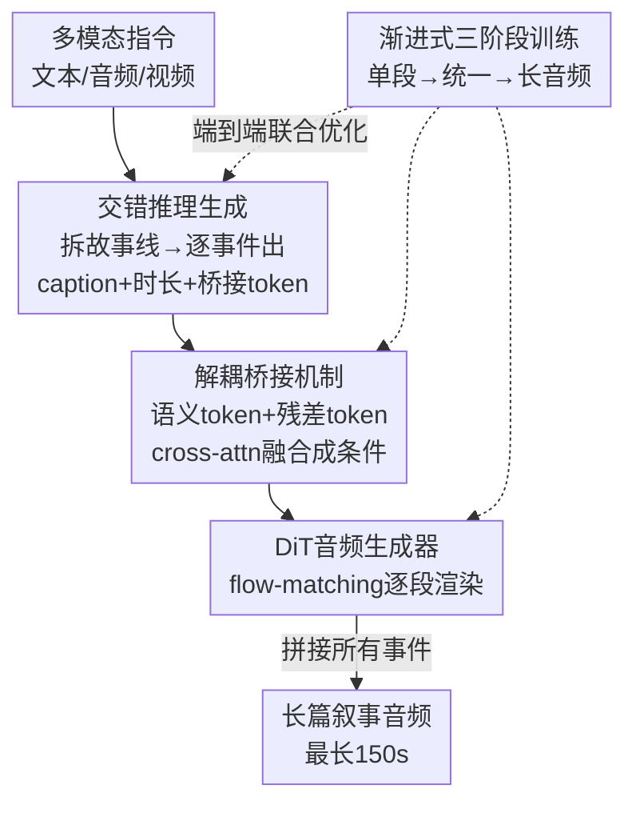

# AudioStory: Generating Long-Form Narrative Audio with Large Language Models

**会议**: CVPR 2026  
**论文**: [CVF Open Access](https://openaccess.thecvf.com/content/CVPR2026/html/Guo_AudioStory_Generating_Long-Form_Narrative_Audio_with_Large_Language_Models_CVPR_2026_paper.html)  
**代码**: https://github.com/TencentARC/AudioStory  
**领域**: 音频/语音生成  
**关键词**: 长篇叙事音频、LLM+扩散、桥接 token、交错推理生成、端到端训练  

## 一句话总结
AudioStory 把 LLM 的叙事推理和 DiT 扩散音频生成器拼成一个端到端框架，先让 LLM 把复杂指令拆成带时间戳的子事件、再逐段生成短音频拼成长篇叙事音频，靠"语义 token + 残差 token"两路解耦桥接保证段内对齐与跨段连贯，能稳定生成最长 150 秒的多场景音频故事。

## 研究背景与动机
**领域现状**：文本到音频（TTA）这两年靠 TangoFlux、AudioLDM、Stable Audio 这类扩散/flow-matching 模型，已经能从一句描述合成高保真的短音频片段。

**现有痛点**：但它们基本只擅长"一句话 → 一个声音事件"。一旦要生成长篇叙事音频（有声书、播客、游戏动态音景），需要把"暴风雨中惊险追逐：脚步溅水、雷声轰鸣、汽车打滑、车门砸上"这种复杂指令拆成有先后、有强度配合的多个事件并保持整体风格统一，纯 TTA 模型就力不从心，输出零碎、风格漂移。

**核心矛盾**：长篇叙事音频要同时满足两件 TTA 不具备的能力——**时序连贯**（跨长时段保持主题/音效/情绪一致）和**组合推理**（把高层指令分解成逻辑有序、时间精确的子事件）。现有方法没有显式机制建模跨段依赖，也没法把音频事件对齐到演进的叙事结构上。

**切入角度**：作者借 LLM 的推理与规划能力来补这块短板——让 LLM 做"导演"负责拆解叙事、排时间线，扩散模型做"演奏"负责把每个事件渲染成音频，两者端到端联合训练而非零样本拼接。

**核心 idea**：用"分而治之"把长音频拆成时序排列的短片段逐段生成，并用一套解耦的桥接 token（语义 token 管高层语义、残差 token 管低层声学细节与跨事件关联）把 LLM 和 DiT 缝起来，整套端到端训练。

## 方法详解

### 整体框架
AudioStory 的输入是多模态指令（纯文本 / 音频+文本 / 视频+文本），输出是一段由多个有序短音频拼成的长篇叙事音频。整体是一个"理解-生成"统一框架，跑通三步：① LLM 读懂指令并做**交错推理生成**，先 reason 出整条故事线、推断事件个数和每个事件的时间戳/情绪/内容，再逐事件交错地吐出 caption、时长、以及两类桥接 token；② **解耦桥接机制**把语义 token 和残差 token 融合成条件，喂给基于 TangoFlux 初始化的 DiT 音频生成器，逐段渲染音频；③ 整个 LLM+DiT 用**渐进式三阶段端到端训练**，从单段生成一路扩到长音频统一生成与理解。

### 关键设计

**1. 交错推理生成：把长音频拆成"先规划后逐段生成"的分而治之流程**

直接让模型一口气生成对齐复杂指令的长音频很难，因为它得同时管多个事件、时间关系和长叙事结构。AudioStory 把这件事拆成两步交错进行。第一步是**故事线推理**：LLM 通读整条指令，推断该分成几个音频事件，并给每个事件标出起止时间戳、事件描述和应包含的音频内容。第二步是**交错生成**：对每个事件，LLM 依次推出 caption、时长、以及对应的桥接 query（语义 + 残差 token），这些连同时长信息作为条件喂进 DiT 逐段生成。训练数据被组织成一个交错模板：先是 `[BOT]{事件数}{故事线推理 token}[EOT]`，然后每个事件一段 `[BOG]{caption}{duration}T_semantic T_residual[EOG]`，串到 `[EOS]`。所有文本 token 由 next-token-prediction 监督，损失拆成三块：

$$L_{reason} = L^{\#event}_{text} + L^{content}_{text} + L^{caption}_{text}$$

消融显示，去掉推理会漏事件、指令跟随骤降；去掉交错（不显式给每段写 caption）更是灾难性——FAD 从 3.06 飙到 16.03，说明逐段 caption 是给桥接 token 提供上下文引导的关键。

**2. 解耦桥接机制：用语义 token + 残差 token 两路分别管语义和声学细节**

以往工作（如 NExT-GPT）用预定义的文本空间当 LLM 和扩散器之间的桥，但纯文本虽语义丰富，却抓不住音色、节奏、氛围这些低层声学细节。AudioStory 把桥接 query 解耦成两类互补的 token：**语义 token** $T_{semantic}$ 编码文本导向的高层音频语义，**残差 token** $T_{residual}$ 捕捉细腻声学线索和跨事件关联。语义 token 用 Flan-T5 的文本 token $T^{gt}_{semantic}$ 作 MSE 对齐监督：

$$L_{mse} = \lVert T^{gt}_{semantic} - T_{semantic} \rVert_2^2$$

残差 token 不做显式监督（实验发现用音频特征强监督反而掉点），而是靠生成损失隐式学到补全信息。两类 token 通过多头交叉注意力融合成最终桥接 query（语义当 query、残差当 key/value）：

$$H_{bridge} = \text{Cross-Attn}(T_{semantic}, T_{residual}, T_{residual})$$

DiT 以 $H_{bridge}$ 为条件做 flow-matching 生成，$L_{flow} = \mathbb{E}_{x_1,x_0,t}\lVert u(x_t,t,c) - v_t \rVert_2^2$，其中 $c = H_{bridge}$、$t$ 在 $[0,1]$ 均匀采样。正是这条生成监督让残差 token 学到细节、补全语义 token 的缺失。消融（表 5）证实：语义 token 用文本特征监督最优，残差 token 用 DiT loss 弱监督最优——FAD 单/多音频降到 2.29/3.12，明显好于各种音频特征监督方案。

**3. 渐进式三阶段端到端训练：从单段到长音频、生成与理解统一**

LLM 和 DiT 以往分开训会留下特征 gap，所以作者设计了"单到多、生成到统一"的渐进训练。**Stage-I 单音频生成**分两小步：先 warm-up 只用 MSE 学语义 token（只更新 LLM 的 LoRA 和语义投影器），再 whole 阶段同时回归语义+残差 token 并融合喂 DiT，目标是 $L^{whole}_{s1} = L_{mse} + \lambda_1 L^{token}_{text} + \lambda_2 L_{flow}$。**Stage-II 单音频统一生成与理解**引入音频理解数据（音频问答/captioning），冻结音频编码器，让模型既能生成又能理解单段音频，目标 $L_{s2} = L_{mse} + \lambda_1 L_{text} + \lambda_2 L_{flow}$。**Stage-III 长音频统一生成与理解**才接入交错推理生成和高质量多音频数据，做长篇叙事的 SFT，并支持"音频续写"任务（给输入音频和指令、续接后续片段），总目标加上推理损失 $L_{s3} = L_{mse} + \lambda_1 L_{text} + \lambda_2 L_{flow} + \lambda_3 L_{reason}$（$\lambda_1{=}1,\lambda_2{=}0.2,\lambda_3{=}0.4$）。这条渐进路线让指令理解和音频合成相互增益，而非各练各的。

### 损失函数 / 训练策略
- 骨干：LLM 用 Qwen-2.5-3B-Instruct，DiT 用 TangoFlux 初始化，音频续写用 Whisper-large-v3 当音频编码器，投影器是两层 GeLU。
- 可训练部分：三阶段都只调 LLM 的 LoRA、各投影器、桥接 query 的 cross-attention 融合器、以及 DiT。
- 数据：理解侧整合 AudioSetCaps/VGGSound/MusicCaps/Auto-ACD 共约 1M 音频-QA 对；单段生成 700k 音频-caption 对；多段长音频用自建 AS-10k。Stage-II 理解:生成 = 2:1。

## 实验关键数据

### 主实验
在自建 AS-10k 基准上做长篇叙事音频生成评测（Gemini-2.0-flash 当 0–5 分评委，外加 FD/FAD 客观指标）：

| 模型 | Instruct.↑ | CLAP↑ | Reasoning↑ | Consis.↑ | Coher.↑ | FD↓ | FAD↓ | 最大时长↑ |
|------|-----------|-------|-----------|---------|--------|-----|------|----------|
| AudioLDM2 | 2.8 | 0.296 | - | 4.6 | 4.4 | 3.43 | 4.49 | 10s |
| TangoFlux | 3.2 | 0.317 | - | 4.1 | 4.2 | 2.48 | 3.49 | 30s |
| LLM+TangoFlux | 3.5 | 0.322 | 3.5 | 2.1 | 1.9 | 2.55 | 3.82 | 30s |
| LLM+NExT-GPT | 3.3 | 0.299 | 3.5 | 1.8 | 1.7 | 3.47 | 3.99 | 10s |
| Caps(gt)+TangoFlux（oracle） | 4.0 | 0.348 | - | 2.4 | 2.0 | 1.79 | 3.59 | 30s |
| **AudioStory** | **4.1** | **0.392** | **4.2** | 4.1 | 3.9 | **1.43** | **3.00** | **150s** |

AudioStory 在指令跟随、推理、生成质量上全面领先，CLAP 比 LLM 辅助的 TTA 高 17.85%，最大时长直接拉到 150s（baseline 普遍卡在 10–30s）。值得注意：AudioLDM2 的 consistency 看着高（4.6）但只因输出短到 10s 且指令跟随极差，是个"虚高"的弱 baseline；AudioStory 在生成长得多、叙事丰富得多的情况下仍拿到可比的一致性，更有说服力。短音频生成（表 3）和音频理解（表 2）上 AudioStory-Base 也超过 TangoFlux、NExT-GPT 等，说明底层生成/理解能力扎实。

### 消融实验

推理形式消融（表 4）：

| 配置 | Consis.↑ | Inst.↑ | FAD↓ | CLAP↑ | 说明 |
|------|---------|--------|------|-------|------|
| w/o reasoning | 3.1 | 3.1 | 4.13 | 0.34 | 跳过指令分析，漏事件 |
| w/o interleaved | 1.6 | 1.2 | 16.03 | 0.14 | 不给每段写 caption，质量崩 |
| w/ reasoning（完整） | 4.0 | 4.1 | 3.06 | 0.39 | 完整交错推理 |

桥接特征消融（表 5，数值为 single/multi FAD）：

| 配置 | 监督特征 | Single↓ | Multi↓ | 说明 |
|------|---------|---------|--------|------|
| 语义 token | AudioMAE | 9.55 | 11.39 | 音频特征监督语义，差 |
| 残差 token | AudioMAE | 9.24 | 10.06 | 强监督残差，差 |
| 残差+引导 | AudioMAE | 3.60 | 4.21 | 弱监督有改善 |
| **Ours：T5 监督语义 + 残差无显式监督** | T5 w/o guid. | **2.29** | **3.12** | 文本监督语义、DiT loss 弱监督残差最佳 |

### 关键发现
- **交错的逐段 caption 是命脉**：去掉交错（不为每段显式生成 caption）后 FAD 从 3.06 暴涨到 16.03、指令跟随从 4.1 跌到 1.2，说明桥接 token 离不开逐段上下文引导。
- **桥接特征要"分工监督"**：语义 token 用文本特征（T5）监督最高效，因为音频特征语义密度低、Whisper 的时序结构太复杂 LLM 难解读；残差 token 反而要弱监督（靠 DiT 生成损失隐式学），显式音频监督会掉点。
- **残差 token 在端到端联合训练里贡献显著**：去掉残差 token 性能明显下降，印证 LLM 和 DiT 各自关注不同信息类型，端到端联合训练能弥合两者的特征 gap。

## 亮点与洞察
- **"导演 + 演奏"的解耦最巧**：LLM 管高层叙事规划（拆事件、排时间戳、定情绪），扩散器管低层渲染，再用两路 token 当翻译官——这个分工让长音频生成从"硬生成"变成"先规划后填充"，可迁移到长视频配乐、多镜头视觉叙事等任何"长序列+组合推理"的生成任务。
- **桥接 token 的语义/残差解耦是可复用 trick**：高层语义用文本对齐（监督强）、低层细节用生成损失隐式学（监督弱），这种"强监督管语义、弱监督管细节"的非对称设计能直接搬到其他 LLM↔扩散器桥接场景。
- **渐进训练的"单到多、生成到统一"路线**：先把单段质量打牢再扩长、先生成再融理解，避免一上来就在长序列上硬训，是稳定端到端训练 LLM+扩散的实用配方。

## 局限与展望
- 长音频最长测到 150s，对真正的有声书/长播客（数十分钟级）能否保持连贯仍未验证。
- 评测高度依赖 Gemini 当 LLM 评委打 0–5 分，主观指标（consistency/coherence）的可靠性和可复现性存疑，缺少大规模人评对照。
- 动画音频数据全来自 157 集 Tom & Jerry，风格单一；自然音来自 UnAV-100，覆盖面有限，泛化到更多叙事风格（恐怖、纪录片、多角色对白）还需验证。
- ⚠️ 残差 token "无显式监督靠 DiT loss 学到细节"的机制偏经验性，论文未给出残差 token 究竟编码了哪些声学维度的可解释分析。

## 相关工作与启发
- **vs 纯 TTA（TangoFlux / AudioLDM2 / Stable Audio）**：它们擅长单句短音频但无跨段推理，最长 10–30s；AudioStory 加 LLM 规划层，把时长拉到 150s 并显著提升指令跟随与连贯性。
- **vs LLM+TTA 级联（LLM+TangoFlux 把 caption 喂给 TTA 再拼接）**：级联是零样本拼接、LLM 和 TTA 之间有特征 gap，consistency 只有 2.1；AudioStory 端到端联合训练 + 桥接 token，consistency 升到 4.1。
- **vs any-to-any 多模态 LLM（NExT-GPT / CoDi / Spider）**：它们多聚焦语音或简单 caption-to-sound，且只生成单段短音频；AudioStory 专攻长篇叙事的组合推理，在长音频生成上大幅领先（FAD 3.00 vs 3.99/4.04）。

## 评分
- 新颖性: ⭐⭐⭐⭐ 把"分而治之 + 解耦桥接 token + 渐进端到端"组合到长篇叙事音频这一新任务，并建了首个评测基准
- 实验充分度: ⭐⭐⭐⭐ 主结果 + 4 张消融覆盖推理形式/桥接特征/联合训练，单段生成与理解也都验证，但缺人评对照
- 写作质量: ⭐⭐⭐⭐ 框架清晰、三阶段训练和两类 token 讲得明白，少数符号（如残差监督机制）略经验化
- 价值: ⭐⭐⭐⭐ 开源、面向有声书/游戏音景的实际需求，"LLM 规划 + 扩散渲染 + 解耦桥接"范式可迁移

<!-- RELATED:START -->

## 相关论文

- [\[ICML 2025\] Long-Form Speech Generation with Spoken Language Models](../../ICML2025/audio_speech/long-form_speech_generation_with_spoken_language_models.md)
- [\[ACL 2026\] PlanRAG-Audio: Planning and Retrieval Augmented Generation for Long-form Audio Understanding](../../ACL2026/audio_speech/planrag-audio_planning_and_retrieval_augmented_generation_for_long-form_audio_un.md)
- [\[AAAI 2026\] End-to-end Contrastive Language-Speech Pretraining Model For Long-form Spoken Question Answering](../../AAAI2026/audio_speech/end-to-end_contrastive_language-speech_pretraining_model_for_long-form_spoken_qu.md)
- [\[CVPR 2026\] TAPE: Task-Adaptive Prototype Evolution in Audio-Language Models for Fully Few-shot Class-incremental Audio Classification](tape_task-adaptive_prototype_evolution_in_audio-language_models_for_fully_few-sh.md)
- [\[ACL 2026\] Comprehensive Benchmarking of Long-Form Speech Generation in Diverse Scenarios](../../ACL2026/audio_speech/comprehensive_benchmarking_of_long-form_speech_generation_in_diverse_scenarios.md)

<!-- RELATED:END -->
