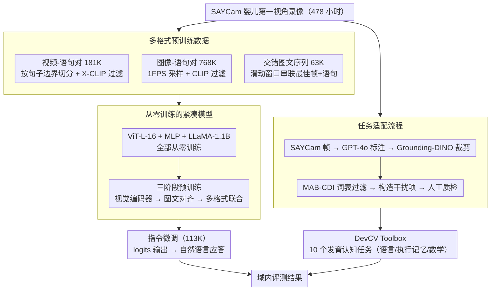

# BabyVLM-V2: Toward Developmentally Grounded Pretraining and Benchmarking of Vision Foundation Models

**会议**: CVPR 2026  
**arXiv**: [2512.10932](https://arxiv.org/abs/2512.10932)  
**代码**: [https://shawnking98.github.io/BabyVLM-v2/](https://shawnking98.github.io/BabyVLM-v2/)  
**领域**: 音频语音  
**关键词**: 发育认知, 婴儿视觉, 样本效率预训练, NIH Baby Toolbox, DevCV Toolbox

## 一句话总结
提出BabyVLM-V2框架，从婴儿第一视角的SAYCam纵向语料构建三种格式预训练数据（768K图像对+181K视频对+63K交错序列），设计基于NIH Baby Toolbox®的DevCV Toolbox（10个发育认知任务），从零训练的紧凑模型在部分数学任务上超越GPT-4o，首次系统探索人工发育智能(ADI)。

## 研究背景与动机

**领域现状**：视觉基础模型依赖scaling law在海量数据上预训练，但早期儿童能从极其有限的视觉输入（出生到3岁约4万小时清醒时间）中发展出强大的感知和推理能力。这构成了样本效率预训练的自然目标。

**现有痛点**：BabyVLM-V1（前作）存在四大不足——(1) 仅用SAYCam约1/3录像(67K图像对)，覆盖极小比例；(2) 仅支持图像-文本对，不支持视频和多轮对话；(3) 4个评测任务是直觉设计而非基于标准化心理学测试；(4) 模型开放集性能接近零，需对logits后处理才能评估。

**核心矛盾**：如何在婴儿有限的感官体验约束下，训练出像早期儿童一样能力多样的基础模型？如何用发育心理学标准公正评估？

**切入角度**：(1) 最大化SAYCam语料利用率并构建多格式数据支持多样化下游任务；(2) 使用2025年2月NIH发布的Baby Toolbox®——目前最权威的儿童神经发育评估工具——作为benchmark设计基础。

**核心idea**：将发育心理学标准化评估方法工程化为AI评测的计算机视觉任务，建立DevCV Toolbox。

## 方法详解

### 整体框架
这篇论文想回答一个问题：如果只给模型婴儿那点有限的视觉经验，它能学到多少早期儿童的认知能力？为此作者把婴儿第一视角的 SAYCam 纵向录像（478 小时）尽量"原样"地转成预训练数据，从零训练一个紧凑的视觉-语言模型，再用一套基于发育心理学标准测试改造的 benchmark 来考它。整条流水线是：原始录像经最小化处理切成三种格式的预训练数据（图像对 / 视频对 / 交错序列）→ 三阶段预训练把视觉编码器、图文对齐、多格式联合训练逐级搭起来 → 用 113K 样本做指令微调让模型从输出 logits 变成会说人话 → 最后在 DevCV Toolbox 的 10 个认知任务上评测。其中评测样本本身也由 SAYCam 帧经一条任务适配流程重建而来，让评测和训练同处一个视觉域。

### 关键设计

**1. 多格式预训练数据：让有限的婴儿录像支撑起多样化下游能力**

V1 的根本短板是只用了约 1/3 录像、只支持图像-文本对，于是下游任务也被卡死在单图理解上。V2 把 SAYCam 几乎榨干，并刻意做成三种互补格式。视频-语句对（181K）按语音转录的句子边界切分视频，Azure 语音识别提字幕，再用 X-CLIP 图文相似度 >0.1 过滤掉对不上的片段，最终保留 138 小时；图像-语句对（768K）从视频对里 1FPS 采样、CLIP 相似度 >0.2 保留，规模直接是 V1 的 67K 的 11 倍；交错图文序列（63K）则用大小 4–8 的滑动窗口，把连续片段各自的最佳帧+语句串起来，模拟婴儿"连续交互"的经验流。三种格式不是冗余，而是各自喂养不同能力——视频对撑起时序理解、图像对撑起静态感知、交错序列撑起多轮对话，恰好覆盖后面 benchmark 的不同任务类型。关键是整条链路只做"切分+过滤"这种最小化处理，不引入额外标注或合成，保住了数据的发育真实性。

**2. DevCV Toolbox：把临床发育测评工程化成计算机视觉任务**

V1 的 4 个评测任务是凭直觉拍的，没有心理学依据，说服力弱。V2 改用 2025 年 2 月 NIH 发布的 Baby Toolbox®——目前最权威的儿童神经发育评估工具——作为蓝本，搭出含 10 个任务的 DevCV Toolbox，分三个子域：语言（Looking While Listening 双图选择、Picture Vocabulary 四图词汇理解、Localization 物体定位）、执行功能与记忆（Left/Right 朝向辨别、Spatial Details 空间细节、Visual Delayed Response 遮挡后记忆、Memory 多轮延迟记忆）、数学（Who Has More 数量比较含合成与自然两版、Subitizing 快速计数、Object Counting 物体计数）。每个任务都不是直接搬原工具箱的卡通刺激物，而是从 SAYCam 帧里重新构建自然场景样本，这样评测和训练同处一个视觉域，避免分布漂移把成绩压低。借 NIH 工具箱的临床背书，benchmark 的可信度也跟着立起来了。

**3. 任务适配流程：以 Picture Vocabulary 为例看一个临床测试怎么落成 CV 样本**

把心理学测试变成 AI 能做的题，难点在于既要保留测试的考查意图，又要换成域内的真实图像。原始 NIH 测试是 iPad 上摆 4 张卡通图配语音提示、让儿童点选目标。DevCV 的适配链条则是：SAYCam 帧 1FPS 采样 → GPT-4o 加手工标注框出帧里的物体 → Grounding-DINO 把物体裁出来 → 用 MAB-CDI 婴儿词汇表过滤掉超纲词 → 再按语义和语音学分布去构造干扰项（让错选项既不太像也不太离谱）→ 最后人工质检。这套半自动流程让每道题既符合原测试的难度梯度，又用的是婴儿真实见过的画面，是前面"域内评测"原则的具体落地。

**4. 从零训练的紧凑模型：把能力来源完全锁定在婴儿语料**

模型是 ViT-L-16（300M）+ MLP 连接器 + LLaMA-1.1B 的标准视觉-语言架构，输入支持文本、单图、多图、视频、多轮对话，输出统一是自然语言。最关键的一条约束是全部组件都从零训练、不加载任何预训练权重——因为只要用了外部预训练，就无法判断模型表现到底来自婴儿经验还是别的海量语料，这条实验才不成立。这也是为什么一个仅 ~1.4B、只见过 478 小时录像的模型若能在某些任务上打平甚至超过 GPT-4o，结论才有分量。

### 损失函数 / 训练策略
三阶段 pipeline：Stage 1 预训练视觉编码器，Stage 2 做图像-文本对齐，Stage 3 在三种格式上联合训练；最后用 DevCV 任务做指令微调，把模型从输出 logits 拉成自然语言应答。

## 实验关键数据

### 主实验（DevCV Toolbox 域内评测）

| 模型 | Overall | Count | PV(词汇) | Memory | WhoHasMore | LeftRight |
|------|---------|-------|----------|--------|------------|-----------|
| 人类表现 | 93.0 | 99.1 | 91.8 | 87.3 | 63.6/95.5 | 94.5 |
| Gemini-2.5-flash | 72.7 | 71.1 | 91.2 | 84.8 | 42.4 | 34.9 |
| GPT-4o | ~70 | ~65 | ~90 | ~80 | ~40 | ~34 |
| **BabyVLM-V2** | 竞争力 | **部分超越GPT-4o** | 竞争力 | 竞争力 | 竞争力 | 竞争力 |

### 消融实验

| 配置 | 关键影响 | 说明 |
|------|---------|------|
| 仅图像-文本预训练(V1) | 基线 | 开放集接近零 |
| +视频-语句(181K) | +视频理解任务改善 | DelayedResponse任务受益 |
| +交错序列(63K) | +多轮对话任务改善 | Memory任务受益 |
| +指令微调(113K) | **显著全面提升** | 从logits输出→自然语言 |
| 768K vs 67K图像对 | V2 >> V1 | 数据量的直接影响 |

### 关键发现
- **数学任务超越GPT-4o**：从零训练的~1.4B模型在Who Has More和Counting上部分超越GPT-4o——婴儿经验数据蕴含足够的计数和数量理解
- DevCV Toolbox的人类上界(93%)远高于所有AI模型，AI与儿童认知差距显著
- Subitizing和Looking While Listening作为hold-out任务测试泛化性，证实多格式预训练的泛化收益
- 三种预训练数据格式各有独立且互补的贡献
- OOD测试集(Ego4D构建)性能下降验证了域内评测的必要性

## 亮点与洞察
- **发育心理学标准化评估的AI工程化**：首次将NIH Baby Toolbox®转化为AI评测benchmark，开创了发育计算视觉的研究范式。未来心理学家可以用DevCV Toolbox"阅读早期儿童的心智"
- **挑战Scaling Law**：仅478小时的婴儿经验就能训练出在数学任务上超越GPT-4o的模型，展示了样本效率预训练的巨大潜力
- **数据格式多样性>数据量**：V1(67K)到V2(768K+视频+交错)的跨越不仅来自量的增加，更关键的是格式多样性使能力多样化
- **三方有益**：让大学可参与FM研究+为认知科学提供实验工具+增进AI公众理解

## 局限与展望
- SAYCam仅3名婴儿(6-32月龄)，样本量极小且存在个体差异。BabyView等更大规模数据待纳入
- 紧凑模型在复杂推理上仍远逊于大模型和人类——ADI差距巨大
- DevCV Toolbox缺儿童实际表现数据（仅成人上界）——需心理学实验室合作收集真正的发育对比数据
- 指令微调用DevCV任务本身，可能存在task leakage
- 不包括非视觉的语言和运动发育评估

## 相关工作与启发
- **vs BabyVLM-V1**: 数据扩大11倍+多格式；benchmark 4→10任务且基于NIH标准化测试；模型从logits→自然语言
- **vs Vong et al.(CLIP on SAYCam)**: 仅关注词-指称映射，本文关注通用感知
- **vs DevBench/KIVA**: 面向更大年龄段，不匹配SAYCam的6-32月龄段
- **启发**：发育认知视角可为AI训练策略提供全新灵感——也许"像婴儿一样学习"是通往AGI的另一条道路

## 评分
- 新颖性: ⭐⭐⭐⭐⭐ 独特的发育认知视角+NIH Baby Toolbox®的首次AI适配
- 实验充分度: ⭐⭐⭐⭐ DevCV设计严谨，缺乏真实儿童数据对比
- 写作质量: ⭐⭐⭐⭐⭐ 跨学科背景介绍充分
- 价值: ⭐⭐⭐⭐⭐ 对理解AI与人类认知的关系有深远影响

<!-- RELATED:START -->

## 相关论文

- [\[ICCV 2025\] 2.5 Years in Class: A Multimodal Textbook for Vision-Language Pretraining](../../ICCV2025/audio_speech/25_years_in_class_a_multimodal_textbook_for_visionlanguage_p.md)
- [\[ICCV 2025\] VGGSounder: Audio-Visual Evaluations for Foundation Models](../../ICCV2025/audio_speech/vggsounder_audio-visual_evaluations_for_foundation_models.md)
- [\[ICLR 2026\] ParaS2S: Benchmarking and Aligning Spoken Language Models for Paralinguistic-Aware Speech-to-Speech Interaction](../../ICLR2026/audio_speech/paras2s_benchmarking_and_aligning_spoken_language_models_for_paralinguistic-awar.md)
- [\[NeurIPS 2025\] Data-Juicer 2.0: Cloud-Scale Adaptive Data Processing for and with Foundation Models](../../NeurIPS2025/audio_speech/data-juicer_20_cloud-scale_adaptive_data_processing_for_and_with_foundation_mode.md)
- [\[CVPR 2026\] Echoes Over Time: Unlocking Length Generalization in Video-to-Audio Generation Models](echoes_over_time_unlocking_length_generalization_in_video-to-audio_generation_mo.md)

<!-- RELATED:END -->
