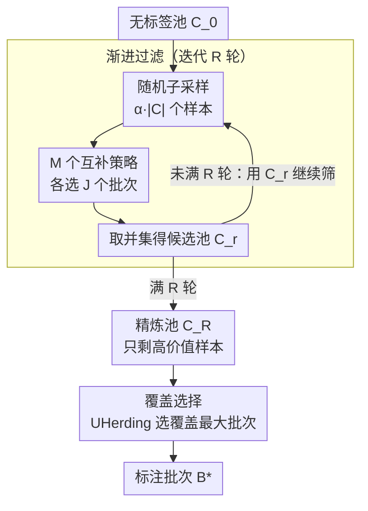

# Cleaning the Pool: Progressive Filtering of Unlabeled Pools in Deep Active Learning

**会议**: CVPR 2026  
**arXiv**: [2511.22344](https://arxiv.org/abs/2511.22344)  
**代码**: [GitHub](https://github.com/dhuseljic/dal-toolbox)  
**领域**: Audio/Speech (主动学习)  
**关键词**: 主动学习, 集成策略, 渐进过滤, 基础模型, 覆盖选择

## 一句话总结

提出 Refine 集成主动学习方法，通过两阶段策略——渐进过滤（多策略迭代精炼无标签池）+ 覆盖选择（从精炼池中选择多样性高价值样本）——在不预知最佳策略的情况下一致超越单一 AL 策略和现有集成方法。

## 研究背景与动机

**领域现状**：预训练基础模型（DINOv2、CLIP）适配下游任务仍需标注数据。主动学习通过智能选择标注样本降低标注成本，但近年基准显示没有单一策略始终最优。

**现有痛点**：(a) 不同 AL 策略捕获不同"数据价值"观——不确定性 vs 代表性，无策略始终占优；(b) 选错策略可能比随机采样更差；(c) 现有集成方法（TCM/TAILOR/SelectAL）依赖启发式切换或学习调度，表现不稳定。

**核心矛盾**：AL 是 one-shot 问题（无试错机会），必须在不知最佳策略时做选择。

**本文目标**：设计无需学习的集成方法，自动整合多种互补策略优势。

**切入角度**：将重点从"选什么样本"转为"先清理池子去掉无价值样本"。

**核心 idea**：让多策略反复投票筛选——经多轮保留的样本必被至少一个策略认为有价值，未被任何策略选中的样本必无价值。

## 方法详解

### 整体框架

Refine 不再纠结"这一轮该用哪个 AL 策略"，而是把选样拆成两步：先**把无标签池洗干净**，再从洗干净的池子里挑批次。第一步是渐进过滤——让多个互补策略反复投票，一轮一轮地把"没人要"的样本淘汰掉，留下一个被至少一个策略认可的高价值候选池；第二步是覆盖选择——既然池子已经只剩有价值样本，最后只需在里面挑一批多样性最大的去标注。整套流程不学习、不调度，新策略想加随时加。

### 关键设计

**1. 渐进过滤：用多策略反复投票，把"没人要"的样本指数级清掉**

主动学习是个 one-shot 问题，选错策略可能比随机还差，而你事先并不知道哪个策略最优。渐进过滤绕开这个两难：它不去赌某个策略，而是让所有 $M$ 个策略一起在池子上投票。每一轮里，每个策略 $s_m$ 都从当前池 $\mathcal{C}_{r-1}$ 的一个 $\alpha=0.4$ 随机子采样里挑出 $J=10$ 个批次，然后把**所有**策略、所有子采样选出的样本取并集，作为下一轮的候选池：

$$\mathcal{C}_r = \bigcup_{m=1}^M \bigcup_{j=1}^J s_m(\text{SubSample}(\mathcal{C}_{r-1}, \alpha \cdot |\mathcal{C}_{r-1}|), b)$$

这里三个设计决策环环相扣。取**并集而非交集**，是因为不同策略捕获的"价值"互补（不确定性 vs 代表性），交集会把某个策略独有的发现误删，并集则保证"只要有一个策略认可就留下"。用**多轮迭代而非一次拼接**，是真正让噪声衰减的关键：单轮只是把各策略的选择拼起来，而一个真正无价值的样本要想存活 $R$ 轮，得每一轮都被至少一个策略在随机子采样里选中——这个概率随轮数指数下降。**子采样 $\alpha<1$** 则让 Margin 这类确定性策略每轮看到不同的样本子集、从而产生多样批次，顺带也压低了内存。直观地说，一个 $R=5$ 轮、初始上万的池子会被一路收缩成几百个的精炼池，被反复保留下来的样本几乎都是某个策略眼里的"宝"。

**2. 覆盖选择：在已清洗的池子上只管多样性**

过滤之后的池 $\mathcal{C}_R$ 已经是高价值候选集，所以最后一步不必再操心"价值"，只需保证选出的批次在特征空间里铺得够开。Refine 用 UHerding 在 $\mathcal{C}_R$ 上选一个最大化覆盖的批次——让每个数据点都能被已标注集 $\mathcal{L}_t$ 或新批次 $\mathcal{B}$ 中某个近邻"代表到"：

$$\mathcal{B}^* = \arg\max_{\mathcal{B} \subset \mathcal{C}_R} \mathbb{E}_{\mathbf{x}}\big[\max_{\mathbf{x}' \in (\mathcal{L}_t \cup \mathcal{B})} k(\mathbf{x}, \mathbf{x}')\big]$$

把"找价值"交给过滤、把"保多样"交给覆盖，两步各司其职，这也是它能稳定胜过那些靠启发式硬切换策略的集成方法的原因。

**3. 三条定理：把"过滤有效"从直觉变成保证**

渐进过滤之所以可信，是因为它的三个性质都被证明了，而不只是经验观察。**价值保留**（定理 1）说明单轮里一个有价值样本被保留的概率有下界 $P_r(\mathbf{x}) \geq 1 - (1 - \alpha \cdot \max_m p_{m,r}(\mathbf{x}))^J$——只要有任一策略以不小的概率选它，$J$ 次重复采样就让它大概率活下来。**指数衰减**（定理 2）则从反面保证：一个 $\epsilon$-无价值（任何策略选中概率都不超过 $\epsilon$）的样本，经 $R$ 轮后存活概率 $\leq (MJ\alpha\epsilon)^R$，随轮数指数趋零，这正对应实验里"轮数越多噪声越少"。两者合起来给出**价值单调性**（定理 3）：精炼池的期望价值逐轮不降，$\mathbb{E}[V|\mathcal{C}_R] \geq \dots \geq \mathbb{E}[V|\mathcal{C}_0]$，所以过滤无论如何不会让池子变差。

> ⚠️ 定理中的概率符号与常数（如 $p_{m,r}$、$MJ\alpha\epsilon$）以原文为准。

### 训练设置

- 3 个骨干：DINOv2-ViT-S/14, DINOv3-ViT-S/16, CLIP-ViT-B/16
- 冻结骨干+训练分类头，SGD LR 0.01, 200 epochs/cycle
- 20 AL 周期，10 次独立运行

## 实验关键数据

### 主实验 — 综合胜率

| Refine vs | 胜率 (3骨干×5数据集×10试验) |
|-----------|--------------------------|
| BAIT | 85% |
| UHerding | 80% |
| SelectAL | 100% |
| TAILOR | 100% |
| TCM | 98% |
| AutoAL | 97% |

### 消融实验 — 渐进过滤作为前处理

| 策略 | 从原始池 AULC | 从精炼池 AULC | 提升 |
|------|-------------|-------------|------|
| Random | 基线 | +3.7% | 仅过滤+随机即有效 |
| BAIT | 差于Random | **优于Random** | 过滤拯救失败策略 |
| AlfaMix | 基线 | +2.6% | 普遍受益 |
| UHerding | 高 | +0.7% | 强策略也受益 |

### 过滤轮数影响

| R (轮数) | CIFAR-10 AULC提升 | Snacks AULC提升 |
|---------|-------------------|-----------------|
| 1 | +3.02% | +6.91% |
| 3 | +3.72% | +7.22% |
| 5 | +3.71% | +7.79% |
| 9 | +3.78% | +8.43% |

### 关键发现

1. Refine 对所有单一策略和所有集成方法均有最高综合胜率。
2. 渐进过滤是通用前处理——任何 AL 策略应用于精炼池后都比应用于原始池更好。
3. BAIT 从原始池选差于随机，过滤后反转为优于随机——过滤去除了误导样本。
4. 仅 Margin+TypiClust 两策略过滤即可自动整合不确定性和代表性。
5. $\alpha \in [0.3, 0.9]$ 范围内性能稳定。

## 亮点与洞察

- **渐进过滤作为前处理**是最实用的贡献——零成本嫁接到任何 AL 策略。
- 理论分析优雅：三个定理分别保证价值保留、噪声去除、质量单调提升。
- "从不被任何策略选中的样本肯定无价值"——洞察简洁但深刻。
- 易于扩展：新策略直接加入集成，无需重训。

## 局限与展望

- 多次调用多个策略增加计算开销（虽可并行化）。
- 集成中多数策略失效时精炼池质量可能下降（Dopanim+CLIP 案例）。
- 未探索策略加权——当前等权，可根据历史表现动态调权。
- 主要在图像分类上验证，检测/分割待进一步测试。

## 相关工作与启发

- 与 TCM 的硬切换不同，Refine 通过渐进过滤自然实现软切换。
- 并集+迭代的设计可推广到其他需要集成多种启发式的场景。
- 为基础模型时代的 AL 提供了实用且理论上有保证的解决方案。

## 评分

- 新颖性: ⭐⭐⭐⭐ 渐进过滤思路简洁新颖，但是策略组合而非根本新范式
- 实验充分度: ⭐⭐⭐⭐⭐ 6数据集×3骨干×8单策略+4集成方法+充分消融+理论分析
- 写作质量: ⭐⭐⭐⭐⭐ 理论和实验完美互补，结构清晰
- 价值: ⭐⭐⭐⭐ 通用AL前处理步骤，实用价值高

<!-- RELATED:START -->

## 相关论文

- [\[ACL 2026\] ControlAudio: Tackling Text-Guided, Timing-Indicated and Intelligible Audio Generation via Progressive Diffusion Modeling](../../ACL2026/audio_speech/controlaudio_tackling_text-guided_timing-indicated_and_intelligible_audio_genera.md)
- [\[CVPR 2026\] SAVE: Speech-Aware Video Representation Learning for Video-Text Retrieval](save_speech-aware_video_representation_learning_for_video-text_retrieval.md)
- [\[ACL 2026\] Privacy-preserving Prosody Representation Learning](../../ACL2026/audio_speech/privacy-preserving_prosody_representation_learning.md)
- [\[ICLR 2026\] PACE: Pretrained Audio Continual Learning](../../ICLR2026/audio_speech/pace_pretrained_audio_continual_learning.md)
- [\[ICML 2026\] Algorithmic Recourse of In-Context Learning for Tabular Data](../../ICML2026/audio_speech/algorithmic_recourse_of_in-context_learning_for_tabular_data.md)

<!-- RELATED:END -->
