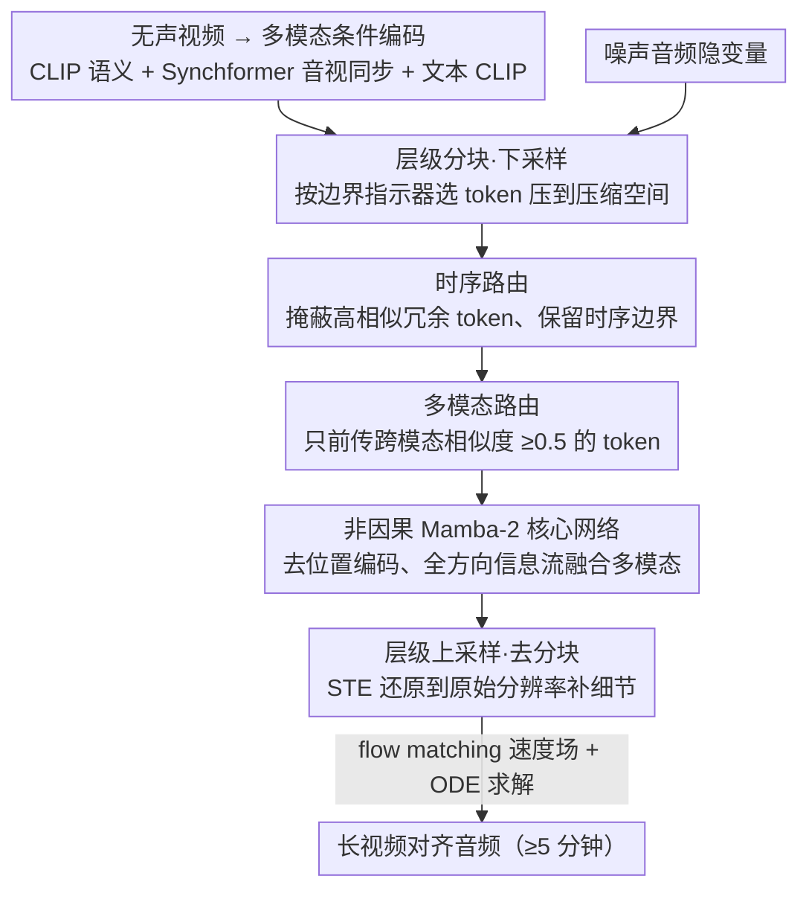

# Echoes Over Time: Unlocking Length Generalization in Video-to-Audio Generation Models

**会议**: CVPR 2026  
**arXiv**: [2602.20981](https://arxiv.org/abs/2602.20981)  
**代码**: 无（项目页面：[https://echoesovertime.github.io](https://echoesovertime.github.io)）  
**领域**: 语音/音频  
**关键词**: 视频转音频, 长序列生成, 层级网络, Mamba, 多模态对齐

## 一句话总结
提出 MMHNet，一种基于层级结构和非因果 Mamba-2 的多模态层级网络，实现了在短片段（8秒）上训练、在长视频（5分钟以上）上生成高质量对齐音频的长度泛化能力，在 UnAV100 和 LongVale 基准上大幅超越现有方法。

## 研究背景与动机
视频转音频（V2A）生成旨在为无声视频生成语义和时序对齐的音频，在电影制作和游戏领域有重要意义。现有 V2A 方法（如 MMAudio、Diff-Foley）主要针对 8-10 秒的短音频生成进行优化，无法有效推广到长视频场景。

**核心矛盾**在于：(1) 长音频-视频训练数据稀缺，公开数据集最长通常只到 1 分钟；(2) Transformer 架构依赖位置编码（如 RoPE），当推理序列长度超过训练长度时性能急剧下降；(3) 简单的分段拼接方法会导致音频碎片化、过渡不自然、音质下降。

本文发现问题的根源在于**显式位置编码**——它们在训练长度固定时有效，但在长度泛化时成为瓶颈。实验显示，去掉位置编码的 MMAudio 生成的声音变得同质化，保留位置编码则在长序列中质量退化（FD_PANN 下降 3-4 分）。因此，核心 idea 是用**不需要位置编码的 Mamba-2** 替代 Transformer 注意力模块，结合**层级 token 路由**实现高效长序列处理。

## 方法详解

### 整体框架
MMHNet 想解决的是视频转音频的"长度泛化"：模型只在 8 秒短片段上训练，却要为 5 分钟以上的长视频生成连贯对齐的音频。它在 MMAudio 的多模态 DiT 架构上改造，保留处理音频+视觉+文本的多模态块和只处理音频的单模态块，整体仍用 flow matching 在压缩空间里建模条件速度场、再由 ODE 求解器解出音频。三处关键改动让它摆脱长度限制：把注意力换成不依赖位置编码的非因果 Mamba-2、用时序路由和多模态路由组成层级框架筛掉冗余 token、再靠层级分块和上采样在压缩与原始分辨率之间来回切换。

### 关键设计

**1. 非因果 Mamba-2 核心网络：去掉位置编码这个长度瓶颈**

作者把长度泛化失败的根源定位到显式位置编码——它在训练长度固定时有效，一旦推理序列超长就成了瓶颈。于是用 Mamba-2 替换 Transformer 的注意力模块，彻底去掉位置编码依赖。但因果 Mamba-2 通过累积乘积建模掩码矩阵，会带来长序列的调制衰减（modulation decay）；非因果版本把掩码定义为变换矩阵的逆，避免累积乘积，实现全方向的信息流动。这样模型推理时能处理任意长度而无需改架构，而且全局隐状态可以同时融合所有模态、不受扫描顺序约束，正适合离线视频条件下的多模态融合。

**2. 时序路由层（Temporal Routing）：按相似度滤掉冗余时间步**

音视频事件里相邻时间段往往高度冗余（相似的帧和声音），全都算一遍既浪费又稀释了关键时刻。时序路由用相邻 token 之间的余弦相似度识别变化边界：高相似度的 token 判为冗余被掩蔽，低相似度的 token 判为时序边界/事件变化点被保留，从而在不丢事件的前提下压低计算复杂度。

**3. 多模态路由层（MM Routing）：只让跨模态相关的 token 前传**

不是所有 token 都该参与跨模态对齐，弱相关的 token 反而干扰对齐。MM 路由只选与参考模态相似度 $\ge 0.5$ 的 token 前向传播，例如让 Synchformer 的音视同步特征与文本条件对齐，把算力集中在真正跨模态相关的位置上、提升对齐效率。

**4. 层级分块与上采样：在压缩空间对齐、在原始空间补细节**

要让路由筛选不破坏序列结构，需要能压缩又能还原。下采样器按边界指示器直接选出边界位置的 token，把编码器输出压成更少的向量；处理完再由上采样器恢复到原始尺寸，并用 Straight-Through Estimator (STE) 让梯度能穿过这个离散选择操作。于是早期层在压缩空间专注多模态对齐，后期层回到原始空间处理细节，兼顾效率与精度。

### 损失函数 / 训练策略
使用条件 flow matching 目标训练，在 VGGSound 数据集上以 8 秒片段训练，推理时直接推广到任意长度。小模型（S）使用 N=5 多模态块 + N'=4 单模态块（157M 参数），大模型（L）使用 N=10 + N'=7（1.09B 参数）。

## 实验关键数据

### 主实验

| 数据集 | 指标 | MMHNet-S | MMHNet-L | MMAudio-L | LoVA | HunyuanVideo-Foley |
|--------|------|----------|----------|-----------|------|-------------------|
| UnAV100 | FD_PANNs ↓ | **5.87** | 5.29 | 9.01 | 7.50 | 10.28 |
| UnAV100 | IB-Score ↑ | **36.82** | 36.27 | 30.71 | 24.62 | 32.90 |
| UnAV100 | DeSync ↓ | 0.439 | **0.410** | 0.593 | 1.232 | 0.757 |
| LongVale | FD_PANNs ↓ | 10.10 | **10.03** | 16.12 | 21.81 | 28.00 |
| LongVale | IB-Score ↑ | **30.62** | 30.00 | 21.60 | 17.04 | 18.75 |
| LongVale | DeSync ↓ | **0.438** | 0.465 | 0.678 | 1.233 | 1.082 |

### 消融实验

| 配置 | FD_PANNs ↓ | IB-Score ↑ | DeSync ↓ | 说明 |
|------|-----------|-----------|---------|------|
| Transformer (无位置编码) | 9.00 | 28.41 | 0.638 | 基线，丧失时序结构 |
| 因果 Mamba-2 | 9.18 | 33.32 | 0.497 | 有方向限制 |
| **非因果 Mamba-2** | **5.87** | **36.82** | **0.439** | 全方向信息流，最佳 |
| 非层级 (UnAV100) | 6.31 | 35.00 | 0.621 | 不压缩token |
| **层级** (UnAV100) | **5.87** | **36.82** | **0.439** | 路由压缩显著提升 |

### 关键发现
- 非因果 Mamba-2 在所有指标上显著优于 Transformer 和因果 Mamba-2，尤其在长视频多模态对齐（IB-Score 提升 8+ 分）
- 层级 token 路由带来一致性改进，在 LongVale 上提升更为明显（IB-Score 从 26.34 到 30.62）
- token 选择阈值 0.5 为最优，过高（0.7）会导致灾难性失败
- 自回归方法（V-AURA）在长度泛化上表现最差，验证了逐步预测的误差累积问题
- 在 VGGSound（训练测试同长度）上 MMHNet 与 MMAudio 性能持平，证明长度泛化不以牺牲短片段质量为代价

## 亮点与洞察
- **训练短、测试长的范式**：仅用 8 秒短片段训练，即可生成超过 5 分钟的高质量长音频
- **非因果 Mamba-2 替代位置编码**：可迁移到其他需要长度泛化的序列生成任务
- **层级路由的 token 压缩**：通过时序和多模态路由筛选重要 token，既降低计算成本又提升对齐质量
- **评估方法创新**：对长音频采用多段分块评估，避免预训练分类器无法处理长音频的问题

## 局限与展望
- 生成质量依赖预训练条件特征（CLIP、Synchformer）的质量
- 仅在音频-视频场景验证，是否适用于其他长序列多模态生成值得探索
- 层级路由的固定阈值（0.5）可用自适应阈值进一步优化

## 相关工作与启发
- **vs MMAudio**: 直接基于 MMAudio 扩展，用 Mamba-2 替代 Transformer 实现长度泛化
- **vs LoVA**: LoVA 是 LV2A 领域 SOTA，但超过 1 分钟后质量明显退化
- **vs V-AURA**: 自回归方法理论上可处理任意长度，但误差累积导致实际表现最差

## 评分
- 新颖性: ⭐⭐⭐⭐ 首次系统研究 V2A 的长度泛化问题，非因果 Mamba + 层级路由组合新颖
- 实验充分度: ⭐⭐⭐⭐⭐ 两个长视频基准 + VGGSound，多维度消融，跨时长分析
- 写作质量: ⭐⭐⭐⭐ 先导实验 motivate 清晰，架构描述详尽
- 价值: ⭐⭐⭐⭐ 解决了 V2A 长度泛化的实际瓶颈，对影视/游戏音效生成有直接应用价值

<!-- RELATED:START -->

## 相关论文

- [\[CVPR 2026\] Omni2Sound: Towards Unified Video-Text-to-Audio Generation](omni2sound_towards_unified_video-text-to-audio_generation.md)
- [\[CVPR 2026\] OmniSonic: Towards Universal and Holistic Audio Generation from Video and Text](omnisonic_towards_universal_and_holistic_audio_generation_from_video_and_text.md)
- [\[CVPR 2026\] PAVAS: Physics-Aware Video-to-Audio Synthesis](pavas_physics-aware_video-to-audio_synthesis.md)
- [\[CVPR 2026\] Unlocking Strong Supervision: A Data-Centric Study of General-Purpose Audio Pre-Training Methods](unlocking_strong_supervision_a_data-centric_study_of_general-purpose_audio_pre-t.md)
- [\[CVPR 2026\] FoleyDirector: Fine-Grained Temporal Steering for Video-to-Audio Generation via Structured Scripts](foleydirector_fine-grained_temporal_steering_for_video-to-audio_generation_via_s.md)

<!-- RELATED:END -->
