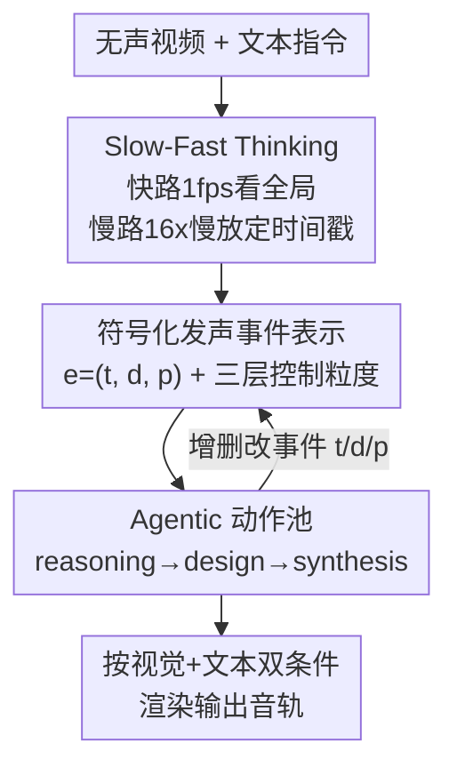

# EchoFoley: Event-Centric Hierarchical Control for Video Grounded Creative Sound Generation

**会议**: CVPR 2026  
**论文**: [CVF Open Access](https://openaccess.thecvf.com/content/CVPR2026/html/Li_EchoFoley_Event-Centric_Hierarchical_Control_for_Video_Grounded_Creative_Sound_Generation_CVPR_2026_paper.html)  
**代码**: 项目页 https://echofoley.github.io/（代码未公开）  
**领域**: 视频生成音频 / Foley 生成 / 多模态  
**关键词**: video-to-audio、Foley 音效、事件级控制、agentic 框架、slow-fast thinking

## 一句话总结
针对现有视频配音模型「视觉主导、听不懂文本指令、做不了细粒度编辑」的问题，本文提出 EchoFoley 任务（用符号化「发声事件」表示 + 三层控制粒度），配套 6k 规模密标注 benchmark，并设计了 training-free 的 agentic 框架 EchoVidia（slow-fast thinking + 动作池），在可控性上比最强 baseline 提升约 40.7%、感知质量提升 12.5%。

## 研究背景与动机
**领域现状**：视频→音频（V2A）/ 视频+文本→音频（VT2A）这两年进展很快，Diff-Foley、MMAudio、HunyuanVideo-Foley、ThinkSound 等模型已经能给无声视频生成时间上对齐的音效，文本指令通常以短标签（"cat meowing"）或一句话描述（"distant rumble of thunder becomes louder"）的形式作为可选条件。

**现有痛点**：作者指出当前形式有三个硬伤——（1）**视觉主导（visual dominance）**：模型严重依赖画面、几乎忽略文本里的细粒度要求，画面和指令冲突时永远听画面的；（2）**没有"细粒度可控生成"的明确定义**：现有指令只能在"某一类声音"的粒度上操作，无法区分同类的多个事件（视频里猫叫了两声，"把猫叫改大声"到底指哪一声？）；（3）**指令理解弱**：现有数据集都是简短的类别标签，无法支持多属性联合编辑（同时改音色、顺序、时长、音量）。

**核心矛盾**：根子在于"控制的最小单元"错了——现有方法以**视频级 / 类别级**为控制单元，而创作级的音效编辑本质需要落到**单个发声事件**这个原子上，并且要能说清每个事件的"何时、是什么、怎么发声"。

**本文目标**：把控制从视频级下沉到事件级，让用户能对单个声音事件做生成、插入、编辑，并支持从单事件到全片的层级化控制。

**切入角度**：作者引入一个**符号化的发声事件表示**作为自然语言指令与音频生成之间的中间接口——把"模糊的人话"翻译成结构化、可被精确操作的事件元组。

**核心 idea**：用「事件中心 + 层级控制」重新定义任务（EchoFoley），并用一个 training-free 的 agentic 框架（EchoVidia）配 slow-fast thinking，先把视频里的发声事件看清楚、再按符号化计划逐个合成。

## 方法详解
本文其实有两条主线：一条是**任务与数据**（EchoFoley 任务定义 + EchoFoley-6k benchmark + 评测指标），一条是**方法**（EchoVidia 框架）。下面把两条都讲清，重点在符号表示、层级控制和 EchoVidia 的推理流程。

### 整体框架
EchoVidia 是一个 **training-free 的 agentic 框架**：核心是一个基于 VideoLLM 的 agent，它操作一个含 12 个原子动作的**动作池（action pool）**，把生成过程组织成三个串联阶段——**reasoning（识别发声事件、估时间、裁剪相关画面）→ design（增删改事件的符号表示 t/d/p）→ synthesis（合成、调整、混音各音频层）**。在进入 agent 流程之前，先用 **slow-fast thinking** 把视频里的发声事件看清楚（快路看全局、慢路看慢动作定时间戳），把"事件感知弱、定时间不准"这个 VideoLLM 的通病补上。最终 agent 输出一份符号化事件计划，交给音频生成模块按"视觉 + 文本"双条件渲染成声音。

### 关键设计

**1. 符号化发声事件表示 + 层级控制空间：把"模糊人话"翻译成可精确操作的事件元组**

这是整个任务的地基，直接对准"无法区分同类多事件、无法多属性联合编辑"的痛点。作者把一个发声事件 $e$ 定义为结构化三元组 $e=(t, d, p)$：$t=(t_{start}, t_{end})$ 是事件在视频时间轴上的起止位置；$d$ 是语义描述 `<subject, action, object>`（object 可选，如"cat meow"）；$p$ 是可控音频属性（音色 timbre、音高 pitch、强度 intensity、空间化 spatialization）。给定视频 $V$ 和指令 $I$，任务就是产出满足约束的事件集合 $C=\{(t,d,p)\mid V,I\}$；当 $I$ 为空时退化为普通视频配音。

有了这个符号接口，作者把控制空间组织成**三个层级**——**Instance Level**（单事件：如"把第二声 meow 改成狮吼"）、**Group Level**（一组相关事件：如"把视频里所有猫叫都变成狮吼"）、**Video Level**（全片声学风格：如"整条音轨做成卡通风"）；再叠加三种与层级正交的**控制类型**——Temporal（何时/多长）、Timbre（听起来像什么）、Volume（多响/多远）。正是因为有了"事件"这个原子和"何时×是什么×怎么发声"三个维度，"在 00:07 插入 1 秒魔法爆炸声、并让它和之前所有声音都比之后的响"这种复合指令才第一次变得可表达、可评测。

**2. Slow-Fast Thinking 策略：先把发声事件看清楚、把时间戳定准，再去配音**

作者在评测里发现（见 §5.3），VideoLLM 对发声事件的感知很弱、时间边界漂移严重——这是 EchoVidia 想用 VideoLLM 当 agent 必须先解决的前置短板。受双过程认知（System 1 快直觉 / System 2 慢分析）启发，本文设计了两条互补的观看路径：**快路（fast）**以 1 fps 浏览整段视频，抓全局结构和粗粒度听觉上下文；**慢路（slow）**看一个"16 倍慢动作"版本来精确定位——具体做法是先把视频降采样到 16 fps，再在时间上拉伸 16×，得到一个 1 fps 的慢放视频，让模型在更细的时间分辨率上做事件定位和属性推断。这个策略是即插即用的提示级增强：套在 Gemini-2.5 Pro 上让事件检测 recall 从 0.66 提到 0.83、定位 IoU 从 0.510 飙到 0.842（相对提升 60%+），证明"看不清"很大程度是观看方式问题而非模型容量问题。

**3. Agentic 动作池 + 三阶段推理：把"生成"拆成可解释的 reasoning-design-synthesis 闭环**

为了在不训练的前提下实现细粒度可控，作者让 VideoLLM agent 操作一个含 **12 个原子动作**的动作池，分成三类：视频推理动作（识别发声事件、检索时间线索、裁剪相关画面）、声音设计动作（add / remove / modify 事件的符号表示，控制其语义属性和时间属性）、生成动作（synthesize / adjust / mix 各音频层，保证时间对齐和跨模态一致）。推理时 agent 先分析视频找出潜在事件并估时，构建一份符号化事件计划，然后**通过 reasoning 和 editing 动作迭代精修这份计划**（对应框架图里 design 回到事件表示的反馈环），最后把定稿的符号表示交给生成模块按视觉+文本双条件渲染。这种 agentic 写法的价值在于：编辑、插入、删除都落在符号事件这个可解释中间层上，从而绕开了端到端 VT2A 模型"文本信号被视觉淹没"的老问题。

**4. EchoFoley-6k benchmark 与事件级评测指标：让"细粒度可控"第一次可量化**

光有任务定义还不够，作者构建了配套数据与指标。数据用 5 步流水线从 VGGSound、PE Video 里筛选并标注：①筛选运动/发声明显的视频；②采集元数据 + 逐帧 caption 提供视觉与时间线索；③用 LLM 基于元数据和 caption 生成一个"声音如何塑造场景"的创意故事并提出初始事件候选（仅作脚手架）；④人工把故事转成细粒度指令、并调整事件时间边界和音频属性。最终得到 ~6,000 条 video–instruction 三元组、~42,000 个密标注发声事件（937 个视频、平均每视频 6 个事件 12 条指令）。配套三个**自动指标**对准"何时/是什么/怎么发声"：

$$\text{TempIoU}(e)=\frac{|t\cap\hat t|}{|t\cup\hat t|}, \qquad \text{CLAP}(e)=\text{sim}(A_t, d)$$

即 **TempCtl** 用预测活跃区间与真值区间的 IoU 衡量时间可控性；**TimbCtl** 用事件音频片段 $A_t$ 与语义描述 $d$ 的 CLAP 相似度衡量音色可控性；**VolCtl** 先把每个片段相对整段音频的响度离散成 low/medium/high 三档（$\omega_t$ 按相对 Loudness 与阈值 $\varepsilon_1,\varepsilon_2$ 划分），再统计与真值响度档 $\omega_t^{gt}$ 一致的比例。三者都先按事件求值、再对视频内所有事件取平均。

## 实验关键数据

### 主实验
在 EchoFoley-6k 上对比 8 个开源 VT2A 模型，EchoVidia 在可控性与多数质量维度全面领先：

| 模型 | TempCtl | TimbCtl | VolCtl | Instr. 遵从 | A–V 一致 | 感知质量 |
|------|---------|---------|--------|-------------|----------|----------|
| MMAudio-S-44.1kHz | 0.30 | 0.24 | 0.55 | 2.00 | 3.53 | 3.13 |
| ThinkSound | 0.18 | 0.34 | 0.50 | 1.53 | 2.20 | 2.00 |
| AudioGenie | 0.27 | 0.23 | 0.58 | 1.47 | 3.47 | 3.47 |
| HunyuanVideo-Foley-xxl | 0.43 | 0.48 | 0.69 | 2.53 | 4.07 | 3.67 |
| **EchoVidia** | **0.72** | **0.78** | **0.75** | **3.80** | 3.93 | **3.79** |

相对最强 baseline（HunyuanVideo-Foley-xxl），三项可控性分别 +0.29 / +0.30 / +0.19（平均约 +55%），人工指令遵从 +1.20。值得注意的是 EchoVidia 在 Instruction Adherence 和 Audio–Visual Coherence 两个轴上**同时**拿高分，打破了其他模型"画面对得上、指令听不懂"的视觉主导偏置（其余模型都挤在指令遵从 1.4–2.0、A–V 一致 3.2–3.6 的左上区域）。

### 消融实验
Slow-Fast（SF）策略在发声事件检测（Task 1）与定位（Task 2）上的增益：

| 配置 | Recall | F1 | 说明 |
|------|--------|----|----|
| Gemini-2.5 Pro | 0.66 | 0.59 | 基线 VideoLLM |
| Gemini-2.5 Pro + SF | 0.83 (+0.17) | 0.74 (+0.15) | 加慢快双路后最优 |
| Qwen3-VL-30B-Thinking | 0.45 | 0.53 | 基线 |
| Qwen3-VL-30B-Thinking + SF | 0.54 (+0.09) | 0.71 (+0.18) | F1 大涨 |

定位精度上，SF 让 Gemini-2.5 Pro 的 IoU 从 0.510 提到 0.842、Qwen3-VL-30B 从 0.484 提到 0.650（相对 +60%+）。

### 关键发现
- **越细粒度越难控**：所有 VT2A 模型在 video 级控制分最高，到 group 级骤降、到 instance 级更差，说明现有模型缺乏定位/解耦/操纵单事件属性的能力——这正是 EchoFoley 任务要逼出来的短板。
- **视觉主导偏置普遍存在**：现有模型 A–V 一致性尚可但指令遵从普遍 <2.6/5，画面与文本冲突时压倒性偏向画面。
- **SF 是性价比很高的提示级增强**：不训练、只改观看方式，就把 VideoLLM 的事件感知与定时精度大幅拉起，是 EchoVidia 能用现成 VideoLLM 当 agent 的关键前提。
- **omni-modal 模型 > 纯视觉 VideoLLM**：在事件检测上音频对齐的多模态预训练带来明显优势。

## 亮点与洞察
- **把"声音"形式化成可操作的符号事件 $(t,d,p)$**：用一个轻量的结构化中间层把模糊的自然语言指令翻译成可精确增删改的事件，是这篇最"啊哈"的设计——它让"第二声 meow""00:07 插入 1 秒爆炸"这类指令第一次可表达、可评测，思路可迁移到视频编辑、TTS 韵律控制等任何"需要按事件精修"的生成任务。
- **Slow-Fast Thinking 用"16× 慢放视频"换时间分辨率**：把双过程认知落地成两条观看路径，且完全是提示级、即插即用，对任意 VideoLLM 都能涨点，复用成本极低。
- **training-free agentic 路线绕开视觉主导**：把生成拆成 reasoning-design-synthesis 并落在符号层做编辑，从机制上避免了端到端模型"文本被视觉淹没"，对工程落地友好。
- **配套三个事件级指标（IoU / CLAP / 离散响度档）**：让"细粒度可控"从一句口号变成可量化对象，benchmark 本身也能当 VideoLLM 的发声事件感知测试集复用。

## 局限与展望
- 作者承认 EchoVidia 是 training-free 的拼装式 agent，未来应把事件中心的形式化整合进**端到端可训练**模型，并扩展符号事件表示到更多应用。
- ⚠️ 框架细节（12 个原子动作的具体清单、慢快两路结果如何融合、动作池的调度策略）正文只给了概览，需查附录才能复现；本笔记相关描述以原文为准。
- 数据规模仍偏小（937 个视频），且来源集中在 VGGSound / PE Video 的"运动/发声明显"子集，对环境音、背景氛围音这类非显式发声场景的覆盖有限。
- 重度依赖强 VideoLLM（Gemini-2.5 Pro 级别）作为 agent 底座，换成弱模型时 SF 增益和整体可控性能否保持未充分验证。

## 相关工作与启发
- **vs MMAudio / Diff-Foley / HunyuanVideo-Foley（端到端 VT2A）**：它们把视频+文本直接喂给扩散/transformer 生成音频，过度优化视觉对齐、文本控制弱；本文不训练，改用符号事件 + agent 在中间层做可解释编辑，可控性大幅领先（TempCtl 0.72 vs 0.43）。
- **vs ThinkSound / AudioGenie（MLLM 多阶段 V2A）**：同样想用 MLLM 推理，但仍停在类别/视频级控制；本文把控制下沉到单事件并给出层级化定义与评测，是对这条路线的细粒度化推进。
- **vs 发声事件定位类工作（AVE / AVE-CLIP 等）**：那些工作只做"检测+定位"，本文把事件感知接到**可控生成**下游，并用 EchoFoley-6k 同时支撑生成与感知两类评测。

## 评分
- 新颖性: ⭐⭐⭐⭐⭐ 用符号事件 $(t,d,p)$ + 三层控制重新定义任务，把模糊指令变成可精确编辑的对象，范式级创新
- 实验充分度: ⭐⭐⭐⭐ 8 个 VT2A baseline + 9 个 VideoLLM、自动/人工双评测，但 EchoVidia 自身组件消融偏少
- 写作质量: ⭐⭐⭐⭐ 动机三连问清晰、指标定义明确；部分方法细节（动作池/融合）下放附录
- 价值: ⭐⭐⭐⭐⭐ 任务+benchmark+指标+方法一整套，为细粒度可控配音奠定可量化基线，复用价值高

<!-- RELATED:START -->

## 相关论文

- [\[CVPR 2026\] Hierarchical Codec Diffusion for Video-to-Speech Generation](hierarchical_codec_diffusion_for_video-to-speech_generation.md)
- [\[CVPR 2026\] FoleyDirector: Fine-Grained Temporal Steering for Video-to-Audio Generation via Structured Scripts](foleydirector_fine-grained_temporal_steering_for_video-to-audio_generation_via_s.md)
- [\[CVPR 2026\] Omni2Sound: Towards Unified Video-Text-to-Audio Generation](omni2sound_towards_unified_video-text-to-audio_generation.md)
- [\[CVPR 2026\] OmniSonic: Towards Universal and Holistic Audio Generation from Video and Text](omnisonic_towards_universal_and_holistic_audio_generation_from_video_and_text.md)
- [\[CVPR 2026\] BabyVLM-V2: Toward Developmentally Grounded Pretraining and Benchmarking of Vision Foundation Models](babyvlm-v2_toward_developmentally_grounded_pretraining_and_benchmarking_of_visio.md)

<!-- RELATED:END -->
