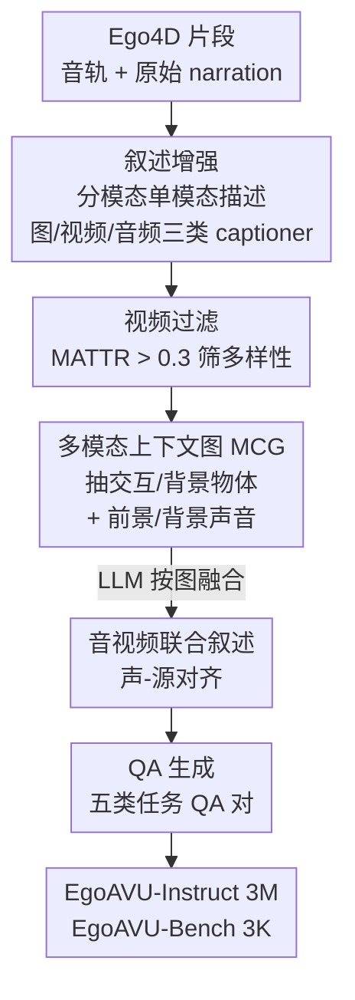

# EgoAVU: Egocentric Audio-Visual Understanding

**会议**: CVPR 2026  
**论文**: [CVF Open Access](https://openaccess.thecvf.com/content/CVPR2026/html/Seth_EgoAVU_Egocentric_Audio-Visual_Understanding_CVPR_2026_paper.html)  
**代码**: 项目页 https://cs20s030.github.io/EgoAVU/ （未见独立代码仓）  
**领域**: 多模态VLM / 第一人称视频 / 音视频理解  
**关键词**: 第一人称视频, 音视频理解, 数据引擎, 多模态上下文图, MLLM 指令微调

## 一句话总结
针对"现有 MLLM 在第一人称视频里只看不听、把声音和错误视觉源乱配"的问题，本文提出一个全自动数据引擎 EgoAVU，用模块化开源模型分模态生成音视频叙述、用图结构（MCG）显式建模声-源关系，造出 300 万训练样本（EgoAVU-Instruct）和 3000 条人工核验评测集（EgoAVU-Bench），微调后在自家 benchmark 上最高拿到 113% 的相对提升，并能迁移到其他第一人称基准。

## 研究背景与动机
**领域现状**：第一人称视频（cooking、装配等日常活动）是具身智能和混合现实的关键数据来源。它的剧烈相机抖动和狭窄视野让纯视觉理解很吃力，而声音提供了持续、稳定的事件线索（切菜声、水流声、敲击声）。近期 MLLM（Qwen2.5-Omni、VideoLLaMA2、MiniCPM-o 等）已经能同时吃视觉和音频输入。

**现有痛点**：问题卡在数据上。训练侧，现有第一人称数据集（MultiHop-EgoQA、MM-Ego）几乎都源自 Ego4D 的人工 narration，而这些 narration 只描述"人-物交互"，缺环境上下文、更缺听觉信号的多样性。评测侧，现有 benchmark（EgoSchema、EgoTempo、EgoIllusion）基本只测视觉；少数想补音视频的（如 EgoTempo/EgoIllusion）又依赖 GPT-4o/Gemini 等闭源模型生成数据，没法大规模可复现。外向视角（exocentric）的音视频 benchmark 虽多，但第一人称的多模态动态与之根本不同。

**核心矛盾**：要让模型学会"听-看"联合理解，就得有"声音-视觉源"正确对齐的联合模态标注；可这种标注极难自动获得——作者实测发现，直接把音频+视频一起喂给 MLLM 让它联合描述，模型会因为**模态偏置和幻觉**而漏掉大量声音、或把声音绑到错误的视觉事件上（Qwen2.5-Omni 在音频上的不一致率高达 54.3%）。

**本文目标**：造一个**全自动、只用开源模型**的数据引擎，从 Ego4D 这种公开第一人称数据里生成"声-源对齐、音视频联合"的叙述与 QA，既能大规模训练又能可复现评测。

**切入角度**：既然 MLLM 联合输入时会互相干扰，那就**分而治之**——让每个模型在单模态（只看 / 只听）下发挥它最可靠的能力，再用一个**显式的图结构**把跨模态关系拼回去。

**核心 idea**：用"模块化单模态描述 + 多模态上下文图（MCG）显式建模声-源关系 + LLM 融合成联合叙述 + 自动生成五类 QA"这条流水线，把难以获得的联合标注自动造出来。

## 方法详解

### 整体框架
EgoAVU 是一条四阶段的全自动数据生产线：输入是 Ego4D 里带音轨的原始第一人称视频片段（每段配有 `#C C holds a cup` 这类动作 narration），输出是两份数据集——3M 样本的训练集 EgoAVU-Instruct 和 3K 人工核验的评测集 EgoAVU-Bench。中间四步依次是：**(1) 叙述增强**，用多个开源 MLLM 分模态把原始 narration 扩写成细粒度的视觉/听觉描述；**(2) 视频过滤**，用词汇多样性指标 MATTR 筛掉静态、重复的片段；**(3) 音视频叙述生成**，先把单模态线索整理成多模态上下文图（MCG），再让 LLM 按图融合成一段声-源对齐的联合叙述；**(4) QA 生成**，从联合叙述里派生出五类任务的问答对。

### 关键设计

**1. 模块化分模态叙述增强：用单模态可靠性绕开联合输入的幻觉**

这一步直击"联合输入会互相干扰"的痛点。作者先做了一个验证实验：在 200 个随机片段上，让 Qwen2.5-Omni、MiniCPM-o 分别在单模态（只看 / 只听）和联合模态下描述，再人工统计"单模态里抓到的物体/事件有多少在联合输出里也正确出现"。结果联合输入下 Qwen2.5-Omni 的音频不一致率 54.3%、视觉 25.4%，MiniCPM-o 更是 68.2% / 31.2%——模型要么漏声音、要么把声音绑错视觉事件。

基于这个观察，EgoAVU 不再让一个模型联合处理，而是**拆成三路单模态描述**：用图像 captioner（Qwen2.5-VL）对中心帧抓细粒度物体空间描述；用 Qwen2.5-Omni 作"纯视频 captioner"（去掉音频）生成连贯的视频级动作叙述；再用同一个 Qwen2.5-Omni 作"纯音频 captioner"（去掉画面）描述前景声（敲击、嘶嘶声等贴着人类动作的声音）和背景声（鸟叫、风声）。这样得到时间对齐的单模态叙述，每个模型都只在它最可靠的设置下工作，避开了联合输入的偏置。

**2. MATTR 视频过滤：用词汇多样性筛出"音视频信号丰富"的片段**

增强后的 narration 里，有些片段动作单调、声音重复，对训练价值不大。作者用词汇多样性来量化"信息丰富程度"：把一个视频的所有段级 narration 拼成单条文本并分词 $T_v = \{t_1, \dots, t_n\}$，计算 Moving-Average Type-Token Ratio（MATTR），即在大小为 $w$ 的滑动窗口里平均"不重复词占比"：

$$\text{MATTR}(T_v) = \frac{1}{n-w+1} \sum_{i=1}^{n-w+1} \frac{|\text{Uni.}(t_i, \dots, t_{i+w-1})|}{w}.$$

MATTR 越高，说明叙述里出现的物体、动作、声音种类越多。作者设阈值 $\tau = 0.3$，剔除分布底部约 25% 的静态/重复片段，最终保留 9,900 个视频。相比直接按时长或随机采样，这个指标直接对准"多样性"这个训练真正需要的属性。

**3. 多模态上下文图（MCG）+ 两阶段叙述融合：把声-源关系从隐式推理变成显式可读**

这是全文最核心的设计，解决"如何把分开的单模态叙述正确融合"。作者发现，直接把视觉叙述和音频叙述一起丢给 LLaMA-70B 让它合并，模型常常维持不住人-物交互和声-源对应——因为它得**隐式**地在脑子里检索"人在和哪个物体交互、哪些是背景、什么动作/物体产生了哪个声音"，这对开源 LLM 太难。

于是作者设计两阶段流程。**第一阶段**先让 LLaMA-70B 从增强叙述里抽出一个结构化的多模态上下文图（MCG），显式列出四类节点：交互物体（人 physically 交互的物体及交互类型）、背景物体（环境里可见但未交互的物体）、前景声音（与具体动作相关的人为声音，如"放手机→碰撞声"，或可被画面 grounding 的环境声如可见的狗"汪汪"）、背景声音（音轨里存在但视觉无法定位声源的声音）。**第二阶段**再把增强叙述和 MCG 一起喂给 LLM，要求它先从 MCG 里提取显式线索（交互/背景物体、grounding 过的声音事件及其与动作和可见源的关联），再把这些线索和视频/动作叙述的时间描述对齐，生成一段声-源对齐的联合叙述。MCG 的价值在于把跨模态关系**外化成显式可读的结构**，模型不用再"隐式推理"，因此能稳定保持正确的声-源对应。

**4. 五类任务 QA 生成：覆盖 grounding / 时序 / 幻觉的音视频评测谱系**

有了高一致性的联合叙述，最后一步是派生 QA。作者设计五类任务，分开放式和封闭式两组。开放式（要求模型产出整合视听线索的描述性回答）三类：**SSA（Sound-Source Association）**识别前景声音并指出对应可见源；**AVSN（Audio-Visual Segment Narration）**在指定时间段内描述人在做/看/听什么；**AVDN（Audio-Visual Dense Narration）**把 AVSN 扩到整段视频，考查叙述连贯性。封闭式（适合对抗测试，可构造细粒度干扰项）两类：**TR（Temporal Reasoning）**用四选一考多模态事件的时序关系（哪个先/后发生）；**AVH（Audio-Visual Hallucination）**用 Yes/No 考模型会不会幻想出不存在的动作/物体/声音。开放式用 LLM-as-Judge（1–5 分，judge 用 Qwen3-235B）+ METEOR/ROUGE-L 评，封闭式用正则匹配算 Accuracy。这套谱系正好对准了 benchmark 想暴露的几种失败：声-源对不上、时序乱、幻觉。

### 损失函数 / 训练策略
没有新损失，标准 MLLM 指令微调。用 LLaMA-Factory 在 EgoAVU-Instruct 上微调 Qwen2.5-Omni（7B），分 LoRA 和全参两种设置；64 张 H100，global batch size 64，训 5 个 epoch，每个视频均匀采 300 帧，五类任务均匀采样以平衡性能。

## 实验关键数据

### 主实验
在 EgoAVU-Bench 上对比 7 个开源 MLLM 与微调后模型。开放式任务（SSA/AVDN/AVSN）报 LLM-as-Judge 分 S（1–5）、METEOR(M)、ROUGE-L(R)，封闭式（TR/AVH）报 Accuracy。下表摘最能说明问题的列：

| 模型 | SSA (S↑) | AVSN (S↑) | TR Acc↑ | AVH Acc↑ |
|------|----------|-----------|---------|----------|
| VideoLLaMA2 (7B) | 1.51 | 1.71 | 37.00 | 20.32 |
| MiniCPM-o (8B) | 1.43 | 2.06 | 26.44 | 21.76 |
| Qwen2.5-Omni (7B) 最强基线 | 1.50 | 1.99 | 53.20 | 42.69 |
| **Ours (LoRA, 7B)** | 3.15 | 2.45 | 64.31 | 61.69 |
| **Ours (Full, 7B)** | **3.20** | **2.63** | **67.84** | 60.12 |
| Δ(%) vs 最强基线 | **+113.3** | +27.6 | +27.2 | +30.8 |

两个核心结论：(1) 现有 MLLM 在音视频联合理解上**普遍很差**——SSA 上所有基线 LLM-as-Judge 分都低于 1.6/5，AVH 准确率都低于 43%，印证了"重视觉、轻音频"的系统性偏置；(2) 在 EgoAVU-Instruct 上微调能**大幅且一致**地补上这个缺口，SSA 相对提升达 113.3%，LoRA 和全参都有效（说明资源受限也能拿到强音视频理解）。

迁移性（Table 4）：微调后在其他第一人称基准上也涨——EgoTempo +28.1%、EgoIllusion +7.2%，EgoSchema 仅微降 0.1%，说明没有过拟合到自家数据。

### 消融 / 错误分析
论文没有传统的"去掉模块 A/B"消融，而是做了**按子模态拆分的错误分析**，恰好验证了"声音是最弱环节、而本文数据专门补声音"。AVH 任务按动作/物体/声音三个子集分别算准确率：

| 模型 | Action Acc↑ | Object Acc↑ | Sound Acc↑ |
|------|-------------|-------------|------------|
| Qwen2.5-Omni (7B) | 44.39 | 50.00 | 33.67 |
| **Ours (Full, 7B)** | **61.32** | **62.40** | **64.20** |

| SSA 错误率（越低越好） | Error Rate |
|------------------------|------------|
| Qwen2.5-Omni (7B) | 68.3% |
| MiniCPM-o 2.6 | 83.2% |
| **Ours (Full)** | **46.7%** |

### 关键发现
- **声音是所有 MLLM 的最大短板**：无论 TR 还是 AVH，模型识别声音的准确率都明显低于识别物体/动作；Qwen2.5-Omni 在 TR 里识别声音仅 36.1%，比识别视觉物体低 28.5 个百分点。在 SSA 的开放式错误里，MiniCPM-o/Phi4-mm 超过 72% 的错误来自"漏听或听错声音"而非认错人-物交互。
- **本文数据精准补在最弱处**：微调后 AVH 上识别声音的幻觉率相对 Qwen2.5-Omni 降了 30.0 个百分点（动作 -15.9、物体 -11.0），Sound Acc 从 33.67 飙到 64.20，是涨幅最大的子项。
- **自提升潜力**：EgoAVU 展示了用 MLLM 的单模态能力去造数据、再反过来提升其联合模态能力的"自学习"闭环——全程只用开源模型。

## 亮点与洞察
- **"联合输入会幻觉，那就拆开单独问再用图拼回去"**——这个 divide-and-conquer 的数据工程思路很可迁移：任何"多模态联合标注难、单模态标注可靠"的场景（如音视频字幕、多传感器融合）都能借鉴"单模态生成 + 显式关系图融合"。
- **MCG 把隐式跨模态推理外化成显式结构**，是让弱开源 LLM 也能稳定融合的关键；这比"靠更强的闭源模型硬合并"更可复现、更可控。
- **错误分析当消融用**：没有传统模块消融，但按动作/物体/声音拆分的错误率分析，直接证明了"声音是瓶颈、数据补声音"的因果链，比单纯堆 SOTA 数字更有说服力。
- **全开源可复现**：从 captioner 到 judge 全用开源模型（judge 用 Qwen3-235B 而非 GPT-4），刻意避开闭源依赖，这正是它相对 EgoTempo/EgoIllusion 的核心优势。

## 局限与展望
- 数据质量被上游开源 MLLM 的能力上限封顶：单模态 captioner（Qwen2.5-Omni/VL）本身的视觉/听觉描述误差会沿流水线传播，MCG 也只是把这些可能有噪声的线索结构化，并不能纠正源头错误。⚠️ 论文 conclusion 提到 limitation 但缓存截断，未见完整表述。
- 评测部分依赖 LLM-as-Judge（Qwen3-235B 打 1–5 分），开放式分数会受 judge 偏好影响；虽然用开源 judge 保证可复现，但 judge 与人类判断的一致性论文未充分讨论。
- 声-源关联的"正确性"在自动流程里靠 MCG 显式抽取保证，但前景/背景声音的划分（能否被视觉 grounding）本身可能含糊，边界 case 的标注一致性存疑。
- 改进方向：把单模态 captioner 的不确定性显式建模进 MCG（如给边加置信度），或引入跨片段一致性约束减少声-源误绑。

## 相关工作与启发
- **vs MultiHop-EgoQA / MM-Ego**：它们同样源自 Ego4D narration，但只描述人-物交互、缺环境与听觉多样性，且基本是纯视觉；EgoAVU 的差异在于显式补齐环境上下文和声音，并强制声-源对齐，填的是"音视频联合"这个空白。
- **vs EgoTempo / EgoIllusion**：这两个 benchmark 也想增强上下文理解，但依赖 GPT-4o/Gemini 等闭源模型生成数据，难以大规模可复现；EgoAVU 全用开源模型，且专门覆盖音视频联合（带同步音轨、4 分钟长视频、200 个答案类别）。
- **vs 外向（exocentric）音视频 benchmark**：第一人称的相机抖动、自遮挡、独特音频 profile 与外向数据根本不同，直接迁移外向模型会失效；EgoAVU 专门针对第一人称特性构造数据。

## 评分
- 新颖性: ⭐⭐⭐⭐ 第一个系统性的第一人称音视频联合理解数据引擎+benchmark，MCG 显式建模声-源关系的思路新颖
- 实验充分度: ⭐⭐⭐⭐ 7 个基线 + 跨基准迁移 + 细到子模态的错误分析，但缺传统的模块消融
- 写作质量: ⭐⭐⭐⭐ 动机-观察-设计的因果链清晰，pipeline 四步交代完整
- 价值: ⭐⭐⭐⭐⭐ 揭示并量化了 MLLM 的"视觉偏置"，提供可复现的训练数据与评测，对具身/AR 社区实用价值高

<!-- RELATED:START -->

## 相关论文

- [\[CVPR 2026\] AMUSE: Audio-Visual Benchmark and Alignment Framework for Agentic Multi-Speaker Understanding](amuse_audio-visual_benchmark_and_alignment_framework_for_agentic_multi-speaker_u.md)
- [\[ECCV 2024\] Listen to Look into the Future: Audio-Visual Egocentric Gaze Anticipation](../../ECCV2024/audio_speech/listen_to_look_into_the_future_audio-visual_egocentric_gaze_anticipation.md)
- [\[CVPR 2026\] HAVE-Bench: Hierarchical Audio-Visual Evaluation from Perception to Interaction](have-bench_hierarchical_audio-visual_evaluation_from_perception_to_interaction.md)
- [\[CVPR 2026\] Semantic Noise Reduction via Teacher-Guided Dual-Path Audio-Visual Representation Learning](semantic_noise_reduction_via_teacher-guided_dual-path_audio-visual_representatio.md)
- [\[CVPR 2026\] How Far Can We Go With Synthetic Data for Audio-Visual Sound Source Localization?](how_far_can_we_go_with_synthetic_data_for_audio-visual_sound_source_localization.md)

<!-- RELATED:END -->
