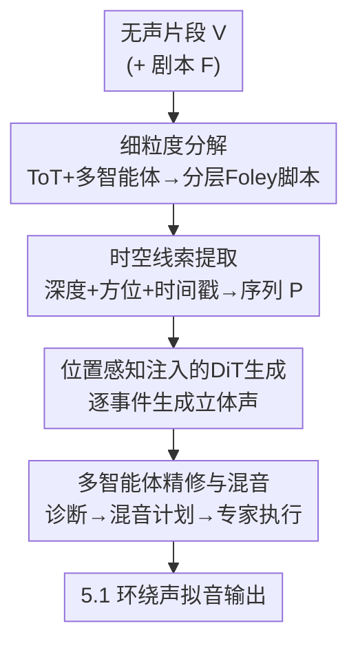

# FoleyDesigner: Immersive Stereo Foley Generation with Precise Spatio-Temporal Alignment for Film Clips

**会议**: CVPR 2026  
**论文**: [CVF Open Access](https://openaccess.thecvf.com/content/CVPR2026/html/Li_FoleyDesigner_Immersive_Stereo_Foley_Generation_with_Precise_Spatio-Temporal_Alignment_for_CVPR_2026_paper.html)  
**代码**: https://gekiii996.github.io/FoleyDesigner/ （项目页）  
**领域**: 音频生成 / 多模态  
**关键词**: 立体声拟音, 时空对齐, 扩散Transformer, 多智能体, Tree-of-Thought

## 一句话总结
FoleyDesigner 模仿专业拟音师的工作流，把无声电影片段拆成分层声音事件、用从视觉追踪里提取的「深度+方位」时空线索驱动 DiT 扩散生成帧级对齐的立体声、再用多智能体后期混音并升混到 5.1 环绕声，在时空对齐与电影级拟音质量上全面超过现有 baseline。

## 研究背景与动机

**领域现状**：拟音（Foley，给画面手工配音效）是电影沉浸感的核心，但目前的音频生成方法分三类，没一类能直接拿来做电影立体声拟音：单声道生成（AudioLDM2、Tango2、Make-an-Audio2）质量高但完全没有空间维度；立体声生成（Stable Audio、SpatialSonic、See2Sound）能出立体声但要么没有精确的空间定位、要么做不到帧级时间对齐；单声道转立体声（Sep-Stereo、Mono-to-Binaural）依赖已有单声道源，灵活性受限。

**现有痛点**：电影级拟音同时卡在三个技术难点上。其一，**密集重叠的声音事件**——电影场景里多个声源在频谱和时间上同时重叠，单趟（single-pass）生成模型没法把它们解耦，输出要么不全要么糊成一团。其二，**缺乏时空 grounding**——文本条件只能给「左边」「远处」这种粗糙方向描述，无法指定连续的空间轨迹和帧级时序；图像条件又没有时间信息，抓不住声源的动态移动。其三，**专业声学质量不达标**——生成音频常有混响不匹配、重叠频段的频谱遮蔽、响度失衡，关键音效被埋掉，破坏电影沉浸感。

**核心矛盾**：通用音频生成把声场当成一个整体「一次性」生成，而专业拟音的本质是「先分解、再逐个精确放置、最后整体调和」——这套分层 + 空间 grounding + 后期混音的流程，恰恰是端到端生成模型缺的。

**本文目标**：从无声电影片段直接生成符合电影标准的立体声拟音，分别对应三个难点——可分层生成密集声场、可控的帧级时空对齐、专业声学一致性。

**切入角度**：作者直接把专业拟音师的真实工作流「翻译」成三个串行模块（分解 → 生成 → 精修），让每个阶段对症解决一个难点。

**核心 idea**：用「Tree-of-Thought 多智能体分解 + 从视觉追踪提取时空线索注入 DiT + 多智能体专业混音」这条完整流水线，把电影拟音的整套人工流程自动化，并配套首个带空间元数据的电影立体声数据集 FilmStereo。

## 方法详解

### 整体框架
FoleyDesigner 把无声片段 $V$（可选配合剧本 $F$）变成电影级 5.1 环绕声拟音，整条流水线串三个阶段：**① 细粒度分解**——用 Tree-of-Thought 推理 + 多智能体校验把场景拆成一份分层 Foley 脚本，每个事件标注前景/背景层；**② 时空拟音生成**——对每个声音事件，从关键帧里提取深度与方位、检测时间戳，编码成时空线索，通过位置感知的注入块条件化一个 DiT 扩散模型，生成帧级对齐的立体声；**③ 拟音精修与专业混音**——多个诊断+专家智能体识别声学问题、确定混响/均衡/动态参数，最后按 ITU-R BS.775 升混到 5.1 声道。

### 关键设计

**1. 细粒度分解：用 Tree-of-Thought 多智能体把密集声场拆成分层脚本**

针对「单趟模型解不开密集重叠声场」的痛点，作者不让模型一次性生成整个声场，而是先把场景「拆开、逐个生成」。这一步由两个智能体模块构成。**FilmScribe** 把无声视频 $V$ 转成结构化脚本 $T$：一个 generator 智能体先产出初始脚本 $T^{(0)}$，一个 validator 智能体检查准确性与完整性，闭环迭代 $T^{(k+1)} = \mathrm{Generator}(V, \mathrm{Feedback}(T^{(k)}, V))$，直到 $\mathrm{Validator}(T, V)\to\mathrm{True}$，保证视音对齐和事件不漏。**FoleyScriptWriter** 再融合剧本 $F$ 与 $T$，产出分层脚本 $S=\{(e_i, l_i)\}$，其中 $e_i$ 是第 $i$ 个声音事件、$l_i\in\{fg, bg\}$ 标前景/背景——视觉只能抓物理可见事件，剧本则补上「画面看不出但叙事需要」的声音。

分解的核心是 Tree-of-Thought 在有向搜索图 $G=(N,E)$ 上的搜索：（i）**Expand**——从根节点 $(V,F)$ 出发，扩展智能体按拟音设计原则（叙事声源分离、与画面语义对齐、与影片基调匹配的情绪调制）生成候选脚本子节点；（ii）**Score**——每个候选打分 $\mathrm{Score}(S,V,F)=w_1 s_{align}+w_2 s_{layer}+w_3 s_{emotion}$，分别评视音对应、前后景分离、影片基调一致，错位/分层含糊/情绪冲突都会扣分；（iii）**Optimization**——当 $\mathrm{Score}(S,V,F)>\tau$ 立刻终止，否则对可修问题（如层次重叠）做 refinement 生成子节点、对根本性失败（如情绪错位）做 regeneration 生成同级节点，每层 prune 保留 top-$b$，直到超过深度 $d_{max}$ 或预算耗尽。这样产出的脚本同时保证物理保真、感知清晰、叙事连贯。

**2. 时空线索提取：把视觉追踪转成「深度+方位+激活」的逐帧条件序列**

针对「文本/图像条件给不出连续空间轨迹和帧级时序」的痛点，作者直接从视频帧里量化空间信息。从 $N$ 个关键帧 $K=\{I_1,\dots,I_N\}$ 中，用 VLM 给声源标边界框 $B=\{b_i\}$，用深度估计模型得深度图 $D_i$，在每个框内取平均深度得标量 $d_i$；方位角 $\theta_i$ 由框的水平中心 $x_i\in[0,W]$ 推出：

$$\theta_i = \arctan\!\left(\frac{x_i - W/2}{d_i}\right)\cdot\frac{180^\circ}{\pi} + 90^\circ$$

把相对水平位置映射到 $\theta_i\in[0^\circ,180^\circ]$ 的角度。时序上，检测声音事件时间戳得到二值激活向量 $c=\{c_t\}\in\{0,1\}^T$（$c_t$ 表示第 $t$ 帧是否有事件）。关键帧的空间序列 $X=\{x_i=(d_i,\theta_i)\}$ 按帧率时间插值成 $\{x_t\}_{t=1}^T$，再被激活向量掩码：

$$p_t = c_t\cdot x_t,\quad P=\{p_t\}_{t=1}^T$$

每个 $p_t\in\mathbb{R}^2$ 编码第 $t$ 帧活跃事件的深度与方位。这一步把「画面里物体在哪、什么时候发声」变成扩散模型能吃的可控条件。

**3. 位置感知注入：用 Fourier 编码 + 跨注意力把时空线索喂进 DiT 扩散**

有了 $P$ 还要让 DiT 真正「听进去」。作者基于 Stable Audio Open（DiT latent 扩散）做条件化，文本 $c_{text}$ 走原通道，时空线索 $P$ 走新设计的位置感知注入。先对每个位置向量做 Fourier 特征变换以增强表达力：$\gamma(p_t)=[\cos(2\pi Bp_t);\sin(2\pi Bp_t)]\in\mathbb{R}^{2m}$，$B\in\mathbb{R}^{m\times2}$ 是从 $\mathcal{N}(0,\sigma^2)$ 采的随机投影矩阵。再用激活掩码调制：$\tilde\gamma(p_t)=c_t\cdot\gamma(p_t)+\epsilon\cdot\gamma(p_t)$，其中 $\epsilon=0.1$ 让不活跃帧仍保留弱位置信息（避免突变）。接着用卷积编码器（1D 卷积 + group norm + SiLU 的下采样块）把特征压到和音频 latent 同样的时间压缩率 $r$，得到位置嵌入 $E_{pos}\in\mathbb{R}^{T'\times d_{emb}}$（$T'=T/r$）。

注入方式是在扩散主干每 4 个标准 DiT 块后插一个注入块，位于层 $\ell\in\{3,7,11,15,19,23\}$，对噪声 latent $z_\ell$ 与层归一化后的位置嵌入做跨注意力：$z'_\ell=\mathrm{InjBlock}(z_\ell, \mathrm{LN}(E_{pos}))$。这样空间感知被均匀注入到网络不同深度，实现帧级时空对齐——这也是消融里贡献最大的组件。

**4. 多智能体精修与混音：诊断—规划—专家执行三级流水线 + 5.1 升混**

针对「生成的原始音频混响不一致、频谱遮蔽、响度失衡」的痛点，作者模仿专业拟音团队的协作，搭了一套多智能体后处理。**Foley Analysis** 智能体对每条音轨 $a_i$ 抽复合特征 $f_i=[f_{sem},f_{spec},f_{rev},f_{loud}]$——语义嵌入（Audio-LLM）、Mel 频谱模式（VLM 分析）、混响时间、积分响度，把语义判断和客观测量结合做综合诊断。**Mixing Planner** 智能体跨模态校验、轨间平衡分析后产出混音计划 $\Pi=\{(i,O_i)\}$，$O_i\subseteq\{reverb, eq, dyn\}$ 指明每条轨要做哪些操作。计划再下发给三个**专家智能体**：混响专家按场景空间关系定混响参数、均衡专家按频谱重叠调频段减少遮蔽、动态专家按相对响度调增益防止关键音效被埋。最后**5.1 升混**：立体声 $s_L,s_R$ 直接映射到前左/前右，中置和环绕声道由立体声加权混得，LFE 由全混信号低通滤波得到 $s_{LFE}(t)=\mathrm{LPF}(s_{mix}(t), 120\,\mathrm{Hz})$（$s_{mix}=s_L+s_R$），整套遵循 ITU-R BS.775 标准。

### 损失函数 / 训练策略
训练分两阶段：（1）训练立体声 Mel 频谱 VAE；（2）训练带时空控制注入的 DiT 扩散模型。两阶段都用 FilmStereo，学习率 $3\times10^{-5}$，batch size 8，跑在 NVIDIA A6000 上。配套数据集 FilmStereo 是首个面向电影拟音的立体声数据集，覆盖 8 大类（23 子类）、166 小时、14,784 个样本；空间上用 5 个正面方位区（$\pm15^\circ,\pm45^\circ,0^\circ$）+ 3 个深度区（近场 0–2m / 中场 2–5m / 远场 >5m），用 gpuRIR（16–18cm 耳间距）生成静态和动态声源的房间脉冲响应；标注用 GPT-4 链式思维生成融合空间参数的 caption，时序上检测去噪音频的振幅峰值定位事件起止时间戳。

## 实验关键数据

### 主实验

音频质量（立体声转单声道后评，单声道指标）：

| 方法 | IS ↑ | KL ↓ | FAD ↓ | CLAP ↑ |
|------|------|------|-------|--------|
| Stable Audio | 10.50 | 1.86 | 2.37 | 0.594 |
| SpatialSonic | 13.79 | **1.37** | 1.93 | 0.672 |
| **Ours** | 12.36 | 1.40 | **1.88** | **0.679** |

CLAP 最高（0.679）、FAD 最低（1.88），比 SpatialSonic 分别好 1.0% / 2.6%，比 Stable Audio 好 14.3% / 20.7%。IS 略低于 SpatialSonic，作者解释 IS 衡量样本多样性而非质量/语义准确度。

时空对齐（立体声指标）：

| 方法 | GCC ↓ | CRW ↓ | FSAD ↓ | IoU ↑ |
|------|-------|-------|--------|-------|
| Stable Audio | 61.17 | 51.44 | 0.343 | 24.5 |
| See2Sound | 60.03 | 51.17 | 0.291 | 21.3 |
| SpatialSonic | 49.20 | 36.87 | 0.163 | 27.8 |
| **Ours** | **48.79** | **34.23** | **0.138** | **32.2** |

空间准确度上 GCC/CRW 均最低（比 SpatialSonic 好 0.8% / 7.2%），FSAD 0.138 说明声道分离质量高；时间对齐 IoU 32.2 最高，比 SpatialSonic 提升 15.8%。

电影拟音质量（电影片段评估）：

| 方法 | IB ↑ | SRS ↑ | CCS ↑ | AV-Sync ↑ |
|------|------|-------|-------|-----------|
| Stable Audio | 0.216 | 5.31 | 5.8 | 0.512 |
| See2Sound | 0.105 | 3.03 | 3.0 | 0.601 |
| SpatialSonic | 0.251 | 5.91 | 4.5 | 0.545 |
| **Ours** | **0.402** | **8.27** | **6.2** | **0.726** |

ImageBind Score（0.402）和 AV-Sync（0.726）分别比 SpatialSonic 高 60.2% / 33.2%；SRS（声音丰富度 8.27）和 CCS（电影清晰度 6.2）分别提升 39.9% / 37.8%——前者归功于细粒度分解，后者归功于多智能体精修。其中 SRS 和 CCS 是作者自定义的两个指标，用具备音频能力的 MLLM 评估专业电影语境下的声音分层多样性与感知分离质量。⚠️ 这两个指标依赖 MLLM 主观判断，具体打分细则原文未完全给出，以原文为准。

### 消融实验

| 配置 | GCC ↓ | CRW ↓ | FSAD ↓ | FAD ↓ |
|------|-------|-------|--------|-------|
| w/o STC | 62.02 | 55.89 | 0.297 | 2.14 |
| **Full Model** | **48.79** | **34.23** | **0.138** | **1.88** |

去掉时空线索（STC，含轨迹信息和空间定位 prompt）后所有指标都明显变差：加上 STC 后 GCC 降 21.3%、CRW 降 38.8%、FAD 改善 12.1%，证明位置感知注入是时空对齐的关键。

### 关键发现
- **时空线索（STC）是对齐的命脉**：消融里去掉 STC，CRW 这种空间相关误差暴涨 38.8%，说明从视觉追踪提取深度/方位再注入 DiT 是帧级对齐的真正来源，而非靠文本条件。
- **分解 vs 精修各司其职**：SRS（声音丰富度）大涨来自前端的细粒度分解（把密集场景拆开逐个生成），CCS（电影清晰度）大涨来自后端的多智能体混音（调和混响/频谱/动态），两个模块对应两个不同维度的提升，说明三阶段流水线的分工是有效的。
- **人工评测偏好明显**：在线 53 人 / 离线 12 人评测中，情绪对齐（在线 61% 偏好）和沉浸感（在线 58% 偏好）领先，说明时空线索不只提空间准确度，也带来语义和情感层面的电影感。

## 亮点与洞察
- **把人类专业工作流直接「编译」成模块**：分解 → 生成 → 精修三阶段不是凭空设计，而是 1:1 对应真实拟音师的流程，每个阶段对症解一个技术难点，是个很可迁移的「向专家流程看齐」的设计范式。
- **方位角的几何化定义很巧**：用边界框水平中心和深度通过 $\arctan$ 算方位角，把「物体在画面哪个位置」直接变成可量化的空间条件，比文本描述「左/右」精确得多，也比纯图像条件多了连续轨迹。
- **不活跃帧的弱位置保留 trick**：$\tilde\gamma(p_t)=c_t\cdot\gamma(p_t)+\epsilon\cdot\gamma(p_t)$ 里 $\epsilon=0.1$ 让没有事件的帧也保留微弱位置信号，避免条件在 0/1 之间硬跳变——这种「软掩码」思路可迁移到其它需要时序激活的条件生成。
- **多智能体后期混音**：把混响/均衡/动态拆成三个专家智能体协作，等于把音频工程师的领域知识结构化进 LLM 驱动的 agent，是个把「专业 know-how」自动化的好例子。

## 局限与展望
- 作者承认在**密集并发声音事件**场景（如同时的脚步声、物体交互、环境音）下生成性能会退化，偶尔出现空间定位错误；未来计划用更鲁棒的多目标追踪和分层空间推理增强视觉理解。
- ⚠️ 自定义指标 SRS / CCS 依赖音频 MLLM 主观打分，缺乏与人类标注的严格相关性验证，跨方法比较的绝对数值需谨慎看待。
- 方位角公式只建模水平方位（$0^\circ$–$180^\circ$ 正面半平面），不含俯仰/后方，对真正的 3D 空间音频（如头顶、身后的声源）覆盖有限；5.1 升混也只是加权映射而非真实房间声学建模。
- 整条流水线重度依赖多个外部模型（VLM 定框、深度估计、时间戳检测、Audio-LLM 诊断），任一环节失误都会沿管线传播，工程复杂度和推理成本都不低。

## 相关工作与启发
- **vs SpatialSonic / See2Sound**：它们能从文本/图像/视频生成立体声并改善空间精度，但忽略了帧级时间对齐、且架构缺乏接入专业后期流程的通路。FoleyDesigner 用位置感知注入做到帧级时空对齐，IoU 和 AV-Sync 明显更高，并原生支持 5.1 升混。
- **vs 单声道生成（AudioLDM2 / Tango2 / Make-an-Audio2）**：它们音质高但完全没有空间维度。本文在保留扩散生成质量（CLAP/FAD 领先）的同时补上了空间控制。
- **vs 单声道转立体声（Sep-Stereo / Mono-to-Binaural）**：它们依赖已有单声道源、要额外制作步骤；本文是端到端从无声视频直接生成立体声，灵活性更高。
- **启发**：当一个生成任务有成熟的人类专业流程时，与其追求端到端「一步到位」，不如把流程拆成对症的模块串联，再用 agent/LLM 把每个模块的领域知识结构化——这套思路可迁移到视频配乐、配音、3D 音效等同样有专业 pipeline 的创作任务。

## 评分
- 新颖性: ⭐⭐⭐⭐ 首个把专业拟音工作流端到端自动化、并做帧级时空对齐立体声生成的框架，时空线索注入机制有新意。
- 实验充分度: ⭐⭐⭐⭐ 三类指标 + 消融 + 人工评测较完整，但消融只做了 STC 一项，分解/混音模块缺独立消融。
- 写作质量: ⭐⭐⭐⭐ 难点—方法—模块对应关系清晰，公式给得齐；个别自定义指标定义略简。
- 价值: ⭐⭐⭐⭐ 配套 FilmStereo 数据集填补空白，对电影后期/VR 沉浸音效有实际应用潜力。

<!-- RELATED:START -->

## 相关论文

- [\[CVPR 2026\] Hear What You See: Video-to-Audio Generation with Diffusion Transformer and Semantic-Temporal Alignment-Ranked Direct Preference Optimization](hear_what_you_see_video-to-audio_generation_with_diffusion_transformer_and_seman.md)
- [\[CVPR 2026\] FoleyDirector: Fine-Grained Temporal Steering for Video-to-Audio Generation via Structured Scripts](foleydirector_fine-grained_temporal_steering_for_video-to-audio_generation_via_s.md)
- [\[CVPR 2025\] MultiFoley: Video-Guided Foley Sound Generation with Multimodal Controls](../../CVPR2025/audio_speech/video-guided_foley_sound_generation_with_multimodal_controls.md)
- [\[AAAI 2026\] A Text-Routed Sparse Mixture-of-Experts Model with Explanation and Temporal Alignment for Multi-Modal Sentiment Analysis](../../AAAI2026/audio_speech/text-routed_sparse_mixture-of-experts_model_with_explanation_and_temporal_alignm.md)
- [\[CVPR 2026\] Multi-speaker Attention Alignment for Multimodal Social Interaction](multi-speaker_attention_alignment_for_multimodal_social_interaction.md)

<!-- RELATED:END -->
