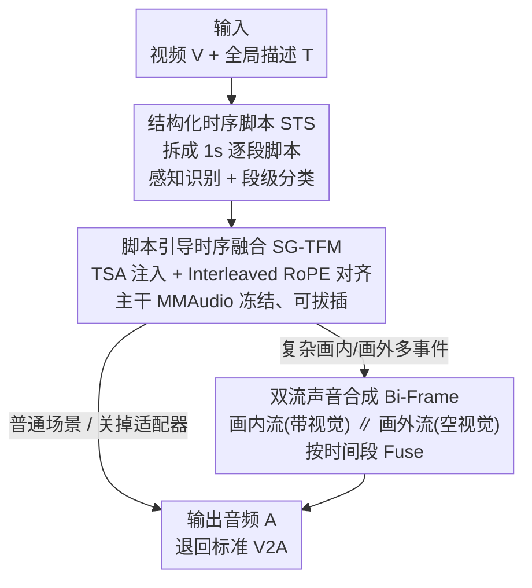

# FoleyDirector: Fine-Grained Temporal Steering for Video-to-Audio Generation via Structured Scripts

**会议**: CVPR 2026  
**论文**: [CVF Open Access](https://openaccess.thecvf.com/content/CVPR2026/html/Li_FoleyDirector_Fine-Grained_Temporal_Steering_for_Video-to-Audio_Generation_via_Structured_Scripts_CVPR_2026_paper.html)  
**代码**: 待确认  
**领域**: 视频转音频 / 多模态生成  
**关键词**: Video-to-Audio、细粒度时序控制、结构化时序脚本、DiT 适配器、画内画外声

## 一句话总结
FoleyDirector 在预训练 DiT 类 V2A 生成器（MMAudio）上挂一个可插拔适配器，用"导演脚本"式的逐秒文本（Structured Temporal Scripts）补足视觉线索、实现按时间段精确控制声音何时出现，并用双流并行渲染画内/画外声，在 DirectorBench 上把控制力 F1 从 0.2451 提到 0.4819，同时几乎不损伤原模型音质。

## 研究背景与动机
**领域现状**：现代 Video-to-Audio（V2A）方法普遍采用 DiT/flow-matching 架构（MMAudio、HunyuanVideo-Foley、ThinkSound 等），把视频、文本、Synchformer 时序特征联合建模，已经能生成高保真、与画面大体同步的音频。

**现有痛点**：这些模型把 caption 当作**粗粒度的全局语义线索**，一旦遇到三类场景就失控：①多事件场景里画内/画外声混杂，模型抓不住每个事件的语义和它们的时间关系；②视觉线索不足时——声源是小区域、被遮挡、只露一半、或干脆在画外——模型根本不知道某个声音该在**何时**出现；③用户想当"拟音导演"（指定 5\~6 秒响汽车喇叭、其余静音），现有方法没有任何可用的控制接口。

**核心矛盾**：V2A 的时序几乎完全被视觉线索牵着走，而真实视频里视觉线索常常**不完整或有歧义**。只靠画面，模型既补不上画外信息，也给不了用户细粒度的时间控制权。

**本文目标**：在不重训大模型、不牺牲原有音质的前提下，给 DiT 类 V2A 注入**额外的时序+语义线索**，让用户能精确指定"什么声音、在哪一秒出现"，并且能一键切回普通 V2A。

**切入角度**：作者借鉴图像生成里 MIGC 把复杂全局描述拆成局部控制的思路——既然用户很难手写精确时间戳、复杂事件描述也难被模型解析，那就把全局 caption **拆成逐秒的短脚本**，每段脚本只负责该时间窗内的语义，像一份"导演分镜脚本"。

**核心 idea**：用"逐秒结构化时序脚本 + 可插拔时序注意力适配器 + 画内/画外双流合成"代替"单条全局 caption"，把时间控制权交还给用户，同时冻结主干保住音质。

## 方法详解

### 整体框架
FoleyDirector 构建在预训练的 **MMAudio** 生成器之上，整条管线分三步：**(1) 提脚本**——把视频/音频按 1 秒切段，用一套标注流水线为每段生成 Structured Temporal Scripts（STS），即"第 0 秒：切菜声，中等响度 / 第 1 秒：说话，很响……"这样的逐段标签；**(2) 融脚本**——通过 Script-Guided Temporal Fusion Module（SG-TFM）这个适配器，把 STS 特征经 Temporal Script Attention（TSA）注入音频流，并用 Interleaved RoPE 做时间对齐，主干 MMAudio 完全不动；**(3) 双流渲染**——Bi-Frame Sound Synthesis 把音频潜变量复制成两路并行，一路带视觉条件渲染画内声、一路用空视觉嵌入渲染画外声，再按时间段融合，应对复杂的画内/画外多事件。三个贡献模块串成一条"脚本 → 注入 → 双流"的链，且 SG-TFM 是可拔插的——去掉它就退回标准 V2A。

### 关键设计

**1. Structured Temporal Scripts（STS）：把全局 caption 拆成逐秒"导演脚本"**

针对"全局 caption 太粗、用户又写不出精确时间戳"的痛点，作者把整段音频拆成 **1 秒一段**，每段配一条短文本脚本，描述该段内的事件、响度、音色。这相当于把"整段音频的语义控制"降维成"多个短时窗的段级全局控制"——既保留了细粒度时序信息，又不要求用户手填时间戳。配套的标注流水线分两步：①**感知与识别**，用 Qwen-Omni 7B 先对整段音频生成内容感知 caption，再据此识别出现了哪些声音类型；②**段级分类**，把"声音事件是否落在某 1 秒段内"建模成**二分类**问题，逐段用 MLLM 判断每个候选事件是否出现，若出现再补充段内描述、响度、音色。靠这套流水线作者收集了训练集 DirectorSound 和测试集 VGGSound-Director，且**只在 V2A 数据上训练、不用任何 T2A 数据**。

**2. Script-Guided Temporal Fusion Module（SG-TFM）：可拔插适配器注入脚本而不动主干**

要把 STS 融进去，作者列了三个挑战：C1 怎么抽出能表达时序的脚本特征、C2 怎么在不破坏预训练生成能力的前提下融合、C3 怎么让脚本和音频在时间轴上对齐。三招对应解决：

C1（特征）——沿用 MMAudio 的模态处理，对每段脚本用 CLIP 文本编码器再池化，得到紧凑的"时序-语义"表征 $\mathbf{F}_{tsr}^i = \mathrm{Pool}\big(\mathrm{CLIP}(\mathcal{T}_{tsr}^i)\big)$，避免 token 过多拖慢计算、复杂化对齐；每段特征沿时间复制 $T$ 次（匹配视频 token 数）后拼接成 $\mathbf{F}_{tsr} = [\mathbf{F}_{tsr}^1, \dots, \mathbf{F}_{tsr}^N]$，缺描述的段用空嵌入补位。

C2（融合）——关键设计是**新增一条独立的 Temporal Script Attention（TSA）**，主干的 Joint Attention 原封不动 $\mathbf{F}_a^{(l)}, \mathbf{F}_v^{(l)}, \mathbf{F}_t^{(l)} = \mathrm{JointAttn}(\cdot)$，只在每个 block 里把音频特征与脚本特征拼接做一次统一自注意力 $\mathbf{F}_{a'}^{(l)}, \mathbf{F}_{tsr}^{(l)} = \mathrm{TSA}(\mathbf{F}_a^{(l)}, \mathbf{F}_{tsr}^{(l-1)})$。因为是**独立的注意力层**，直接 drop 掉 SG-TFM 就能在标准 V2A 和脚本控制两种模式间自由切换——这是"几乎不损音质 + 一键切回"的来源。

C3（对齐）——借鉴 HunyuanVideo-Foley 引入 **Interleaved RoPE**：先把脚本 token 上采样到音频时间分辨率，再把音频和脚本沿时间轴**交错排列** $\mathbf{F}_{int} = \mathrm{Interleave}(\mathbf{F}_a^{(l)}, \mathrm{Up}(\mathbf{F}_{tsr}^{(l-1)}))$，对交错序列施加 RoPE 后再拆回、下采样回原长度做 TSA。交错让时间上相邻的音频/脚本特征拿到**相近的位置索引**，从而注入时保持时序连贯，比直接拼接对齐得更准。

**3. Bi-Frame Sound Synthesis：画内/画外双流并行，解开属性纠缠**

STS 给了时间控制，但遇到"人突然发出违和怪声""鸟鸣中突然一声狗吠"这类画内/画外混合甚至反事实组合时，**视觉线索会压过文本**，模型忽略与画面无关的文本属性、再次失控。作者发现一个有用现象：只在 V2A 数据（DirectorSound）上训练、不碰 T2A 数据，模型在 T2A 任务里**仍保留脚本控制能力**。据此他们把生成拆成两路并行：画内声（画面里可见的事件）用完整的视频+文本+STS 条件 $\mathbf{F}_{a,in}^{(l)} = \mathrm{Block}(\mathbf{F}_a^{(l-1)}, \mathbf{F}_v^{(l-1)}, \mathbf{F}_t^{(l-1)}, \mathbf{F}_{tsr}^{(l-1)})$；画外声（画外/叙事事件）把视觉换成**可学习的空视觉嵌入** $\mathbf{F}_v^{\varnothing}$、只靠文本和 STS 控制（Synchformer 特征保持不变）。两路在 SG-TFM 内按时间段融合 $\mathbf{F}_a^{(l)} = \mathrm{Fuse}(\mathbf{F}_{a,in}^{(l)}, \mathbf{F}_{a,out}^{(l)})$，Fuse 按时间顺序拼接画内/画外片段。这样画内声和画外声的属性被**解开分别渲染**，既保住时序连贯又显著增强可控性。

### 损失函数 / 训练策略
基于 MMAudio-medium 做**全模型训练**；学习率 2e-5、batch 16、cosine 调度，训练 120 万 iteration，8×40GB A800 约 3 天。训练时以 0.1 概率随机丢弃 STS 特征（替换成空文本）以支持 Classifier-free Guidance。推理沿用 MMAudio 默认配置，25 步、CFG scale 4.5。

## 实验关键数据

### 主实验

DirectorBench（控制力，IoU 匹配后算 P/R/F1；FD$_{VGG}$ 越低越好）：

| 方法 | 反事实 F1↑ | 时序 F1↑ | 总体 F1↑ | FD$_{VGG}$↓ |
|------|-----------|---------|---------|------------|
| MMAudio | 0.1825 | 0.2972 | 0.2378 | 8.55 |
| ThinkSound | 0.1208 | 0.2206 | 0.1707 | 7.17 |
| Video-Foley | 0.1976 | 0.2350 | 0.2163 | 8.03 |
| Hunyuan-Foley | 0.2331 | 0.2572 | 0.2451 | 7.51 |
| **Ours** | **0.5284** | **0.4354** | **0.4819** | **6.19** |

VGGSound-Director（音质/对齐，验证"加控制不掉质"）：

| 模型 | FD$_{VGG}$↓ | KL$_{PANN}$↓ | ISC$_{PANN}$↑ | IB↑ | DeSync↓ |
|------|------------|-------------|--------------|-----|---------|
| GT | 0.00 | 0.00 | 12.73 | 0.33 | 0.625 |
| MMAudio | 1.45 | 1.67 | 14.38 | 0.32 | 0.439 |
| Hunyuan-Foley | 2.39 | 2.03 | 12.74 | 0.31 | 0.543 |
| Ours (w/o STS) | 1.27 | 1.65 | 13.81 | 0.32 | 0.438 |
| **Ours** | **1.17** | **1.42** | **14.84** | **0.33** | **0.432** |

控制力总体 F1 从 0.2451（Hunyuan-Foley）提到 0.4819；同时 FD$_{VGG}$ 从 1.45 降到 1.17、KL$_{PANN}$ 从 1.67 降到 1.42、ISC 从 14.38 升到 14.84——**加脚本控制反而让音频更接近真实录音**，且去掉 STS（w/o STS）几乎与 MMAudio 持平，证明可无损切回 V2A。

### 消融实验

DirectorBench 上逐组件消融（总体 P/R/F1）：

| ID | 配置 | Precision↑ | Recall↑ | F1↑ |
|----|------|-----------|---------|-----|
| ① | Base | 0.1448 | 0.1963 | 0.1311 |
| ② | + STS | 0.4102 | 0.5432 | 0.4252 |
| ③ | + Interleaved RoPE | 0.4209 | 0.5582 | 0.4389 |
| ④ | + Bi-Frame | 0.4677 | 0.5962 | **0.4819** |
| ⑤ | w/o Bi-Frame（难子集） | 0.3928 | 0.5373 | 0.4178 |
| ⑥ | w/ Bi-Frame（难子集） | 0.4449 | 0.5701 | 0.4613 |

STS 段长权衡（仅用 1s 段训练，直接在不同段长上推理）：

| STS 段长 | 总体 F1↑ |
|---------|---------|
| 1s | 0.4819 |
| 0.5s | **0.5197** |
| 2s | 0.4646 |

### 关键发现
- **STS 是控制力的最大来源**：①→②单加 STS 就把 F1 从 0.1311 拉到 0.4252（接近三倍），Interleaved RoPE 和 Bi-Frame 是在此基础上的递进打磨（+0.014、+0.043）。
- **Bi-Frame 专治难场景**：在更难的画内/画外混合子集上，加 Bi-Frame 把 F1 从 0.4178 提到 0.4613（⑤→⑥），甚至超过整体 baseline，说明它确实缓解了视觉压制文本导致的失控。
- **段长存在三方权衡**：段越短时序细节越多、F1 越高（0.5s 达 0.5197），但需要用户写更多脚本（0.5s 段要 16 条 STS），且过短音频缺上下文会拉高标注错误率——1s 是可控性/可用性/标注精度的折中。
- **主观一致**：30 人 user study 中 FoleyDirector 在质量/可控性/对齐三项（4.27/4.50/4.53）全面超过 MMAudio（3.03/2.67/2.60）和 Hunyuan-Foley，与客观指标一致。

## 亮点与洞察
- **"可拔插适配器"范式很巧**：把控制信号塞进一条独立的 TSA 注意力层、主干完全冻结，于是"加控制"和"不加控制"只是 drop 一个模块的区别——既保住预训练音质，又天然支持无损切回标准 V2A，工程上极其友好。
- **逐秒脚本 + 段级二分类标注**把"难给的精确时间戳"转化成"好答的逐段是否出现"，这套把连续时序控制离散化成段级全局控制的思路，可迁移到视频生成、时序动作控制等需要细粒度时间指令的任务。
- **"只用 V2A 数据训练却保留 T2A 控制能力"**这个观察是 Bi-Frame 的支点——它让画外声能脱离视觉、纯靠文本+脚本渲染，从而把画内/画外属性解开，这种"利用预训练模型残留的跨任务能力"的用法很值得借鉴。
- Interleaved RoPE 的"交错再编码"让脚本 token 和音频 token 共享相近位置索引，是一个轻量但有效的跨模态时序对齐技巧。

## 局限与展望
- **依赖标注流水线质量**：STS 由 Qwen-Omni/MLLM 自动标注，段级二分类和段内描述的错误会直接传导到控制精度；过短段（0.5s）标注错误率上升，作者已承认这一权衡。
- **段长是固定超参**：1s/0.5s/2s 的取舍需要在可控性与用户负担间手动权衡，缺少自适应段长机制（⚠️ 论文未给自动选段长方案，属笔者观察）。
- **绝对控制力仍有空间**：总体 F1 0.4819 虽大幅领先，但离"精确触发"还远，复杂多事件场景的 Precision 仍偏低。
- **画外声靠空视觉嵌入**：Bi-Frame 用可学习 null 视觉嵌入区分画外声，若画内画外语义高度耦合，双流融合的时间段切分是否仍干净，论文未深入讨论。

## 相关工作与启发
- **vs MMAudio（主干）**：MMAudio 用联合注意力融合视频-文本-音频做高质量 V2A，但只能吃全局 caption、无时间控制；本文在其上挂 SG-TFM 适配器补上逐秒控制，主干冻结，控制力 F1 从 0.2378 → 0.4819 而音质不降反升。
- **vs HunyuanVideo-Foley**：同为大规模多模态 DiT、强调同步与空间感知，本文借用其 RoPE 时序对齐思想（Interleaved RoPE），但额外引入用户可写的结构化脚本，把"被动同步"变成"主动可控"。
- **vs Video-Foley**：Video-Foley 用视频提取的 RMS 信号控制生成，本质仍受视觉牵引；本文用文本脚本提供视觉之外的线索，能处理画外声/反事实声，控制力总体 F1（0.4819 vs 0.2163）大幅领先。
- **vs ThinkSound**：ThinkSound 引入链式推理做交互式音频合成，偏语义理解；本文聚焦细粒度时间轴控制，两者关注的"可控"维度不同。

## 评分
- 新颖性: ⭐⭐⭐⭐⭐ 首次在 DiT 类 V2A 上实现按时间段的细粒度控制，结构化脚本 + 可拔插适配器 + 双流合成的组合很完整。
- 实验充分度: ⭐⭐⭐⭐ 自建 DirectorBench/VGGSound-Director 双 benchmark + 逐组件消融 + 段长权衡 + user study，较充分；但 benchmark 为自建、规模偏小（100/2.2K）。
- 写作质量: ⭐⭐⭐ 思路清晰、图示到位，但正文有多处明显语法/拼写错误（疑为未精修版本）。
- 价值: ⭐⭐⭐⭐⭐ 把 V2A 从"被动配音"推向"用户当拟音导演"，控制接口对创作落地价值高，且适配器范式易复用。

<!-- RELATED:START -->

## 相关论文

- [\[ACL 2026\] SegTune: Structured and Fine-Grained Control for Song Generation](../../ACL2026/audio_speech/segtune_structured_and_fine-grained_control_for_song_generation.md)
- [\[CVPR 2026\] Hear What You See: Video-to-Audio Generation with Diffusion Transformer and Semantic-Temporal Alignment-Ranked Direct Preference Optimization](hear_what_you_see_video-to-audio_generation_with_diffusion_transformer_and_seman.md)
- [\[CVPR 2026\] EchoFoley: Event-Centric Hierarchical Control for Video Grounded Creative Sound Generation](echofoley_event-centric_hierarchical_control_for_video_grounded_creative_sound_g.md)
- [\[CVPR 2026\] Omni2Sound: Towards Unified Video-Text-to-Audio Generation](omni2sound_towards_unified_video-text-to-audio_generation.md)
- [\[CVPR 2026\] OmniSonic: Towards Universal and Holistic Audio Generation from Video and Text](omnisonic_towards_universal_and_holistic_audio_generation_from_video_and_text.md)

<!-- RELATED:END -->
