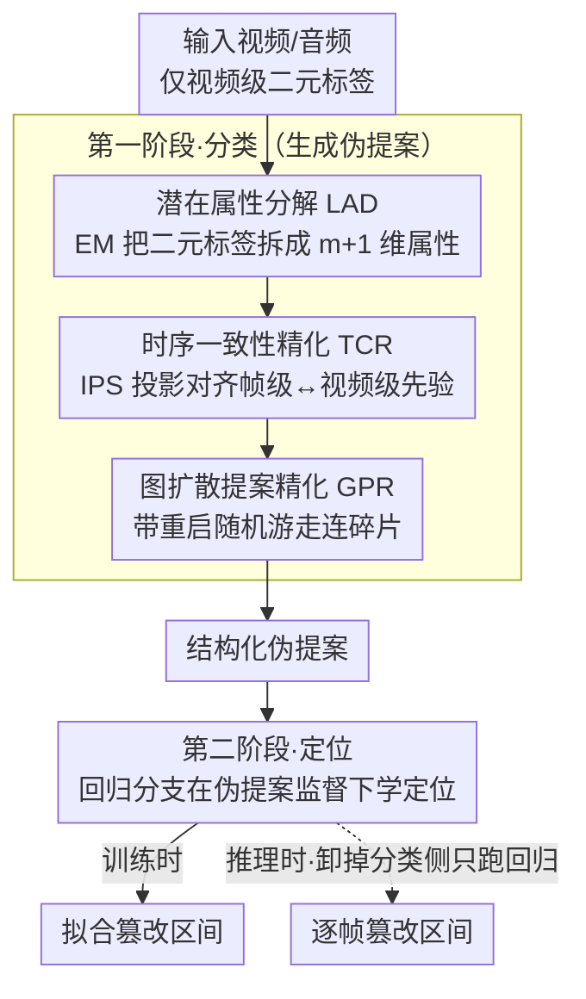

# GEM-TFL: Bridging Weak and Full Supervision for Forgery Localization

**会议**: CVPR 2026  
**arXiv**: [2603.05095](https://arxiv.org/abs/2603.05095)  
**代码**: 无  
**领域**: 语音/音频  
**关键词**: 时序伪造定位, 弱监督, EM算法, 图扩散, 时序一致性

## 一句话总结

提出 GEM-TFL，通过两阶段分类-回归框架弥合弱监督与全监督之间的差距，用 EM 分解二元标签为多维潜在属性、训练无关的时序一致性精化、图扩散提案精化三大模块，在弱监督时序伪造定位上平均 mAP 提升 4-8%。

## 研究背景与动机

时序伪造定位 (TFL) 旨在精确定位视频/音频中的篡改片段。全监督方法需要逐帧标注，成本高昂。弱监督 TFL (WS-TFL) 仅用视频级二元标签训练，但面临：

1. 训练目标（分类）与推理目标（定位）不匹配
2. 二元标签监督信息过弱
3. top-k 聚合不可微导致梯度阻断
4. 提案独立生成导致碎片化

## 方法详解

### 整体框架

GEM-TFL 想解决的核心矛盾是：弱监督只给了视频级的「真/假」二元标签，却要在推理时输出逐帧的篡改区间——训练学的是「分类」，测的却是「定位」。论文的做法是把整条流程拆成两阶段，用第一阶段把弱标签「放大」成可信的伪提案，再用第二阶段把定位能力真正学进一个回归分支里。

第一阶段是分类阶段：在多示例学习（MIL）框架下，先用潜在属性分解（LAD）把单一二元标签拆成多维伪造属性来增强监督信号，再用训练无关的时序一致性精化（TCR）把帧级预测对齐回视频级先验，最后用图扩散提案精化（GPR）把零散的候选区间连成结构化的伪提案。第二阶段是定位阶段：一个回归分支在这些伪提案的监督下学习直接预测篡改区间，推理时整套分类侧模块全部卸掉，只跑回归分支，从而彻底消除训练目标与推理目标之间的错位。

### 关键设计

**1. 潜在属性分解（LAD）：把一个二元标签拆成多维语义，补足弱监督的信息量**

弱监督最致命的痛点是监督信号太稀薄——一整段视频只告诉你「有没有被篡改」，模型很难从这一个比特里学到「哪种伪造、长什么样」。LAD 的思路是假设「伪造」本身不是单一类别，而是由 $m$ 种可学习的潜在属性混合而成，于是把标签空间扩展成 $(m+1)$ 维：类 0 代表真实，$1\dots m$ 代表 $m$ 个伪造属性。由于这些属性是隐变量、没有标注，论文用 EM 来交替估计。E 步计算后验 $P(c\mid x,y;\theta^{(t)})$：真实样本硬性归到类 0，伪造样本则按当前模型的置信度软分配到多个属性上；M 步固定这份软分配，最小化

$$\mathcal{L}_{bin} + \lambda_1 \mathcal{L}_{nll} + \lambda_2 \mathcal{L}_{ent}$$

来更新网络参数，并用 EMA 滑动更新属性先验。这样一来，原本一个比特的监督被摊到了多维属性上，模型被迫去区分不同伪造模式，弱标签里的语义被「榨」得更干净。

**2. 时序一致性精化（TCR）：用一次训练无关的投影绕开 top-k 聚合不可微**

MIL 里把帧级分数聚合成视频级预测通常靠 top-k，但 top-k 的选取是离散操作、梯度传不回去，帧级预测因此学不充分。TCR 不去硬改聚合方式，而是把「帧级属性预测要和视频级属性先验保持一致」直接写成一个带约束的最优传输式对齐问题：要求帧级属性矩阵 $S_t$ 的行/列边缘分布去逼近视频级先验 $q$，用基于 KL 散度的 Bregman 投影来求解。求解器是迭代比例缩放（IPS）——交替把当前解投影到「行约束」和「列约束」满足的空间，反复迭代直到收敛。关键在于它是训练无关（training-free）的后处理：不引入新参数、不参与反向传播，所以根本不存在 top-k 那样的梯度阻断，却能把帧级预测拉回到与全局统计自洽的状态。

**3. 图扩散提案精化（GPR）：让相邻提案互相印证，把碎片连成完整区间**

逐提案独立打分会让一段连续的篡改被切成好几个孤立小段，且早期方法常靠手工设定的「外区域」（OIC 分数那类硬编码规则）来抑噪，引入人为偏差。GPR 改成在提案之间建一张无向图 $G=(V,E)$：节点是候选提案，边权同时融合时序邻近度（DIoU）和语义相似度，于是时间上挨着、内容上像的提案被连在一起。然后让置信度在图上扩散——本质是一次带重启的随机游走：

$$\omega^{(t+1)} = \beta \mathcal{T} \omega^{(t)} + (1-\beta) \omega^{(0)}$$

其中 $\mathcal{T}$ 是图的转移矩阵，$\omega^{(0)}$ 是初始置信度，$\beta$ 控制「向邻居借信息」与「保留自身」的比例。这个迭代有闭式解

$$\omega^* = (1-\beta)(I - \beta\mathcal{T})^{-1}\omega^{(0)}$$

可一步算出收敛后的置信度。效果上，高置信提案会把信心沿图「传染」给相邻的弱提案，孤立误检则因缺乏邻居支撑被压下去，碎片化的候选最终被整合成连贯、可靠的伪提案——既替换了硬编码规则，也减少了人为先验。

### 损失函数

定位阶段的回归分支同时受视频级分类和伪提案两路监督：

$$\mathcal{L} = \mathcal{L}_{bce}(\hat{y},y) + \gamma \cdot \mathcal{L}_{main}(\hat{\mathcal{P}}, \mathcal{P})$$

其中 $\mathcal{L}_{main}$ 是回归预测 $\hat{\mathcal{P}}$ 对伪提案 $\mathcal{P}$ 的拟合项，权重 $\gamma$ 从 0.5 线性增长到 1.0——训练初期伪提案还不可靠，先少信一点，随着分类侧逐渐稳定再逐步加大定位监督的比重。

## 实验关键数据

### LAV-DF 数据集

| 方法 | 监督 | Avg. mAP |
|------|------|----------|
| UMMAFormer | 全监督 | 96.8 |
| MFMS | 全监督 | 97.3 |
| MDP | 弱监督 | 60.0 |
| WMMT | 弱监督 | 73.3 |
| **GEM-TFL** | 弱监督 | **77.6** |

### AV-Deepfake1M 数据集

| 方法 | 监督 | Avg. mAP |
|------|------|----------|
| GEM-TFL vs 上一SOTA | 弱监督 | +8% 绝对提升 |

### 关键发现

- 两阶段设计有效弥合训练-推理鸿沟
- EM 分解使二元标签的监督信号增强
- TCR 的训练无关特性避免了梯度阻断

## 亮点与洞察

1. EM 将二元标签分解为多维属性——巧妙地从弱监督中挖掘更丰富语义
2. 图扩散替代 OIC 分数的硬编码外区域设置，减少人为偏差
3. TCR 的训练无关特性——后处理级别的精化不增加训练开销

## 局限与展望

1. 与全监督方法仍有约 20% mAP 差距
2. 潜在属性数量 m 需要手动设置
3. 图扩散中的 beta 等超参需要调优

## 相关工作与启发

- 相比 PseudoFormer：增加了 EM 属性分解和图扩散，提升了伪提案质量
- EM 潜在属性分解的思路可迁移到其他弱监督任务

## 评分

- 新颖性: ⭐⭐⭐⭐ EM分解+图扩散+TCR的组合有创新
- 实验充分度: ⭐⭐⭐⭐ 两个数据集充分对比
- 写作质量: ⭐⭐⭐⭐ 框架图清晰
- 价值: ⭐⭐⭐⭐ 弥合弱/全监督差距的方向重要

<!-- RELATED:START -->

## 相关论文

- [\[AAAI 2026\] DeformTrace: A Deformable State Space Model with Relay Tokens for Temporal Forgery Localization](../../AAAI2026/audio_speech/deformtrace_a_deformable_state_space_model_with_relay_tokens_for_temporal_forger.md)
- [\[CVPR 2026\] Unlocking Strong Supervision: A Data-Centric Study of General-Purpose Audio Pre-Training Methods](unlocking_strong_supervision_a_data-centric_study_of_general-purpose_audio_pre-t.md)
- [\[CVPR 2026\] How Far Can We Go With Synthetic Data for Audio-Visual Sound Source Localization?](how_far_can_we_go_with_synthetic_data_for_audio-visual_sound_source_localization.md)
- [\[AAAI 2026\] Listening Between the Frames: Bridging Temporal Gaps in Large Audio-Language Models](../../AAAI2026/audio_speech/listening_between_the_frames_bridging_temporal_gaps_in_large_audio-language_mode.md)
- [\[ICML 2026\] MoshiRAG: Asynchronous Knowledge Retrieval for Full-Duplex Speech Language Models](../../ICML2026/audio_speech/moshirag_asynchronous_knowledge_retrieval_for_full-duplex_speech_language_models.md)

<!-- RELATED:END -->
