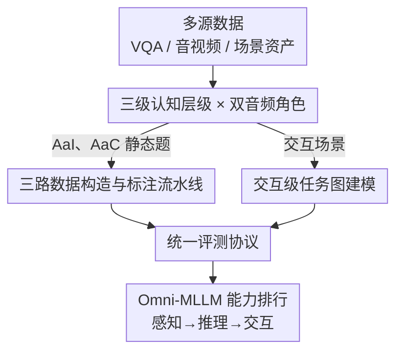

# HAVE-Bench: Hierarchical Audio-Visual Evaluation from Perception to Interaction

**会议**: CVPR 2026  
**论文**: [CVF Open Access](https://openaccess.thecvf.com/content/CVPR2026/html/Zhong_HAVE-Bench_Hierarchical_Audio-Visual_Evaluation_from_Perception_to_Interaction_CVPR_2026_paper.html)  
**代码**: 未公开（论文称将释出统一评测工具包，正文未给链接 ⚠️ 以原文为准）  
**领域**: 多模态VLM / 音频-视觉评测基准  
**关键词**: 音视频基准, 认知层级, 语音指令, 多轮交互, Omni-MLLM  

## 一句话总结
HAVE-Bench 用「感知—推理—交互」三级认知层级 × 「音频作指令(AaI)/音频作上下文(AaC)」双角色搭出一个 2451 题的音视频评测基准，首次把多轮、依赖记忆的交互任务建模成任务图来考 Omni-MLLM，结果显示开源/闭源模型在推理和交互层级断崖式下滑，且语音问图远不如文本问图。

## 研究背景与动机
**领域现状**：MLLM 正从「视觉-语言」扩展到「视觉-语言-音频」三模态（Qwen2.5-Omni、Gemini2.5-Flash、MiniCPM-o 等 Omni-LLM），并开始走向多轮对话、长上下文记忆、交互式多步推理这些更真实的设定。

**现有痛点**：音视频基准跟不上模型的进化。AVQA、MUSIC-AVQA 局限在自然环境声/音乐；OmniBench、AV-Odyssey、AVHBench 等各自只盯某一个侧面（音频属性、对抗鲁棒、跨模态幻觉），缺乏对「依赖记忆的多轮交互」的支持。

**核心矛盾**：作者把现有基准的缺口归纳成三个瓶颈——(i) **没有交互级评测**：音频大多只是被动背景，而不是驱动视觉推理/动作的指令，高价值的「多轮、依赖记忆」能力几乎没被测过；(ii) **没有层级化评测**：任务零散，缺少从低阶感知 → 高阶推理 → 动作的结构化阶梯，无法考查模型在递增认知复杂度下整合多模态线索的能力；(iii) **声学/上下文复杂度不足**：大多用短而简单的音频片段，反映不了混合声源、长篇语音、事件重叠的真实场景。

**本文目标**：造一个统一基准，同时满足「层级化 + 面向交互 + 高质量且声学丰富的音频」，覆盖从感知、推理一路到目标导向、依赖记忆的交互这条完整的认知连续谱。

**核心 idea**：把评测沿两条正交轴展开——**认知层级**（感知/推理/交互）和**音频角色**（指令/上下文），并首创把交互任务表示成**任务图**，用固定 LLM 裁判判定每一步状态转移是否成功。

## 方法详解

### 整体框架
HAVE-Bench 本质是一套「分类体系 + 数据流水线 + 评测协议」。它沿两条正交轴组织任务：(1) 三级认知层级——感知(Perception, 1172 题)、推理(Reasoning, 1016 题)、交互(Interaction, 263 题)，共 2451 题；(2) 音频角色——音频作指令(Audio-as-Instruction, AaI)，语音本身就是要在图像上执行的查询；音频作上下文(Audio-as-Context, AaC)，音频是环境声/人声/音乐等背景信息，必须和视觉融合才能回答。两轴交叉出 11 个子任务（如 Instructed Recognition、Text-Rich QA、Cross-modal Matching、Math、Discourse、Navigation、Puzzle、Music Reproduction 等）。

数据按来源走三条定制流水线（AaI / AaC / 交互），分别经过预处理、标注、人工核验落库；交互任务额外被建模成多轮任务图。最后所有任务进入一个统一评测框架，对选择题、开放题、交互任务分别用准确率/LLM 评判/路径判定打分，产出模型在三级层级上的能力排行。

### 关键设计

**1. 三级认知层级 × 双音频角色：把零散任务织成结构化阶梯**

针对痛点「评测零散、缺层级」，作者用两条正交轴定义整个 taxonomy。**认知层级**沿难度递增：感知任务是单轮单跳，配短的单源音频，测细粒度对齐与识别；推理任务仍单轮，但要求时序/因果/知识的多跳整合，语音更长、常为多源或序列结构；交互任务进一步扩展到多轮、目标导向，但刻意让「每一步」的视觉/听觉理解难度保持在和低层级相当，从而把考点隔离到跨轮的规划与记忆上。**音频角色**则区分音频的功能：AaI 中输入是 $(I, A_{instr}) \rightarrow y$，语音是显式指令；AaC 中输入是 $(I, A_{ctx}, q) \rightarrow y$，音频是背景，必须与图像联合才能作答。这套双轴设计让「同一个基础技能在不同认知复杂度/不同音频角色下的表现」可以被系统拆解对比——这是单维度基准做不到的。

**2. 交互级任务图建模：把多轮交互变成可自动判定的状态机**

这是本文最具开创性的部分，针对「没有交互级评测」。每个交互任务被建模成多轮任务图 $G = (V, E)$：节点 $v_i$ 是一个离散状态，带观测 $o_i = (I_i, A_i)$（视觉 + 音频，音频可作指令或上下文）；每条边是三元组 $e_{ij} = (v_i, v_j, c_{ij})$，其中 $c_{ij}$ 是一句自然语言成功判据，描述「何时该接受从 $v_i$ 到 $v_j$ 的转移」。给定当前观测 $o_i$ 和模型的自由文本回应 $\hat{a}_t$，固定 LLM 裁判 $J_\theta(c_{ij}, \hat{a}_t, o_i) = 1$ 时转移有效；模型从起点 $v_{start}$ 出发，只有当被判定通过的转移在图上连成一条到达目标态 $v_{goal}$ 的路径，整个 instance 才算成功。作者实例化三个场景：**音频导航**（地图→街景视点，语音给寻路指令，每步输出转向/前进）、**规则解谜**（Menu→Learn→Solve 的 UI 状态，语音播规则与提示，考是否先学规则再答题）、**音乐复现**（用 melody/rhythm/instrumentation/tempo/loudness 参数元组刻画状态，对照目标音频选参数直到精确匹配）。这种图建模的好处是：把「长程、需记忆」的交互拆成离散可观测状态，每步判据是局部、可解释的，从而把整条多轮轨迹变成可自动、可复现地判定成败的对象。

**3. 三路数据构造与标注流水线：保证语音质量与「双模态依赖」**

针对痛点「声学/上下文复杂度不足、易被单模态走捷径」，三类数据各走定制流程（图 3）。**AaI（约 1.4k）**：从 TextVQA、ChartQA、数学/学科 VQA 等图文数据集取样转成口语指令——先剔除口播时长超约 1 分钟、依赖表格/代码/深层嵌套的题，数学题滤掉密集 LaTeX/生僻符号，再用 GPT-4o 把题重写成流畅、口语友好且语义忠实的 prompt；然后按 GPT-4o 在准确性/逻辑/清晰度/相关性/深度五维(0–10)打分做质量下采样以均衡各子任务；最后用 Azure TTS 合成，并随机抽 400 题由 8 名播音员（4 男 4 女）录音棚朗读、全部人工核验。**AaC**：融合 AudioSet、FAVDBench、Music-AVQA、Epic-Kitchen 等多个数据集，用 MLLM 辅助配对——每视频均匀抽 5 关键帧配对齐音频段，GPT-4o 生成音频/帧字幕并标记低 SNR 片段，再算音图字幕语义对齐丢弃弱对（过滤后约 9% 候选留存）；Cross-modal Matching 走全人工标注，按 AudioSet 类目挑正样本 + 同子类干扰项凑四选一（最终仅约 0.4% 音图对留作正例）。一条贯穿 AaC 的核心规则是**双模态依赖**：每题及选项必须同时需要音频和图像，任何能靠单模态或选项措辞猜出的题都被丢弃（如 Audio-grounded VQA 只保留图中含多个可能声源的样本）。**交互**：先在 blueprint 层定义合法状态类型与转移，再由标注者实例化具体图 $G$、收集资产 $\{I_i, A_i\}$、为每条边手写自然语言判据 $c_{ij}$。

**4. 统一评测协议：三类任务一套可复现的判分口径**

针对「不同基准口径不一、难以公平比较」，HAVE-Bench 用一个统一框架覆盖三类题型。选择题直接算准确率，模型若输出自由文本则用 LLM matcher（仿 MMMU）对到语义最一致的选项；开放题（推理、Audio-grounded QA）由 LLM 评判器比对参考答案，兼顾事实与语义等价，每个子任务配定制 prompt 与人工挑选的 in-context 示例以保证跨域口径一致；交互题则复用设计 2 的 LLM 裁判，逐步对照边判据验证，整条 instance 当且仅当判定转移连成到目标态的合法路径时才计成功。配套以 VLMEvalKit 为底的统一推理协议、所有模型同 prompt、结果取三次独立运行平均，保证开源/闭源模型的可复现公平对比。

## 实验关键数据

### 主实验：三级层级全子任务排行
评测覆盖开源 Omni-LLM（Ola、VITA-1.5、Megrez-3B-Omni、MiniCPM-o、Ming-Lite-Omni、Qwen2.5-Omni）与商用 Gemini2.5-Flash。下表为各层级总分（节选自 Table 1）：

| 层级 | Gemini2.5-Flash | Qwen2.5-Omni | Ming-Lite-Omni | MiniCPM-o | Ola | VITA-1.5 | Megrez-3B |
|------|------|------|------|------|------|------|------|
| L1 感知 | 68.9 | 68.4 | 61.1 | 57.6 | 62.0 | 54.2 | 51.0 |
| L2 推理 | 60.8 | 52.6 | 46.9 | 44.7 | 45.3 | 41.7 | 31.2 |
| L3 交互 | **30.4** | 18.0 | 11.6 | 13.8 | –* | 7.1 | 3.8 |

\* Ola 官方实现无法跑「多轮图+音频」对话，故交互级缺测。

- 最强闭源是 Gemini2.5-Flash，最强开源是 Qwen2.5-Omni。
- **开闭差距随层级上升而拉大**：感知层 Gemini 仅领先 Qwen 约 +0.5，推理层扩到约 +8.2，交互层达约 +12.4。
- 所有模型从感知→推理→交互一路下滑，交互层**无一超过 40%**，最强的 Gemini 也只有 30.4。

### 细分发现：感知小差距、交互大塌陷
- **感知层**模型差异小，Qwen2.5-Omni 在 Instructed Recognition、Cross-modal Matching 上甚至超过 Gemini；但 Audio-grounded VQA（在图中定位并描述声源）开源模型明显吃力。
- **推理层** AaI 上 Multi-disciplinary Reasoning 差距最大（Gemini 71.0 vs Qwen 57.8）；AaC 上 Discourse Reasoning（长篇语音+幻灯片/图表）差距明显。
- **交互层**揭示根因不在单步能力而在跨轮：每步只需基础视觉/听觉技能（路景理解+OCR、简单旋律/乐器属性），Gemini、Qwen 在感知/推理层已能胜任，但多轮中频繁「记不住」目标地图或参考音乐；解谜任务进一步暴露规划缺陷——除 Gemini 外多数模型不遵守「Menu→Learn→Solve」流程，常跳过学习阶段。

### 文本替换消融：语音问图 vs 文本问图（Table 2，节选）
把 AaI 题的语音换成等价文本（TI）对比原始语音（SI），并加 ASR+模型 作内容等价对照：

| 模型 | 模式 | Rec. | Text-Rich | Math | M-Disc. | Avg. |
|------|------|------|------|------|------|------|
| Gemini2.5-Flash | SI | 78.5 | 89.5 | 46.0 | 71.0 | 71.3 |
| Gemini2.5-Flash | TI | 80.7 | 88.8 | 49.0 | 74.1 | **73.2** |
| Ming-Lite-Omni | SI | 81.3 | 86.0 | 45.4 | 50.0 | 65.7 |
| Ming-Lite-Omni | TI | 86.7 | 88.6 | 49.0 | 61.0 | **71.3** |
| Megrez-3B-Omni | SI | 67.0 | 68.1 | 22.0 | 34.0 | 47.8 |
| Megrez-3B-Omni | TI | 70.7 | 77.3 | 37.7 | 51.5 | **59.3** |
| ASR+GPT-4.1 | SI→文本 | 83.3 | 89.5 | 48.6 | 74.4 | 74.0 |

- **TI 普遍优于 SI**，且差距在推理类（Math、M-Disc.）上最大；连最简单的 Instructed Recognition 上 Ming(+5.4)、Ola(+6.0) 也有差距。
- **ASR+TI 几乎等于 TI**（Gemini 72.9 vs 73.2），说明 TTS/朗读忠实保留了题意——因此 SI 落后并非内容损失，而是**模型没把文本-图像的推理能力迁移到语音-图像联合推理**。

## 亮点与洞察
- **把多轮交互形式化成任务图 + 固定 LLM 裁判**，是这篇最巧的地方：它让「长程、依赖记忆」这种本来很难标注/判分的能力，变成一条条局部判据连成的可自动判定路径，可复现地隔离出「跨轮记忆/规划」这个考点。
- **「每步易、整轮难」的对照实验**很有说服力：通过保持单步难度与低层级相当，作者干净地把交互失败归因到跨轮记忆而非单步多模态能力——这是单纯报一个低分说不清的。
- **SI vs TI + ASR 对照**这套设计可迁移：任何想验证「某模态是真瓶颈还是内容损失」的工作，都可以借这个「换模态 + 转写回填做内容等价控制」的三段对照。
- **「双模态依赖」过滤规则**（任何能单模态走捷径的题都丢）是音视频基准防作弊的实用 trick。

## 局限性 / 可改进方向
- **重度依赖 LLM 裁判**：选择题 matcher、开放题评判、交互每步判定都靠 GPT-4o 类模型，裁判自身的偏差/不稳定会传导到结论（虽取三次平均，但未见对裁判一致性的系统验证 ⚠️）。
- **交互样本偏少**：交互级仅 263 题、三个场景，相对感知/推理的千题量级偏小，结论的统计稳健性有限。
- **数据可用性受限**：导航图像因许可只释出 panorama ID 与坐标、不发图本身，复现门槛较高。
- **闭源覆盖窄**：商用侧只测了 Gemini 系列（作者称受限于三模态专有模型稀少），横向闭源对比不充分。
- 可改进：扩大交互场景与样本量、引入多裁判投票/人工抽检校准、补充对长音频处理的细粒度诊断。

## 相关工作与启发
- **vs AVQA / MUSIC-AVQA**：它们把音频整进视频但局限于自然环境声/音乐场景；HAVE-Bench 跨真实场景且引入语音指令与交互层，覆盖面更广、认知更深。
- **vs OmniBench / AV-Odyssey / AVHBench**：这些各自盯「协同推理 / 感知 gap / 跨模态幻觉」单一侧面；HAVE-Bench 用统一的「层级×音频角色」taxonomy 把它们纳入一个连续谱，并补上前者都缺的交互级评测。
- **vs AudioMarathon / MMAU**：长上下文/纯音频类基准缺视觉接地；HAVE-Bench 强调音视觉联合且要求双模态依赖。
- **启发**：当模型能力从单轮静态走向多轮交互时，基准也要从「静态题库」升级为「带状态、可判定转移的任务图」，这套范式或可迁移到具身/GUI agent 的评测。

## 评分
- 新颖性: ⭐⭐⭐⭐⭐ 首个把「感知-推理-交互」三级层级与交互级任务图建模引入音视频评测
- 实验充分度: ⭐⭐⭐⭐ 7 个 Omni-MLLM × 11 子任务 + SI/TI/ASR 对照，但交互样本与闭源覆盖偏少
- 写作质量: ⭐⭐⭐⭐⭐ 瓶颈分析与归因（跨轮记忆 vs 单步能力）清晰有力
- 价值: ⭐⭐⭐⭐⭐ 精准指出 Omni-MLLM 在语音推理与多轮交互上的硬伤，给社区指了明确方向

<!-- RELATED:START -->

## 相关论文

- [\[ACL 2026\] Full-Duplex-Bench-v2: A Multi-Turn Evaluation Framework for Duplex Dialogue Systems with an Automated Examiner](../../ACL2026/audio_speech/full-duplex-bench-v2_a_multi-turn_evaluation_framework_for_duplex_dialogue_syste.md)
- [\[CVPR 2026\] EgoAVU: Egocentric Audio-Visual Understanding](egoavu_egocentric_audio-visual_understanding.md)
- [\[ICLR 2026\] Query-Guided Spatial-Temporal-Frequency Interaction for Music Audio-Visual Question Answering](../../ICLR2026/audio_speech/query-guided_spatial-temporal-frequency_interaction_for_music_audio-visual_quest.md)
- [\[CVPR 2026\] Pushing the Frontier of Audiovisual Perception with Large-Scale Multimodal Correspondence Learning](pushing_the_frontier_of_audiovisual_perception_with_large-scale_multimodal_corre.md)
- [\[CVPR 2026\] EchoFoley: Event-Centric Hierarchical Control for Video Grounded Creative Sound Generation](echofoley_event-centric_hierarchical_control_for_video_grounded_creative_sound_g.md)

<!-- RELATED:END -->
