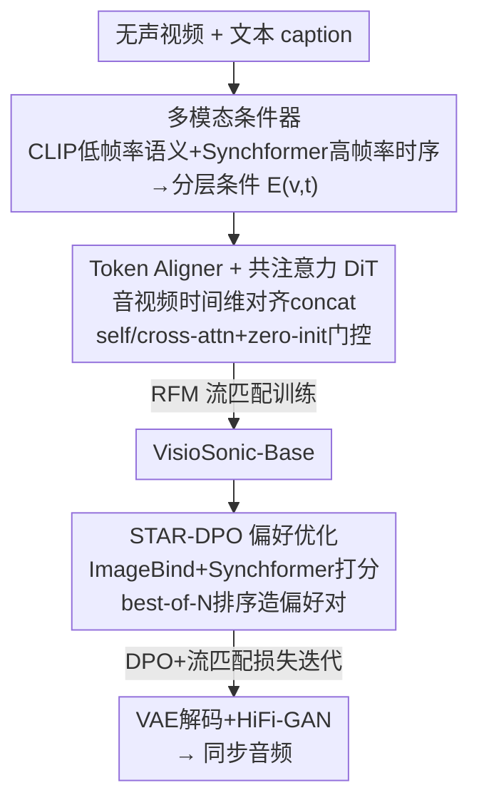

# Hear What You See: Video-to-Audio Generation with Diffusion Transformer and Semantic-Temporal Alignment-Ranked Direct Preference Optimization

**会议**: CVPR 2026  
**论文**: [CVF Open Access](https://openaccess.thecvf.com/content/CVPR2026/html/Wang_Hear_What_You_See_Video-to-Audio_Generation_with_Diffusion_Transformer_and_CVPR_2026_paper.html)  
**代码**: [项目页 VisioSonic](https://kaiw7.github.io/VisioSonic/)  
**领域**: 视频到音频生成 / 扩散模型 / 多模态对齐  
**关键词**: 视频到音频生成, 扩散 Transformer, 整流流匹配, 偏好优化(DPO), 时序对齐  

## 一句话总结
VisioSonic 用「CLIP 低帧率语义 + Synchformer 高帧率时序」双路条件喂给一个 video-text-audio 共注意力扩散 Transformer 做整流流匹配生成无声视频的配音，再用全自动、无需人工标注的 STAR-DPO 偏好优化把语义和时序对齐进一步拉满——以 151M 可训练参数（同类最少）拿到 VGGSound 上最强的分布匹配与音视频同步。

## 研究背景与动机
**领域现状**：视频到音频（V2A）生成要给一段无声视频合成既「语义对得上」（狗出现就该有狗叫）又「时间对得齐」（鼓槌落下那一帧就该有鼓声）的声音，主流有两条路：一是直接在大规模音视频对上从头训扩散模型，二是把视频特征转成文本/语言 embedding 去 condition 一个预训练的文生音（T2A）模型。

**现有痛点**：第一条路常用的 VGGSound 等数据集混入了非画面内声音（背景音乐）、音视画同步本来就弱，逼得后来的工作（如 MMAudio）混入大量高质量文音数据来补，代价是算力暴涨、参数量上 G。第二条路把视频「翻译成文字」再去驱动 T2A，天然有语义损失和描述不准，很难做到精细同步。

**核心矛盾**：细粒度时序对应难抓。CLIP 这类语义编码器跑的是低帧率（4~8 fps），足够认出「这是狗」却抓不住「叫声该卡在哪一帧」；而要的恰恰是逐帧级的视听同步。语义信号和时序信号被同一个低帧率视觉塔糊在一起，是同步差的根因。同时，监督训练（流匹配回归 ground-truth 速度场）只学「平均像不像」，并不直接优化「对不对齐」这个人类真正在意的目标。

**本文目标**：(1) 在不堆数据、不堆参数的前提下，同时拿到强语义对齐和强时序同步；(2) 找到一种超越监督训练、又不依赖人工偏好标注的方式继续把对齐质量往上推。

**切入角度**：作者的两个观察——其一，音频和视频在时间轴上本就同步，应当让二者的 latent 在时间维显式对齐、共享一套注意力，而不是像 MMDiT 那样把三模态平铺做 shared self-attention、忽视音视频的内在时序相关；其二，ImageBind / Synchformer 这类预训练的音视频联合 embedding 模型本身就是现成的「对齐打分器」，可以拿来当 reward model 自动造偏好数据。

**核心 idea**：用「双帧率多模态条件 + 共注意力 DiT」把对齐做进生成主干，再用「以语义+时序联合打分排序」的自动 DPO（STAR-DPO）把对齐做到监督之外。

## 方法详解

### 整体框架
VisioSonic 输入一段无声视频 + 一句文本 caption，输出与画面语义一致、时间同步的音频波形。整条管线分两个阶段：**先训一个流匹配扩散基座 VisioSonic-Base**，**再用 STAR-DPO 偏好微调**。

生成走在音频的压缩 latent 空间：波形先经 STFT 变成 mel 频谱图 $A \in \mathbb{R}^{T\times F}$，再由预训练 VAE 编码成 latent $z_a \in \mathbb{R}^{N\times D}$；推理时预测的 latent 解码回频谱、再过 HiFi-GAN vocoder 还原波形。扩散建模用**整流流匹配（Rectified Flow Matching, RFM）**：在噪声 $a_0\sim\mathcal{N}(0,I)$ 与真实音频 $a_1$ 之间走直线 $a_t = t a_1 + (1-t)a_0$，模型学预测速度场 $v_t = a_1 - a_0$，目标为

$$\mathcal{L}_{\text{RFM}} = \mathbb{E}_{t,\,p_0(a_0),\,p_1(a_1)}\big\| v_\theta(t, a_t, C) - (a_1 - a_0) \big\|_2^2$$

其中条件 $C$ 包含视频和文本。推理时从噪声出发用 ODE solver（Euler，25 步）积分学到的速度场得到音频。

主干由两块构成：**多模态条件器**把视频+文本编成语义与时序两路引导；**共注意力 DiT**（16 个 block）在去噪过程中把对齐后的音视频 token 与文本 token 高效融合。第二阶段 STAR-DPO 用 ImageBind+Synchformer 当 reward，给基座生成的多个候选音频排序、造偏好对，再 DPO 微调。

### 关键设计

**1. 多模态条件器：用双帧率把「语义」和「时序」拆开各管各的**

针对低帧率视觉塔抓不住逐帧同步的痛点，条件器同时抽两路互补表示。**低帧率语义路**：CLIP 视觉塔（8 fps）把帧 $V\in\mathbb{R}^{T\times 3\times H\times W}$ 编成 $E_v\in\mathbb{R}^{T\times D}$，并与 CLIP 文本塔的 $E_t$ 对齐，保证「认得出画面里是什么、且和文字一致」。**高帧率时序路**：Synchformer 视觉编码器（24 fps）抽 $E_v^{\text{hfr}}\in\mathbb{R}^{N\times D}$，其帧数 $N$ 与音频 latent 对齐，专门提供逐帧级的运动-声音同步线索。最后把全局视频 embedding $E_v^g$ 与全局文本 $E_t^g$ 求和过 MLP 得语义条件 $E_{v,t}^g$，再叠加时间步 embedding $E_{\text{time}}$ 与高帧率视觉 $E_v^{\text{hfr}}$，得到分层条件 $E_{v,t}$。把语义信号和时序信号分别用不同帧率的编码器供给，正是它能在不堆数据的情况下同时做好两种对齐的关键——语义靠 CLIP，同步靠 Synchformer，各取所长。

**2. Token Aligner + 共注意力 DiT：让音视频先在时间轴对齐，再共享一套注意力**

针对 MMDiT 那种「三模态平铺、shared self-attention」忽视音视频内在时序相关的问题，作者主张：视频和音频应当时间对齐，二者再共同与文本做语义对齐。由于视频帧率远低于音频 mel 谱时间分辨率（$N\gg T$），**Token Aligner** 先把视频 embedding 沿时间轴插值上采样成与噪声音频 latent 等长的 $E_v'\in\mathbb{R}^{N\times D}$，再用两个投影层把音、视 latent 各降到一半通道、沿通道维 concat 成对齐的音视频 token——这一步简单却让模型直接吃到音视频的内在同步。**共注意力 block** 里，对齐后的音视频 token 投成 $I^{av}_q,I^{av}_k,I^{av}_v$，文本投成 $I^t_v,I^t_k$；$I^{av}_q,I^{av}_k$ 经 LN + 2D RoPE 后先走 **self-attention** 做音视频内部交互，再用音视频 query 与文本 key/value 走 **cross-attention** 把文本语义注入，且 cross-attention 输出过一个 **zero-init 门控**动态控制文本注入强度。条件 $E_{v,t}$ 通过 scale/gate 调制 block 的输入输出，全程用 RMSNorm + 残差稳训。比起 MMDiT 把文本-视频-音频一锅炖，这种「音视频先对齐、文本后注入」的结构既提了同步又省了算力。

**3. STAR-DPO：用现成对齐模型当裁判，全自动造偏好数据做无标注 DPO**

针对监督流匹配只学「像不像」、不直接优化「对不对齐」，且人工标注偏好昂贵的问题，STAR-DPO 是首个把整流流的 DPO 引到 V2A、且全自动的偏好框架。它拿两个预训练模型当 **reward model**：ImageBind 算音频-视频 embedding 余弦相似度衡量**语义对齐**，Synchformer 沿时间方向算生成音频与高帧率视频的相似度衡量**时序对齐**，两者加权和成最终 reward。**造数据**：从未见过的验证集采视频-文本对，让基座 $\theta_0$ 每个 prompt 生成 $N$ 个（实现里 $N{=}5$）候选音频，按联合分排序，最高分作 winner $a_i^w$、最低分作 loser $a_i^l$，组成偏好集 $D=\{(a_i^w, a_i^l, v_i, y_i)\}$。**优化目标**在标准 DPO 上加流匹配损失 $\mathcal{L}_{\text{RFM}}$ 防过优化：

$$\mathcal{L}_{\text{final}} = -\mathbb{E}\,\log\sigma\!\Big(\!-\beta\big[(L_w - L_w^{\text{ref}}) - (L_l - L_l^{\text{ref}})\big]\Big) + \mathcal{L}_{\text{RFM}}$$

其中 $L_w,L_l$ 是 winner/loser 在当前模型上的流匹配回归误差，$L_w^{\text{ref}},L_l^{\text{ref}}$ 是参考模型上的对应误差，$\sigma$ 为 sigmoid、$\beta$ 控偏好强度。整个流程可迭代重复，用最近一轮模型造新数据继续 refine。它的巧处在于：把「对齐」这个本来要人来判的主观目标，外包给了两个本就擅长判对齐的预训练模型，零人工标注就能把同步指标继续往上抬。

### 损失函数 / 训练策略
基座用 AdamW 训 300k 步，lr 1e-4 线性 warmup 后分段衰减到 1e-6；训练时对视觉 token / 文本各 10% 概率 mask 做跨模态 classifier-free guidance（视觉换可学 embedding、文本换空串），推理 guidance scale 4.5。STAR-DPO 阶段微调 5k 步，lr warmup 到 2e-6 后恒定，迭代多轮取最好。音视频特征预抽缓存以省训练开销。

## 实验关键数据

### 主实验
VGGSound 测试集上对比 SOTA（↓越低越好，IS/IB↑越高越好；DeSync 为 Synchformer 预测的同步偏移秒数）：

| 方法 | 参数量 | FD_PaSST↓ | KL_PaSST↓ | IS↑ | IB-score↑ | DeSync↓ |
|------|--------|-----------|-----------|-----|-----------|---------|
| MMAudio-S (44.1kHz) | 157M | 65.25 | 1.44 | 18.02 | 32.27 | 0.444 |
| MMAudio-L (44.1kHz) | 1.03B | 60.60 | 1.40 | 17.40 | 33.22 | 0.442 |
| HunyuanVideoFoley | - | 145.22 | - | 16.14 | **36.0** | 0.53 |
| **VisioSonic Base** | **151M** | 58.27 | 1.30 | 18.12 | 32.8 | 0.45 |
| **VisioSonic w/ STAR-DPO** | **151M** | **55.48** | **1.29** | **18.41** | 33.1 | **0.41** |

VisioSonic 以同类最少的 151M 参数拿下 FD_PaSST / FD_PANNs / KL_PANNs / KL_PaSST 等分布匹配指标最佳；MMAudio-L 与 HunyuanVideoFoley 在个别指标更好但靠的是额外训练数据和大得多的模型（1B 级）。STAR-DPO 在所有指标上进一步提升基座，验证偏好优化有效。

零样本跨域（MovieGen-Audio / Kling-Audio Bench，仅在 VGGSound 训）：

| 方法 | MovieGen IB↑ | MovieGen DeSync↓ | Kling IB↑ | Kling DeSync↓ |
|------|--------------|------------------|-----------|----------------|
| MMAudio | 0.27 | 0.80 | 0.30 | 0.56 |
| HunyuanVideoFoley | **0.35** | 0.74 | **0.38** | 0.54 |
| **Ours** | 0.27 | **0.72** | 0.32 | **0.50** |

仅用 VGGSound 训练即在两个域外基准拿到最佳 DeSync，时序泛化强；IB 略逊于用 IB-过滤数据精选过的 HunyuanVideoFoley。

### 消融实验

模态融合方式（VGGSound 测试集，本文方案为 T+AV, Co-attn）：

| 配置 | FD_PaSST↓ | IS↑ | IB↑ | DeSync↓ | 说明 |
|------|-----------|-----|-----|---------|------|
| T+V+A, Co-attn | 59.71 | 15.70 | 31.0 | 0.47 | 三模态完全分离，语义对齐最弱 |
| TV+A, Co-attn | 59.74 | 15.74 | 32.1 | 0.48 | 文本-视频先合，时序对齐最差 |
| T+AV, Flux-like | 66.76 | 16.04 | 31.6 | 0.46 | 模态交互弱于共注意力 |
| Label+AV, Co-attn | 62.72 | 16.48 | 32.6 | 0.48 | 用类别标签替代描述 caption，明显掉点 |
| T+AV, MMDiT | 60.14 | 18.10 | 32.7 | 0.47 | 换 MM-DiT block，分布相似度更差 |
| **T+AV, Co-attn (本文)** | **58.27** | **18.12** | **32.8** | **0.45** | 完整模型 |

reward 模型 / DPO 迭代 消融：

| 配置 | FD_PaSST↓ | IB↑ | DeSync↓ | 说明 |
|------|-----------|-----|---------|------|
| CAVP（仅语义） | 57.75 | 32.7 | 0.43 | 语义 reward 弱于 IB-AV |
| AV-Align（仅时序） | 55.99 | 31.7 | 0.44 | 时序 reward 弱于 DeSync |
| IB-AV + DeSync（本文） | **55.48** | **33.1** | **0.41** | 语义+时序联合 reward 最佳 |
| DPO Iter 2（本文采用） | 55.48 | 33.1 | 0.41 | 第 2 轮最优，之后略降（过优化） |

排序管线消融进一步表明：联合语义-时序排序（Joint DPO，FD_PaSST 56.09）明显优于「DeSync→IB-AV」级联（68.57）和「DeSync→新数据+IB」级联（84.28）。

### 关键发现
- **音视频先对齐再注入文本是同步的关键**：T+V+A（三模态分离）语义最弱、TV+A（文本视频先合）时序最差，说明把音视频内在同步显式建模、文本后注入的结构选对了。
- **描述性 caption 远胜类别标签**：Label+AV 全面掉点，丰富文本提供了更强的上下文与同步线索。
- **语义+时序双 reward 必须联合**：单独 IB-AV 或单独 DeSync 都不如二者加权；且联合一次性排序优于级联式 re-rank。
- **STAR-DPO 第 2 轮见顶**：迭代到第 3 轮 FD/IB 反而回落，提示偏好优化几轮内有效、再迭代会过优化。

## 亮点与洞察
- **「语义归 CLIP、同步归 Synchformer」的双帧率分工**：用两套不同帧率的视觉编码器分别供给语义与时序条件，是它能以 151M 参数打过 1B 级模型的根本——不靠堆数据，靠把对齐的两个子目标解耦到合适的编码器上。
- **把对齐目标外包给现成裁判模型**：STAR-DPO 用 ImageBind+Synchformer 当 reward 自动造偏好对，零人工标注就把「对齐」这个主观目标变成可优化的训练信号，这套「拿预训练对齐模型当 best-of-N 选择器再 DPO」的范式可直接迁到任何有现成评测器的生成任务（文生图/视频的美学、文生音的 CLAP 对齐等）。
- **DPO 加流匹配损失防过优化**：在偏好目标里保留 $\mathcal{L}_{\text{RFM}}$ 锚住生成质量，是把 DPO 稳定引入扩散/流匹配的实用 trick。

## 局限与展望
- **训练数据单一**：基座只在 VGGSound 上训，论文也坦承 IB-score 落后于用 IB-过滤数据精选过的 HunyuanVideoFoley——语义对齐的天花板部分被训练数据质量卡住，混入更高质量精选数据可能进一步提升。
- **DeSync 略逊于 MMAudio/Kling**（0.45 vs 0.44/0.43）：作者归因于 MMAudio 的 shared-decouple DiT 在联合文本-视频条件上更复杂；⚠️ 这一解释偏定性，差距是否真来自结构还是训练数据/步数，文中未严格剥离。
- **偏好优化迭代窗口窄**：仅 2~3 轮就过优化，长期持续 self-improvement 的稳定性未解决；reward 模型本身的偏差也会被 DPO 放大（⚠️ 论文未深入讨论 reward hacking 风险）。
- **强依赖外部预训练模型**：CLIP / Synchformer / ImageBind / VAE / HiFi-GAN 多个现成组件串联，端到端可控性与各组件域偏移的影响未充分分析。

## 相关工作与启发
- **vs MMAudio**：MMAudio 用类别标签 + MMDiT 的 shared self-attention 把三模态平铺联合，忽视音视频内在时序相关，且靠混入文音数据扩规模；本文用描述性 caption + 共注意力（音视频先 token 对齐、文本 cross-attn 注入），仅 VGGSound、151M 参数即在多数指标反超，消融里 MMDiT 变体分布相似度也更差。
- **vs V2A-Mapper / FoleyCrafter（T2A 适配派）**：它们把视频映射成文本 embedding 去 condition 预训练 T2A，引入语义损失与描述不准；本文直接对齐视频-音频 latent、用高帧率视觉条件做精细同步，避开「翻译成文字」的信息瓶颈。
- **vs DPO-Diffusion / VideoDPO / TangoFlux（偏好对齐派）**：这些把 DPO 引入单模态图像/视频/文生音生成；STAR-DPO 是首个面向跨模态 V2A 同步的偏好框架，用 ImageBind+Synchformer 双 reward 联合排序专门优化语义-时序对齐。

## 评分
- 新颖性: ⭐⭐⭐⭐ 双帧率条件解耦 + 首个 V2A 自动偏好优化（STAR-DPO），组合扎实但单点均有前作影子
- 实验充分度: ⭐⭐⭐⭐⭐ 7 张表覆盖主对比/跨域/模态融合/reward/迭代/排序管线/用户研究，消融到位
- 写作质量: ⭐⭐⭐⭐ 方法与动机清晰，部分指标差异的归因偏定性
- 价值: ⭐⭐⭐⭐⭐ 151M 参数打过 1B 级模型，且「拿现成对齐模型当 reward 自动 DPO」范式可迁移性强

<!-- RELATED:START -->

## 相关论文

- [\[CVPR 2026\] FoleyDesigner: Immersive Stereo Foley Generation with Precise Spatio-Temporal Alignment for Film Clips](foleydesigner_immersive_stereo_foley_generation_with_precise_spatio-temporal_ali.md)
- [\[CVPR 2026\] FoleyDirector: Fine-Grained Temporal Steering for Video-to-Audio Generation via Structured Scripts](foleydirector_fine-grained_temporal_steering_for_video-to-audio_generation_via_s.md)
- [\[CVPR 2026\] Omni2Sound: Towards Unified Video-Text-to-Audio Generation](omni2sound_towards_unified_video-text-to-audio_generation.md)
- [\[CVPR 2026\] OmniSonic: Towards Universal and Holistic Audio Generation from Video and Text](omnisonic_towards_universal_and_holistic_audio_generation_from_video_and_text.md)
- [\[ICML 2026\] Towards Streaming Synchronized Spatial Audio Generation via Autoregressive Diffusion Transformer](../../ICML2026/audio_speech/towards_streaming_synchronized_spatial_audio_generation_via_autoregressive_diffu.md)

<!-- RELATED:END -->
