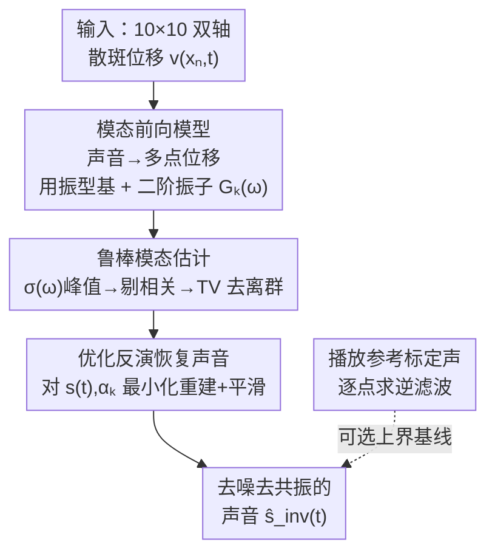

# Hearing the Room Through the Shape of the Drum: Modal-Guided Sound Recovery from Multi-Point Surface Vibrations

**会议**: CVPR 2026  
**论文**: [项目主页 / CVF Open Access](https://shaibagon.github.io/hearing_the_shape_of_the_drum)  
**代码**: 无（仅项目主页，含音频 demo）  
**领域**: 视觉声音恢复 / 计算成像 / 多模态  
**关键词**: 散斑测振, 视觉麦克风, 振动模态, 物理前向模型, 声音恢复

## 一句话总结
针对响应差、强共振的"硬"物体（鼓面、笔记本、相框等），本文用散斑测振一次性采集物体表面 10×10 个点的双轴振动，推导一个把"场景声音 → 多点振动"联系起来的物理前向模型（以物体的振动模态为桥梁），再通过优化反演这个模型，把几十路含噪振动融合成一路去噪、去共振音色的声音，质量显著优于单点散斑测振和经典信号处理融合（平均、delay-and-sum）。

## 研究背景与动机
**领域现状**：光学测振（optical vibration sensing）能把日常物体变成"视觉麦克风"——声波让附近物体表面产生肉眼不可见的微振动，用激光照射表面、读取反射回来的散斑（speckle）干涉图样的位移，就能把这种微振动放大几个数量级并还原出声音。已有工作（Davis 的运动放大、Sheinin 的双相机散斑系统、Kichler 的 2D 网格散斑）已经能做到单相机同时记录场景中**多个点**的振动。

**现有痛点**：先前方法几乎都挑"好测"的物体——要么是自身就在发声的"主动"物体（音箱膜、吉他箱体），要么是对声音极其敏感的薄膜物体（薯片袋、树叶）。对于鼓面、笔记本、活页夹、相框这类**固体物体**，表面对环境声的响应要么很弱、要么强烈共振，单点测出来的信号既含噪又被物体自身共振频率"染色"，听起来一股浓重的"鼓味"。

**核心矛盾**：多点信号看似能靠"多测几路再平均"去噪，但本文指出这是个陷阱。与麦克风阵列不同——麦克风阵列各路之间只差一个**全局到达时延**，而物体表面各点之间是由**机械波传播**连接的：声音在固体里传得快，机械振动主导整体运动，导致同一段录音里两个表面点对**不同频率分量**有**不同的相位延迟**（如 198 Hz 反相、411 Hz 同相）。直接平均会让某些频率相消；delay-and-sum 只能对齐一个主导低频，丢掉高频模态。此外不同点在不同模态频率上能量分布也不同（靠近模态峰/谷的点，因为振动幅度正比于模态空间梯度、在极值处梯度为零，几乎测不到该模态）。

**本文目标**：把这几十路相位/幅度各异的含噪信号，原理性地融合成一路最大化去噪、并"均衡"掉物体共振音色的声音。

**切入角度**：作者的关键洞察是——**物体的模态（modal frequencies + mode shapes）就是缺失的那座桥**。在线性振动假设下，模态构成一组正交基，张成所有表面振动；只要知道模态，就能近似反演物体的时空脉冲响应，估计出激起这些振动的原始声音。

**核心 idea**：先从数据里估出物体的模态频率和振型梯度，用模态基把"声音→多点散斑位移"写成一个解析前向模型，再通过优化**反演**这个模型，等价于"逆掉"物体的共振传递函数并融合多点信号。

## 方法详解

### 整体框架
系统输入是一段时长内对单个物体表面 10×10 网格采到的**双轴**散斑位移信号 $v(x_n,t)\in\mathbb{R}^2$（$n=1,\dots,N$，两轴分别记 $v_1,v_2$）；输出是一路融合后的去噪声音估计 $\hat s_{\text{inv}}(t)$。整条管线分三步：(1) 把物理振动方程展开成模态和，建立"声音 $s(t)$ → 多点散斑位移"的前向模型；(2) 从数据里**鲁棒地**估出模态频率 $\hat\omega_k$ 和振型梯度 $\nabla\hat\phi_k(x_n)$；(3) 固定模态、对声音做优化反演。论文还额外提出一个需要播放参考标定信号的"最优恢复"基线，用来界定本文无监督方法离上界有多远。

### 关键设计

**1. 模态前向模型：把"声音→多点双轴散斑位移"写成可反演的解析式**

这是全文的物理地基，针对的痛点是"多点信号之间不是简单时延、而是被机械波耦合"。作者从薄弹性表面的通用波动方程出发：$\rho\,\partial_{tt}u + c(x)\,\partial_t u - T\nabla^2 u + D\nabla^4 u = f(x,t)$（膜 $D=0$，板 $T=0$）。在线性振动假设下，离面位移可按模态展开 $u(x,t)=\sum_{k=1}^{K}\phi_k(x)\,q_k(t)$，把方程投影到每个模态并用正交性、再假设驱动压强场在表面近似均匀 $f(x,t)=p(t)$，每个模态坐标就退化成一个二阶线性振子：$\ddot q_k + 2\zeta_k\omega_k\dot q_k + \omega_k^2 q_k = \alpha_k p(t)+\eta_k(t)$，其频域传递函数为

$$G_k(\omega)=\frac{\alpha_k}{-\omega^2 + j\,2\zeta_k\omega_k\omega + \omega_k^2}.$$

由于散斑位移测的是表面**梯度** $v(x_n,t)=\beta\nabla_x u(x_n,t)$，把 $p(t)=\gamma s(t)$ 代入后得到本文的前向模型：

$$v(x_n,t)\approx \gamma\beta\sum_{k=1}^{K}\nabla\phi_k(x_n)\big(s(t)*g_k(t)\big)+\eta(x_n,t),$$

其中 $g_k(t)$ 是 $G_k(\omega)$ 的脉冲响应。这个式子之所以关键：它把"每个点、每个轴的测量"统一表达为"原始声音 $s(t)$ 与各模态脉冲响应卷积、再按该点的振型梯度加权之和"，于是融合多点信号的问题变成了"已知混合矩阵（模态）反解源 $s(t)$"。和麦克风阵列的全局时延模型相比，这里用**频率相关的模态相位关系**取而代之，从根上解释了为何朴素平均会失败。

**2. 鲁棒模态估计：只信对的模态频率，三级过滤掉噪声与伪模态**

要用上面的模型，必须先估出 $\nabla\hat\phi_k(x_n)$ 和 $\hat g_k(t)$（后者用解析式 Eq. (5)，只剩 $\alpha_k,\zeta_k,\omega_k$ 三个未知量）。难点在于：大多数模态只有被宽带激励才会被激发，而普通录音里模态频率不一定都"露脸"。作者的做法分两层。

频率定位上，不看单点谱，而看**各点 FFT 幅度的跨点标准差** $\sigma(\omega)=\mathrm{std}_n(|V_n(x_n,\omega)|)$——因为真模态在不同表面点（峰/谷）之间幅度差异大，而不相关的噪声跨点变化很小，所以模态会在 $\sigma(\omega)$ 上凸显。振型梯度则由模态频率处的双轴谐波信号的相对幅度（含符号）直接读出：

$$\nabla\hat\phi_k(x_n)=\mathrm{Re}\!\left\{\frac{V(x_n,\hat\omega_k)\cdot V_1(x_0,\hat\omega_k)^{*}}{\mathbb{E}_{n,a}[|V(x_n,\hat\omega_k)|]\cdot|V_1(x_0,\hat\omega_k)|}\right\},$$

即用参考点 $x_0$ 对齐相位、再除以全场平均幅度做归一化。在此基础上加一个**三级一致性过滤**：① 对 $\sigma(\omega)$ 做 5 Hz Savitzky–Golay 平滑后用 SciPy `find_peaks` 取候选峰；② 算各候选模态的振型、剔除与已接受模态高度空间相关的冗余模态；③ 计算每个振型的空间总变差 $\mathrm{TV}(\nabla\phi_k)$，丢掉违反"空间复杂度应随频率单调增加"这一振动本征模规律的离群模态（低频却高 TV 的，多半是数值伪影）。作者还特意论证：宽带激励不必专门制造，长录音（1/5/30 min）里偶发的拍手、敲击就足以激发全套模态——类比录音里留一段环境声用于后期降噪。实验也证明"频率对不对"比"是否凑齐全部模态"更重要。

**3. 优化反演恢复声音：联合解 $s(t)$ 与模态耦合系数，逆掉共振并去噪**

有了模态频率和振型梯度，最后把声音当未知量、对前向模型做最小二乘反演：

$$\arg\min_{s(t),\,\alpha_k}\ \Big\|\,v(x_n,t)-\sum_{k=1}^{K}\nabla\hat\phi_k(x_n)\big(s(t)*\hat g_k(t)\big)\Big\|_2^2+\lambda\|\dot s(t)\|_2^2,$$

其中 $\hat g_k(t)=\mathrm{iFFT}(G_k(\omega))$，$\zeta_k$ 固定为常数（实验取 0.01），而模态耦合系数 $\alpha_k$（隐含在 $G_k$ 里）与声音 $s(t)$ **联合优化**。这步同时干了两件事：一是通过模态把 N 个测量点的频率相关相位关系都纳入，相当于反转表面的共振传递函数，把被物体"染色"的共振音色"均衡"成更平的频谱；二是 $\lambda\|\dot s\|_2^2$ 的平滑项抑制噪声、避免把噪声频率也拟合进去。求解用 PyTorch + Adam 跑 10000 步（lr $10^{-4}$，$\lambda=1$），单段恢复在 RTX 4090 上约 27 s。

**4. 标定式最优恢复基线：用参考啁啾信号界定上界（评估用，非主方法）**

为回答"无监督结果离最好能做到的有多远"，作者额外提出一个需要介入场景的基线：播放一段已知参考声 $s_{\text{ref}}(t)$（如 50 Hz–10 kHz 对数啁啾）并录下振动 $v^{\text{ref}}_a(x_n,t)\approx s_{\text{ref}}(t)*h_{n,a}(t)$，对每个点每个轴独立用最小二乘解出逆滤波器 $\hat h_{n,a}(t)^{-1}=\arg\min_h\|v^{\text{ref}}_a*h - s_{\text{ref}}\|_2^2$（4096 taps），之后对任意新录音逐通道做逆滤波再平均 $\hat s_{\text{new}}(t)=\frac{1}{2N}\sum_a\sum_n v^{\text{new}}_a(x_n,t)*\hat h_{n,a}(t)^{-1}$。它绕开解析模型、直接测每路传递函数，思想借鉴现代麦克风波束成形，给出"已知物体传递函数时最好能恢复到什么程度"的代理上界。

### 损失函数 / 训练策略
核心目标即 Eq. (12) 的"重建误差 + 一阶导平滑"；无网络训练，是对单段录音做一次优化反演。预处理：22000 fps（个别 44100 fps）采集，HOLOEYE 分束器生成 10×10 点阵，PCLK+ 算双轴位移，7 阶 Butterworth 带通（50–10000 Hz）。

## 实验关键数据

> ⚠️ 论文主体以频谱图 / 可听音频做定性对比，大量定量结果在补充材料中，正文未给统一数值表。下表按论文图示的定性结论整理，便于速览。

### 主实验：鼓面上不同融合方式对比（Fig. 4）

| 融合方式 | 高频模态 | 去噪 | 共振音色 | 结论 |
|----------|----------|------|----------|------|
| 单点 (x 轴) | 部分 | 差（含噪） | 重（鼓味浓） | 单点既噪又被共振染色 |
| 朴素平均 | 抑制 | 更差 | 重 | 相位失配致频率相消 |
| Delay-and-sum | 丢高频 | 中（降高频噪声） | 中 | 单一全局时延只对齐主导低频 |
| 本文（模态反演） | 保留 | 优 | 显著抑制 | 频谱更丰富、更接近源信号 |

跨物体定性结果（Fig. 5）：在木、金属、塑料、橡胶等材料，平面/曲面/不规则形状（木质活页夹、吉他箱体）乃至实心瑜伽砖（非为体结构优化）上均能去噪重建；薯片袋作为"易测"参照，单点已很好。

### 消融：模态来源与频率精度对恢复的影响（Fig. 6 / Fig. 7）

| 配置 | 关键现象 | 说明 |
|------|----------|------|
| 模态取自拍手录音 | 质量好 | 默认设置（clap 作参考） |
| 模态取自录音本身 | 质量相当 | 信号自身即可作可靠模态来源 |
| 随机**删** 20% 模态频率 | 略降锐度、音色保留 | 不必凑齐全部模态 |
| 随机**加** 20% 伪频率 | 明显伪影、不自然共振 | 错误频率危害远大于缺失 |
| vs 标定式上界（参考啁啾） | 大部分频率高保真匹配 | 仅最高频模态被低估 |

### 关键发现
- **"频率对不对" > "是否凑齐"**：加错频率比漏掉真频率危害大得多，因为伪频率会被反演成虚假共振；这也解释了为什么模态估计要花三级过滤死磕频率纯度。
- 模态可直接从目标录音自提取，无需专门标定声，落地门槛低（长录音里的偶发宽带事件就够激发模态）。
- 本文无监督结果已逼近需要播放参考信号的标定上界，只在最高频模态处略逊。
- 朴素平均反而比单点更差——再次印证多点振动**不能当独立麦克风平均**，必须建模机械耦合。

## 亮点与洞察
- **把"声学反问题"重写成"已知模态混合矩阵的源分离"**：用物体振型当正交基，巧妙地把"多点相位失配"从障碍变成可利用的物理约束——这是全文最"啊哈"的地方。
- **跨点标准差 $\sigma(\omega)$ 找模态**：用"真模态跨点有空间结构、噪声没有"这一性质，比单点找峰鲁棒得多，是个可迁移的频域模态检测 trick。
- **TV 单调性先验剔伪模态**：振型空间复杂度随频率单调增加是振动本征模的物理规律，拿它当离群检测准则，简单却有效。
- 思路可迁移到任何"多传感器被同一介质机械/电磁耦合"的反演问题（如结构健康监测、被动声学探测）。

## 局限与展望
- 作者承认：方法依赖**线性、模态化**的简化模型，真实物体的空间非均匀受力、复杂几何、异质材料、边界效应会偏离理想假设。
- 假设驱动压强场在表面近似均匀 $f(x,t)=p(t)$，对大尺寸物体或近场强方向性声源未必成立。
- ⚠️ 只恢复激光网格点覆盖到的那一段模态振型；最高频模态在结果中被低估（Fig. 7）。
- 假设所有点共享同一光学传递因子 $\beta$；论文指出 per-point $\beta_n$ 差异只会等比缩放振型梯度、Eq. (12) 对此不敏感，但极端轴向距离差异下的鲁棒性仍待验证。
- 主体评估偏定性（频谱图/听感），缺正文统一定量指标，跨物体可比性需看补充材料。

## 相关工作与启发
- **vs 单点散斑测振 [Sheinin/Davis 等]**：他们挑响应好的物体单点测，遇到鼓面这类强共振物体就被音色染色且含噪；本文用多点 + 模态反演，专攻"难测"固体，去噪去共振。
- **vs 朴素平均 / Delay-and-sum 波束成形**：经典做法假设全局时延（麦克风阵列范式），只能对齐主导低频；本文用频率相关的模态相位关系替代全局时延，从机械波物理出发保留高频。
- **vs 标定式逐点逆滤波（本文基线）**：基线需播放已知参考声、逐路测传递函数（有监督上界）；本文无需任何介入即逼近它，价值在于"开箱即用"的被动恢复。

## 评分
- 新颖性: ⭐⭐⭐⭐⭐ 首次把散斑测振与日常物体的机械振动模态绑定，用物理前向模型做多点声音融合，问题设定与解法都新。
- 实验充分度: ⭐⭐⭐⭐ 物体/材料/几何覆盖广、消融到位，但正文定量偏弱、量化结果压在补充材料。
- 写作质量: ⭐⭐⭐⭐⭐ 物理推导清晰、动机层层递进，图示把"为何平均会失败"讲得很透。
- 价值: ⭐⭐⭐⭐ 把视觉声音恢复推向"难测"固体，朝通用相机声学传感迈了一步，落地门槛（无需标定）低。

<!-- RELATED:START -->

## 相关论文

- [\[CVPR 2026\] MMAudioReverbs: Video-Guided Acoustic Modeling for Dereverberation and Room Impulse Response Estimation](mmaudioreverbs_video-guided_acoustic_modeling_for_dereverberation_and_room_impul.md)
- [\[AAAI 2026\] Hearing More with Less: Multi-Modal Retrieval-and-Selection Augmented Conversational LLM-Based ASR](../../AAAI2026/audio_speech/hearing_more_with_less_multi-modal_retrieval-and-selection_augmented_conversatio.md)
- [\[NeurIPS 2025\] Seeing Sound, Hearing Sight: Uncovering Modality Bias and Conflict of AI Models in Sound Localization](../../NeurIPS2025/audio_speech/seeing_sound_hearing_sight_uncovering_modality_bias_and_conflict_of_ai_models_in.md)
- [\[CVPR 2026\] Semantic Noise Reduction via Teacher-Guided Dual-Path Audio-Visual Representation Learning](semantic_noise_reduction_via_teacher-guided_dual-path_audio-visual_representatio.md)
- [\[CVPR 2025\] MultiFoley: Video-Guided Foley Sound Generation with Multimodal Controls](../../CVPR2025/audio_speech/video-guided_foley_sound_generation_with_multimodal_controls.md)

<!-- RELATED:END -->
