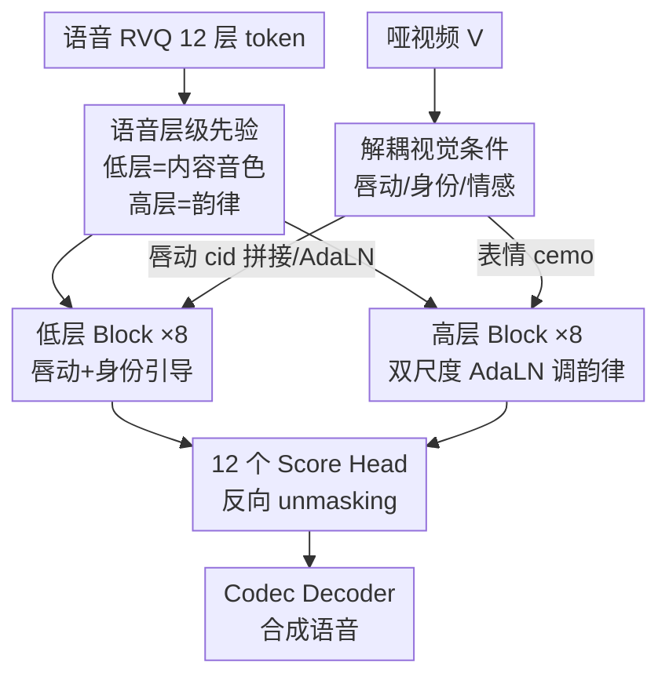

# Hierarchical Codec Diffusion for Video-to-Speech Generation

**会议**: CVPR2026  
**arXiv**: [2604.15923](https://arxiv.org/abs/2604.15923)  
**代码**: https://github.com/Jiaxin-Ye/HiCoDiT (有)  
**领域**: 多模态生成 / 语音合成 / 离散扩散  
**关键词**: 视频转语音(VTS), RVQ Codec, 离散扩散, 语音层级先验, AdaLN

## 一句话总结
HiCoDiT 把"哑视频→语音"这件事重新拆成**沿 RVQ 离散 token 层级逐层生成**的掩码扩散任务——低层 token 负责内容与音色、由唇动和身份引导，高层 token 负责韵律、由表情通过双尺度 AdaLN 调制，从而在 LRS2/LRS3 上跨数据集零训练就拿下自然度、可懂度和唇同步的领先成绩。

## 研究背景与动机
**领域现状**：Video-to-Speech(VTS) 想从一段没有声音的人脸视频里推断并合成出与口型对齐的语音，应用在默片配音、失声者辅助交流、噪声/隐私敏感场景。主流做法是"表征对齐"——把视觉特征对齐到语音的语义内容(NaturalL2S)、说话人身份(Face2Speech)、情感韵律(FTV)上，再喂给生成模型。

**现有痛点**：视觉和声学之间存在**信息不对称**——视觉特征稀疏，难以承载语音那种稠密表征。更关键的是，现有方法几乎都把语音当成一个**扁平的整体表征**，把视觉特征一股脑注入进去，完全忽略了语音本身"从粗到细"的层级结构(粗的说话人语义 → 细的韵律细节)。这种忽略反过来加剧了模态间的信息不对称。

**核心矛盾**：语音并不是均质的——不同属性(内容、音色、韵律)天然分布在不同的抽象层级上；而视觉里的不同线索(唇动、人脸身份、表情)也对应不同属性。把它们硬塞进同一个整体表征，等于让"唇动"去干扰"韵律"、让"表情"去污染"内容"，对齐自然次优。

**本文目标**：找到一种**层级化的视觉条件注入**机制，让每种视觉线索只去 refine 它该负责的那一层语音 token。

**切入角度**：作者对 RVQ codec 做了量化分析(论文 Figure 2)——RVQ 把语音残差式地编进 12 层 VQ token，**低层(VQ 1-2)主要贡献语义内容(+30.35%)和音色(+20.10%)，高层(VQ 2-12)才把韵律补上来(+10.85%)**。这就给出一条天然的层级先验：低层 token ↔ 说话人语义，高层 token ↔ 抽象韵律。

**核心 idea**：用"离散语音 token 的层级先验"作为桥梁——把 VTS 写成**层级化掩码 token 预测**，让唇动+身份去精修低层 token、让表情去调制高层 token，在离散扩散框架里第一次显式注入语音层级结构。

## 方法详解

### 整体框架
HiCoDiT 接收一段哑视频 $V$，目标是合成与视觉对齐的高保真语音。它把语音先用 RVQ codec 离散化成 12 层 token，按层级切成低层 $x^{low}=x^{r_1:r_2}$ 和高层 $x^{high}=x^{r_3:r_{12}}$；同时从视频里**解耦**出三种视觉特征——唇动 $c_{lip}$、身份 $c_{id}$、情感 $c_{emo}$。然后用一个掩码离散扩散 Transformer 当 score network：低层 block 吃唇动+身份生成内容/音色 token，高层 block 吃表情生成韵律 token。最后 12 个线性 score head 输出 concrete score，驱动反向 unmasking，把恢复的 token 交给 codec decoder 解码成语音。整条管线是"视觉解耦 → 按层级分流 → 分块条件生成 → 解码"的单向 pipeline。

### 关键设计

**1. 语音层级先验：把"从粗到细"的 RVQ 结构当成对齐的脚手架**

痛点是现有 VTS 把语音当扁平整体，导致视觉条件无差别注入。作者实测 RVQ codec 的逐层解码贡献：低层 token(VQ 1-2)集中改善语义内容(+30.35%)与音色相似度(+20.10%)，韵律质量则要靠高层(VQ 2-12)才补上来(+10.85%)。基于这条观测，论文把 12 层 token 切成低层 $x^{r_1:r_2}$(内容+音色)和高层 $x^{r_3:r_{12}}$(韵律)，并据此规定：唇动/身份这类与内容音色强相关的视觉线索去 refine 低层，表情这类承载情感韵律的线索去调制高层。这一刀切是后面所有解耦条件注入的依据——它把"视觉该对齐到哪层语音"从经验拍脑袋变成了由 codec 层级直接指定

**2. 解耦视觉条件：三个 adapter 各管一种语音属性**

视觉里的唇动、人脸身份、表情本是混在一起的，硬注入会互相干扰。HiCoDiT 用三个独立 adapter 把它们解耦后分别对齐：唇动用 AV-HuBERT 取末层隐状态(它编码了最判别性的视听语义)，经 MLP 投影成 $c_{lip}$ 去管内容；身份用 ArcFace 提脸部身份特征投影成 $c_{id}$，并用 $\ell_1$ 距离把它对齐到 GE2E 语音说话人嵌入，从而把"脸"映射到"音色"；情感用强表情识别模型 Poster2 逐帧预测情感类别，再在 0.5 秒窗口上做时间平滑(抑制身份偏置抖动)，得到 $c_{emo}$ 去管韵律。三路特征各走各的注入通道，正好对应设计 1 切出的低/高层 token

**3. 层级化掩码 token 预测的双块结构：用两类条件机制匹配两类信号**

针对"不同视觉信号粒度不同"，HiCoDiT 在掩码离散扩散(基于 SEDD 的 DSE 训练目标)框架下用两种互补的条件机制：对帧级同步的细粒度信号(唇动)，直接把掩码低层特征 $m^{low}_t$ 与 $c_{lip}$ 沿通道拼接再过线性层做时序融合；对类别式属性(身份、情感)，用 AdaLN 注入。低层 block(×8)负责内容/音色 token，高层 block(×8)负责韵律 token，前向过程把 token 按 SEDD 掩码、反向过程用 Euler 采样 64 步迭代 unmask。这种"按层级配条件机制"避免了用同一种注入方式去硬套粒度迥异的信号

**4. 双尺度自适应实例层归一化(Dual-scale AdaLN)：同时抓全局音色和局部韵律抖动**

普通 DiT 的 AdaLN 只在通道维做归一化，能注入全局风格却抓不住韵律是随时间动态变化的。HiCoDiT 在高层 block 引入双尺度 AdaLN：通道维 MLP 用情感+时间特征预测通道级缩放/平移 $\gamma_{emo,c}, \beta_{emo,c}$ 建模全局发声风格；时间维 MLP 再用情感+时间特征预测时间级缩放 $\gamma_{emo,t}$ 捕捉局部韵律动态。两者复合作用：

$$\underbrace{\gamma^i_{emo,t}\otimes \mathbf{1}_{25}}_{\text{时间级}}\cdot\Big[\underbrace{(1+\gamma^i_{emo,c})\cdot\frac{h_t-\mu(h_t)}{\sigma(h_t)}+\beta^i_{emo,c}}_{\text{通道级}}\Big]$$

其中 $\otimes$ 是 Kronecker 积，$\mathbf{1}_{25}$ 把 $L_{emo}=L/25$ 的时间参数上采样对齐到 50 Hz 隐特征。身份条件则用单尺度通道版 AdaLN($(1+\gamma^i_{id})\cdot\frac{h_t-\mu}{\sigma}+\beta^i_{id}$)。这一设计让"情感"既塑造整体音色又逐帧调节韵律起伏，正是表达力提升的来源

### 损失函数 / 训练策略
总损失 $L_{total}=L_{score}+\lambda L_{id}$，其中 $\lambda=100$。$L_{score}=\sum_{i=1}^{12}L_{DSE}(x^{r_i},t,c)$ 是对全部 12 层 RVQ token 求和的多级 DSE(denoising score entropy)损失；$L_{id}=\ell_1(c_{id},c_{GE2E})$ 把视觉身份嵌入对齐到 GE2E 语音嵌入以强化说话人一致性。训练用 predictor-free guidance：每个条件以 10% 概率置空、并有 10% 样本全置空。训练时用真值声学特征替换 $c_{id}/c_{emo}$ 保证稳定，推理时只用视觉特征。RVQ codec 来自 MaskGCT(12 层、码本 1024)，低/高层 block 各 8 层、通道 768、12 头，AdamW、lr 1e-4、batch 32、200k 步。

## 实验关键数据

### 主实验
在 VoxCeleb2(261.5 小时、169k 条、3438 说话人)上训练，**零训练**直接在 LRS3 / LRS2 两个 in-the-wild 数据集上测试。下表为 LRS3 仅视频引导(V-only)结果：

| 方法 | 来源 | WER↓ | DNSMOS↑ | UTMOS↑ | MCD↓ | LSE-C↑ | EmoAcc↑ | SpkSim↑ |
|------|------|------|---------|--------|------|--------|---------|---------|
| AlignDiT | ACM MM'25 | 31.37 | 3.24 | 3.76 | 10.02 | 6.95 | 76.11 | 0.5597 |
| FTV | CVPR'25 | 30.37 | 3.22 | **3.99** | 10.54 | 7.08 | 73.19 | **0.5981** |
| **HiCoDiT (V)** | - | **29.41** | **3.50** | 3.84 | 9.62 | **7.15** | **79.41** | 0.5678 |
| HiCoDiT (A+V) | - | **28.98** | 3.44 | 3.80 | **8.69** | 7.10 | 77.08 | **0.6715** |

LRS2 上同样领先 DNSMOS(3.35 vs FTV 3.11)、LSE-C(7.95 vs 7.71)、LSE-D(6.17 vs 6.35)，WER(39.99) 略逊 FTV(38.09)。OOD 真实电影数据(160 句/56 说话人)上 WER 58.7 远好于 EmoDubber 88.3 与 AlignDiT 80.8，鲁棒性突出。主观评测 MOSnat 3.17、MOSsyn 3.50 均第一，A/B 测试对 AlignDiT 57.0% 偏好、对 FTV 52.1%。

### 消融实验
| 配置(LRS3) | WER↓ | DNSMOS↑ | EmoAcc↑ | SpkSim↑ | 说明 |
|------|------|---------|---------|---------|------|
| HiCoDiT (full) | 29.41 | 3.50 | 79.41 | 0.5678 | 完整模型 |
| w/o 层级建模 | 30.65 | 3.36 | 76.98 | 0.5652 | 塌成单一模块，视觉无差别注入 |
| w/o 双尺度 AdaLN | 29.60 | 3.45 | 78.55 | 0.5621 | 退回 utterance 级情感 |
| w/o GE2E $L_{id}$ | 29.38 | 3.41 | 74.47 | 0.3410 | SpkSim 崩到 34.10% |
| w/o Poster2(换 Poster) | 29.41 | 3.50 | 76.29 | 0.5528 | EmoAcc 79.41→76.29 |

### 关键发现
- **层级建模是地基**：去掉它(把多级表征塌成单一模块、视觉跨所有 token 注入)所有指标全面下滑，WER 30.65、DNSMOS 3.36、EmoAcc 76.98，印证"视觉属性应对齐到承载匹配内容的特定层 token"。
- **GE2E 身份损失不可或缺**：去掉后说话人相似度从 56.78% 暴跌到 34.10%，而 WER 几乎不变——说明它专门负责从脸部线索里抽隐式音色，与内容解耦得很干净。
- **双尺度 AdaLN 主要吃表达力**：换成池化后的整句情感，EmoAcc 仅微降但其余指标明显下滑，说明逐帧时间维归一化对建模韵律动态确实关键。
- **诚实的弱点**：仅视频时 SpkSim(0.5678) 不及 FTV(0.5981)，作者归因于训练数据说话人多样性有限；一旦引入语音作身份引导，SpkSim 跃到 0.6715 全场最高，显示强语音克隆能力。

## 亮点与洞察
- **把"指标分析"直接变成"架构先验"**：论文先量化 RVQ 各层对内容/音色/韵律的贡献占比(30.35%/20.10%/10.85%)，再据此切层、分配视觉条件——这种"先测量层级、再据层级设计"的思路很可迁移到任何残差量化表征(图像 RVQ、视频 token)的条件生成上。
- **离散扩散 + codec 层级**的组合让 VTS 第一次摆脱连续 mel 谱建模，既享受 codec 强重建力(频谱更干净、信噪比更高)，又规避连续扩散的计算低效。
- **两类条件机制对两类信号**：帧级同步信号用通道拼接、类别式属性用 AdaLN——这种"按信号粒度选注入方式"的工程判断，值得在任何多条件生成里照搬。
- **双尺度 AdaLN 把"全局风格 vs 局部动态"拆成通道维和时间维两条归一化**，是个干净的、可复用到任意需要"既定风格又要时变细节"的调制场景的 trick。

## 局限与展望
- **作者承认**：说话人相似度受训练数据多样性掣肘，仅视频时不及 FTV；表达力(MOSexp 2.88)也略逊 FTV，作者认为更多样的说话人数据可缓解。
- **依赖一串现成强编码器**(AV-HuBERT、ArcFace、Poster2、GE2E、MaskGCT codec)，任一环节的领域偏移都会传导到最终语音；且层级先验是基于这个特定 codec 测出来的，换 codec 是否仍是"VQ1-2 管内容"需重新验证。
- **层级切分点(r2/r3 之间)是按 Figure 2 的统计经验定的，偏硬**；是否对所有语种/采样率都最优、能否学习自适应的切分边界，论文未探讨。
- **64 步 Euler 采样 + 12 个 score head** 的推理开销相对自回归 codec TTS 仍需评估，论文未给端到端延迟数字。

## 相关工作与启发
- **vs FTV (CVPR'25)**: FTV 用 flow matching + 层级视觉编码器，把视觉特征逐步注入**连续 mel 谱**空间；本文在**离散 token** 空间做扩散，且层级来自语音 token 自身而非视觉编码器。FTV 在 UTMOS/SpkSim 上仍有优势(数据多样性)，但 HiCoDiT 在 DNSMOS/WER/EmoAcc/同步性上更强。
- **vs AlignDiT (ACM MM'25)**: 同为多模态对齐扩散 transformer，但 AlignDiT 不显式利用语音层级；HiCoDiT 在几乎所有指标和 A/B 偏好(57.0%)上胜出。
- **vs VoiceCraft-Dub**: 它把预训练自回归离散 TTS 适配进视觉上下文，但模糊了语音表征的层级结构；HiCoDiT 是从零训练、显式集成层级先验的离散扩散，首次把 speech hierarchy prior 引入离散扩散 VTS。
- **vs 层级 TTS(Lee et al. / Hsu et al. 的层级 VAE)**: 它们设计纠缠的条件去建模层级语音属性；本文直接利用 token 自身的内在层级，做到解耦条件，这是和先前层级语音生成最本质的区别。

## 评分
- 新颖性: ⭐⭐⭐⭐⭐ 首次把离散语音 token 的层级先验显式引入扩散式 VTS，且层级来自对 RVQ 的量化分析而非拍脑袋。
- 实验充分度: ⭐⭐⭐⭐ LRS2/LRS3/OOD 电影三套数据 + 主客观 + 4 组消融齐全，唯说话人多样性弱点诚实暴露。
- 写作质量: ⭐⭐⭐⭐ 动机—先验—设计逻辑链清晰，公式与图配合好；离散扩散预备知识稍重。
- 价值: ⭐⭐⭐⭐ 给残差量化表征的条件生成提供了"先测层级再设计"的范式，默片配音/辅助交流落地潜力明确。

<!-- RELATED:START -->

## 相关论文

- [\[AAAI 2026\] Diff-V2M: A Hierarchical Conditional Diffusion Model with Explicit Rhythmic Modeling for Video-to-Music Generation](../../AAAI2026/audio_speech/diff-v2m_a_hierarchical_conditional_diffusion_model_with_explicit_rhythmic_model.md)
- [\[CVPR 2026\] EchoFoley: Event-Centric Hierarchical Control for Video Grounded Creative Sound Generation](echofoley_event-centric_hierarchical_control_for_video_grounded_creative_sound_g.md)
- [\[CVPR 2026\] SAVE: Speech-Aware Video Representation Learning for Video-Text Retrieval](save_speech-aware_video_representation_learning_for_video-text_retrieval.md)
- [\[CVPR 2026\] Hear What You See: Video-to-Audio Generation with Diffusion Transformer and Semantic-Temporal Alignment-Ranked Direct Preference Optimization](hear_what_you_see_video-to-audio_generation_with_diffusion_transformer_and_seman.md)
- [\[CVPR 2026\] Omni2Sound: Towards Unified Video-Text-to-Audio Generation](omni2sound_towards_unified_video-text-to-audio_generation.md)

<!-- RELATED:END -->
