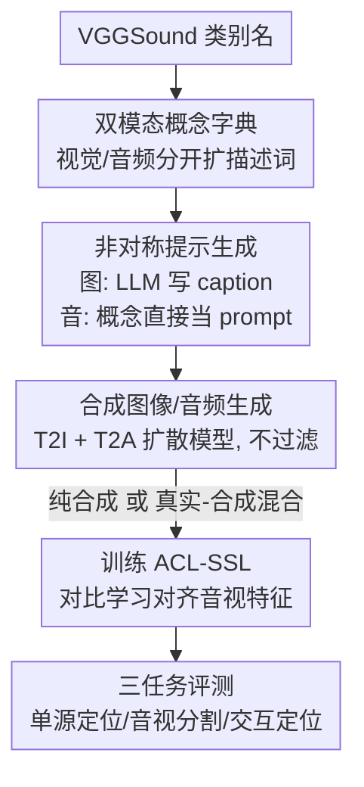

# How Far Can We Go With Synthetic Data for Audio-Visual Sound Source Localization?

**会议**: CVPR 2026  
**论文**: [CVF Open Access](https://openaccess.thecvf.com/content/CVPR2026/html/Senocak_How_Far_Can_We_Go_With_Synthetic_Data_for_Audio-Visual_CVPR_2026_paper.html)  
**代码**: https://github.com/swimmiing/SyntheticSSL  
**领域**: 多模态VLM（音视频自监督）  
**关键词**: 声源定位、合成数据、文本到图像/音频、数据中心学习、对比学习

## 一句话总结
本文提出首个用 text-to-X 生成模型批量造数据来训练声源定位（SSL）模型的可扩展框架，证明纯合成数据能与真实数据打平、用合成图像替换有噪的真实中间帧能"提纯"训练集，而真实+合成混合训练在单源定位、音视分割、交互式定位三类任务上全面刷到 SOTA。

## 研究背景与动机
**领域现状**：声源定位（Sound Source Localization, SSL）要在画面里圈出"正在发声的物体/区域"，已从音视学习的子课题独立成一个有自己 benchmark 和新任务（单源定位、音视分割、交互式定位）的方向。但主流工作都是 **model-centric**——比着改模型结构、对比学习目标、正则项，训练数据却长期停在 VGGSound 这一套不超过 14.4 万样本的规模上。

**现有痛点**：真实训练数据有两个硬伤。一是**规模上不去**，14.4 万样本基本是天花板，可扩展性没人验证过；二是**语义错位**，训练图像通常直接取视频"中间帧"，但中间帧那一瞬间画面里未必有发声物体（人已经走出画面、声音是画外音），导致音频和图像在语义上对不上（论文 Figure 2）。

**核心矛盾**：要同时解决"规模"和"对齐"，靠人工采集+清洗当然可以，但人力成本极高、不可扩展。而新任务、新 benchmark 不断涌现，又要求模型更通用——model-centric 的小数据路线越来越吃力。

**本文目标**：换个赛道，从 model-centric 转向 **data-centric**，具体回答三个问题：(1) SSL 模型能不能从合成数据有效学习；(2) 合成数据能不能突破上述瓶颈；(3) 通往更强 SSL 的可行配方是什么。

**切入角度**：text-to-image（T2I）和 text-to-audio（T2A）生成模型已经足够可控，可以"按概念点菜"地批量造图造音——天然能避开中间帧错位（生成的图必然画的是那个发声物体），又能无限扩规模。作者把合成数据当作"验证工具+研究工具"，去探测 SSL 的真实瓶颈。

**核心 idea**：用生成模型造出 VGGSound 的"合成克隆体"，再用纯合成 / 真实-合成混合的方式去训一个现成的 SOTA SSL 模型（ACL-SSL），系统性地回答"合成数据能带我们走多远"。

## 方法详解

### 整体框架
整条 pipeline 的目标是：给定 VGGSound 的类别名，自动产出与之对应的合成图像和合成音频，再拿去训练声源定位模型。它分四步串行——先为每个类别建"概念字典"扩充描述词，再用 LLM 把概念写成生成提示，接着用 T2I/T2A 扩散模型造出合成图/音，最后用纯合成或真实-合成混合数据训练 ACL-SSL。整个流程里唯一需要人工的只有第一步建字典，其余全自动。

### 关键设计

**1. 双模态概念字典：给类别名"扩容"以提升生成多样性**

直接拿类别名（如 "dog"）去喂生成模型，产出的图/音单调且语义贫乏。作者为每个 VGGSound 类别构建一份**概念字典**，把类别名扩成一组更具描述性的词条。关键在于**视觉和音频分开维护两套字典**——因为同一描述在两个模态里信息量不同：如 "thunder in the night" 里的 "night" 对画面描述很有用（夜空背景），但对描述雷声这段音频几乎没增量。字典由 10 名标注者人工写（每人负责 31 个类别），平均每类只配 3.35 个视觉概念、7.80 个音频概念。这是整条 pipeline 里**唯一**的人工环节，但相比人工大规模采集/清洗数据，这点投入微不足道。

**2. 非对称提示生成：T2I 和 T2A 对提示的"口味"不一样**

有了概念字典，要把概念转成生成模型的文本提示。作者发现两类生成模型对提示的敏感度截然不同：**T2I 模型喜欢描述性强、句式丰富的完整 caption，而 T2A 模型反而处理不好整句、只认简短概念词**。于是采用非对称策略——图像侧：从字典里随机取一个概念 $k_i$，交给 LLM（Mistral-7B）按固定模板写一句不超过 15 词的 caption $t_i = G(p, k_i)$；音频侧：直接把随机抽到的概念词当 prompt，不经过 LLM。形式化为 $T^{image}=\{G(p,k_i)\mid k_i\sim \text{Uniform}(D(c(x_i)))\}$ 与 $T^{audio}=\{k_i\sim \text{Uniform}(D(c(x_i)))\}$，其中 $D(c)$ 返回类别 $c$ 的概念集合。作者还随机开关 caption 里"把场景放到不寻常地点"那段提示词，进一步增多样性。这种"按模态定制提示"是让两路生成都好用的关键。

**3. 合成数据生成且全程不过滤：直接用现成扩散模型造 VGGSound 克隆体**

用 Stable Diffusion 3 Medium（T2I）和 Stable Audio Open 1.0（T2A）按上述提示生成图像 $V=\{G_{T2I}(t_i)\}$ 与音频 $A=\{G_{T2A}(t_i)\}$，得到 VGGSound 的合成克隆。一个刻意的选择是**对生成样本不做任何过滤**——作者要验证的是"开箱即用的标准生成模型"能走多远，因此故意用最普通、最易得的模型并跳过清洗，建立一个低成本、可复现的配方。框架对任意数据集/类别范围都适用，不局限于 VGGSound。

**4. 真实-合成混合训练配方：用合成图像"提纯"、再混少量真实数据冲 SOTA**

最后把数据喂给 ACL-SSL（CLIP 视觉编码器 + BEATs 音频编码器，音频被投影成"类文本 token"过 CLIP 文本编码器，再用自监督对比学习对齐音视特征、高亮发声区域，全程无显式文本输入）。本设计的精髓是**配方而非模型**：作者系统比较了 6 种数据配置，得出关键结论——(SynI, RealA)（合成图+真实音）效果最好，因为合成图语义更干净、能修复真实中间帧的错位；纯合成可与纯真实打平；而即便只掺 1 万张真实样本（如 SynI+MixedA），也能在三类任务上稳超纯真实基线。这说明**视觉模态是合成数据的主要受益点**，T2A 不如 T2I 成熟，所以"真实图+合成音"反而是最差组合。

### 损失函数 / 训练策略
完全沿用 ACL-SSL 的自监督对比学习设置：ViT-B/16 CLIP 作图像编码器、BEATs 作音频编码器；训练用 10 秒、16 kHz 音频片段，图像缩放到 352×352；20 epoch、batch size 16。因 SSL 对随机种子敏感，每个基线训练 6 次取均值±标准差。每个任务含多个数据集，最终性能对所有数据集做平均。

## 实验关键数据

### 主实验（同数据量 144K，单源定位）
六种数据配置在单源定位任务上的平均结果（数据规模都对齐到 VGGSound 的 14.4 万）。**cIoU**：固定阈值下预测热图与 GT 框的一致 IoU；**cIoU Adap.**：用自适应阈值的版本，对热图绝对幅度不敏感。

| 配置 | cIoU | cIoU Adap. | AUC | AUC Adap. |
|------|------|-----------|-----|-----------|
| (a) Original（全真实） | 48.03 | 62.22 | 41.95 | 51.99 |
| (b) Synthetic（全合成） | 47.97 | 60.88 | 41.86 | 51.03 |
| (c) (SynI, RealA)合成图+真实音 | **55.13** | **67.16** | **46.73** | **55.06** |
| (d) (RealI, SynA)真实图+合成音 | 46.38 | 61.66 | 41.43 | 51.28 |
| (e) (SynI, MixedA) | 52.24 | 64.75 | 44.66 | 53.37 |
| (f) (MixedI, SynA) | 50.61 | 62.75 | 43.96 | 52.16 |

纯合成 (b) 与全真实 (a) 基本持平；用合成图替换真实图 (c) 直接 +7.10 cIoU；最差的是真实图+合成音 (d)。

### 三任务收益对比（相对全真实基线 Original）
| 任务 | 配置 (SynI,RealA) 增益 | 度量 |
|------|------------------------|------|
| 单源定位 | +7.10 cIoU / +4.94 cIoU Adap. | cIoU |
| 音视分割 | +4.61 mIoU / +3.50 mIoU Adap. | mIoU |
| 交互式定位 | +10.40 IIoU / +10.91 IIoU Adap. | IIoU |

> mIoU = 分割任务的平均 IoU；IIoU = 交互式定位下，给同一张图换不同声音时模型移动定位区域能力的 IoU。三任务里交互式定位受益最大。

### 关键发现
- **视觉模态是合成数据的主要功臣**：合成图普遍带来更大增益，因为真实图受"中间帧选择"之累、语义脏；合成图语义更干净一致。T2A 不如 T2I 成熟，合成音收益有限。
- **真实图+合成音 (RealI, SynA) 是唯一掉点的组合**：本就语义有噪的真实图，配上较弱的合成音，缺陷被放大——对比 (d) 与 (f)，把真实图换成合成图（音频不变）所有任务都涨，反向印证此结论。
- **混合一点真实就够**：即便只掺 1 万真实样本，(SynI,MixedA)/(MixedI,SynA) 也能全面超过纯真实基线（单源 +4.20 cIoU 等）；作者推测合成数据修语义瑕疵、真实数据补域差。
- **可扩展到 2× 规模继续涨**：在 144K 之上扩到 2×（如 (C) 配置）单源 cIoU 达 56.36，进一步逼近上界；论文摘要报告相对真实基线最高 +8.62 cIoU（单源）、+5.58 mIoU（分割）、+12.16 IIoU（交互）。

## 亮点与洞察
- **把"换赛道"做扎实**：不发明新模型，而是系统验证"合成数据能否取代/提纯/扩展真实数据"，给出 replace / refine / scale 三段式证据链——这种 data-centric 视角在音视领域是首次，比再调一个对比损失更有启发。
- **非对称提示是个易被忽略的工程关键**：T2I 要长 caption、T2A 要短概念，这个不对称观察直接决定生成质量，可迁移到任何"双生成模型造多模态数据"的场景。
- **"用合成图修真实数据的脏"是反直觉但合理的卖点**：人们通常担心合成数据的域差，本文反而指出真实中间帧才是噪声源、合成图反而更"对齐"，把合成数据从"退而求其次"提升为"主动提纯工具"。
- **配方可复现**：刻意只用 HuggingFace 上最标准的 SD3 / Stable Audio / Mistral-7B 并完全不过滤，门槛低、易复现。

## 局限与展望
- **概念字典仍需人工**：虽只占极小人力，但 10 人各写 31 类、每类 3-8 个概念，扩到更大类别空间时这步是否可自动化（如让 LLM 直接生成字典）未深入。
- **合成音是短板**：T2A 当前不够成熟，导致音频模态收益有限、(RealI,SynA) 甚至掉点；方法效果一定程度上被 T2A 质量卡住，待 T2A 进步后结论可能变化。⚠️ 论文据此推断"图优于音"主要归因于 T2A 不成熟，是相关性论证而非控制实验严格证明。
- **全程不过滤是双刃剑**：低成本配方代价是放弃质量控制，若引入轻量筛选/重加权是否能进一步提升、需不需要，论文未系统探究。
- **只在 ACL-SSL 一个骨干上验证**：结论是否跨 SSL 模型架构稳健，需更多骨干佐证。

## 相关工作与启发
- **vs model-centric SSL（ACL-SSL / 各类对比损失改进）**：他们改模型和目标函数、卡在 144K 真实数据上；本文不动模型只换数据来源，证明数据侧还有大量未挖掘红利，是正交方向。
- **vs 视觉/视觉-文本领域的合成数据工作（StableRep、SynCLR 等）**：合成数据训分类器/CLIP 已成熟，但音视（audio-visual）领域此前空白；本文首次把"合成数据训练"系统引入声源定位。
- **vs IS4 [39] 的半合成数据集**：IS4 用 T2I 生成图配真实音，但**只当测试集**用；本文把合成数据真正用于**训练**，且覆盖三类任务，定位完全不同。

## 评分
- 新颖性: ⭐⭐⭐⭐⭐ 首次把 text-to-X 合成数据系统性引入声源定位，并给出 replace/refine/scale 完整证据链。
- 实验充分度: ⭐⭐⭐⭐⭐ 6 种数据配置 × 3 任务 × 多数据集、每配置训 6 次取均值，还做了 2× 扩展实验。
- 写作质量: ⭐⭐⭐⭐ 五条 key findings 组织清晰，但部分结论（图优于音）依赖推断而非控制实验。
- 价值: ⭐⭐⭐⭐ 提供低成本可复现配方+开源数据，对 data-centric 音视学习有切实推动；受限于 T2A 成熟度。

<!-- RELATED:START -->

## 相关论文

- [\[CVPR 2025\] Object-aware Sound Source Localization via Audio-Visual Scene Understanding](../../CVPR2025/audio_speech/object-aware_sound_source_localization_via_audio-visual_scene_understanding.md)
- [\[CVPR 2025\] Improving Sound Source Localization with Joint Slot Attention on Image and Audio](../../CVPR2025/audio_speech/improving_sound_source_localization_with_joint_slot_attention_on_image_and_audio.md)
- [\[CVPR 2026\] Semantic Noise Reduction via Teacher-Guided Dual-Path Audio-Visual Representation Learning](semantic_noise_reduction_via_teacher-guided_dual-path_audio-visual_representatio.md)
- [\[CVPR 2026\] EgoAVU: Egocentric Audio-Visual Understanding](egoavu_egocentric_audio-visual_understanding.md)
- [\[CVPR 2026\] Unlocking Strong Supervision: A Data-Centric Study of General-Purpose Audio Pre-Training Methods](unlocking_strong_supervision_a_data-centric_study_of_general-purpose_audio_pre-t.md)

<!-- RELATED:END -->
