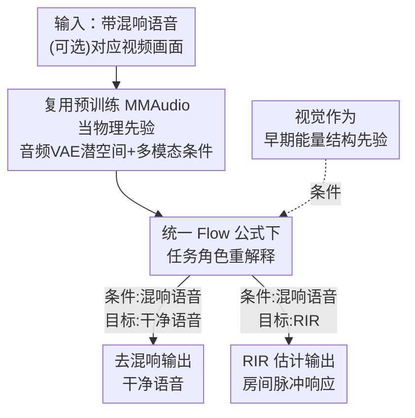

# MMAudioReverbs: Video-Guided Acoustic Modeling for Dereverberation and Room Impulse Response Estimation

**会议**: CVPR 2026  
**arXiv**: [2605.00431](https://arxiv.org/abs/2605.00431)  
**代码**: 无  
**领域**: 音频语音 / 多模态  
**关键词**: 视频到音频, 去混响, 房间脉冲响应, Flow Matching, 物理先验

## 一句话总结
本文发现预训练的视频到音频（V2A）大模型 MMAudio 其实隐式编码了"画面 ↔ 房间声学"的关系，于是**不改任何网络结构**、只在小数据集上微调，就把它复用成一个统一框架去做去混响和房间脉冲响应（RIR）估计两件事，并实验性地揭示出"视觉主要帮早期能量、晚期混响只能靠声学"的分工规律。

## 研究背景与动机

**领域现状**：近年的 V2A 模型（如 MMAudio）已经能从视频画面合成语义上很合理的声音，听感真实。房间声学建模（去混响、RIR 估计）则一直是语音增强、虚拟声学、视频配音等应用的基础环节。

**现有痛点**：V2A 模型只追求"内容/感知上像"，**完全不显式建模房间声学效应**（混响、RIR），因此对这些效应几乎没有可控性。另一边，已有的视觉引导房间声学方法（geometry-aware RIR、material-aware 建模等）则各自设计**任务专用架构**来注入几何/材质先验，每个任务都要重新搭一套网络，迁移和复用成本高。

**核心矛盾**：一边是"懂画面但不懂物理声学"的通用大模型，一边是"懂物理声学但要专用架构、不通用"的专门方法——两者的能力被人为隔开了。

**本文目标**：验证一个假设——SOTA 的 V2A 基础模型是否**已经隐式编码了视觉线索与房间声学属性（房间几何、空间布局、材质、声源-接收点关系）之间的关系**，从而能被直接"借用"来做物理接地的声学任务，而不必改架构。

**切入角度**：受 MMAudioSep 启发，作者认为 MMAudio 在大规模 V2A 预训练中已经"顺带"学到了场景布局、物体摆放、声源-接收点关系等信息。既然它已经知道"这个房间长什么样、声音会怎么传"，那它就可以当作**物理先验的来源**。

**核心 idea**：把预训练 V2A 模型当成现成的物理先验，**不改架构、只微调**，并通过在同一套 flow-matching 公式里**重新解释"条件信号"和"目标轨迹"的角色**，让同一组参数同时胜任去混响和 RIR 估计两个反向/条件生成任务。

## 方法详解

### 整体框架
整篇方法的核心主张可以浓缩成一句："不动 MMAudio 的网络，只换它在 flow 里的输入输出角色，再微调。"输入是带混响的语音（可选地配上对应视频画面），输出根据任务不同分别是干净语音（去混响）或房间脉冲响应（RIR 估计）。中间复用 MMAudio 的三大件：预训练音频 VAE 的潜空间、统一的多模态条件接口、以及 flow-matching 生成动力学。两个任务共享同一套可学习参数和架构组件，差别仅在于"谁当条件、谁当目标潜轨迹"——在 MMAudio 架构图里就是把右上角那一小块（图 2a 中浅蓝虚线高亮的部分）替换成去混响（图 2b）或 RIR 估计（图 2c）的接法。

### 关键设计

**1. 把预训练 V2A 模型当物理先验复用，零架构改动**

针对"通用 V2A 模型不显式建模房间声学、专用声学方法又要各搭一套架构"这个矛盾，本文的做法是直接拿 SOTA 的 MMAudio 当骨干，**一行架构都不改**，只在很小的数据集（SoundSpaces-Speech，2.56 秒片段、20k 步）上微调。这之所以可行，是建立在一个具体假设上：MMAudio 在 V2A 预训练里已经隐式学到了场景布局、物体摆放、声源-接收点关系等信息，因此它本身就是一个现成的"物理先验"容器。实验也给了直接证据——同样的条件设置下，从预训练初始化微调比从头训练（Scratch）在去混响的 RTE 和 RIR 的多数指标上都更低，说明预训练表征确实提供了对房间声学有益的起点，而不是随便一个初始化都能学出来

**2. 统一 Flow 公式下的任务角色重解释，一套参数干两件事**

MMAudio 在预训练音频 VAE 的潜空间里、用 flow-matching 目标训练。本文的关键洞察是：**同一套 flow 动力学不需要重参数化就能跨任务复用**，既能表达逆映射也能表达条件生成。于是作者不为每个任务单独建模，而是通过**重新解释"条件信号"与"目标潜轨迹"的角色**来实例化不同任务：去混响被建模为"从带混响语音到干净语音"的条件映射，本质是抑制声学上不一致的反射；RIR 估计则是"以输入带混响音频为条件、生成与之一致的房间脉冲响应"。两个任务共享完全相同的可学习参数和架构组件，切换任务只是替换图 2a 右上角的输入/目标接法。这种"角色重解释"避免了为反问题和生成问题各搭一套网络，也让"同一个先验同时服务两个声学任务"成为可能。推理时关闭了 classifier-free guidance（CFG），因为作者发现它会引入额外的生成随机性、反而降低估计精度——这对"需要物理准确"而非"听感多样"的估计任务很关键

**3. 视觉作为早期能量的结构先验，与声学证据互补**

为了厘清"视觉到底帮不帮、帮在哪"，本文在推理时对比两种条件设置：纯音频（A）与音频+视觉（A+V）。结论很清晰：**视觉主要充当早期声传播的结构先验，晚期混响则根本上由声学证据决定**。物理上，晚期混响（如 RT60 这类衰减指标）由长时间累积的时域声学证据主导，而早期能量和直达声占比则与场景布局、声源-接收点几何强相关，这部分可以从画面里部分推断出来。证据是：RIR 估计里加视觉后 DRR（直达-混响比）误差明显下降（早期能量受益），而 RT60 这类晚期指标 A-only 反而更好；去混响任务两种设置几乎打平，说明那里声学条件已经足够。作者还点出一个 caveat——画面里**声源常常不可见**，所以"从视觉单独推断声源-接收点关系"本就困难；但哪怕只知道"接收点视角里没有声源"，对建模早期反射和直达声也已经有意义，因此早期能量指标的改善可解读为"隐式视觉线索提供了物理上有意义、但不完整的先验"

## 实验关键数据

数据集为 SoundSpaces-Speech（16 kHz，全景 RGB 裁成 120° 方形视图作视觉条件），vocoder 用 BigVGAN 且两任务分开训练。"A"=纯音频，"A+V"=音频+视觉。

### 主实验

**去混响（Table 1a）**：↑ 越高越好，↓ 越低越好。

| 方法 | 模态 | SRMR↑ | RT60(ms)↓ | RTE(ms)↓ | DNSMOS-OVRL↑ |
|------|------|-------|-----------|----------|--------------|
| Clean（参考） | – | 7.26 | 39.4 | – | 3.19 |
| Reverberant（输入） | – | 4.75 | 403.1 | 363.9 | 2.09 |
| WPE | A | 5.97 | 137.2 | 127.3 | 2.34 |
| VIDA | A+V | 6.54 | 78.2 | 56.2 | 2.62 |
| Ours (Scratch) | A | 7.22 | 30.1 | 29.4 | 3.24 |
| Ours (Finetune) | A | 7.27 | **27.1** | **28.7** | 3.24 |
| Ours (Finetune) | A+V | **7.29** | 27.2 | 28.9 | 3.24 |

本文 RTE 从 VIDA 的 56.2 ms 大幅降到 28.7 ms，且多个指标甚至超过 "Clean" 参考——作者解释 Clean 信号本身可能还残留背景噪声和混响，而模型把它们进一步抑制了。微调相比从头训练把 RTE 从 29.4 降到 28.7，验证了预训练初始化的价值；A 与 A+V 在去混响上几乎打平。

**RIR 估计（Table 1b）**：Δ 表示与参考 RIR 解算参数的绝对误差，越低越好。

| 方法 | 模态 | ΔRT60(ms)↓ | ΔDRR(dB)↓ | ΔEDT(ms)↓ |
|------|------|-----------|-----------|-----------|
| Image2Reverb | V | 131.7 | 4.94 | 382.1 |
| FiNS | A | 87.7 | 3.30 | 235.7 |
| S2IR-GAN | A | 63.1 | 3.04 | 168.3 |
| AV-RIR | A | 88.8 | 2.96 | 122.4 |
| AV-RIR | A+V | 40.2 | 1.76 | 77.2 |
| Ours (Finetune) | A | 51.6 | 2.40 | **41.9** |
| Ours (Finetune) | A+V | 60.0 | 2.36 | 47.5 |

本文在 ΔEDT 上（41.9 ms）显著优于 AV-RIR 的 A+V（77.2 ms）。注意一个反直觉现象：晚期指标 ΔRT60 上 A-only（51.6）反而比 A+V（60.0）更好，而早期相关的 ΔDRR 上 A+V（2.36）略优于 A（2.40），印证了"视觉帮早期、声学定晚期"的核心洞察。

### 消融实验

| 配置 | 现象 | 说明 |
|------|------|------|
| Finetune vs Scratch | 微调多数指标更低（去混响 RTE 29.4→28.7；RIR ΔRT60 78.9→51.6） | 预训练表征是有益初始化 |
| A vs A+V（去混响） | 几乎打平（RTE 28.7 vs 28.9） | 声学条件已足够，视觉冗余 |
| A vs A+V（RIR 早期能量） | A+V 的 ΔDRR 更低（2.40→2.36） | 视觉为早期能量提供结构先验 |
| A vs A+V（RIR 晚期混响） | A-only 的 ΔRT60 更低（51.6 vs 60.0） | 晚期混响由时域声学证据主导 |
| CFG 开/关 | 关闭 CFG | CFG 引入生成随机性，降低估计精度 |

### 关键发现
- **预训练初始化是真有用**：从头训练 vs 微调的对比是最关键的消融——RIR 估计 ΔRT60 从 78.9 直接降到 51.6，证明 MMAudio 的多模态预训练表征确实编码了对房间声学有益的物理先验。
- **视觉的作用有明确边界**：视觉只在早期能量/直达声占比（ΔDRR）上带来增益，对晚期混响（RT60）几乎无帮助甚至有害——这是全文最有价值的物理洞察。
- **声源不可见限制了视觉**：画面里常看不到声源，导致"从视觉推断声源-接收点距离"困难，这正是晚期混响指标无法靠视觉改善的物理原因。

## 亮点与洞察
- **"零架构改动复用大模型"是最省力的迁移范式**：不重新设计网络、只重解释 flow 里的输入输出角色 + 小数据微调，就把一个生成模型变成两个物理估计器，思路非常干净，可迁移到其他"有预训练大模型 + 想做反问题"的场景。
- **把"视觉到底帮哪部分声学"量化清楚**：很多多模态工作笼统说"视觉有帮助"，本文用 DRR（早期）vs RT60（晚期）的分项对比，给出了"视觉=早期结构先验、声学=晚期主导"的可解释结论，这种"拆开看每个模态各管什么"的分析值得借鉴。
- **统一 flow 公式做反问题+条件生成**：同一套 flow-matching 既表达"混响→干净"的逆映射又表达"音频→RIR"的条件生成，说明 flow 框架在角色重解释下天然支持多任务复用。

## 局限与展望
- **方法描述偏概念、缺细节**：论文（短文形式）对"条件信号与目标潜轨迹具体怎么重接"只给了文字和示意图，没有公式级的形式化，复现门槛偏高。⚠️ flow 公式的具体重参数化细节以原文/代码为准。
- **数据集单一、规模小**：只在 SoundSpaces-Speech（仿真数据、16 kHz、2.56 秒片段）上验证，未在真实录制 RIR 或更高采样率上测试，泛化性存疑。
- **视觉条件受限于声源可见性**：作者自己承认声源常不可见，限制了视觉对声源-接收点关系的建模；未来可引入显式几何/深度估计来补足这一缺口。
- **缺主观听感评测**：去混响只报客观指标（SRMR/DNSMOS），没有人类主观 MOS 听测，感知质量仍有待确认。

## 相关工作与启发
- **vs V2A 生成模型（MMAudio / 通用 V2A）**：它们追求内容/感知真实、不显式建模房间声学；本文反过来把同一个 MMAudio 当物理先验来源，揭示其隐式编码的声学知识，是"复用而非重训"的视角。
- **vs 任务专用视觉声学方法（AV-RIR / Image2Reverb / geometry-aware RIR）**：它们为注入几何/材质先验各搭专用架构；本文不做任务专用特化，只验证"通用 V2A 模型能否隐式提供这些先验"，并在 ΔEDT 等指标上超过 AV-RIR 的 A+V 设置。
- **vs MMAudioSep**：直接启发来源——MMAudioSep 表明 V2A 模型隐式编码了空间音频与视觉的关系，本文把这一假设推广到去混响和 RIR 估计两个物理声学任务。

## 评分
- 新颖性: ⭐⭐⭐⭐ 「零架构改动 + flow 角色重解释复用 V2A 大模型做物理声学」的视角新颖，但更偏"巧妙复用"而非全新方法
- 实验充分度: ⭐⭐⭐ 双任务对比 + Scratch/Finetune + A/A+V 消融到位，但数据集单一、无主观听测、属短文规模
- 写作质量: ⭐⭐⭐⭐ 动机清晰、洞察提炼好，但方法形式化偏弱、缺公式细节
- 价值: ⭐⭐⭐⭐ "视觉管早期、声学定晚期"的可解释结论对多模态声学建模有实际指导意义

<!-- RELATED:START -->

## 相关论文

- [\[ICLR 2026\] AC-Foley: Reference-Audio-Guided Video-to-Audio Synthesis with Acoustic Transfer](../../ICLR2026/audio_speech/ac-foley_reference-audio-guided_video-to-audio_synthesis_with_acoustic_transfer.md)
- [\[CVPR 2026\] Hearing the Room Through the Shape of the Drum: Modal-Guided Sound Recovery from Multi-Point Surface Vibrations](hearing_the_room_through_the_shape_of_the_drum_modal-guided_sound_recovery_from_.md)
- [\[CVPR 2025\] MultiFoley: Video-Guided Foley Sound Generation with Multimodal Controls](../../CVPR2025/audio_speech/video-guided_foley_sound_generation_with_multimodal_controls.md)
- [\[CVPR 2026\] Semantic Noise Reduction via Teacher-Guided Dual-Path Audio-Visual Representation Learning](semantic_noise_reduction_via_teacher-guided_dual-path_audio-visual_representatio.md)
- [\[CVPR 2026\] SAVE: Speech-Aware Video Representation Learning for Video-Text Retrieval](save_speech-aware_video_representation_learning_for_video-text_retrieval.md)

<!-- RELATED:END -->
