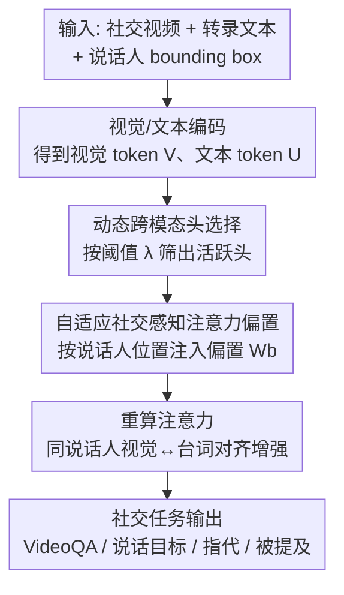

# Multi-speaker Attention Alignment for Multimodal Social Interaction

**会议**: CVPR 2026  
**论文**: [CVF Open Access](https://openaccess.thecvf.com/content/CVPR2026/html/Ouyang_Multi-speaker_Attention_Alignment_for_Multimodal_Social_Interaction_CVPR_2026_paper.html)  
**代码**: https://github.com/ut-vision/SocialInteraction  
**领域**: 多模态VLM / 视频理解  
**关键词**: 多人社交理解、跨模态注意力、说话人对齐、免训练干预、MLLM

## 一句话总结
本文发现多模态大模型（MLLM）在多人对话场景里"说话人的文本 token 与其视觉区域"的跨模态注意力严重错位，于是提出一种**无需新增参数、无需改架构**的注意力对齐方法：先动态挑出真正负责视觉接地的注意力头，再往这些头里注入一个由说话人位置算出的自适应偏置，把同一说话人的视觉特征和台词"焊"在一起，在三个 MLLM、三个数据集上平均提升约 2~3% 并刷新多项 SOTA。

## 研究背景与动机
**领域现状**：理解视频里的社交互动需要同时推理"谁在说、对谁说、配合什么眼神/手势"。MLLM 因为天生能同时处理语言和视觉，被认为是这类任务（视频问答、说话目标识别、代词指代消解、被提及说话人预测）的天然候选。

**现有痛点**：作者实测发现一个反直觉现象——给 MLLM 喂入视觉信息**并不能稳定提升、甚至会拉低**多人场景的表现。例如在 OnlineMMSI 上，给 Qwen2.5-VL 加视频帧在"被提及说话人预测"任务上毫无收益，而 LLaMA-3.2-Vision 在"代词指代消解"上反而掉点。

**核心矛盾**：作者把问题定位到 transformer 内部的**跨模态注意力错位**。他们量化了"说话人文本 token → 该说话人 bounding box 视觉 token"的注意力强度，发现多人视频里这种对齐**远弱于、也远比 COCO 这类以物体为中心的图像分散**（Table 1：COCO 的 AttnMax 是 $9.23\times10^{-2}$，而 MMSI 只有 $4.54\times10^{-2}$）。根因在于对话里说话人常以"speaker 2""Mitchell"这类匿名/人名指代出现，缺乏明确的视觉对应物；而往文本里塞 box 坐标或往图上画彩色框等已有补救手段，要么注意力仍然很弱，要么注意力堆在框的边界、甚至把 speaker 3 的注意力错误地盖到 speaker 2 区域。

**本文目标**：在不破坏 MLLM 预训练能力、不引入可训练参数的前提下，把"同一说话人的视觉与文本表示"重新对齐。

**切入角度**：既然问题出在注意力分布本身，那就**直接在注意力层动手**，而不是绕外圈改 prompt 或重训模型。

**核心 idea**：用一句话概括——**只在真正负责视觉接地的那批注意力头上，按说话人位置注入一个自适应偏置，把跨模态注意力软性地推向当前说话人区域**。

## 方法详解

### 整体框架
方法是一个**插在现有 MLLM 跨注意力层内部的轻量干预模块**，输入是社交互动视频（被切成时空 patch 的视觉 token $V$）、带时间戳和说话人标签的转录文本（文本 token $U$）以及每帧每个说话人的 bounding box $B$；输出是经过对齐增强后的注意力分布，进而得到更准的社交任务答案。整条链路分两步：先用**动态跨模态头选择**从所有注意力头里筛出"活跃头"（真正在做视觉接地的头），只对它们动手以免破坏其他能力；再用**自适应社交感知注意力偏置**，把同一说话人的文本 token 与其视觉区域之间的注意力分数抬高。整个过程不新增任何可训练参数，box 标注只在推理时用来定位说话人区域。

### 关键设计

**1. 动态跨模态头选择：只挑负责接地的头动手，避免误伤预训练能力**

现代 MLLM 是多头注意力，不同头各司其职——已有研究指出某些层里存在专门盯着图像 token 的"视觉头"，且这些头随模型和训练策略而**动态变化**，并非固定。如果对所有头无差别地加偏置，会破坏那些本来不负责视觉接地的头的功能。作者因此先把全体说话人 box 内的视觉 token 记作 $V_{all}$，对每个注意力头计算它从全部话语 token 到这些区域的平均跨模态注意力，再用阈值 $\lambda$ 判活跃：当 $\frac{1}{|U||V_{all}|}\sum_{u\in U}\sum_{v\in V_{all}}\mathrm{Attn}(u,v) > \lambda$ 时该头为"活跃"，否则"非活跃"。活跃头的特征是注意力高度集中在一两个说话人区域，非活跃头则跨区域都很弱。**只有活跃头**才会被施加后续偏置，从而在增强接地的同时尽量保留模型原有能力。

**2. 自适应社交感知注意力偏置：按当前最强跨模态交互软性抬升同说话人对齐**

光选对头还不够，还要决定"抬多少"。作者在活跃头里给"说话人 $s$ 在第 $t$ 帧的文本 token $u_i$ 与其视觉 token $v_j$"注入偏置：

$$W_b(u_i, v_j) = \alpha \cdot \max_{v\in V_{all}} \frac{(u_i W_Q)(v W_K)^\top}{\sqrt{d}},\quad u_i\in U_{s,t},\ v_j\in V_{s,t}$$

其中 $\alpha$ 控制偏置强度，$\max_{v\in V_{all}}$ 取的是该文本 token 在**所有说话人视觉 token 中本来最强的那次跨模态交互**。这个"自适应"很关键：像"speaker""Sheldon"这种实体 token 天生和视觉交互强，而"yeah""then"这类语气填充词交互弱——用每个 token 自己的最大注意力值当偏置量，等于**按 token 本身的视觉相关性来分配抬升幅度**，把注意力分布平滑地推向当前说话人区域，而不是生硬地强压。最终调整后的注意力为

$$\widetilde{\mathrm{Attn}}(i,j) = \mathrm{softmax}_j\Big(\tfrac{(u_i W_Q)(v_j W_K)^\top}{\sqrt{d}} + W_b(u_i, v_j)\Big)$$

由于偏置完全由现有注意力分数和 box 位置算出，方法**不引入任何可训练参数**；又因为只作用在动态选出的活跃头上，额外计算开销极小。

### 损失函数 / 训练策略
方法本身是免训练的注意力干预，但实验里基线 MLLM 和加了本方法的模型都用 LoRA（rank=128、学习率 1e-4、batch=4、3 epoch）在三个数据集上微调以做公平对比。关键超参 $\lambda = 5\times10^{-5}$、$\alpha = 1.0$；视频统一处理为 $640\times360$、均匀抽 8 帧，结果取三次独立运行平均。

## 实验关键数据

### 跨模态对齐诊断（动机量化）
作者先用一张对照表证明"错位确实存在、且本方法对齐最强"，AttnMax / AttnMean 越高代表说话人文本与其视觉区域的注意力越强：

| 图像来源 / 对齐方法 | AttnMax ($\times10^{-2}$) | AttnMean ($\times10^{-4}$) |
|---|---|---|
| COCO（一般物体） | 9.23 | 15.56 |
| MMSI（无干预） | 4.54 | 3.26 |
| MMSI + Box Prompt | 4.49 | 3.93 |
| MMSI + Visual Prompt | 6.29 | 5.29 |
| MMSI + Fine-Tuning | 6.82 | 6.32 |
| **本文** | **17.09** | **26.20** |

多人场景的原始对齐（4.54）远低于 COCO（9.23），而塞 box 坐标、画彩色框、甚至微调都只能小幅改善；本方法把 AttnMax 拉到 17.09，**显著超过所有补救手段**。

### 主实验
在 TVQA+、MMSI、OnlineMMSI 上跨四个社交任务（VideoQA、T=说话目标识别、P=代词指代消解、M=被提及说话人预测）对比，输入模态 V=视频、L=文本、B=说话人框：

| 模型 | TVQA+ VideoQA | MMSI (T/P/M) | OnlineMMSI (T/P/M) | 平均提升 |
|---|---|---|---|---|
| Qwen2.5-VL (VLB) | 86.1 | 64.8 / 76.6 / 62.4 | 60.1 / 75.9 / 50.2 | — |
| **Qwen2.5-VL + 本文** | 87.3 | 68.5 / 78.6 / 66.0 | 62.4 / 78.2 / 53.1 | **+2.6** |
| LLaVA-NeXT-Video + 本文 | 84.6 | 68.0 / 79.9 / 63.3 | 61.0 / 77.8 / 52.9 | +2.1 |
| InternVL3 + 本文 | 89.1 | 69.7 / 80.5 / 65.7 | 62.6 / 79.7 / 55.2 | +3.2 |

三个 MLLM 全部稳定提升；MMSI 上的增益高于 TVQA+，因为 MMSI 平均 4.1 个说话人、参与者更多，更能体现多说话人对齐的优势（而 TVQA+ 来自剧本固定的电视剧，模型微调时可能直接学到人名-token 关联）。相比往文本里注入 box/人名/颜色线索的基线（在 Qwen2.5-VL 上有的任务涨、有的任务掉、收益不稳定），本方法因为**直接改注意力分布**，跨模型、跨数据集、跨任务都稳定提升。唯一在"说话目标识别"上未夺冠（取得次优），作者归因于该任务需要在当前说话人与说话对象之间更平衡地分配注意力。

### 消融实验
| 配置 | 关键结果 | 说明 |
|---|---|---|
| 偏置作用层 0-27（全层） | MMSI-T 66.9 | 全层施加 |
| 偏置作用层 0-9（早层） | MMSI-T 66.9 | 早层 |
| **偏置作用层 10-19（中层）** | **MMSI-T 68.5 / TVQA+ 87.3** | 中层最优 |
| 偏置作用层 20-27（晚层） | MMSI-T 66.4 | 晚层 |
| 活跃头比例 ~9% (λ=5e-5) | 平均 +约3% | 只激活少量头就有效 |
| 活跃头比例 ~25% | 平均 +约4% | 激活更多头收益更大 |

### 关键发现
- **中层是跨模态融合主战场**：把偏置只加在 transformer 中间层（10-19）效果最好，与已有"中层负责跨模态特征融合"的研究一致。
- **少量头就够**：阈值 $\lambda=5\times10^{-5}$ 时即便只激活约 9% 的头，平均也能涨约 3%，证明"挑对头"比"全加"更划算。
- **可视化佐证**：注意力图显示，加偏置前模型会把 Penny 的注意力错放到 Beverley 区域而答错，加偏置后注意力自然聚到 Penny 上并答对；时间维度上也能从"均匀分布在所有帧"变成"聚焦到关键帧"。

## 亮点与洞察
- **把"加视觉没用"这件反直觉的事量化成了可诊断的注意力错位**：这是全文最有价值的洞察——不是 MLLM 不行，而是多人场景里跨模态注意力天然分散，作者用 AttnMax/AttnMean 把它测出来，给后续工作提供了一把可复用的"对齐尺子"。
- **免训练、零新增参数、即插即用**：偏置完全由现有注意力分数 + box 位置算出，能直接插进 LLaVA-NeXT-Video / Qwen2.5-VL / InternVL3 三种不同 MLLM，迁移成本极低。
- **"动态选头 + 自适应偏置"的组合可迁移**：凡是"想增强某类 token 的跨模态接地、又怕破坏预训练能力"的任务（如指代消解、视觉接地、多目标问答），都能借用"先筛活跃头、再按 token 自身最强交互软性抬升"这套思路。

## 局限与展望
- **依赖说话人 bounding box 标注**：偏置的注入位置完全靠 box 定位说话人区域，无框场景或检测不准时方法难以直接用，作者也是在带 box 标注的数据集上评测的。
- **说话目标识别任务未夺冠**：该任务需要在"当前说话人"和"说话对象"之间平衡注意力，而本方法主要强化"当前说话人"对齐，提示单向偏置在需要双向关注的任务上有上限。
- **超参偏经验性**：$\lambda$、$\alpha$ 和作用层区间都靠消融搜出，换模型/数据可能需要重调；⚠️ 偏置公式（式 4/5）以原文为准。
- **改进方向**：把 box 依赖换成模型内部自动定位说话人区域；或把偏置扩展为能同时建模"说话人↔说话对象"的双向版本。

## 相关工作与启发
- **vs MMSI / OnlineMMSI（说话人嵌入、视觉 prompt）**: 它们靠往文本/图像里注入说话人嵌入或彩色框来对齐，本文则直接改 transformer 内部注意力；优势是收益稳定、无需额外语言提示，且首次系统量化了这种错位。
- **vs 注意力调节类方法（调高对非文本模态的注意力）**: 这类方法在常规 VQA 上有效，但缺乏在多说话人社交场景的评测；本文是首个把跨注意力图用于多人社交任务、并在三个强 MLLM 上验证的工作。
- **vs MMSI + Fine-Tuning**: 微调虽提升下游表现，但对齐分数提升有限（AttnMax 仅 6.82），说明"下游涨分"未必等于"对齐变好"，而本方法直击对齐本身。

## 评分
- 新颖性: ⭐⭐⭐⭐⭐ 首次量化多说话人跨模态注意力错位，并给出免训练的对齐干预，问题定位与解法都很新。
- 实验充分度: ⭐⭐⭐⭐ 覆盖 3 个 MLLM × 3 数据集 × 4 任务并有可视化与消融，但依赖 box、部分超参偏经验性。
- 写作质量: ⭐⭐⭐⭐ 诊断→方法→验证逻辑清晰，注意力可视化直观。
- 价值: ⭐⭐⭐⭐ 即插即用、可迁移到多种 MLLM 与接地类任务，实用性强。

<!-- RELATED:START -->

## 相关论文

- [\[CVPR 2026\] Omni-MMSI: Toward Identity-Attributed Social Interaction Understanding](omni-mmsi_toward_identity-attributed_social_interaction_understanding.md)
- [\[CVPR 2026\] AMUSE: Audio-Visual Benchmark and Alignment Framework for Agentic Multi-Speaker Understanding](amuse_audio-visual_benchmark_and_alignment_framework_for_agentic_multi-speaker_u.md)
- [\[CVPR 2025\] DualTalk: Dual-Speaker Interaction for 3D Talking Head Conversations](../../CVPR2025/audio_speech/dualtalk_dual-speaker_interaction_for_3d_talking_head_conversations.md)
- [\[CVPR 2026\] HAVE-Bench: Hierarchical Audio-Visual Evaluation from Perception to Interaction](have-bench_hierarchical_audio-visual_evaluation_from_perception_to_interaction.md)
- [\[ICML 2026\] Towards Understanding Modality Interaction in Multimodal Language Models via Partial Information Decomposition](../../ICML2026/audio_speech/towards_understanding_modality_interaction_in_multimodal_language_models_via_par.md)

<!-- RELATED:END -->
