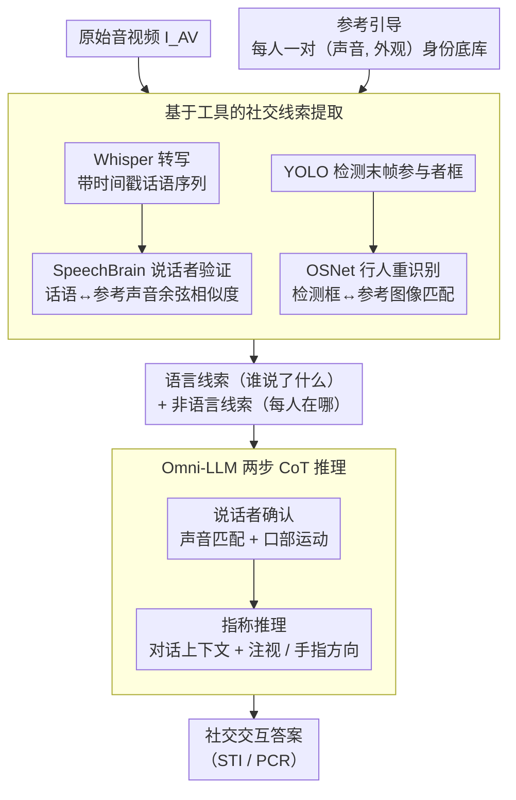

# Omni-MMSI: Toward Identity-Attributed Social Interaction Understanding

**会议**: CVPR 2026  
**arXiv**: [2604.00267](https://arxiv.org/abs/2604.00267)  
**代码**: [项目页](https://sampson-lee.github.io/omni-mmsi-project-page)  
**领域**: 音频语音 / 社交理解  
**关键词**: 社交交互理解, 身份归因, 多模态推理, 链式推理, 参考引导

## 一句话总结

提出 Omni-MMSI 任务——从原始音视频输入（而非预处理的 oracle 社交线索）理解多人社交交互，并设计 Omni-MMSI-R 参考引导流水线，通过工具生成身份归因社交线索 + 链式思维推理实现准确的社交交互理解。

## 研究背景与动机

多模态多人社交交互理解（MMSI）旨在解读社交场景中的人类行为，是构建社交智能 AI 系统的基础。现有研究（如说话目标识别 STI、代词共指消解 PCR）取得了显著进展，但存在一个根本假设：**身份归因的社交线索是预先完美提供的**（oracle 输入），例如"谁在说什么"和"每个人在哪里"都是已知的。

然而在真实部署中，AI 助手必须从原始音视频数据中自行感知和推理。从 oracle 输入切换到原始输入时：
- 先前流水线（Lee et al., Li et al.）准确率平均下降 **28.1%**
- 人类标注者和先进 Omni-LLM（Qwen2.5 Omni、Gemini 2.5 Pro）也下降 **9.52%**

**核心瓶颈是身份归因**：
- **视觉归因**：现有检测器在多人场景下容易在遮挡/重叠时发生身份交换（如 Gemini 按从左到右空间顺序分配身份，检测失败时就出错）
- **语音归因**：语音识别后无法正确将话语与说话者匹配（识别出的内容经常归属到错误的人）

## 方法详解

### 整体框架

Omni-MMSI 把多人社交交互理解从"假设身份归因线索已完美给定（oracle 输入）"推到"从原始音视频自己感知"，而瓶颈正是身份归因——谁在说话、谁在哪里。Omni-MMSI-R 是一条参考引导的 LLM 流水线，形式上是

$$f: (P, I_{AV}, \mathcal{R}) \rightarrow X_{answer}$$

输入为系统提示 $P$、原始音视频 $I_{AV}$ 和参考集 $\mathcal{R} = \{(a_i, v_i)\}_{i=1}^N$（每个参与者的代表性声音和外观）。整条流程是：加载参考 → 用专用工具生成身份归因线索 → Omni-LLM 做链式推理 → 输出答案，核心思想是先把"身份"这一步交给可靠的小工具，再让 LLM 在带身份的线索上做社交推理。

### 关键设计

**1. 参考引导：像认熟人一样给每个参与者建档**

通用 LLM 在多人遮挡场景下很容易把身份张冠李戴（如 Gemini 按从左到右的空间顺序分配身份，检测一失败就错）。Omni-MMSI-R 借鉴人类"记住熟人外貌和声音再做关联"的方式，为每个参与者手动裁剪上半身图像 + 提取语音片段构成一对参考，全集共 69 个音视觉参考 profile。实际部署时这些参考可以通过设备的注册/验证流程收集，相当于给社交推理提供了一份可比对的身份底库。

**2. 基于工具的社交线索提取：用专用模型而非 LLM 做身份匹配**

身份归因要准，靠的是任务专用工具而不是通用 LLM。音频侧先用 Whisper 把音频转成带时间戳的话语序列，再用 SpeechBrain 对每句话做说话者验证——把话语和每个参考声音编码成嵌入、算余弦相似度，相似度最高的参考即预测说话者。视觉侧用 YOLO 检测视频末帧里所有可见参与者的边界框，再用 OSNet 做行人重识别，把每个检测框和参考图像编码成视觉嵌入、取最高相似度作为预测视觉身份。两条线产出身份归因的语言线索（谁说了什么）和非语言线索（每人在哪里），交给后续推理。

**3. CoT 社交推理：用两步链式思维把线索落到指代上**

有了带身份的线索，还要推出"谁在对谁说"。推理被设计成两步结构化链：先做说话者确认，联合声音匹配和可见的口部运动锁定最后说话者；再做指称推理，结合语言线索（对话上下文、话语匹配）和非语言交互信号（互相注视、手指方向）推断说话者指代的对象。CoT 训练数据由 Gemini 2.5 Pro 生成，经拒绝采样（只保留答案正确的）和轻量人工审查后留用。

**4. 模型训练：在 Qwen2.5-Omni 上轻量微调**

底座选 Qwen2.5-Omni-7B，用 LoRA（rank=8）微调，框架为 LLaMA-Factory，交叉熵损失配余弦学习率调度；学习率 $1\times10^{-4}$、训练 3 个 epoch、上下文长度 16384 token。轻量微调既让模型学会按上面的两步链推理，又不破坏底座的多模态感知能力。

### 损失函数 / 训练策略

标准交叉熵损失训练模型同时生成推理过程 $X_{think}$ 和最终答案 $X_{answer}$：

$$X_{answer}, X_{think} = f_\theta^{\text{Omni-LLM}}(P, I_{AV}, \mathcal{R}, \mathcal{S})$$

## 实验关键数据

### 主实验

**社交交互理解（Ego4D + YouTube）**：

| 方法 | Ego4D STI | Ego4D PCR | Ego4D Avg. | YouTube STI | YouTube PCR | YouTube Avg. |
|------|-----------|-----------|------------|-------------|-------------|--------------|
| Qwen2.5 Omni 7B | 26.29 | 28.57 | 27.43 | 14.00 | 26.18 | 20.09 |
| Gemini 2.5 Pro | 36.12 | 39.28 | 37.70 | 36.13 | 53.47 | 44.80 |
| Lee et al. | 28.98 | 32.14 | 30.56 | 29.01 | 34.80 | 31.91 |
| Li et al. | 29.73 | 32.27 | 31.00 | 26.30 | 30.14 | 28.22 |
| **Omni-MMSI-R** | **40.57** | **45.54** | **43.06** | **37.46** | **56.62** | **47.04** |

Omni-MMSI-R 在 Ego4D 上超越先前流水线 12%+，在 YouTube 上超越 15%+。

**身份归因准确率**：

| 方法 | Ego4D 语言归因 | Ego4D 非语言归因 | Ego4D 平均 | YouTube 平均 |
|------|--------------|----------------|-----------|-------------|
| Gemini 2.5 Pro | 44.75 | 26.52 | 35.64 | 58.04 |
| Qwen3 Omni 30B | 52.61 | 57.61 | 55.11 | 55.14 |
| **Omni-MMSI-R** | **71.09** | **86.48** | **78.79** | **76.95** |

Omni-MMSI-R 在身份归因上超越 Omni-LLM 约 23.7%（Ego4D）和 18.9%（YouTube）。

### 消融实验

**参考引导输入配置（Ego4D）**：

| 参考音频 | 参考视觉 | 语言线索 | 非语言线索 | 平均准确率 |
|----------|----------|----------|-----------|-----------|
| ✗ | ✗ | ✗ | ✗ | 33.97% |
| ✓ | ✓ | ✗ | ✗ | 35.98% |
| ✗ | ✗ | ✓ | ✓ | 39.44% |
| ✓ | ✓ | ✓ | ✓ | **43.06%** |

原始参考和工具提取的线索互补，联合使用最佳。

**CoT 推理粒度**：

| 配置 | 推理步骤 | 平均准确率 |
|------|---------|-----------|
| 有参考 | None | 39.41% |
| 有参考 | 1-step（指称推理） | 39.70% |
| 有参考 | 2-step（说话者确认+指称推理） | **43.06%** |
| 有参考 | 3-step（+线索提取） | 34.43% |

**2-step CoT 最优**，3-step 反而大幅下降——过长推理链分散模型注意力，且超出模型能力。

### 关键发现

1. **身份归因是从 oracle 到 raw 输入的核心瓶颈**：先进 Omni-LLM 在提取线索方面表现不错，但在将线索正确关联到个体上严重不足
2. 参考引导对小模型（7B）比大模型更重要：小 Omni-LLM 在有参考时性能反而下降（可能无法有效利用参考信息），说明工具辅助的必要性
3. LLM 并非盲目信任工具提取的线索：通过联合使用原始音视频证据和提取线索，模型能在 CoT 推理中自行纠正不准确的线索
4. 适中的推理粒度（2-step）最优，过度分解推理步骤有害
5. 音频和视觉模态的贡献互补：单独加音频归因 +5.87%，单独加视觉归因 +4.59%，联合 +9.09%

## 亮点与洞察

- **问题定义本身很有价值**：将 MMSI 从假设 oracle 输入推进到 raw 输入，是从学术研究走向实际部署的关键一步
- **参考引导**的设计理念很实际：类似人脸解锁/声纹注册流程，部署场景下收集参考是可行的
- **工具 + LLM 推理**的组合比纯端到端 LLM 更可靠——特定任务的轻量工具（Whisper/YOLO/SpeechBrain/OSNet）在身份归因上远超通用 LLM
- CoT 粒度实验的发现（3-step 反而差）很有实践意义：推理链设计需要匹配模型能力和训练数据量

## 局限与展望

1. 参考对需要手动构建（每个参与者的上半身图像 + 语音片段），自动化参考获取是重要方向
2. 总体准确率仍然较低（Ego4D 43%、YouTube 47%），距离实际部署还有距离
3. CoT 数据通过 Gemini 2.5 Pro 生成，可能引入自动生成偏差
4. 仅在狼人杀游戏数据集上验证，场景多样性有限
5. 当前工具链的错误会传播到下游推理，需要更鲁棒的错误处理机制

## 相关工作与启发

- 与 Lee et al. 和 Li et al. 的先前 MMSI 工作直接延伸——从 oracle 到 raw 的范式转换
- LLM 工具使用（tooling）在社交理解中的首次系统探索，填补了 MMSI 与 LLM agent 的连接
- CoT 推理在社交场景中的应用证明了结构化推理对细粒度多模态理解的价值
- 对实际 AI 助手的启示：在多人交互场景中，身份追踪/归因能力是理解社交动态的前提

## 评分

- 新颖性: ⭐⭐⭐⭐ （任务定义新颖，参考引导设计实用，方法论上是工程集成而非全新架构）
- 实验充分度: ⭐⭐⭐⭐⭐ （多基线、多 LLM 对比、详尽消融、定性分析）
- 写作质量: ⭐⭐⭐⭐ （问题动机清晰，定量证据充分展示了从 oracle 到 raw 的性能差距）
- 价值: ⭐⭐⭐⭐ （推动了 MMSI 领域向更真实场景的发展）

<!-- RELATED:START -->

## 相关论文

- [\[ICLR 2026\] Human Behavior Atlas: Benchmarking Unified Psychological and Social Behavior Understanding](../../ICLR2026/audio_speech/human_behavior_atlas_benchmarking_unified_psychological_and_social_behavior_unde.md)
- [\[ICML 2026\] Towards Understanding Modality Interaction in Multimodal Language Models via Partial Information Decomposition](../../ICML2026/audio_speech/towards_understanding_modality_interaction_in_multimodal_language_models_via_par.md)
- [\[CVPR 2026\] OmniRet: Efficient and High-Fidelity Omni Modality Retrieval](omniret_efficient_and_high-fidelity_omni_modality_retrieval.md)
- [\[ICLR 2026\] Query-Guided Spatial-Temporal-Frequency Interaction for Music Audio-Visual Question Answering](../../ICLR2026/audio_speech/query-guided_spatial-temporal-frequency_interaction_for_music_audio-visual_quest.md)
- [\[ACL 2025\] DNCASR: End-to-End Training for Speaker-Attributed ASR](../../ACL2025/audio_speech/dncasr_end-to-end_training_for_speaker-attributed_asr.md)

<!-- RELATED:END -->
