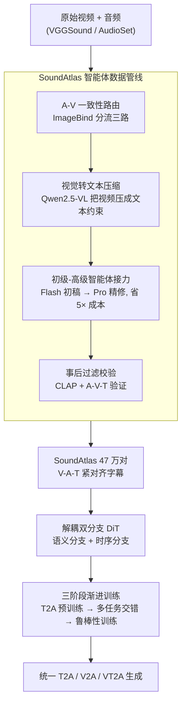

# Omni2Sound: Towards Unified Video-Text-to-Audio Generation

**会议**: CVPR 2026  
**论文**: [CVF Open Access](https://openaccess.thecvf.com/content/CVPR2026/html/Dai_Omni2Sound_Towards_Unified_Video-Text-to-Audio_Generation_CVPR_2026_paper.html)  
**代码**: 项目页 https://omni2sound.github.io  
**领域**: 扩散模型 / 音频生成 / 多模态VLM  
**关键词**: 统一音频生成、视频-文本-到-音频、扩散 Transformer、数据集构建、多任务训练

## 一句话总结
本文要训练一个**单一模型同时干好** video-to-audio（V2A）、text-to-audio（T2A）和 video-text-to-audio（VT2A）三件事，但卡在"高质量 V-A-T 对齐字幕稀缺"和"任务间/任务内相互竞争"两道坎上；为此先用一条智能体标注流水线造出 47 万对紧对齐字幕数据集 SoundAtlas，再配一个解耦双分支 DiT + 三阶段渐进训练的 Omni2Sound 模型，最终用一个标准 DiT 骨干在三项任务上全部刷到 SOTA。

## 研究背景与动机
**领域现状**：音频生成正从单模态条件走向统一框架。T2A 语义保真强但缺乏密集时序控制；V2A 时序同步好但在复杂场景推理弱、容易生成不该有的音乐/人声；VT2A 同时吃视频和文本，语义和时序都好，但**强依赖两路输入同时在场**，缺一路（只有视频或只有文本）就急剧退化。把三者塞进一个原生支持 VT2A/V2A/T2A 的统一模型，是顺应 AIGC 趋势、省掉多套专用模型来回切换的自然选择。

**现有痛点**：作者指出统一 VT2A 框架有两个被忽视的根本难题。其一是**高质量字幕稀缺**——多数工作直接拿"只听音频生成的字幕"去配视频，造成训练数据里视觉内容和（纯音频）文本字幕**语义打架**（图 1：远处烟花 vs 网球击球、汽车引擎 vs 电钻，音频本身就有歧义，再叠加早期音频语言模型的幻觉，错配雪上加霜），实测会导致收敛不稳、音频保真度大幅下降。其二是**任务竞争**：跨任务上 V2A 与 T2A 存在零和权衡（偏向一个就拖累另一个）；任务内 VT2A 自身存在模态偏置（偏文本→音视频不同步，偏视频→画外音文本保真差）。

**核心矛盾**：统一模型想"既要又要"，但数据质量不够 + 任务间天然异质，使联合训练退化成此消彼长。

**本文目标**：(1) 造出 V-A-T 紧对齐的大规模字幕数据；(2) 设计一个能把竞争转成协作、并抑制模态偏置的统一模型与训练方案。

**切入角度**：作者的关键观察是——**视觉应当被当成"上下文约束"而非"主输入"**，并且**高质量的 VT2A 数据可以充当连接异质视频/文本特征空间的"语义桥"**，把零和竞争掰成协作。

**核心 idea**：用一条"先把视频压成文本约束、再由初/高级智能体接力生成、最后多重过滤"的流水线造高对齐字幕，配合"先 T2A 预训练→多任务交错→鲁棒性训练"的三阶段课程，让单个 DiT 统一三项任务。

## 方法详解

### 整体框架
方法由两大块串成：先是**SoundAtlas 数据构建**——给 VGGSound/AudioSet 的原始视频音频打上人类专家级、V-A-T 紧对齐的字幕（470k 对）；再是 **Omni2Sound 模型**——一个标准 DiT 骨干，用解耦双分支注入多模态条件，并按三阶段渐进课程训练，最终支持灵活的 T2A / V2A / VT2A 生成。整条链路里，数据管线解决"字幕脏"的问题，解耦架构解决"如何同时管语义和时序、还能缺模态降级"的问题，三阶段训练解决"任务间/任务内竞争"的问题。

### 关键设计

**1. SoundAtlas 智能体数据管线：把视频当约束而非主输入，造高对齐字幕还省成本**

针对"纯音频字幕 V-T 打架、原生多模态模型又贵又有视觉偏置"的痛点，作者设计了一条四步流水线。第一步 **A-V 一致性路由**：用 ImageBind 对齐分数 $s_{ib}$ 把样本分三路——$s_{ib}>0.30$ 进"音视频增强路"（视觉可信，用来增强），$0.20\le s_{ib}\le 0.30$ 进"纯音频路"（视觉是干扰，弃用视觉防幻觉），$s_{ib}<0.20$ 直接丢弃。第二步 **视觉转文本压缩**（核心洞察）：对增强路样本，用 Qwen2.5-VL 只看视频（不看音频）生成文本表示 $c_v = \mathrm{Qwen}(V)$，把昂贵的原始视频输入换成廉价的"文本-音频"提示，既降成本又因为只给语义上下文（如"一男一女站着"）而非原始视觉流，**移除了直接的视觉偏置**。第三步 **初级-高级智能体接力**：每个样本先交给初级智能体 $G_{junior}$（Gemini 2.5 Flash），它吃音频 $A$ 和可选视觉上下文 $c_v$ 产出字幕 $c_a$；只有当字幕触发复杂度标准、含高频幻觉短语、或 $\mathrm{CLAP}(c_a, A)<\tau_{clap}$（一般音频 $\tau_{clap}=0.35$、音乐 $0.15$）时才升级给高级智能体 $G_{senior}$（Gemini 2.5 Pro，推理输出限 128 token 控成本），整体省下约 **5×** 成本。第四步 **事后过滤校验**：先用 CLAP(T-A) 滤掉文本-音频不忠实的字幕，再对增强路样本用 A-V-T 验证器检查字幕是否与视觉上下文 $c_v$ 在声学上自洽。这条管线的语义/时序对齐质量甚至超过人类专家标注。

**2. 解耦双分支 DiT：把"是什么"和"什么时候"拆开，天然支持缺模态降级**

为了既保证语义又保证时序、还要能只给一路输入就生成，作者用标准 DiT 骨干（条件来自预训练音频 VAE 的隐特征），把多模态条件**解耦成两条分支**。**语义分支（What）**负责全局语义：把 Flan-T5 的文本嵌入 $F_t$ 和 CLIP 的视觉特征 $F_v$（8 fps 采样）沿时间维拼接，经 cross-attention 注入——这种拼接式注入的妙处在于，**想做单模态生成（V2A 或 T2A）只需省掉缺席的那一路、无需任何 padding 约束**，灵活性天然。**时序分支（When）**负责细粒度同步：用 Synchformer 抽取密集视觉时序特征 $F_s$，经 AdaLN 全局注入。这套解耦设计同时拿到了"多条件框架的灵活可扩展"和"接近 MM-DiT 的精确时序对齐"两个好处。

**3. 三阶段渐进训练：把跨任务竞争掰成协作，再单独治模态偏置**

朴素联合训练会同时撞上跨任务和任务内两种竞争，作者拆成三阶段。**阶段一·大规模 T2A 预训练**：先在大规模文本-音频对上用标准 L2 去噪损失 $L = \mathbb{E}_{t,z_t,\epsilon}\lVert \epsilon - \epsilon_\theta(z_t, t, H_c)\rVert^2$ 学一个稳健的生成先验，这样后续阶段只需极少量高质量 T2A 重放就能防遗忘。**阶段二·多任务交错训练**：每步只从分类分布 $\mathrm{Cat}(\pi)$ 采样**单一**任务 $s\in\{V2A, T2A, VT2A\}$ 并只用该任务数据做一次梯度更新（避免 batch 内损失混合），核心是让**高对齐的 VT2A 数据当"语义桥"**，把 V2A↔T2A 的零和竞争转成协同优化，此时 T2A 采样率压到 $\pi_{T2A}=0.1$ 也不灾难性遗忘。**阶段三·鲁棒性训练（解耦在阶段二之后）**：用两个互补增强治模态偏置——**Text Dropout** 随机丢文本 token，逼模型多看视觉、增强音视频同步；**Off-screen Synthesis** 掺入画外音样本并在文本里描述它们，造出"音频内容不在画面里"的训练对，逼模型重视文本、提升画外音的文本保真。作者强调这一阶段必须放在阶段二收敛**之后**，提前引入会破坏多任务优化的稳定性。

## 实验关键数据

### 字幕质量（数据侧）
SoundAtlas 在语义保真（CLAP 分数）和质量胜率上全面领先已有自动管线乃至人类专家：

| 数据管线 | AudioSet LA-CLAP↑ | VGGSound LA-CLAP↑ | MLLM 评判 MWR-S↑ |
|---|---|---|---|
| AudioSetCaps | 0.330 | 0.351 | — |
| Auto-ACD | 0.396 | 0.409 | 0.39 |
| Human-Expert (AudioCaps) | — | — | 0.36 |
| **SoundAtlas (本文)** | **0.447** | **0.461** | **0.75** |

SoundAtlas 的语义对齐胜率 0.75，远超最强基线 Auto-ACD（0.39）和人类专家标注（0.36）。

### 主实验
在自建 VGGSound-Omni 基准上，单个 Omni2Sound 在三项任务上全部 SOTA（FAD/FD 越低越好，IB/CLAP 越高越好；DS=去同步分越低越好）：

| 任务 | 方法 | FAD↓ | FD↓ | DS↓ | IB↑ | CLAP↑ |
|---|---|---|---|---|---|---|
| T2A | MMAudio | 1.63 | 8.62 | — | — | 0.50 |
| T2A | **Omni2Sound** | **1.01** | **4.61** | — | — | **0.53** |
| V2A | MMAudio | 0.81 | 5.65 | 0.48 | 0.28 | 0.43 |
| V2A | **Omni2Sound** | **0.51** | **3.41** | **0.47** | **0.35** | **0.44** |
| VT2A | MMAudio | 0.91 | 5.28 | 0.49 | 0.29 | 0.49 |
| VT2A | **Omni2Sound** | **0.53** | **2.95** | 0.49 | **0.34** | **0.52** |

对照基线既有统一模型（AudioX、MMAudio）也有专用模型（ThinkSound、HunyuanVideo-Foley）。即便换成第三方 Video-LLaMA 风格字幕，Omni2Sound 仍超过所有基线，说明对未见字幕风格鲁棒；在 Kling-Audio-Eval、AudioCaps 等第三方基准上也保持竞争力（在 AudioCaps 上 KL/FD/CLAP 取得最佳）。

### 消融实验
| 配置 | 关键结果 | 说明 |
|---|---|---|
| TA+VA, $\pi_{T2A}$ 0.20→0.40 | T2A FAD 1.36→1.06，但 V2A FAD 0.56→0.62 | 朴素联合训练的 V2A-T2A 零和权衡 |
| **+ SoundAtlas VTA\*（语义桥）** | T2A FAD **0.94** / V2A FD **3.61** / VT2A FD **2.83** | 高对齐 VTA 数据解竞争，三任务同时最佳 |
| 换成低质 TA/VTA 数据 | T2A FAD 1.13（明显更差） | 证明是"数据质量"而非"任务存在"在起作用 |
| 仅 S2 | VT2A FAD 0.63 / FD 4.40 | 无预训练 |
| S1→S2 | VT2A FAD 0.53 / FD 2.83 | 加预训练大幅提升 |
| S1→[S2+S3]（提前融合） | V2A FD 3.81，劣于完整版 | 鲁棒性增强不能提前引入 |
| **S1→S2→S3（完整）** | V2A FAD **0.51** / FD **3.41** / IB **0.35** | 三阶段最优 |

### 关键发现
- **桥效应取决于数据质量**：同样引入 VT2A 任务，用 SoundAtlas（高对齐）能把 V2A-T2A 竞争解掉、三任务齐升；换成纯音频字幕的低质 VTA 数据则照样退化，证明"是高保真对齐的桥数据、而非 VT2A 任务本身"在起作用。
- **三阶段顺序不可乱**：把鲁棒性增强（S3）提前和多任务训练（S2）混在一起（S1→[S2+S3]）会扰乱优化、指标变差；必须等 S2 收敛后再单独做 S3。
- **预训练带来数据效率**：阶段一的 T2A 先验让后续 T2A 采样率可压到 0.1 仍不遗忘，缓解了资源争抢。

## 亮点与洞察
- **"视觉当约束而非主输入"是反直觉但很管用的洞察**：把视频先用 VLM 压成文本上下文，既砍掉昂贵的原始视频推理成本，又顺手去掉了原生多模态模型的视觉偏置幻觉——一个动作解两个问题。
- **VT2A 数据作"语义桥"把零和竞争掰成协作**：这是全文最漂亮的训练观点，且用消融（高质 vs 低质桥数据）干净地证明了"质量才是关键"，比单纯堆数据量更有说服力。
- **解耦双分支 + 拼接式条件注入实现"缺模态自动降级"**：单模态生成只需省掉缺席分支、无需 padding，这套设计可迁移到任何"想用一个模型支持多种输入组合"的多模态生成任务。

## 局限与展望
- **依赖强闭源模型搭管线**：数据构建重度依赖 Gemini 2.5 Flash/Pro 和 Qwen2.5-VL，复现成本与可得性受限；CLAP/路由阈值（0.20/0.30/0.35/0.15）多为经验设定。
- **域差距下并非全面最优**：在 Kling-Audio-Eval 上部分指标落后 HunyuanVideo-Foley，作者归因于后者 100k 小时 vs 本文 2k 小时的数据量优势，说明在专业视频域上仍有差距。
- **画外音/非时间对齐场景仍是难点**：模态偏置要靠专门的鲁棒性阶段才压得住，提示统一框架在强非对称输入下仍脆弱；⚠️ 部分阈值与流程细节以原文附录为准。
- **改进方向**：减少对闭源标注模型的依赖、把路由/过滤阈值学习化、进一步扩大训练数据规模以缩小与超大数据模型的差距。

## 相关工作与启发
- **vs MMAudio**: MMAudio 首个整合 V2A+T2A 但本质 V2A 为中心、把 T-A 对仅当增强；本文把 T2A 当对等任务，并用三阶段训练正面化解跨任务竞争。
- **vs AudioX / AudioGenOmni**: 它们扩展了模态组合但靠暴力堆数据（AudioX 超 900 万样本）、忽视任务竞争；本文用高对齐桥数据 + 课程训练，用更标准的 DiT 骨干拿到统一 SOTA。
- **vs UniFlow-Audio**: UniFlow 首次系统分析任务竞争，但只粗分时间对齐/非时间对齐两类、未深入 V2A vs T2A 的细粒度竞争，也没碰 VT2A 联合生成；本文补上了这块空白。
- **vs Auto-ACD / Sound-VECaps（视觉增强字幕）**: 它们用"先单模态抽取再融合"的分离式设计，LLM 在有损文本上工作导致幻觉累积；本文用端到端音频 + 压缩视觉上下文，从源头减少幻觉。

## 评分
- 新颖性: ⭐⭐⭐⭐⭐ "视觉当约束""VT2A 数据当语义桥"两个洞察新颖，数据管线与训练课程设计巧妙。
- 实验充分度: ⭐⭐⭐⭐⭐ 自建基准 + 三方基准 + 主客观评测，消融干净地证明了数据质量与阶段顺序的因果。
- 写作质量: ⭐⭐⭐⭐ 难题→数据→模型→训练逻辑清晰，但符号与流程细节较多、需对照附录。
- 价值: ⭐⭐⭐⭐⭐ 单模型统一三任务 SOTA，数据集与基准对社区有持续价值。

<!-- RELATED:START -->

## 相关论文

- [\[CVPR 2026\] OmniSonic: Towards Universal and Holistic Audio Generation from Video and Text](omnisonic_towards_universal_and_holistic_audio_generation_from_video_and_text.md)
- [\[ACL 2026\] UniSonate: A Unified Model for Speech, Music, and Sound Effect Generation with Text Instructions](../../ACL2026/audio_speech/unisonate_a_unified_model_for_speech_music_and_sound_effect_generation_with_text.md)
- [\[CVPR 2025\] VinTAGe: Joint Video and Text Conditioning for Holistic Audio Generation](../../CVPR2025/audio_speech/vintage_joint_video_and_text_conditioning_for_holistic_audio_generation.md)
- [\[CVPR 2026\] Echoes Over Time: Unlocking Length Generalization in Video-to-Audio Generation Models](echoes_over_time_unlocking_length_generalization_in_video-to-audio_generation_mo.md)
- [\[CVPR 2026\] Hear What You See: Video-to-Audio Generation with Diffusion Transformer and Semantic-Temporal Alignment-Ranked Direct Preference Optimization](hear_what_you_see_video-to-audio_generation_with_diffusion_transformer_and_seman.md)

<!-- RELATED:END -->
