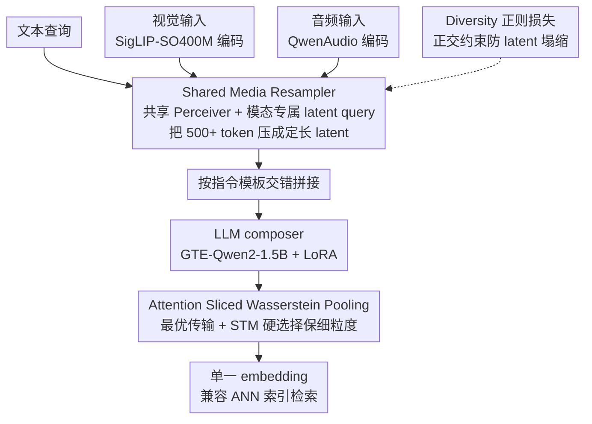

# OmniRet: Efficient and High-Fidelity Omni Modality Retrieval

**会议**: CVPR 2026  
**arXiv**: [2603.02098](https://arxiv.org/abs/2603.02098)  
**代码**: [hmchuong/omniret](https://github.com/hmchuong/omniret)  
**领域**: 音频语音  
**关键词**: omni-modal retrieval, multimodal embedding, Sliced Wasserstein, composed query, audio retrieval

## 一句话总结

提出首个支持文本-视觉-音频三模态组合查询的统一检索模型 OmniRet，通过共享媒体重采样器（Shared Media Resampler）提升计算效率，并引入注意力切片 Wasserstein 池化（ASWP）保留细粒度信息，在 13 个检索任务上取得 12 项领先。

## 研究背景与动机

**多模态检索的现实需求**：信息检索已从单模态（如文本搜索）转变为需要跨图像、视频、音频和文本等异构数据的复合查询场景，现有系统难以覆盖三种以上模态。

**现有模型的模态局限**：CLIP、BLIP、CLAP 等经典模型仅支持两种模态之间的对齐（文本-视觉或文本-音频），无法处理同时涉及三种模态的组合查询。

**信息瓶颈问题**：将丰富的多模态输入压缩为单个 embedding 向量会造成严重的信息损失，简单的均值池化或 [EOS] token 方法丢弃了 LLM 输出中的细粒度信息。

**计算效率瓶颈**：媒体编码器输出的 token 序列通常超过 500 个，直接输入 LLM 会导致计算量爆炸，制约训练 batch size，进而削弱对比学习的效果。

**Late interaction 的代价**：ColBERT 等保留 token 级 embedding 的方法虽然信息保真度高，但存储和计算成本过高，不适合大规模检索系统。

**音频检索基准缺失**：尚无针对组合音频检索（audio+text→audio）和音频-视觉检索（audio→image/video）的系统性评估基准，限制了该方向的研究发展。

## 方法详解

### 整体框架

OmniRet 以 GTE-Qwen2-1.5B-Instruct 为核心 LLM 充当跨模态 composer，视觉输入由 SigLIP-SO400M 编码，音频输入由 QwenAudio Encoder 编码。各模态 token 经共享媒体重采样器压缩后，按指令模板交错拼接输入 LLM，最后由 ASWP 把 LLM 输出聚合成单一 embedding 用于检索。训练只更新重采样器、投影层、池化层和 LLM 的 LoRA（rank=16），总可训练参数约 84M。

### 关键设计

**1. Shared Media Resampler：用模态专属 query 把上百 token 压成定长 latent**

各模态编码器吐出的 token 序列动辄 500+，直接喂给 LLM 会让计算量爆炸、压垮训练 batch size，进而削弱对比学习的效果。OmniRet 用一个 Perceiver 架构把这些 token 重采样成固定数量的紧凑 latent 向量，关键巧思是**共享同一个 Perceiver 模块、却为每种模态配一组独立的 latent query**——共享主干保住跨模态泛化，专属 query 保住模态特异性。视频输入则先做 3D 三线性插值削掉帧级冗余再重采样。这样既把序列长度压到可控范围，又不像简单池化那样一刀切丢信息。

**2. Attention Sliced Wasserstein Pooling (ASWP)：把单向量压缩做成最优传输，留住细粒度**

把 LLM 输出压成单个 embedding 时，均值池化或 [EOS] token 会丢掉大量细粒度信息，而 ColBERT 式 late interaction 又太贵、存不起。ASWP 先用注意力重采样器把 LLM 输出压成 $S$ 个 latent embedding $\mathbf{Z}$，再把它当作一个分布：通过 $L$ 个一维投影方向与 $S$ 个可学习参考点 $\mathbf{X}$ 计算 Monge coupling 距离，得到中间表示 $\mathbf{Z}' \in \mathbb{R}^{S \times L}$；随后用 Straight-Through Maximum（STM）技巧生成二值注意力掩码，为每个投影方向挑出最相关的参考点，列求和得到最终 $L$ 维 embedding，默认 $L=4096, S=128$。它的好处是输出仍是单向量、兼容 ANN 索引，却用最优传输的方式保住了 token 级结构——消融里把 STM 换成 average pooling 直接掉 29.5%，说明这个“硬选择”才是保真度的关键。

**3. Diversity 正则化损失：逼重采样 token 各管各的，不要塌成一团**

如果重采样出来的 token 彼此高度相似，等于白压缩。为此对输出向量 $\mathbf{M}$ 施加正交性约束：先算成对相似度矩阵 $\mathbf{MM}^\top$，移除对角线的自相似，对残差矩阵做 Dropout 稀疏采样后用 Smooth L1 loss（$\gamma=0.5$）惩罚非正交。Dropout 让每步只在随机子集上算损失，既高效又能全局鼓励多样性，确保有限的 latent 各自捕捉不同信息。

**4. 两阶段训练策略：先暖身对齐、再全量微调**

直接全量上 LLM 微调既贵又不稳，于是拆成两段。Stage 1（Warm-up）只在单模态和文本绑定任务上训练投影层、重采样器和池化层，LLM 冻结，batch size 2048，共 2M 样本，先把各模态对齐到一个可用的空间；Stage 2（Fine-tuning）在全部 30 个数据集（约 6.2M query-target 对）上继续训练，加入 LoRA 微调 LLM，batch size 3072，每 batch 随机选 4 个任务、梯度累积 2 步，共 18M 样本。先暖身后微调让大 batch 对比学习站得稳，也避免一上来就动 LLM 引发的训练崩溃。

## 损失函数

总损失为三项加权组合：

$$\mathcal{L} = \mathcal{L}_{\text{cont}} + \mu_1 \mathcal{L}_{\text{triplet}} + \mu_2 \mathcal{L}_{\text{div}}$$

- $\mathcal{L}_{\text{cont}}$：Hard-negative InfoNCE 对比损失，温度 $\tau=0.07$，自适应权重 $\beta=0.5$
- $\mathcal{L}_{\text{triplet}}$：Hinge-based triplet loss，margin $\eta=0.1$
- $\mathcal{L}_{\text{div}}$：Diversity 正则化损失
- 权重：$\mu_1=1, \mu_2=0.1$

## 实验

### 表 1：Extended M-BEIR 13 任务 Recall 对比（1.5B 模型）

| 模型 | I→I | T→T | I→T | T→I | V→T | T→V | A→T | T→A | T→I,T | I,T→T | I,T→I | I,T→I,T | V,T→V |
|------|------|------|------|------|------|------|------|------|-------|-------|-------|---------|-------|
| VLM2VecV2 | 30.0 | 81.1 | 43.4 | 39.8 | 17.6 | 18.4 | - | - | 61.6 | 24.5 | 28.7 | 33.6 | 76.4 |
| **OmniRet** | 24.4 | **86.7** | **50.6** | **46.9** | **43.8** | **43.2** | **66.8** | **62.4** | **70.5** | **44.4** | **36.5** | **64.8** | **86.2** |

OmniRet 在 13 个任务中 12 项领先，音频和视频任务上超越所有专用模型。

### 表 2：MMEBv2 子集泛化性能（Recall@1）

| 模型 | Image CLS | Image RET | Video CLS | Video RET | Video MRET |
|------|-----------|-----------|-----------|-----------|------------|
| VLM2VecV2 | 62.9 | 69.5 | 39.3 | 28.8 | 38.5 |
| **OmniRet** | 51.7 | 65.3 | **48.6** | **36.5** | **43.3** |

视频任务全面 SOTA，图像任务在未使用其训练数据的情况下仍保持中位数水平。

### 表 3：ACM Benchmark（Recall@5）

| 模型 | A,T→A | A→V | V→A | A→I | I→A |
|------|-------|-----|-----|-----|-----|
| ImageBind | 7.32 | **35.5** | **36.3** | **30.1** | **29.7** |
| **OmniRet** | **23.0** | **35.5** | 34.4 | 24.5 | 26.0 |

组合音频检索（A,T→A）大幅领先，音频-视频检索与 ImageBind 持平。

### 消融实验亮点

- 去掉 ASWP 改用 [EOS] 向量：Recall 下降 **6.8%**
- 去掉 Media Resampler：下降 **3.5%**
- 去掉 $\mathcal{L}_{\text{div}}$：下降 **3.1%**
- ASWP 中用 Average Pooling 替换 STM：下降 **29.5%**

## 亮点

- **首个三模态统一检索**：首次实现文本+视觉+音频的组合查询检索，填补了音频模态在通用检索中的空白
- **效率与保真度兼顾**：Shared Media Resampler 将 500+ token 压缩为固定数量 latent，ASWP 在单向量格式下保留 token 级细粒度信息，兼容 ANN 索引
- **新基准贡献**：构建 ACM Benchmark 引入组合音频检索和音频-视觉检索两个全新任务，经人类评估验证质量
- **消融充分**：五组消融覆盖 embedding 类型、投影数/参考数、池化方式、重采样器设计和损失函数，定量验证每个组件贡献

## 局限性

- 受限于计算资源，未探索更大 LLM backbone 和更多训练数据的 scaling 效果
- 仅覆盖文本/视觉/音频三种模态，未扩展至深度图、3D 点云、语音等
- ACM Benchmark 场景相对简单，未涉及交错混合媒体文档的复杂检索
- 图像单模态检索（I→I）相比 PE-Core 等专用模型仍有差距（24.4 vs 32.0）

## 相关工作

- **多模态 Embedding**：CLIP/BLIP 系列专注文本-视觉对齐，CLAP 专注文本-音频，ImageBind 尝试六模态联合空间但计算效率不足
- **通用多模态检索**：UniIR 开创多数据集训练的通用检索器，VLM2Vec 系列利用 VLM 做 embedding，MMEmbed 利用 LLM 指令跟随能力
- **Embedding 池化**：从均值池化/[EOS] 到 ColBERT 的 late interaction，再到 NV-Embed 的可学习查询，OmniRet 的 ASWP 在单向量与 late interaction 之间找到平衡点

## 评分

- 新颖性: ⭐⭐⭐⭐ — 首个三模态统一检索框架，ASWP 池化方法和 ACM Benchmark 均为原创贡献
- 实验充分度: ⭐⭐⭐⭐ — 13+任务评估、MMEBv2 泛化测试、新 benchmark、五组消融实验，覆盖全面
- 写作质量: ⭐⭐⭐⭐ — 结构清晰，问题定义明确，图表丰富，公式推导完整
- 推荐指数: ⭐⭐⭐⭐ — 在多模态检索方向推进了模态覆盖和效率-质量 trade-off，实用价值高
- 价值: 待评

<!-- RELATED:START -->

## 相关论文

- [\[ICCV 2025\] Lyra: An Efficient and Speech-Centric Framework for Omni-Cognition](../../ICCV2025/audio_speech/lyra_an_efficient_and_speechcentric_framework_for_omnicognit.md)
- [\[ACL 2026\] Omni-Embed-Audio: Leveraging Multimodal LLMs for Robust Audio-Text Retrieval](../../ACL2026/audio_speech/omni-embed-audio_leveraging_multimodal_llms_for_robust_audio-text_retrieval.md)
- [\[CVPR 2026\] Omni-MMSI: Toward Identity-Attributed Social Interaction Understanding](omni-mmsi_toward_identity-attributed_social_interaction_understanding.md)
- [\[ICLR 2026\] Flow2GAN: Hybrid Flow Matching and GAN with Multi-Resolution Network for Few-step High-Fidelity Audio Generation](../../ICLR2026/audio_speech/flow2gan_hybrid_flow_matching_and_gan_with_multi-resolution_network_for_few-step.md)
- [\[AAAI 2026\] Improving Multimodal Sentiment Analysis via Modality Optimization and Dynamic Primary Modality Selection](../../AAAI2026/audio_speech/improving_multimodal_sentiment_analysis_via_modality_optimization_and_dynamic_pr.md)

<!-- RELATED:END -->
