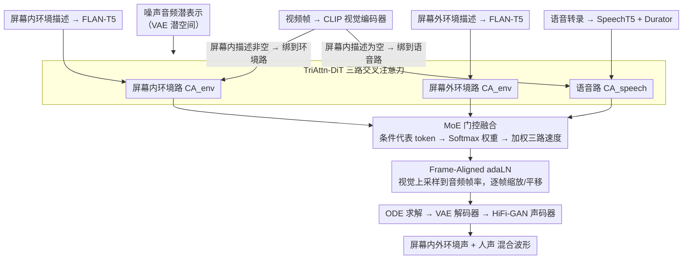

# OmniSonic: Towards Universal and Holistic Audio Generation from Video and Text

**会议**: CVPR 2026  
**arXiv**: [2604.04348](https://arxiv.org/abs/2604.04348)  
**代码**: [https://weiguopian.github.io/OmniSonic_webpage/](https://weiguopian.github.io/OmniSonic_webpage/)  
**领域**: 音频生成 / 多模态  
**关键词**: 视频到音频生成, 全景音频, 扩散模型, 语音合成, 混合专家

## 一句话总结

提出 Universal Holistic Audio Generation (UniHAGen) 任务和 OmniSonic 框架，通过 TriAttn-DiT 架构的三路交叉注意力和 MoE 门控机制，首次实现同时生成屏幕内/屏外环境声和人声的统一音频合成，在新构建的 UniHAGen-Bench 上全面超越 SOTA。

## 研究背景与动机

1. **领域现状**：扩散模型在音频生成领域取得显著进展，V2A（视频到音频）方法如 Diff-Foley、MMAudio 生成的音频在质量和语义对齐上不断提升。联合文本-视频到音频（VT2A）方法如 VinTAGe 开始同时考虑屏幕内外的声音。

2. **现有痛点**：（1）V2A 模型仅能生成画面中可见事件对应的声音，忽略屏幕外的听觉事件；（2）VT2A 模型虽然考虑了屏幕内外声音，但仅限于环境声，无法生成人类语音；（3）环境语音生成模型（如 VoiceLDM）仅依赖文本输入，缺乏视觉 grounding。

3. **核心矛盾**：真实世界的听觉场景是复杂的——一个说话的人前面有鸟叫声，或者背景中有机器声。现有模型无法在一个统一框架中处理"环境声 + 人声 + 屏幕内/外"的全排列组合。

4. **本文目标** 定义一个新任务 UniHAGen，要求模型同时生成屏幕内环境声、屏幕外环境声和人类语音三种声源的混合音频。

5. **切入角度**：将问题拆解为三路条件（屏幕内环境描述、屏幕外环境描述、语音转录），设计专门的三路交叉注意力机制分别处理，再用 MoE 门控动态融合。

6. **核心 idea**：用 TriAttn-DiT 三路交叉注意力分别处理屏幕内环境声、屏幕外环境声和语音条件，通过 MoE 门控自适应平衡三路贡献，实现全景音频生成。

## 方法详解

### 整体框架

OmniSonic 要把真实听觉场景里同时存在的三种声音——屏幕内可见事件的环境声、屏幕外看不见的环境声、画面里人说的话——在一个模型里同时生成出来。它基于 Flow Matching 扩散框架，在音频 VAE 的潜空间里去噪。条件信号有四路：视频帧经 CLIP 视觉编码器，屏幕内、屏幕外两段环境声描述各经一个 FLAN-T5，语音转录经 SpeechT5 加 Durator 编码。这四路条件喂进核心的 TriAttn-DiT，由它堆叠多个 block 预测潜空间的速度场；推理时 ODE 求解器从噪声积分出音频潜表示，再经 VAE 解码器和 HiFi-GAN 声码器还原成波形。整篇方法的关键集中在 TriAttn-DiT 内部：把三种声学特性迥异的条件分路处理、按场景动态融合、再逐帧对齐到画面，下面三个设计依次展开这三件事。

### 关键设计

**1. TriAttn-DiT 三路交叉注意力：让环境声和语音互不干扰**

把环境声和语音塞进同一个注意力层会相互污染——它们的声学统计差太多，共享的 Q/K/V 投影学不出对两者都好的对齐。OmniSonic 干脆把交叉注意力拆成三路，环境声（屏幕内 / 屏幕外）和语音各走各的，分别只对自己那一路条件做 $\text{CA}_{env}$ 或 $\text{CA}_{speech}$，例如屏幕内一路是 $\mathbf{x}_t^{on} = \text{CA}_{env}(\text{RoPE}(\mathbf{x}_t), \text{RoPE}(\mathbf{c}^{on}_{txt,v}[L_{on}:,:]), \mathbf{c}^{on}_{txt,v})$，屏幕外和语音同理。

这里有个简洁但关键的视觉绑定规则：视觉特征 $\mathbf{c}_v$ 不会同时拼给所有路，而是看屏幕内环境声描述是否为空——描述非空（画面里有声音事件）就把视觉拼到屏幕内环境一路，描述为空（画面里是个说话的人）就把视觉拼到语音一路。这等于让模型显式判断"镜头里这个东西到底是声源还是说话人"，从而把视觉 grounding 送到正确的条件上。RoPE 只加在视觉 token 部分，用来给视觉条件编码时间位置，保证后续与音频帧的时序能对上。

**2. MoE 门控融合：按场景动态决定三路谁说了算**

三路各自算完后还要合成一个速度预测，但三种声源在不同场景里的主次是变的——纯环境声片段里语音那一路本该噤声，语音主导的访谈里环境声只是背景。固定权重相加无法适应这种切换，于是用一个轻量 MoE 门控来生成动态权重：把三路条件 embedding 各自沿序列维度取均值得到代表 token，拼接后过 MLP 再 Softmax，得到归一化的 $[\omega^{sp}, \omega^{on}, \omega^{off}]$，最终速度按这组权重加权求和

$$\mathbf{v}_t = \omega^{sp}\mathbf{x}_t^{sp} + \omega^{on}\mathbf{x}_t^{on} + \omega^{off}\mathbf{x}_t^{off}$$

门控由条件本身驱动，所以它能让模型在"该出语音时放大语音路、该静默时压低它"之间自适应平滑过渡。消融里这一项被验证是多源平衡的命门（见下文）。

**3. Frame-Aligned Adaptive Layer Normalization：把音频逐帧钉到视频上**

视频和音频的时间分辨率不一样，若只用一个全局视觉向量调制整段音频，声画就容易错位。这里把视觉条件 $\mathbf{c}_v$ 投影到与时间步 embedding 同一空间并相加得到 $\mathbf{c}_{vt}$，再用最近邻插值把它上采样到音频的时间分辨率，由此生成逐帧的 adaLN 参数 $[\alpha_1, \beta_1, \gamma_1, \alpha_2, \beta_2, \gamma_2]$。每一帧音频特征都被对应那一帧视频生成的缩放/平移量调制，时间同步因此从"整段对齐"细化到"逐帧对齐"。

### 一个完整示例：一段"鸟叫旁有人说话"的视频

设输入是一段 10 秒视频：画面里一个人在说话，画外背景有鸟叫。屏幕内环境声描述为空（画面主体是说话人），屏幕外描述是"birds chirping"，语音转录是这个人说的台词。

按视觉绑定规则，屏幕内描述既然为空，视觉特征 $\mathbf{c}_v$ 就被拼到语音一路——模型据此知道镜头里这个人是说话人而非声源。三路交叉注意力并行展开：语音路带着视觉时序对齐台词的口型与时长，屏幕外环境路把"鸟叫"对齐到背景，屏幕内环境路因描述为空基本不贡献内容。MoE 门控读到"有语音 + 有屏幕外环境 + 无屏幕内环境"，于是给出类似 $\omega^{sp}$ 偏大、$\omega^{off}$ 中等、$\omega^{on}$ 接近 0 的权重，把三路速度按此加权。Frame-Aligned adaLN 再逐帧微调，让说话声卡在嘴动的帧上、鸟叫铺在整段背景里。最终 ODE 求解 + 声码器输出一段人声清晰、画外鸟叫自然的混合音频。消融里"手动抑制语音分支就生不出语音、抑制环境分支就丢背景声"，正对应这个例子中各路的分工。

### 损失函数 / 训练策略

使用 Flow Matching 目标 $\mathcal{L}_{FM} = \mathbb{E}_{t, \mathbf{x}_0, \mathbf{x}_1}[\|\mathcal{V}_\theta(\mathbf{x}_t, t) - (\mathbf{x}_1 - \mathbf{x}_0)\|_2^2]$，让网络回归从噪声 $\mathbf{x}_0$ 到数据 $\mathbf{x}_1$ 的速度场。训练数据由 VGGSound（约 195K 环境声）、LRS3（约 33K 语音视频）、CommonVoice（约 1.67M 语音）按随机 SNR 合成混合，逼出真实场景里语音与环境声叠加的分布。训练时 FLAN-T5 与 CLIP 视觉编码器冻结，SpeechT5 与 Durator 参与微调。

## 实验关键数据

### 主实验

在 UniHAGen-Bench（1003 样本，3种场景）上的客观评估：

| 方法 | FAD↓ | MKL↓ | Mean(AT+AV)↑ | WER↓ | DeSync↓ |
|------|------|------|-------------|------|---------|
| VoiceLDM | 3.58 | 5.74 | 14.03 | 0.15 | 1.25 |
| MMAudio | 5.82 | 5.60 | 17.25 | 1.50 | **0.51** |
| HunyuanVideo-Foley | 6.00 | 5.88 | 16.95 | 1.36 | 0.38 |
| **OmniSonic** | **3.07** | **2.79** | **18.54** | **0.14** | 0.72 |

主观评估 MOS 评分：

| 方法 | MOS-Q↑ | MOS-EF↑ | MOS-SF↑ | MOS-T↑ |
|------|--------|---------|---------|--------|
| VoiceLDM | 3.13 | 3.40 | 4.05 | 2.54 |
| MMAudio | 3.74 | 3.24 | 1.15 | 3.71 |
| **OmniSonic** | **4.35** | **4.42** | **4.74** | **4.29** |

### 消融实验

| 配置 | FAD↓ | Mean↑ | WER↓ | DeSync↓ |
|------|------|-------|------|---------|
| OmniSonic (完整) | 3.07 | 18.54 | 0.14 | 0.72 |
| w/o MoE Gating | 6.12 | 15.94 | 0.56 | 1.23 |

### 关键发现

- 移除 MoE 门控后 FAD 从 3.07 翻倍到 6.12，WER 从 0.14 增到 0.56（4倍），证明门控机制对多源平衡至关重要
- OmniSonic 在 DeSync 上不如 MMAudio 和 HunyuanVideo-Foley，因为后两者使用了 Synchformer 提取的时间细粒度视觉特征，而 OmniSonic 仅用 CLIP 特征
- MMAudio、HunyuanVideo-Foley 的 MOS-SF（语音保真度）仅 1.15/1.17，几乎无法生成语音；VoiceLDM 语音好但环境声差（MOS-EF 3.40）
- 手动抑制 MoE 各分支的可视化分析表明，抑制语音分支则无法生成语音，抑制环境分支则失去背景声，验证了各分支的功能专一性

## 亮点与洞察

- **任务定义有前瞻性**：UniHAGen 定义了三种"屏幕内/外×环境声/语音"场景，首次将语音纳入全景音频生成的考量范围，填补了重要空白
- **TriAttn-DiT 设计优雅**：三路独立注意力 + 共享MoE门控的架构，既保证各声源条件的独立处理，又实现动态融合，避免了多条件混合带来的干扰
- **视觉-条件动态绑定**：根据屏幕内描述是否为空，决定视觉特征与环境描述还是语音转录绑定——这个简洁的设计巧妙地区分了"画面中是声音事件还是说话的人"
- 这种多路注意力 + MoE 门控的模式可以迁移到其他需要处理多种异构条件的生成任务

## 局限与展望

- 时间同步性（DeSync）不如使用 Synchformer 的方法，引入更细粒度的时间视觉特征可能改善
- 训练数据是合成 mixture，真实场景中声源的空间分布和混响效果未被建模
- 仅支持 10 秒音频生成，更长音频的连贯性未验证
- 语音质量虽好但未与专门的 TTS 系统做详细对比
- UniHAGen-Bench 仅 1003 样本，评估规模有限

## 相关工作与启发

- **vs MMAudio**: MMAudio 使用多模态 DiT 联合建模视频和文本，但仅针对环境声；OmniSonic 通过三路注意力扩展到语音领域，且环境声质量也更优
- **vs VoiceLDM**: VoiceLDM 是纯文本条件的语音生成，缺乏视觉 grounding；OmniSonic 加入视频条件后可以区分屏幕内外声源
- **vs VinTAGe**: VinTAGe 提出了"全景"音频生成的概念，但局限于环境声；OmniSonic 真正实现了"全景"——覆盖环境声和语音

## 评分

- 新颖性: ⭐⭐⭐⭐ UniHAGen 任务定义和 TriAttn-DiT 架构都很新颖，MoE 门控是锦上添花
- 实验充分度: ⭐⭐⭐⭐ 客观+主观评估全面，消融验证了核心组件，但 benchmark 规模较小
- 写作质量: ⭐⭐⭐⭐⭐ 问题定义清晰，方法描述详尽，定性分析丰富
- 价值: ⭐⭐⭐⭐ 填补了音频生成领域"环境声+语音"统一的空白，对影视后期制作有直接应用价值

<!-- RELATED:START -->

## 相关论文

- [\[CVPR 2025\] VinTAGe: Joint Video and Text Conditioning for Holistic Audio Generation](../../CVPR2025/audio_speech/vintage_joint_video_and_text_conditioning_for_holistic_audio_generation.md)
- [\[CVPR 2026\] Echoes Over Time: Unlocking Length Generalization in Video-to-Audio Generation Models](echoes_over_time_unlocking_length_generalization_in_video-to-audio_generation_mo.md)
- [\[CVPR 2026\] SAVE: Speech-Aware Video Representation Learning for Video-Text Retrieval](save_speech-aware_video_representation_learning_for_video-text_retrieval.md)
- [\[ICLR 2026\] PrismAudio: Decomposed Chain-of-Thoughts and Multi-dimensional Rewards for Video-to-Audio Generation](../../ICLR2026/audio_speech/prismaudio_decomposed_chain-of-thoughts_and_multi-dimensional_rewards_for_video-.md)
- [\[NeurIPS 2025\] Node-Based Editing for Multimodal Generation of Text, Audio, Image, and Video](../../NeurIPS2025/audio_speech/node-based_editing_for_multimodal_generation_of_text_audio_image_and_video.md)

<!-- RELATED:END -->
