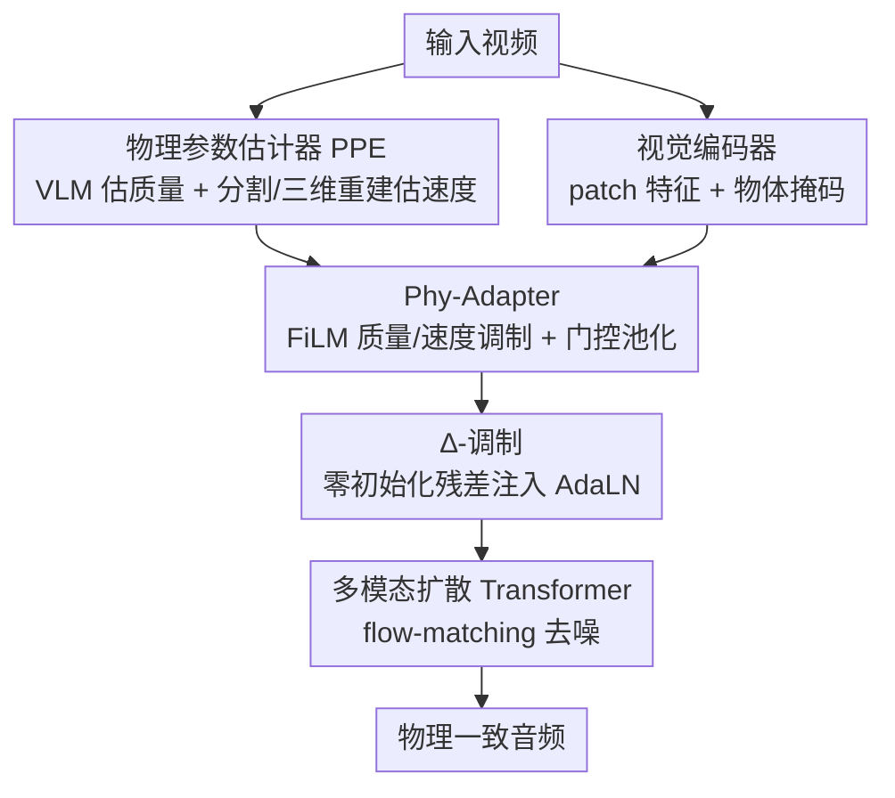

# PAVAS: Physics-Aware Video-to-Audio Synthesis

**会议**: CVPR 2026  
**论文**: [CVF Open Access](https://openaccess.thecvf.com/content/CVPR2026/html/Hyun-Bin_PAVAS_Physics-Aware_Video-to-Audio_Synthesis_CVPR_2026_paper.html)  
**代码**: 项目页 https://physics-aware-video-to-audio-synthesis.github.io  
**领域**: 音频生成 / 扩散模型 / 多模态  
**关键词**: 视频转音频, 物理感知, 潜在扩散, FiLM 调制, 质量与速度估计

## 一句话总结
PAVAS 在潜在扩散的视频转音频（V2A）框架里显式注入「物体级质量 + 速度」两个物理量：用 VLM 估质量、用分割 + 动态三维重建估速度，再通过一个零初始化残差的 Phy-Adapter 把这些物理线索灌进扩散 Transformer，让生成的声音强度/衰减真正随物理动力学变化，并在自建的 VGG-Impact 基准上把物理一致性（APCC-∆）从 0.5+ 降到 0.378。

## 研究背景与动机

**领域现状**：近年的 V2A 生成（自回归、GAN、扩散）在感知质量和音画同步上已经做得很好，尤其是潜在扩散框架（如 MMAudio）借助大规模文本-音频数据，能把「锤子敲击」这种画面可靠地映射到「金属当啷声」的语义类别。

**现有痛点**：这些模型本质是 **appearance-driven（外观驱动）**——它们学的是「视觉外观 ↔ 声学特征」的相关性，却不管声音背后的物理因素。结果就是：模型知道该出「金属声」，但不知道该出多响、衰减多快。一个轻轻碰一下和一记重锤，生成出来可能是同样响度的声音，物理上完全不合理（论文 Fig.1 顶部展示了这种异常长/异常响的冲击声）。

**核心矛盾**：声音的真实属性（响度、谱锐度、冲击包络）由 **可测量的物理量**（物体质量、碰撞速度→动能）决定，而现有 V2A 完全没有把这些物理量建模进来，也没有评测协议去检验「生成音频是否随物理量一致变化」。VGGSound 这类基准只测语义/感知对齐，测不出物理真实性。

**本文目标**：(1) 把物体级物理量显式估出来并注入扩散过程；(2) 提出一个能定量评测「物理-声学一致性」的协议。

**切入角度**：作者发现现成的视觉模块（VLM、开放词汇分割、动态三维重建）已经足够可靠，可以**无需音频-物理标注**地从单目视频里把质量和速度估出来——质量交给 VLM 的常识，速度交给分割掩码 + 度量尺度的三维点云轨迹。

**核心 idea**：用「VLM 估质量 + 分割/三维重建估速度」把物理量从视频里抽出来，再用一个零初始化残差的轻量适配器（Phy-Adapter）把它们温和地注入潜在扩散主干，从而生成物理一致的声音。

## 方法详解

### 整体框架
PAVAS 建立在一个多模态潜在扩散主干（沿用 MMAudio 风格的 flow-matching DiT，在 mel 谱潜空间训练，再经 VAE 解码 + vocoder 还原波形）之上。给定输入视频，**物理参数估计器（PPE）** 先检测所有真正在运动的物体，给每个物体估出一个时不变的质量 $m_i$（kg）和一段逐帧速度序列 $\{v_i^\ell\}$（m/s）；与此同时视觉编码器抽 patch 特征，配合分割得到的掩码变成物体中心特征。随后 **物理驱动音频适配器（Phy-Adapter）** 把质量/速度调制进这些物体中心特征，经门控池化聚合成 $c_\text{mass}$、$c_\text{vel}$ 两个条件，最后通过 **∆-调制** 以零初始化残差的方式叠加进扩散 Transformer 每个 block 的 AdaLN 参数，引导扩散轨迹生成物理合理的音频。

### 关键设计

**1. 物理参数估计器 PPE：从单目视频无标注地抽出物体级质量与速度**

这一步针对的痛点是「现有 V2A 根本没有物理量可用」。PPE 用一条三阶段无监督流水线把质量和速度估出来。**运动物体发现**：先用 VLM 区分「真运动」与「相机运动造成的表观位移」，输出结构化集合 $S=\{(o_i,a_i)\}$，每项是一个被定位的运动物体（如「条纹衫的跑者」）及其动作（「冲刺」），这层文本表示同时充当开放世界泛化和后续估计的语义接口。**质量估计**：直接让 VLM 根据物体名 $o_i$、动作 $a_i$ 和视频上下文推断质量 $m_i=f_\text{mass}(I_{1:L}, T_\text{mass})$——这绕开了 NeRF2Physics 那类需要多视角静态标定的几何方法，能在动态单目视频上跑且跨类别泛化。**速度估计**：用 Florence-2 出框、SAM-2 出逐帧像素级掩码 $M_i^\ell$ 并跨时间传播，再用动态三维重建 CUT3R 恢复每帧度量尺度点云 $P^\ell$ 及相机外参；把掩码反投影到三维点云得到物体三维点集 $X_i^\ell$，求质心 $c_i^\ell$，最后用 $v_i^\ell = \|c_i^{\ell+1}-c_i^\ell\|_2 / \Delta\tau$（$\Delta\tau=1/\text{FPS}$）算出度量尺度的瞬时速度。作者发现这套估计器的质量/速度精度可与专用 expert 模型相当甚至更好。

**2. Phy-Adapter：用 FiLM 把质量/速度调制进物体中心视觉特征**

光有物理量还不够，得把它们对齐到视觉特征序列并能被扩散主干消化。Phy-Adapter 接收三路输入：CLIP-ViT 的 patch 嵌入 $V^\ell$、每个物体的二值掩码 $M_i^\ell$、以及 PPE 估出的 $\{m_i, v_i\}$。**物体特征提取**：用掩码加权求和 $f_i^\ell=\sum_{h,w} M_i^\ell[h,w]\cdot V^\ell[h,w,:]$ 把 patch 特征聚成每帧物体特征，投影 + LayerNorm 得 $h_i^\ell$；物体被遮挡/缺失的帧用可学习的 object-occlusion token 补，保证时间连续性。**质量/速度调制**：标量质量先 $\log(1+m_i)$ 再 z-score 归一化、速度直接 z-score，二者经傅里叶特征映射 $[\sin(2\pi\omega_k\cdot),\cos(2\pi\omega_k\cdot)]$ 展开后过 MLP，再生成 FiLM 系数 $(\gamma,\beta)$ 去调制 $h_i$，形如 $h_{\text{mass},i}=(1+\tfrac12\tanh(\gamma))\odot h_i+\tfrac12\tanh(\beta)$。这里有个关键物理直觉：**质量调制对每个物体跨时间恒定**（控制全局响度与衰减），**速度调制逐帧变化**（让音频特征跟随瞬时运动）。**门控池化聚合**：多物体时按 $c_\text{mass}=\frac{\sum_i G_{\text{mass},i} h_{\text{mass},i}}{\sum_i G_{\text{mass},i}}$（门控 $G=\sigma(\text{MLP}(\cdot))$）把各物体特征加权汇总成单一物理条件。

**3. ∆-调制：零初始化残差，把物理线索温和注入而不破坏多模态稳定性**

直接把物理特征加到多模态条件上会扰乱已经训好的 V2A 主干。作者的做法是：每个 Transformer block 的 AdaLN 调制参数 $\omega$ 由多模态条件 $c_\text{multi}$ 算出，再叠一项**零初始化残差** $\tilde\omega=\omega(c_\text{multi})+\alpha_m g_m(c_\text{mass})+\alpha_v g_v(c_\text{vel})$，其中 $g_m,g_v$ 是零初始化的轻量 MLP、$\alpha_m,\alpha_v$ 是可学习门控。因为初始为零，训练一开始物理项不产生任何扰动，模型从原始多模态行为出发**渐进地**引入质量/运动效应，从而在不破坏感知质量的前提下让扩散动力学对齐物理一致的音画行为。消融显示这种残差 ∆-调制优于直接求和（见实验）。

### 损失函数 / 训练策略
主干用条件 flow-matching 目标训练：$\mathcal{L}_\text{CFM}=\mathbb{E}\|f_\theta(t,Y,x_t)-u(x_t|x_0,x_1)\|^2$，其中 $x_t=(1-t)x_0+tx_1$、目标流速 $u=x_1-x_0$。两阶段训练：① 主干在 VGGSound + 大规模音频-文本语料上训 300k 步（AdamW，lr $1\times10^{-4}$，batch 512）做通用 V2A；② 冻结音/视/文编码器，只训扩散 Transformer 和 PPE/Phy-Adapter 条件通路 30k 步（lr 降到 $1\times10^{-5}$），此阶段只用 VGGSound。物理 token 以 0.1 概率替换为空 token，处理运动线索缺失的情况。

## 实验关键数据

> 自定义指标说明：**APCC（Audio–Physics Correlation Coefficient）** 衡量「冲击时刻的动能变化」与「音频起始（onset）谱强度」两条序列在每个声音类别内的相关性；分别对真实音频和生成音频算这个相关，**APCC-∆** 是两者之差，**越小**说明生成音频越接近真实的「动能↔声学」耦合，物理一致性越强。

### 主实验（VGGSound 测试集）

| 方法 | 参数量 | APCC-∆↓ | FD$_\text{PaSST}$↓ | IS↑ | IB-score↑ | DeSync↓ |
|------|--------|---------|--------------------|-----|-----------|---------|
| MMAudio-L（之前 SOTA） | 1.03B | 0.536 | 60.60 | 17.40 | 33.22 | 0.442 |
| TARO | 258M | 0.758 | 159.1 | 9.62 | 22.85 | 1.169 |
| V2A-Mapper | 229M | 0.671 | 84.57 | 12.47 | 22.58 | 1.225 |
| **PAVAS-L（本文）** | 1.04B | **0.378** | **47.38** | **17.51** | **35.41** | 0.446 |

PAVAS 在物理一致性（APCC-∆ 0.378，唯一显著低于 0.5）、分布匹配（FD 47.38）、语义对齐（IB-score 35.41）上都领先；同步性 DeSync 与 MMAudio 基本持平。说明显式物理条件不仅提升物理合理性，连感知质量也一起带高了。

**用户研究**（27 名参与者，1–5 李克特量表）：

| 方法 | 音质 | 语义对齐 | 时间对齐 | 物理合理性 |
|------|------|---------|---------|-----------|
| MMAudio-L | 3.98 | 4.14 | 4.06 | 3.90 |
| **PAVAS-L（本文）** | **4.23** | **4.47** | **4.45** | **4.37** |

主观评测四项全面领先，物理合理性提升最明显（+0.47）。

### 消融实验（S-16kHz 主干）

| 配置 | FD$_\text{PaSST}$↓ | IS↑ | IB-score↑ | DeSync↓ |
|------|--------------------|-----|-----------|---------|
| Backbone | 70.19 | 14.44 | 29.13 | 0.483 |
| + 仅训更久 | 71.99 | 14.34 | 29.46 | 0.486 |
| + 仅 $c_\text{mass}$ | 66.89 | 15.94 | 29.40 | 0.480 |
| + 仅 $c_\text{vel}$ | 67.22 | 15.07 | 29.33 | 0.446 |
| + 质量+速度（本文） | **65.67** | **16.50** | 29.41 | 0.448 |
| 直接求和注入 | 67.31 | 16.30 | 29.40 | 0.455 |
| ∆-调制（本文） | **65.67** | **16.50** | 29.41 | 0.448 |

### 关键发现
- **单纯训更久没用**：把主干在 VGGSound 上多训一段，FD 反而从 70.19 微升到 71.99——增益确实来自物理组件而非额外数据适配。
- **质量和速度各有贡献且互补**：单独加 $c_\text{mass}$ 或 $c_\text{vel}$ 都能改善分布/感知指标，二者合用 FD 最低（65.67）、IS 最高（16.50）；速度条件对同步性（DeSync 0.446）帮助尤其明显。
- **注入方式很关键**：∆-调制（残差零初始化）比直接求和在 FD（65.67 vs 67.31）和 IS（16.50 vs 16.30）上都更好，印证「温和渐进注入」比「硬叠加」更能保住主干稳定性。
- **现有模型普遍物理失真**：九个 SOTA 在 VGG-Impact 上 APCC-∆ 频繁超 0.5，说明它们抓得住语义却抓不住物理量变化。

## 亮点与洞察
- **「物理量从视频里免费抽」是最妙的一步**：作者没去采集任何音频-物理标注，而是把质量交给 VLM 的世界知识、把速度交给「分割掩码 + 度量尺度三维点云轨迹」，等于用现成视觉模块拼出了一个物理估计器，且精度能比肩专用模型。这种「组合现成大模型解决新问题」的思路可迁移到很多需要物理/几何先验的生成任务。
- **质量恒定、速度逐帧的设计很有物理品味**：把质量做成时不变的全局调制（管响度/衰减）、速度做成逐帧调制（管瞬时动态），直接对应了「质量决定声音能量上限、速度决定冲击时刻」的物理常识，而不是把两者一视同仁地塞进去。
- **零初始化残差 ∆-调制是注入新条件的可复用 trick**：想给一个已训好的扩散主干加新条件又怕破坏原能力时，「零初始化 + 可学习门控的残差叠加」能让新条件从零渐进生效，这个模式在 ControlNet 系工作里也反复出现，这里用在 AdaLN 上同样有效。
- **APCC 把「物理一致性」变得可测**：用「动能变化 ↔ onset 谱强度」的类内相关来量化物理合理性，给 V2A 评测补上了一个被长期忽略的维度。

## 局限与展望
- **重度依赖一堆预训练视觉模块**（VLM、Florence-2、SAM-2、CUT3R、CLIP、Synchformer），流水线偏重，作者也承认未来需要更紧凑的适配器和联合优化的物理估计器。
- **物理因素只覆盖质量和速度**：材料、弹性、摩擦等同样影响声音的属性还没建模，VGG-Impact 也只筛了 10 类、272 个冲击时刻，⚠️ 物理一致性的结论主要在这类「接触动力学清晰」的冲击场景上验证，更复杂/连续的声源是否成立有待考察。
- **质量估计交给 VLM 常识**：对常见物体合理，但对罕见/异形物体的质量推断可靠性如何、误差如何传播到音频，论文未充分量化（⚠️ 以补充材料为准）。
- **速度估计建立在单目三维重建之上**：CUT3R 的度量尺度和遮挡处理一旦出错，速度会失真；作者用可学习的 occlusion token 缓解缺失，但极端遮挡/快速运动下的鲁棒性仍是开放问题。

## 相关工作与启发
- **vs MMAudio**：MMAudio 是本文主干来源，靠大规模文本-音频数据把感知质量和同步做到很强，但仍是外观驱动、不建模物理。PAVAS 在它之上加 PPE + Phy-Adapter，物理一致性（APCC-∆ 0.536→0.378）和感知指标双双提升，证明物理条件是与多模态条件**互补**的。
- **vs NeRF2Physics 等几何质量估计**：那类方法用神经辐射场 + 视觉语言特征从多视角静态图推物理属性，需要标定视角、无法处理动态视频；PAVAS 改用 VLM 在单目动态视频上估质量，牺牲一点精度换来开放世界泛化和动态适用性。
- **vs Su et al. / SonifyAR 等早期物理条件 V2A**：它们要么只生成单一鼓槌冲击声、要么聚焦室内/AR 场景的材料-交互线索，不显式建模物体级质量与运动；PAVAS 把物体级质量+速度作为通用条件注入，覆盖更广的物-物交互。
- **vs 用 onset / motion energy 做辅助条件的工作**：这些辅助信号能帮同步，但往往是被平滑过的特征，抓不住细粒度视觉动态；PAVAS 直接上「可解释的物理量」，从对齐升级到物理感知。

## 评分
- 新颖性: ⭐⭐⭐⭐⭐ 首个把物体级质量+速度显式注入潜在扩散 V2A，并配套提出物理一致性评测协议 APCC，问题定义和方案都新。
- 实验充分度: ⭐⭐⭐⭐ 主实验 + 用户研究 + 三组消融较完整，但物理评测局限于自建的小规模 VGG-Impact（272 个冲击），泛化性证据偏薄。
- 写作质量: ⭐⭐⭐⭐ 动机清晰、pipeline 讲得明白，公式和模块职责交代到位；部分细节（VLM prompt、APCC 完整定义）推到补充材料。
- 价值: ⭐⭐⭐⭐⭐ 给 V2A 补上了「物理一致性」这一长期缺失的维度，PPE 的「组合现成视觉模型估物理量」思路和 ∆-调制注入范式都很可复用。

<!-- RELATED:START -->

## 相关论文

- [\[CVPR 2026\] Audio-sync Video Instance Editing with Granularity-Aware Mask Refiner](audio-sync_video_instance_editing_with_granularity-aware_mask_refiner.md)
- [\[CVPR 2026\] SAVE: Speech-Aware Video Representation Learning for Video-Text Retrieval](save_speech-aware_video_representation_learning_for_video-text_retrieval.md)
- [\[ICLR 2026\] AC-Foley: Reference-Audio-Guided Video-to-Audio Synthesis with Acoustic Transfer](../../ICLR2026/audio_speech/ac-foley_reference-audio-guided_video-to-audio_synthesis_with_acoustic_transfer.md)
- [\[CVPR 2026\] Echoes Over Time: Unlocking Length Generalization in Video-to-Audio Generation Models](echoes_over_time_unlocking_length_generalization_in_video-to-audio_generation_mo.md)
- [\[CVPR 2026\] Omni2Sound: Towards Unified Video-Text-to-Audio Generation](omni2sound_towards_unified_video-text-to-audio_generation.md)

<!-- RELATED:END -->
