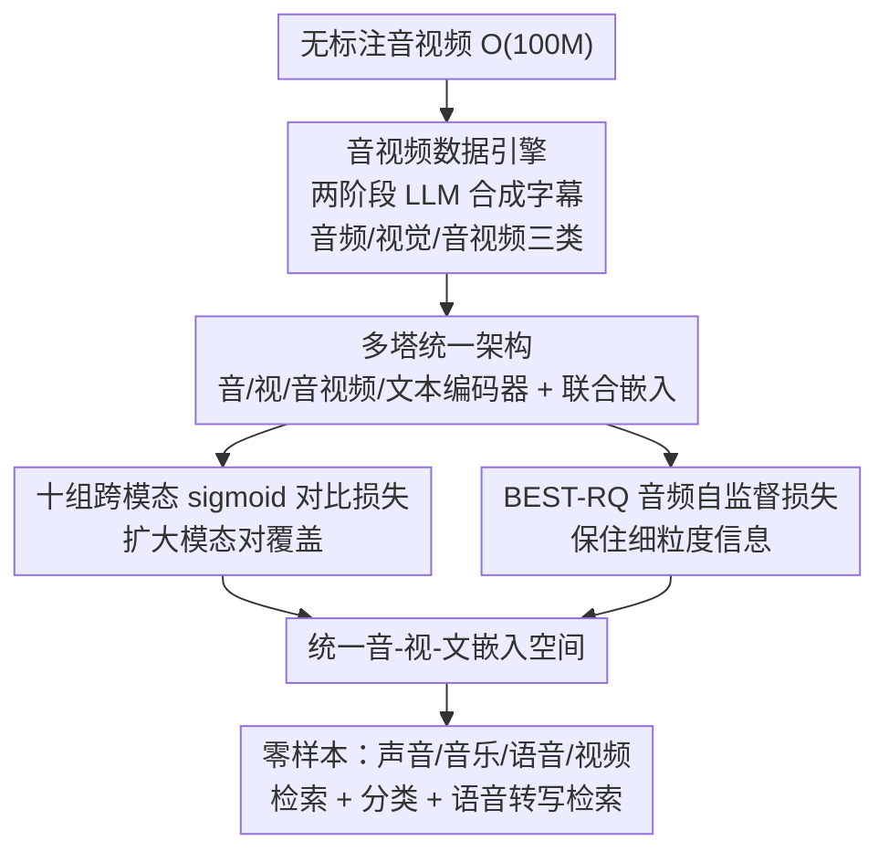

# Pushing the Frontier of Audiovisual Perception with Large-Scale Multimodal Correspondence Learning

**会议**: CVPR 2026  
**论文**: [CVF Open Access](https://openaccess.thecvf.com/content/CVPR2026/html/Vyas_Pushing_the_Frontier_of_Audiovisual_Perception_with_Large-Scale_Multimodal_Correspondence_CVPR_2026_paper.html)  
**代码**: https://github.com/facebookresearch/perception_models  
**领域**: 多模态表示学习 / 对比学习 / 音视频理解  
**关键词**: 音视频文本编码器, 对比学习, 合成字幕数据引擎, 联合嵌入, 零样本检索

## 一句话总结
PEAV（Perception Encoder Audiovisual）是 Meta 提出的「音-视-文」统一对比编码器家族：靠一个两阶段合成字幕数据引擎为 O(100M) 音视频对造出高质量的音频/视觉/音视频三类字幕，再用最多十组跨模态对比损失把音频、视频、文本对齐到同一空间，在声音、音乐、语音、视频四类零样本基准上全面刷新 SOTA（如 AudioCaps T→A 从 35.4 提到 45.8 R@1，VGGSound 分类 36.0→47.1），还首次让「语音→转写文本」检索从近 0 做到 85.6。

## 研究背景与动机

**领域现状**：CLIP 系对比模型已经把图像/音频与文本对齐得很好；ImageBind、LanguageBind、InternVideo2 等进一步通过一个「锚点模态」（图像或文本）把更多模态串起来，实现跨模态零样本检索与分类。

**现有痛点**：这些「单锚点（single-anchor）」模型有两个硬伤。其一是**锚点缺失时崩盘**——文本锚的 LanguageBind 在没有文本的音→视任务上很差（VGGSound V→A 仅 1.6 R@1），图像锚的 ImageBind 在没有视频的音→文任务上也差（AudioCaps T→A 仅 6.6 R@1）。其二是**模态对的规模与多样性严重不均衡**：视觉-语言数据多、音-视数据少且窄，导致音视频域整体落后，且现有音频模型往往只擅长单一域（要么声效、要么语音、要么音乐）。

**核心矛盾**：把所有模态都绑到一个 hub 上，本质上是把不对称的跨模态数据规模问题掩盖了——真正缺的是**覆盖所有模态对的、规模与质量都够的对齐监督**。而音频字幕器本身又很弱，没法直接造出大规模高质量音频文本监督。

**本文目标**：(1) 造出覆盖音频/视觉/音视频三类、规模达 O(100M) 且跨模态均衡的高质量字幕；(2) 把对比目标扩展到覆盖尽可能多的跨模态对，学出真正统一的音-视-文嵌入；(3) 让单个音频编码器同时覆盖语音、音乐、声效三大域。

**切入角度**：作者发现「视觉字幕器已经很强、音频字幕器很弱」，于是用 LLM 把多个弱音频字幕器的输出连同置信度、再加视频字幕一起融合改写，造出比真实字幕还好用的合成字幕；有了这层丰富监督，就能把对比损失从「音-文一对」扩展到十对。

**核心 idea**：用「LLM 融合弱字幕 + 视频上下文」的数据引擎换来大规模均衡监督，再用「十组跨模态对比对 + 音频自监督」把音视频文本压进同一嵌入空间，从根上绕开单锚点的不对称。

## 方法详解

### 整体框架
PEAV 由五个塔组成：文本编码器（ModernBERT）、视频帧编码器（复用 PE）、视频编码器（帧编码器之上叠几层时序 Transformer）、音频编码器（DAC-VAE 抽 token + 带 RoPE 的 Transformer）、以及音视频融合编码器（把时序对齐后的音/视 token 拼起来再过一层浅 Transformer）。训练数据来自一个**两阶段合成字幕数据引擎**：先用 Llama-3.1-8B 融合两个弱音频字幕器（EnCLAP、CoNeTTE）的输出、它们在 Joint-CLAP 下的置信度、以及视频字幕，造出音频/视觉/音视频三类字幕（覆盖 O(100M) 视频）；再用 PLM 出细粒度视频字幕、用 PLM-AV 出多变体音频字幕，二次 LLM 总结提纯。有了字幕，模型用**十组跨模态对比对**（预训练 8 组 + 微调 2 组）的 sigmoid 对比损失对齐各编码器的 `[CLS]` 输出，并在音频编码器上额外加一个 **BEST-RQ 自监督损失**保住细粒度信息。两阶段训练：阶段一在 92M 样本上大规模预训练，阶段二在 32M 均衡样本上微调（重点补语音转写和视频数据）。

### 关键设计

**1. 两阶段音视频数据引擎：用 LLM 把弱字幕融合成超越真实字幕的合成监督**

这一步针对「音频字幕器太弱、跨模态数据不均衡」的痛点。**阶段一**：作者的 pilot 研究发现 EnCLAP 和 CoNeTTE 犯的错误不同（CLAP 置信度能反映出来），且视频字幕能提供消歧上下文（如「电视节目」帮助辨别音频事件）。于是用 Llama-3.1-8B 把两个弱音频字幕、离散化的置信度（低/中/高）、以及视频字幕一起喂进去，改写出音频、视觉、音视频三类字幕，按 30 秒切片覆盖 O(100M) 视频。盲测约 50 条里，LLM 音频字幕在 65.2% 的样本上**严格优于** EnCLAP、28.3% 持平、仅 6.5% 更差。**阶段二**：用 PE 体系里的 PLM 出细粒度时空视频字幕，再用 Llama 把阶段一输出和 PLM 字幕总结成更好的视频字幕；音频侧训一个 PLM-AV（用阶段一 PEAV 当音视频编码器、Llama 当解码器）产出聚焦音频事件/字幕/声学环境的三种变体。消融（Table 5/6）显示：**只用合成字幕比只用真实字幕还好**，二者混合（真:合成 = 1:10）最佳，证明合成字幕的质量与多样性都过关。

**2. 多塔统一架构与联合嵌入：让锚点缺失时也不崩**

针对单锚点的脆弱性，PEAV 不设固定 hub，而是为文本、音频、视频、音视频各建一个编码器，并把它们的 `[CLS]` 投影到**同一共享空间**得到 $h_{ta},h_{tv},h_{tav},h_a,h_v,h_{av}$。视频侧用 PE-L 当帧编码器、上面叠 4 层轻量时序 Transformer 捕获时序动态（参数远小于 InternVideo2/PE-G 却更强）；音频侧在投影后的 DAC-VAE token 前拼可学习 `[CLS]`、过带 RoPE 的多层 Transformer；融合塔把最近邻插值时序对齐后的音/视 token 拼起来再过浅 Transformer。更关键的是引入**文本条件的联合嵌入**：把查询模态的 `[CLS]` 与文本 `[CLS]` 做通道拼接再投影，得到 $h_{vt},h_{at}$，支持 V+T→A、A+T→V 这类「文本补充查询缺失线索」的检索。Table 4 显示当模态互补时联合嵌入显著超过单模态查询（如 AudioCaps V+T→A 比单查询 +6.9 R@1）。

**3. 十组跨模态对比对：扩大模态对覆盖以强化共享空间**

PEAV 对每个模态对用 sigmoid 对比损失（类似 SigLIP）对齐：

$$\mathcal{L}(h^a,h^v)=-\frac{1}{B}\sum_{b=1}^{B}\sum_{b'=1}^{B}\log\sigma\!\big(z_{bb'}(-\alpha_{av}h_b^a\cdot h_{b'}^v+\beta_{av})\big)$$

其中 $\alpha,\beta$ 是该模态对的温度与偏置，$z_{bb'}=1$（正对）/$-1$（负对）。预训练覆盖 8 组对（音↔音频字幕、音↔视频、音↔音视频字幕、音视频↔音频字幕、音视频↔音视频字幕、视频↔音频字幕、视频↔视频字幕、视频↔音视频字幕），微调再加 2 组联合嵌入对（带视频字幕的音→视、带音频字幕的视→音），共十组。消融（Table 9）清楚显示：只用「音-音频字幕」一对时音→视检索几乎为 0（0.1 R@1），随着把对扩展到 8 组，跨模态对齐和零样本性能单调变好，峰值在覆盖全部 8 对时取得——印证「扩大跨模态对覆盖」本身就是提升统一空间质量的关键杠杆。

**4. BEST-RQ 自监督损失：在对比学习之外保住细粒度（尤其语音）信息**

纯对比损失抓的是语义级对齐，会牺牲细粒度细节，这对需要音素级信息的语音任务（如转写检索）是致命的。作者在音频编码器上额外加 BEST-RQ 自监督：把未掩码的 DAC-VAE 特征过一个随机投影量化器生成伪标签，音频编码器去掉 `[CLS]` 的输出经线性投影去预测被掩码帧的伪标签。BEST-RQ 的大码本词表迫使顶层保留细粒度信息，这是它优于 wav2vec 2.0 对比 SSL 的原因。配合阶段二补入的标注英文语音语料，PEAV 的 VCTK 语音→转写检索从预训练后的 16.7 一举提到 85.6 R@1，而所有 baseline 在这项上都是近 0。

### 损失函数 / 训练策略
总损失 = 十组（预训练 8 + 微调 2）sigmoid 对比损失 + 音频编码器的 BEST-RQ SSL 损失。两阶段训练：阶段一预训练 250K 步、batch 3024、lr $10^{-4}$，视频/音频/融合编码器随机初始化、所有编码器（含文本）端到端微调，用 92M 样本；阶段二在 32M 均衡样本上短微调，侧重语音转写和长视频数据并上采样关键视觉概念视频。音频编码器三种规模（S/B/L，0.09B–1.1B）；隐藏维度按层数 ×64 比例缩放。

## 实验关键数据

> 自定义术语：**A/V/T** 分别指音频/视频/字幕文本；**T→A R@1** 指文本查音频检索的 Recall@1；**OOD 设置**指微调只用域外数据（更干净的零样本），不碰下游训练集；**联合嵌入**（如 V+T→A）指用两个模态拼成的原生联合查询，而非两个单模态结果取 max。

### 主实验：零样本声音/音乐/语音

| 基准（指标） | 之前最好 | PEAV-L | 提升 |
|--------------|----------|--------|------|
| AudioCaps T→A R@1 | 35.4 (CLAP-Fusion) | **45.8** | +10.4 |
| VGGSound A→T 分类 Acc | 36.0 (MS-CLAP) | **47.1** | +11.1 |
| AudioCaps V→A R@1 | 51.3 (ImageBind) | **88.3** | +37.0 |
| VCTK 语音→转写 R@1 | ~0 (所有 baseline) | **85.6** | 首次可行 |

PEAV 是已知**首个**在全部声音任务上同时超越纯音频模型（CLAP 系）和音视频模型（ImageBind/LanguageBind）的音-视-文编码器；即便在只用域外数据的 OOD 设置下，仍超过那些直接在下游域内数据上训练的 baseline。

### 主实验：零样本视频

| 基准 | PE-L | PE-G(1.9B) | PEAV-L(0.5B) |
|------|------|-----------|--------------|
| 检索平均 R@1 | 57.1 | 61.4 | **67.9** |
| 分类平均 Acc | 58.5 | 61.1 | — |
| Kinetics-400 Acc | 73.4 | 76.9 | **78.9** |
| ActivityNet T→V R@1 | 46.4 | 54.7 | **66.5** |

PEAV-L 仅 0.5B 视频编码器参数，检索比 PE-L 提 +10.8 R@1、分类提 +5.0 Acc，甚至超过参数 4× 的 PE-G（+6.5 R@1、+1.6 Acc），也比 InternVideo2 分类 +5.7 Acc。

### 消融实验

| 消融维度 | 关键对比 | 结论 |
|----------|----------|------|
| 数据引擎 | EnCLAP 字幕 Avg 33.1 → Stage-1 38.9 → Stage-2 41.5 | 两阶段引擎逐级提升字幕质量 |
| 真实 vs 合成 | 仅真实 1.4 / 仅合成 55.4 / 混合(1:10) 58.2 | 合成强于真实，混合最佳 |
| 数据规模 | 2M→64M 平均单调上升至 64M 峰值 | 规模红利明显 |
| 对比对覆盖 | 1 对（仅音-文）→ 8 对 | 覆盖越广对齐越强，8 对达峰 |
| 模型规模 | 0.03B→1.1B（8→28 层） | 随深度提升，~20 层后因消融预算受限饱和 |

### 关键发现
- **合成字幕竟比真实字幕更好用**：只用真实字幕训出来的模型在视频检索上几乎为 0（K700 V2T 0.1），只用合成字幕反而拿到 55.4 平均分；混合 1:10 最优——这是全文最反直觉也最有价值的结论。
- **扩大跨模态对覆盖是核心杠杆**：从「只对齐音-文」加到「对齐 8 组对」，音→视检索从 0.1 涨到正常水平，零样本分类也一起涨，说明统一空间的质量来自对的覆盖密度而非单纯堆数据。
- **语音转写能力来自微调阶段补语音 + BEST-RQ**：VCTK 从 16.7 跳到 85.6，是其他所有 baseline 完全做不到的新能力。
- **联合嵌入只在模态互补时才划算**：DiDeMo、VTT 这类视觉任务上「音频增强的文本查询」比单查询 +21.7 / +11.5 R@1，但模态不互补时收益有限。

## 亮点与洞察
- **「用 LLM 把一堆弱字幕融合成强监督」是可复用的数据范式**：与其等一个强音频字幕器，不如把多个弱字幕器的互补错误 + 置信度 + 视频上下文交给 LLM 仲裁改写。这种「弱标注集成 + LLM 提纯」的思路能迁移到任何「单一标注器都不够强、但错误互补」的领域。
- **抛弃单锚点、改用多塔 + 联合嵌入**：直面单锚点「锚缺则崩」的结构性缺陷，用原生联合嵌入支持 V+T→A、A+T→V，让查询能在缺信息时被另一模态补齐，是 ImageBind/LanguageBind 之后清晰的一步。
- **对比 + 自监督互补**：对比损失管语义对齐、BEST-RQ 管细粒度保留，二者分工明确，正好解释了为何 PEAV 既能做粗粒度检索又能做音素级语音转写。
- **参数效率惊人**：0.5B 视频编码器超过 1.9B 的 PE-G，说明在表示学习里「数据覆盖 + 对齐密度」可能比单纯堆模型参数更值钱。

## 局限与展望
- **重度依赖一整套预训练大模型**：PE、DAC-VAE、ModernBERT、Llama-3.1、PLM、Joint-CLAP……数据引擎和架构都建立在大量现成模型上，复现门槛和算力成本都高。
- **合成字幕的偏差可能被继承**：字幕由弱字幕器 + LLM 改写而成，若弱字幕器系统性漏掉某类声学事件，LLM 未必能补回；论文用盲测证明质量但 ⚠️ 样本量仅约 50 条，覆盖面有限。
- **消融里的饱和现象未充分解释**：模型规模约 20 层、对齐覆盖 8 对后趋于饱和，作者归因于「消融预算（步数/数据）受限」，⚠️ 是否在全量训练下还能继续 scaling 并未给出完整证据。
- **语音任务仍偏检索/分类**：虽然解锁了转写检索，但离真正的语音识别还有距离；细粒度声音事件检测（SED）放在了补充材料的 PEA-Frame 变体里。

## 相关工作与启发
- **vs ImageBind**：ImageBind 以图像为锚把多模态绑在一起，音→文任务（缺视频）就崩（AudioCaps T→A 6.6 vs PEAV 45.8）。PEAV 用多塔 + 多对对比避免单锚点不对称。
- **vs LanguageBind**：文本锚的 LanguageBind 在缺文本的音→视任务上几乎失效（VGGSound V→A 1.6 vs 48.3），且单域字幕受限；PEAV 用均衡合成字幕和十组对填平模态鸿沟。
- **vs CLAP / M2D-CLAP / AudioFlamingo2 等纯音频编码器**：它们通常专注单一音频域（声效或音乐或语音），且无视频通道；PEAV 单个音频编码器同时覆盖语音/音乐/声效，且即便 OOD 设置也超过它们的域内训练结果。
- **vs PE / InternVideo2 等视频编码器**：PEAV 在 PE-L 帧编码器上加轻量时序 Transformer + 更广音视频数据，用更少参数（0.5B）超过 PE-G（1.9B）和 InternVideo2（1.0B）的零样本视频性能。

## 评分
- 新颖性: ⭐⭐⭐⭐ 数据引擎 + 十对对比 + 多塔联合嵌入的组合很扎实，单点（合成字幕、SigLIP 损失、BEST-RQ）多为已有技术的规模化整合而非全新机制。
- 实验充分度: ⭐⭐⭐⭐⭐ 覆盖声音/音乐/语音/视频四大类、检索 + 分类 + 联合模态，外加数据引擎/真假数据/规模/对覆盖/模型规模五组消融，非常完整。
- 写作质量: ⭐⭐⭐⭐ 动机和数据引擎讲得清楚、消融支撑有力；但涉及大量缩写和外部模型，prompt/PLM-AV 等细节推到补充材料，初读信息密度偏高。
- 价值: ⭐⭐⭐⭐⭐ 在多个音视频零样本基准上刷新 SOTA、首次实现语音转写检索、且开源模型与代码，对音视频表示学习社区价值很高。

<!-- RELATED:START -->

## 相关论文

- [\[CVPR 2026\] HAVE-Bench: Hierarchical Audio-Visual Evaluation from Perception to Interaction](have-bench_hierarchical_audio-visual_evaluation_from_perception_to_interaction.md)
- [\[ACL 2026\] DuIVRS-2: An LLM-based Interactive Voice Response System for Large-scale POI Attribute Acquisition](../../ACL2026/audio_speech/duivrs-2_an_llm-based_interactive_voice_response_system_for_large-scale_poi_attr.md)
- [\[CVPR 2025\] LiveCC: Learning Video LLM with Streaming Speech Transcription at Scale](../../CVPR2025/audio_speech/livecc_learning_video_llm_with_streaming_speech_transcription_at_scale.md)
- [\[ACL 2026\] Multimodal In-Context Learning for ASR of Low-Resource Languages](../../ACL2026/audio_speech/multimodal_in-context_learning_for_asr_of_low-resource_languages.md)
- [\[CVPR 2026\] Semantic Noise Reduction via Teacher-Guided Dual-Path Audio-Visual Representation Learning](semantic_noise_reduction_via_teacher-guided_dual-path_audio-visual_representatio.md)

<!-- RELATED:END -->
