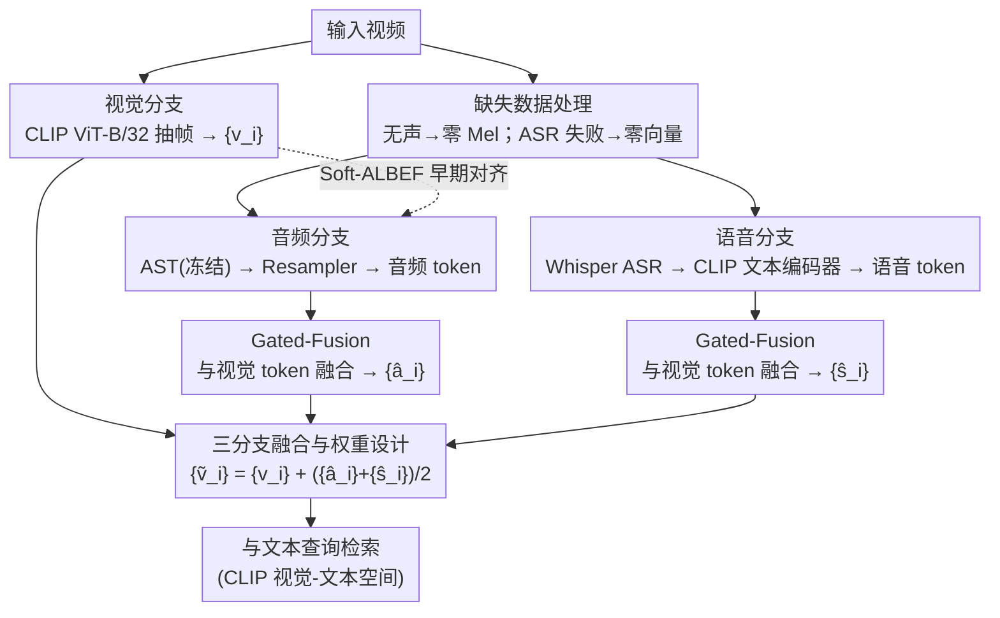

# SAVE: Speech-Aware Video Representation Learning for Video-Text Retrieval

| 信息 | 内容 |
|------|------|
| **会议** | CVPR 2026 |
| **arXiv** | [2603.08224](https://arxiv.org/abs/2603.08224) |
| **领域** | 人体理解 |
| **关键词** | 视频-文本检索, 语音感知, 音视频融合, soft-ALBEF, 多模态学习 |

## 一句话总结

提出 SAVE 方法，通过添加专用语音分支（Whisper ASR + CLIP 文本编码器）和 soft-ALBEF 视觉-音频早期对齐策略，实现语音感知的视频表示学习，在五个视频-文本检索基准上全面超越 SOTA。

## 研究背景与动机

视频-文本检索（VTR）领域普遍采用 CLIP 作为基础，但由于 CLIP 仅提供图像和文本编码器，现有方法自然忽略了视频的声音轨道。近期音视觉方法（EclipSE、TEFAL、AVIGATE）引入音频编码器，但存在两个关键问题：

**音频编码器无法有效表征语音内容**：现有音频编码器（ResNet-18、AST）是在环境声音数据集上训练的，对语音语义的编码效果很差。作者通过一个实验证明：在 AST 的特征空间中，不同类别的语音样本完全混杂在一起，无法区分

**视觉-音频融合前缺乏对齐**：视觉特征（CLIP 图像编码器）和音频特征（AST）从未经过预对齐，直接融合效果受限。虽然 ALBEF（先对齐再融合）已在视觉-语言预训练中成功，但视频-音频对往往缺乏语义对应关系（如背景音乐与视频内容无关），直接套用 hard ALBEF 会引入虚假关联

## 方法详解

### 整体框架

SAVE 想解决的是：现有音视觉检索方法虽然引入了声音，却把视频里**说了什么**这条语义白白丢掉。它的做法是在 AVIGATE 的「视觉 + 音频」双分支上再挂一条**语音分支**，把三路信号融合成一份「语音感知」的视频表示，再去和文本查询做检索。

整条管线这样走：视觉分支用 CLIP ViT-B/32 抽帧特征 $\{v_i\}$；音频分支把 AST（冻结）抽出的音频 token 过 Resampler，再经 Gated-Fusion 与视觉 token 融合得到 $\{\hat{a}_i\}$；新增的语音分支先用 Whisper large-v3 把语音转成 ASR 文本，送进 CLIP 文本编码器得到语音 token $\{s_i\}$，同样经 Gated-Fusion 得到 $\{\hat{s}_i\}$。三路最终合成语音感知的视频表示 $\{\tilde{v}_i\} = \{v_i\} + (\{\hat{a}_i\} + \{\hat{s}_i\})/2$，整个检索仍在 CLIP 的视觉-文本空间里完成。

### 关键设计

**1. 三分支融合与权重设计：把语音语义单独拎成一路，又不让它喧宾夺主**

现有音频编码器（ResNet-18、AST）在环境声数据集上训练，对「说了什么」几乎无能为力——作者的 toy 实验里，不同类别的语音在 AST 特征空间中完全混作一团。SAVE 干脆绕开这条路，不再指望音频编码器去理解语音，而是借 Whisper 把语音转成文字、再交给 CLIP 文本编码器编码，这样语音语义就被映射回了 CLIP 本就对齐好的视觉-文本空间。融合时刻意让视觉项 $\{v_i\}$ 以原始权重为主导，语音与音频则取等权平均 $(\{\hat{a}_i\} + \{\hat{s}_i\})/2$：视觉是检索的主信号所以权重大，语音和音频谁更重要事先并无先验，于是等权交给 Gated-Fusion 自己去学哪一路该被放大。

**2. Soft-ALBEF 早期对齐：用软标签躲开视频-音频之间的虚假关联**

视觉特征和音频特征在融合前从未对齐过，直接融合效果受限。ALBEF 那套「先对齐再融合」在视觉-语言预训练里很成功，但照搬不行——视频和它的声轨常常并无语义对应（背景音乐和画面内容毫不相干），hard ALBEF 会把这种不相干的对硬拉到一起，引入虚假关联。SAVE 的办法是把硬标签换成软标签：用 ImageBind 预先算出一份视频-音频亲和力矩阵 $M_0$ 当监督信号，让网络自己的亲和力矩阵 $M_1$ 去逼近它的相对结构，而不是逼成 0/1：

$$\ell_{\text{pearson}} = \frac{1}{b}\sum_{i=1}^{b} d_p(\sigma(M_0[i,\cdot]), \sigma(M_1[i,\cdot])) + \frac{1}{b}\sum_{j=1}^{b} d_p(\sigma(M_0[\cdot,j]), \sigma(M_1[\cdot,j]))$$

其中 $d_p$ 是 Pearson 距离。这里特意用 Pearson 而非 MSE/Huber，是因为它对尺度和位移变化不敏感，网络只需学到「哪些视频-音频对相对更相关」这套排序结构，而不必死磕绝对数值——对于本就带噪的跨模态对应关系，这种宽容度正好避免把噪声当成硬标签去拟合。

**3. 缺失数据处理：让没声音、识别不出来的样本也能正常走完管线**

真实视频里不是每条都有声轨、也不是每段语音都能被 ASR 识别。SAVE 对这两种缺失各给一个零值占位：完全无声的视频把 Mel 滤波器组置零；ASR 识别失败的就用空字符串，tokenizer 把它填成零向量。这样缺失样本既不会中断 batch，也不会给融合贡献误导信号。

### 损失函数 / 训练策略

Pearson 距离损失作为辅助目标，与 AVIGATE 原有的自适应边距对比损失等权相加。微调时给 CLIP 主干一个很小的学习率 1e-7、其余模块用 1e-4，以防主干发生灾难性遗忘。训练在 8× RTX 3090 上完成。

## 实验关键数据

### 主实验：文本到视频检索 SumR

| 方法 | MSRVTT-9k | MSRVTT-7k | VATEX | Charades | LSMDC | mR1 |
|------|:---:|:---:|:---:|:---:|:---:|:---:|
| CLIP4Clip | 197.5 | 150.1 | 248.5 | 107.6 | 112.7 | 35.1 |
| PIG | 203.0 | 157.1 | 252.1 | - | - | - |
| AVIGATE | 207.7 | 162.7 | 249.3 | 110.6 | 125.7 | 37.9 |
| **SAVE** | **216.2** | **165.8** | **255.5** | **121.4** | **128.3** | **39.6** |

SAVE 相比 AVIGATE 的 SumR 提升：MSRVTT-9k +8.5, VATEX +6.2, Charades +10.8。

### 分组分析（MSRVTT-9k）

| 组别 | SAVE vs AVIGATE SumR差 |
|------|:---:|
| 视觉相关 (499例) | 正提升 |
| 声音相关 (226例) | +11.5 |
| 语音相关 (171例) | +12.9 |
| 声音+语音相关 (104例) | **+16.4** |

### 效率分析

| 方法 | 计算复杂度 | 推理时间 | SumR |
|------|:---:|:---:|:---:|
| TEFAL | $O(n_{\mathcal{A}} n_{\mathcal{T}} + n_{\mathcal{V}} n_{\mathcal{T}})$ | 140.57ms | 209.2 |
| AVIGATE | $O(n_{\mathcal{A}} + n_{\mathcal{V}} + n_{\mathcal{T}})$ | 9.90ms | 207.7 |
| **SAVE** | $O(n_{\mathcal{S}} + n_{\mathcal{A}} + n_{\mathcal{V}} + n_{\mathcal{T}})$ | **9.90ms** | **216.2** |

SAVE 保持与 AVIGATE 相同的推理延迟（9.90ms），因为视频特征可离线提取。

### 消融：语音分支 vs 音频分支

- 去掉语音分支：SumR -4.3
- 去掉音频分支：SumR -8.7
- 两者均有贡献，音频分支影响更大因数据集中声音相关查询更多

## 亮点与洞察

1. **问题洞察精准**：通过 toy 实验直接展示 AST 在语音特征空间中的聚类失败，动机非常有说服力
2. **语音分支设计优雅**：Whisper ASR → CLIP 文本编码器的流水线巧妙利用了 CLIP 的文本-视觉对齐能力来编码语音
3. **soft-ALBEF 通用性强**：用 ImageBind 提供噪声容忍的软监督信号，解决了视觉-音频对缺乏对应关系的根本问题
4. **零额外推理成本**：所有新增计算可离线完成
5. **Charades 上的惊人提升**：即使仅 13.5% 视频有 ASR 文本，SumR 仍提升 10.8，说明 soft-ALBEF 有效利用了声音模态

## 局限性

- 仅在短视频片段上验证，长视频（如电商直播）中 ASR 文本通常更长更噪
- 依赖 Whisper 的 ASR 质量，非英语语言场景可能效果不同
- 使用 ViT-B/32，未探索更大骨干（受 GPU 预算限制）
- ImageBind 用于 soft-ALBEF 引入额外离线计算成本
- 对于完全无声视频的提升空间有限

## 评分

| 维度 | 分数 |
|------|------|
| 新颖性 | ⭐⭐⭐⭐ |
| 实验 | ⭐⭐⭐⭐⭐ |
| 写作 | ⭐⭐⭐⭐⭐ |
| 综合价值 | ⭐⭐⭐⭐ |

<!-- RELATED:START -->

## 相关论文

- [\[ACL 2025\] ChildMandarin: A Comprehensive Mandarin Speech Dataset for Young Children Aged 3-5](../../ACL2025/audio_speech/childmandarin_a_comprehensive_mandarin_speech_dataset_for_young_children_aged_3-.md)
- [\[NeurIPS 2025\] LeVo: High-Quality Song Generation with Multi-Preference Alignment](../../NeurIPS2025/audio_speech/levo_high-quality_song_generation_with_multi-processing_refined_supervision.md)
- [\[CVPR 2025\] DualTalk: Dual-Speaker Interaction for 3D Talking Head Conversations](../../CVPR2025/audio_speech/dualtalk_dual-speaker_interaction_for_3d_talking_head_conversations.md)
- [\[CVPR 2026\] PAVAS: Physics-Aware Video-to-Audio Synthesis](pavas_physics-aware_video-to-audio_synthesis.md)
- [\[CVPR 2026\] Omni2Sound: Towards Unified Video-Text-to-Audio Generation](omni2sound_towards_unified_video-text-to-audio_generation.md)

<!-- RELATED:END -->
