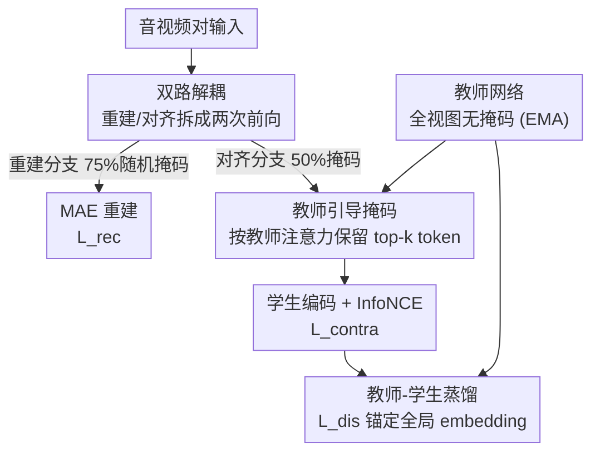

# Semantic Noise Reduction via Teacher-Guided Dual-Path Audio-Visual Representation Learning

**会议**: CVPR 2026  
**论文**: [CVF Open Access](https://openaccess.thecvf.com/content/CVPR2026/html/Wang_Semantic_Noise_Reduction_via_Teacher-Guided_Dual-Path_Audio-Visual_Representation_Learning_CVPR_2026_paper.html)  
**代码**: https://github.com/wanglg20/TG-DP  
**领域**: 多模态VLM / 自监督表示学习  
**关键词**: 音视频预训练, 对比学习, 掩码自编码, 自蒸馏, 跨模态检索

## 一句话总结
TG-DP 把音视频预训练里"掩码重建"和"对比对齐"两个目标拆成两次独立前向（各用自己的掩码比例），再用一个全视图教师网络给对比分支挑选可见 token、并蒸馏全局表征，从而消除以往单前向耦合带来的语义噪声，在 AudioSet / VGGSound 的零样本检索与线性探测上刷到 SOTA。

## 研究背景与动机
**领域现状**：音视频自监督的两条主线是掩码自编码（MAE，靠重建学单模态结构）和对比学习（CL，把异构模态拉到同一嵌入空间对齐）。近年的主流做法（CAV-MAE、MaViL、CAV-MAE Sync 等）是把这两个目标塞进**同一次前向**里联合优化，既要重建又要对齐。

**现有痛点**：作者指出这种耦合带来两个具体问题。其一是**语义噪声**——对比分支用的全局 token 是从"为重建而随机掩码"留下的可见 patch 聚合来的，这套可见性模式根本不是为跨模态匹配设计的，会保留一堆与对齐无关的区域（静音的频谱段、没有信息量的背景），污染全局表征、削弱细粒度对齐。其二是**优化干扰**——MAE 要的是"从局部观测高保真重建"，CL 要的是"对跨模态匹配语义不变"，两个目标压在同一份共享 token 上，梯度会互相打架。

**核心矛盾**：重建和对齐对"该看见哪些 token"的需求是冲突的——重建偏好大比例掩码逼模型补全，对齐偏好低掩码保留完整语义；但旧框架强行让它们共用一份掩码视图。

**本文目标**：在保留两个目标各自收益的前提下，把它们的优化路径解耦，让对比分支用上"更适合对齐"的可见性模式。

**切入角度**：既然冲突来自"共用一份视图"，那就给两个目标各开一条前向通道、各用各的掩码；同时引入一个看得到全图的教师，把"哪些 token 对跨模态对齐更重要"的先验注入对比分支。

**核心 idea**：用"双路解耦 + 教师引导掩码 + 教师蒸馏"替代"单前向联合优化"，把对比分支从重建导向的随机掩码里解放出来。

## 方法详解

### 整体框架
TG-DP 以 CAV-MAE Sync 为骨干：给定一段视频和配对音频，采样一帧 RGB 和与之时间对齐的对数梅尔频谱段作为一个训练对，分别 patch 化成 token、各自插入可学习的全局 token 和若干寄存器 token。关键改动是把训练拆成**两次目标专属的前向**，每个样本被处理两次：

- **重建分支**：沿用 MAE 惯例，大比例随机掩码（75%），把可见的音/视 token 拼接送进联合编码器-解码器去重建被掩的 patch，只贡献重建损失 $L_{rec}$，逼编码器学到强单模态结构。
- **对比分支**：用较低掩码比例（50%），由教师网络引导挑选可见 token，学生编码后取全局 token 做 InfoNCE 跨模态对齐，只贡献对比损失 $L_{contra}$；外加一个蒸馏损失 $L_{dis}$ 把学生全局向教师全视图全局靠拢。

两个分支**共享编码器与联合层权重**，但损失各自从自己的掩码视图算，从而把生成式目标和判别式目标在表征上彻底拆开。教师参数由学生参数的 EMA 滑动平均更新。

### 关键设计

**1. 双路解耦：给重建和对齐各开一条前向通道**

针对"语义噪声 + 优化干扰"这个根因，TG-DP 不再让两个目标共用一份掩码视图，而是把每个样本前向两次。重建分支用 75% 大掩码（重建损失见式 $L_{rec}^{m}=\frac{1}{|M_m|}\sum_{i\in M_m}\|\hat{m}_i^m-m_i^m\|_2^2$），对比分支用 50% 小掩码暴露更多可见 patch、保留更完整的语义上下文给全局表征。两条路共享同一套编码器，但 $L_{rec}$ 只由重建分支贡献、$L_{contra}$ 只由对比分支贡献，于是重建和对齐不再在同一份 token 表征上抢梯度。这种**非对称掩码**让对比分支拿到"更匹配跨模态对齐"的视图，同时保留部分掩码当正则。消融显示：仅加一次前向（两路都用 75%）就能在更难的 Audio→Visual 方向带来增益（R@10 58.1→60.1），但它真正的价值是为"两路用不同掩码比例"提供结构基础。

**2. 教师-学生蒸馏：给被掩视图的全局表征一个全视图语义锚**

对比分支看到的是被掩的局部视图，全局 token 容易飘。作者引入一个轻量教师：教师吃**完整、无掩码**的双模态输入，产出全视图全局表征 $[\hat{g}^v,\hat{g}^a]$；学生在被掩输入上产出自己的全局 $[g^v,g^a]$。除 InfoNCE 外，加一项蒸馏 MSE
$$L_{dis}=\|g^v-\hat{g}^v\|_2^2+\|g^a-\hat{g}^a\|_2^2$$
把学生全局往教师全视图靠。教师参数用学生的 EMA 更新以保证时间稳定性。最终目标为 $L_{all}=\lambda_1 L_{rec}+\lambda_2 L_{dis}+\lambda_3 L_{contra}$，其中重建给单模态生成监督、蒸馏给全视图一致性约束、对比仍是跨模态对齐主目标。消融（表 7）显示蒸馏让 AS20K 分类从 30.5 提到 32.0 mAP，是分类提升的主要来源。

**3. 教师引导掩码：让对比分支保留"对齐更有用"的 token，而非随机丢**

光解耦还不够——对比分支该保留哪 50% 可见 token？随机选仍可能丢掉关键语义。作者从教师联合编码器里抽**注意力权重**，度量每个 patch token 与该模态全局 token 的交互强度，在空间 token 上归一化作为"token 优先级线索"；学生据此保留得分 top-k 的 token 作为可见输入（$k$ 由对比分支掩码比例决定）。这种确定性选择把学生视图偏向"教师全视图里更可能有信息量"的区域，等于把教师的语义先验注入对比分支。消融（表 8）里这个"Distinct Guided Mask"虽在检索上与随机掩码相当，但把 AS20K 分类拉到 32.0（随机仅 30.2、概率式引导掩码 29.8），说明引导掩码主要稳住了表征的语义鲁棒性。

### 损失函数 / 训练策略
总目标 $L_{all}=\lambda_1 L_{rec}+\lambda_2 L_{dis}+\lambda_3 L_{contra}$，$\lambda_{1,2,3}$ 为固定权重。对比分支掩码比例取 0.50（消融最优折中），重建分支固定 75%。教师为学生的 EMA，训练后丢弃。⚠️ 三个 $\lambda$ 的具体取值原文未在正文给出，以原文/附录为准。

## 实验关键数据

### 主实验
预训练用 AudioSet-2M 的可用子集（约 1.39M 对，因 YouTube 视频失效/缺音轨而非全量），评测零样本音视频检索（余弦相似度排序，报 R@1/5/10）与冻结编码器的注意力探测分类。

零样本检索（R@1，训练无关方法对比；VAB-Encodec 因需任务微调仅作参考不直接可比）：

| 数据集/方向 | 指标 | 本文 TG-DP | CAV-MAE Sync | 提升 |
|--------|------|------|----------|------|
| AudioSet V→A | R@1 | 37.4 | 35.2 | +2.2 |
| AudioSet A→V | R@1 | 37.1 | 27.9 | +9.2 |
| VGGSound V→A | R@1 | 31.3 | 27.9 | +3.4 |
| VGGSound A→V | R@1 | 30.3 | 23.2 | +7.1 |

冻结编码器分类（注意力探测）：

| 任务 | 指标 | 本文 | CAV-MAE Sync | 之前最好 |
|------|------|------|----------|------|
| AS20K | mAP | 32.0 | 30.5 | 33.3 (VAB, 需微调) |
| VGGSound | Top-1 Acc | 52.7 | 52.7 | — |
| AS20K 仅音频 | mAP | 31.2 | 29.3 | — |
| AS20K 仅视觉 | mAP | 17.8 | 14.3 | — |

可见增益在更难的 **Audio→Visual** 方向尤其大（AudioSet A→V 直接 +9.2），作者归因于：① 两个编码器多从视觉域权重初始化，音频编码器在联合优化下更脆；② 音频语义在 token 上更稀疏、冗余更少，重掩码更易抹掉关键线索——而 TG-DP 用低掩码保住了更完整的音频视图。

### 消融实验
| 配置 | VGG A→V R@1 | AS20K mAP | 说明 |
|------|---------|------|------|
| 单前向 baseline | 23.2 | 30.5 | 重建/对比耦合 |
| + 双前向(均75%) | 27.4 | 30.4 | 仅解耦结构 |
| 对比掩码 0.50 | 30.3 | 32.0 | 最优折中 |
| 对比掩码 0.00 | 29.8 | 29.6 | 检索好但分类掉 |
| 对比掩码 0.65 | 25.1 | 30.5 | 重掩码毁检索 |
| w/o 蒸馏 | 29.1 | 30.5 | 分类掉 1.5 mAP |
| 随机掩码（替换引导掩码） | 30.3 | 30.2 | 分类掉 1.8 mAP |

### 关键发现
- **对比分支掩码比例是关键旋钮**：0.00/0.20 检索最强但 AS20K 分类掉（正则消失），0.65/0.75 检索崩（稀疏音频语义被重掩码毁掉），0.50 在检索与分类间取得最佳整体平衡。
- **蒸馏与引导掩码主要贡献"语义鲁棒性"（分类），检索贡献相对小**：去掉蒸馏 AS20K 掉到 30.5、换随机掩码掉到 30.2，而检索 R@1 几乎不变——说明这两个组件稳的是表征的可迁移语义而非排序。
- **代价仅在训练**：每 epoch 730s→1045s、总时长 7.1h→10.2h（多一次前向 + EMA 教师），但教师与额外前向推理时全部丢弃，**推理零额外开销/参数**。

## 亮点与洞察
- **"解耦 + 非对称掩码"这一招很干净**：它把"重建要大掩码、对齐要小掩码"这对本质冲突，用两次前向各取所需地化解，而不是靠调一个折中掩码硬凑——这个思路可迁移到任何"生成式 + 判别式"目标共训的多模态场景。
- **用教师注意力当掩码先验**很巧：不引入额外标注、不改架构，仅复用教师对全局 token 的注意力就把"该留哪些 token"从随机变成语义引导，几乎零成本注入先验。
- **诚实地把"检索 vs 分类"拆开归因**：作者没有把所有提升都笼统归给一个模块，而是用消融指出引导掩码/蒸馏主要稳分类、低掩码主要提检索，这种细粒度归因对复现者很有价值。

## 局限与展望
- **作者承认**：方法引入约 43% 的训练时间开销（多一次前向 + EMA），虽然推理无额外成本，但大规模预训练时这笔训练成本不可忽略。
- **自己发现**：检索方向上引导掩码相比随机掩码几乎没优势（表 8 R@1 持平），其收益高度集中在分类的语义鲁棒性，说明"引导"机制对排序型任务的帮助有限；另外实验只在 1.4M 子集上做，未验证在全量 AudioSet-2M 上规模化时增益是否保持。
- **改进思路**：能否把固定 0.50 的对比掩码改成随训练自适应/课程式调度，或让教师注意力先验同时作用于重建分支，是值得探索的方向。

## 相关工作与启发
- **vs CAV-MAE Sync**：本文直接以它为骨干，区别在于把它"单前向里重建+对比共用掩码视图"改成"双前向 + 非对称掩码 + 教师引导"，从而消除语义噪声；在所有检索/分类指标上一致超过它。
- **vs ImageBind / DenseAV**：它们靠大规模/多模态绑定或稠密区域监督做对齐，本文不扩模态、不加稠密标注，而是从"训练框架与目标解耦"角度提升对齐质量，证明改训练范式本身就能逼近甚至超过这些更重的方案。
- **vs DINO / BYOL 等自蒸馏**：本文借用了 EMA 教师-学生的稳定性思想，但把它用在"为被掩对比视图提供全视图语义锚 + 注意力引导掩码"，是自蒸馏在跨模态对齐上的一个具体落地。

## 评分
- 新颖性: ⭐⭐⭐⭐ 解耦双路 + 教师引导掩码组合清晰且有效，但各组件（双路、自蒸馏、引导掩码）均建立在已有思想上。
- 实验充分度: ⭐⭐⭐⭐ 双数据集双方向检索 + 分类 + 单模态迁移 + 5 组消融，归因细致；略憾未在全量 AS2M 上验证规模化。
- 写作质量: ⭐⭐⭐⭐ 动机—方法—消融逻辑顺，问题定义（语义噪声/优化干扰）讲得清楚。
- 价值: ⭐⭐⭐⭐ "解耦冲突目标 + 非对称掩码"的范式对多模态自监督有较强可迁移性，且推理零额外开销。

<!-- RELATED:START -->

## 相关论文

- [\[CVPR 2026\] SAVE: Speech-Aware Video Representation Learning for Video-Text Retrieval](save_speech-aware_video_representation_learning_for_video-text_retrieval.md)
- [\[ACL 2026\] Privacy-preserving Prosody Representation Learning](../../ACL2026/audio_speech/privacy-preserving_prosody_representation_learning.md)
- [\[ACL 2026\] Retrieving to Recover: Towards Incomplete Audio-Visual Question Answering via Semantic-consistent Purification](../../ACL2026/audio_speech/retrieving_to_recover_towards_incomplete_audio-visual_question_answering_via_sem.md)
- [\[CVPR 2026\] How Far Can We Go With Synthetic Data for Audio-Visual Sound Source Localization?](how_far_can_we_go_with_synthetic_data_for_audio-visual_sound_source_localization.md)
- [\[CVPR 2026\] EgoAVU: Egocentric Audio-Visual Understanding](egoavu_egocentric_audio-visual_understanding.md)

<!-- RELATED:END -->
