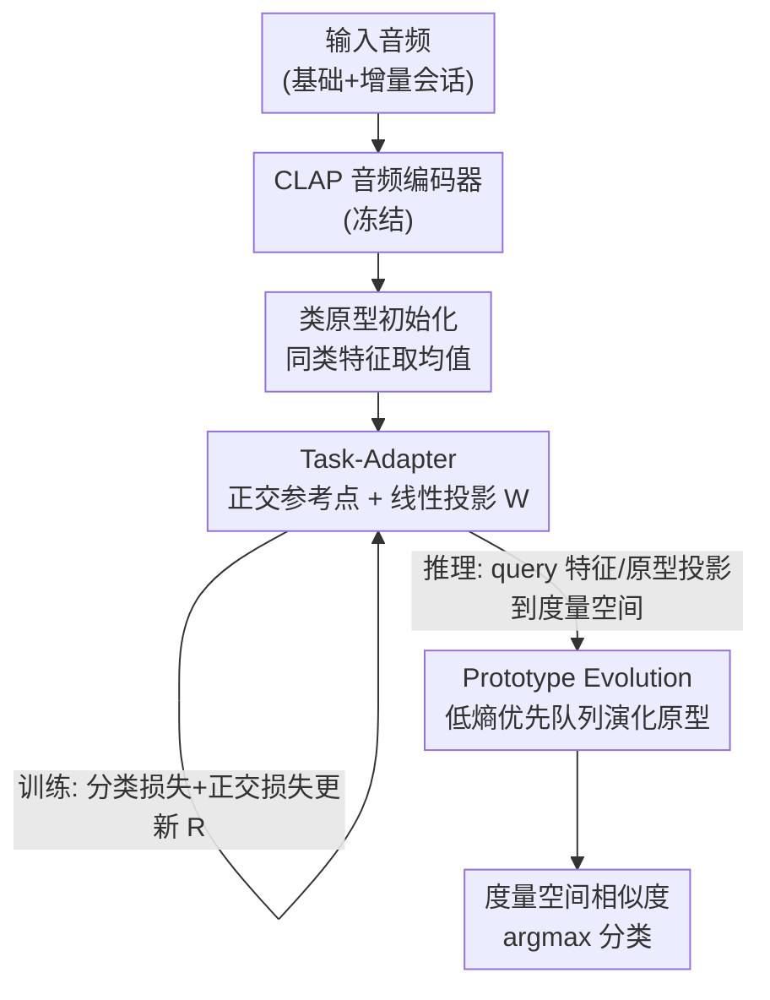

# TAPE: Task-Adaptive Prototype Evolution in Audio-Language Models for Fully Few-shot Class-incremental Audio Classification

**会议**: CVPR 2026  
**论文**: [CVF Open Access](https://openaccess.thecvf.com/content/CVPR2026/html/Gao_TAPE_Task-Adaptive_Prototype_Evolution_in_Audio-Language_Models_for_Fully_Few-shot_CVPR_2026_paper.html)  
**代码**: https://github.com/YvoGao/TAPE  
**领域**: 音频/语音  
**关键词**: 音频-语言模型, 小样本类增量, 灾难性遗忘, 原型演化, CLAP

## 一句话总结
针对"基础阶段和增量阶段都只有极少样本"的全小样本类增量音频分类（FFCAC），TAPE 不去微调 CLAP 的文本端，而是冻结其音频编码器、只学一个把音频投影到正交参考点空间的线性 Task-Adapter 来抗遗忘，并在推理阶段用低熵 query 样本动态修正类原型来抗过拟合，三个数据集上把平均准确率从 54.93% 拉到 82.76%。

## 研究背景与动机
**领域现状**：小样本类增量音频分类（FCAC）要在每个新会话里只用很少的标注音频去学新类、同时不忘旧类。但既有工作几乎都默认"基础会话有充足数据"，这在识别罪犯声纹、监测濒危物种这类真实场景里并不成立——基础会话和增量会话**都只有极少样本**。这个更苛刻的设定被称为 FFCAC（Fully Few-shot），目前只有 EDE、AISP 两项工作，它们靠不断扩展、微调音频频谱 Transformer（AST）来做，随着会话增多模型会越来越臃肿，不利于落地。

**现有痛点**：一个很自然的想法是借用预训练音频-语言模型（ALM，如 CLAP）的强泛化能力。但作者发现直接用 CLAP 在 FFCAC 上行不通，原因有二。其一是**文本-音频错位**：CLAP 的训练数据（0.128M）远少于 CLIP（400M），文本与音频波形对齐很弱，zero-shot CLAP 在 LBS-100 上平均准确率只有约 10%；更糟的是某些任务（如说话人识别）里类名就是 speaker ID，和波形毫无语义关联，文本分支根本帮不上忙。其二是**灾难性遗忘 + 过拟合**：用可训练 prompt 微调 ALM（如 PALM）在基础会话能拿到很高准确率（Nsynth-100 上 session 0 达 94%），但随增量会话推进急剧掉点，且每类仅 5 个样本严重限制泛化。

**核心矛盾**：既想用 ALM 的泛化能力，又不能依赖其不可靠的文本端；既要在增量中保住旧类知识，又要在极少样本下不过拟合到训练分布。

**本文目标**：在不微调 CLAP、不扩张模型的前提下，让 ALM 适配 FFCAC，同时压住遗忘与过拟合两个老问题。

**切入角度**：既然文本端不可靠且样本太少不足以微调 CLAP，那就**完全从音频特征侧学习**，绕开文本；并且不止在训练时学，还要在推理阶段继续从 query 音频里"吸收"知识。

**核心 idea**：冻结 CLAP 音频编码器，只学一个把音频投影到**正交参考点**度量空间的线性变换（抗遗忘），并在推理时用**低熵 query 样本动态演化类原型**（抗过拟合）——即 Task-Adaptive Prototype Evolution（TAPE）。

## 方法详解

### 整体框架
TAPE 把问题拆成训练和推理两段，全程只动音频特征，文本端完全不参与。训练时：CLAP 冻结的音频编码器 $f_A$ 编码标注音频，按类取均值初始化类原型 $P$；Task-Adapter 用一个正交参考层 $R$ 和原型矩阵 $P$ 解出线性变换矩阵 $W$，把音频特征和原型一起投影到"任务自适应度量空间"，并用分类损失只更新参考层。推理时：编码器编码 query 音频，经同一个 $W$ 投影后，Prototype Evolution 挑出**低熵（高置信）**的 query 特征塞进每个类的优先队列，用队列里的特征把类原型往真实类中心方向"演化"，最后在度量空间里算 query 与各类原型的相似度完成分类。

### 关键设计

**1. Task-Adapter：用正交参考点把各类原型几何隔离，抗灾难性遗忘**

遗忘的根源在于：所有类样本挤在同一个特征空间里，彼此纠缠，新会话一来旧类边界就被冲掉。Task-Adapter 的做法是把每个类原型**投影到一组固定且互相正交的参考点上**——既然参考点之间最大程度分离，新旧类原型在投影后的空间里就被天然撑开、互不干扰，旧类不会因为学新类而被挤走。具体地，设参考层权重矩阵 $R$（每行是单位化的 per-class 参考向量 $r_c/\lVert r_c\rVert$，由线性层学习，旧会话的参考点学完即冻结保存），原型矩阵 $P=[p_1,\dots,p_{N_t}]$ 其中每个新类原型由标注特征取均值 $p_c=\frac{1}{|D_c|}\sum_{(x_i,y_i)\in D_c} f_A(x_i)$。作者不去学一个非线性变换，而是**直接解线性方程 $PW=R$**：由于 $P$ 是非方阵，用满行秩广义逆 $P^{+}=P^{T}(PP^{T})^{-1}$，得到变换矩阵 $W=P^{+}R\in\mathbb{R}^{d\times d}$。这样投影 $f_A(x)W$ 就把音频送进任务自适应度量空间。线性解法的好处是可学参数极少，在每类仅 5 样本下不易过拟合。分类概率用投影后特征到原型的余弦距离做 softmax：$p(y|x_q)=\frac{\exp(-d(f_A(x_q)W, p_cW))}{\sum_{p_i\in P}\exp(-d(f_A(x_q)W, p_iW))}$。训练损失含分类交叉熵和一项**正交正则** $\lambda\lVert R^{T}R-I\rVert_F^2$（$\lambda=0.1$）来维持参考点正交。消融显示它主要拉低 PD（遗忘率），LBS-100 上把 PD 从 61.94 压到 15.49。

**2. Prototype Evolution：推理阶段用低熵 query 动态修正原型，抗过拟合**

过拟合的根源在于：训练样本太少，初始原型（5 个样本的均值）会偏离真实类中心，导致 query 分布和训练分布有偏差时分类出错。Prototype Evolution 借鉴时序延迟自适应的思路——既然推理时不断有 query 流入，何不让它们反过来把原型"拉"向真实中心？做法是给每个类维护一个容量为 $M$ 的**优先队列** $Q_c$，按**自信息熵** $h=-\frac{1}{N_t}\sum_{i=1}^{N_t}Pr_i\log Pr_i$ 排序（$Pr_i$ 是样本属第 $i$ 类的概率，熵越低越置信）。由于拿不到 query 真标签，按**伪标签**把特征入队。队列更新规则很直接：没满就直接加入 $(f_A(x_q), h)$；满了且新样本熵低于队尾（最高熵）那个就替换它，否则丢弃——即始终用高置信特征替换低置信特征。每次更新后重排队列、重算原型。原型按动量演化 $p_c\leftarrow(1-\alpha)\hat{p}_c+\alpha\frac{1}{|Q_c|}\sum_m f_A(x_q^m)$，$\hat{p}_c$ 是原始原型，$\alpha\in[0,1]$ 是动量系数。为避免历史测试集重复测时累积的"演化诱导过拟合"，每个会话开始时**重置队列并恢复原始原型**。消融显示它主要拉高 AA（平均准确率），LBS-100 上把 baseline 的 AA 从 40.30 提到 83.54。

### 一个完整示例
以 LBS-100 说话人识别为例（类名是无语义的 speaker ID，文本端彻底失效）：在某个增量会话里，编码器先用 5 个标注音频取均值得到新说话人的初始原型，Task-Adapter 把它投影到一个与所有旧说话人参考点正交的位置，于是新旧说话人在度量空间里被撑开，旧说话人不会因为新人加入而被误判。进入测试，一批 query 音频流入，模型先给每条算伪标签和熵，比如某条 query 熵 0.1（很自信）就被收进对应说话人的队列、替换掉队里熵 0.4 的旧条目；队列里这些高置信特征取均值后按动量把原型往真实声纹中心挪一点。这样即便初始 5 样本原型偏了，几轮 query 演化后原型逐渐贴近类中心，分类随之转正——这也是为什么 TAPE 在 LBS-100 这种文本无关任务上仍能从 ~10%（zero-shot CLAP）涨到 84.53% AA。

### 损失函数 / 训练策略
训练损失为分类交叉熵加正交正则：$\mathcal{L}=-\frac{1}{|Q|}\sum_{x_q\in Q}\sum_{c=1}^{C} y_c\log(\tilde{y}) + \lambda\lVert R^{T}R-I\rVert_F^2$，$\lambda=0.1$。每会话只优化参考层 $R$，编码器始终冻结。优先队列每类容量 $M=5$（实验中 5 是 AA/PD 折中的最优点）。CLAP 权重取自公开预训练，5 个会话，每数据集随机取 25 类切成 5 份无类别重叠，重复 100 次取均值，单卡 TITAN RTX 每个 seed 约 3 小时。

## 实验关键数据

### 主实验
三个数据集分别覆盖乐器识别（Nsynth-100）、事件检测（FSC-89）、声纹识别（LBS-100），用平均准确率 AA↑ 和性能下降率 PD↓（$PD=A_0-A_{T-1}$）衡量。

| 数据集 | 指标 | TAPE | 次优 baseline | 提升 |
|--------|------|------|----------|------|
| Nsynth-100 | AA↑ | 94.78% | 65.40% (EDE) | +29.38 |
| Nsynth-100 | PD↓ | 4.08% | 10.94% (AISP) | -6.82 |
| FSC-89 | AA↑ | 68.97% | 45.31% (AISP) | +23.66 |
| FSC-89 | PD↓ | 20.53% | 29.23% (AISP) | -8.70 |
| LBS-100 | AA↑ | 84.53% | ~61.2% (次优) | +23.32 |
| LBS-100 | PD↓ | 12.78% | ~35.57% (次优) | -22.79 |

平均看，TAPE 把 AA 从 54.93% 提到 82.76%，PD 从 28.74% 降到 12.56%。值得注意的是 PALM 这类微调文本 prompt 的方法在 session 0 极强（Nsynth-100 上 94.09%），但到 session 4 暴跌到 31.32%（PD 高达 62.77），印证了"文本端微调初期强、增量崩"的判断；而 TAPE 各会话准确率都稳（Nsynth-100 从 97.05% 平滑降到 92.97%）。

### 消融实验
以"CLAP 编码器 + 原型网络两层 MLP"为 baseline，逐个加模块（AA↑ / PD↓）：

| 配置 | LBS-100 | Nsynth-100 | FSC-89 | 说明 |
|------|---------|------------|--------|------|
| Baseline | 40.30 / 61.94 | 79.07 / 28.89 | 48.12 / 42.79 | 仅编码器+原型网络 |
| + Prototype Evolution | 83.54 / 15.30 | 93.10 / 6.40 | 67.88 / 21.19 | AA 大涨（+43.24/+14.03/+18.76） |
| + Task-Adapter | 82.20 / 15.49 | 93.67 / 5.83 | 68.05 / 21.68 | PD 大降（遗忘被压住） |
| TAPE（全） | 84.53 / 12.78 | 94.78 / 4.08 | 68.97 / 20.53 | 两者互补 |

### 关键发现
- **两个模块分工明确、互补**：Task-Adapter 主要影响 PD（抗遗忘），把 LBS-100 的 PD 从 61.94 砍到 15.49；Prototype Evolution 主要影响 AA（抗过拟合），把 LBS-100 的 AA 从 40.30 抬到 83.54。合在一起才同时拿到最好的 AA 和 PD。
- **优先队列容量 $M$ 有最优点**：随 $M$ 增大 AA 先升后稳、PD 先降后升，作者取 $M=5$ 作为两指标折中（实测 mem=5 时 LBS-100 AA 84.5/PD 12.8，Nsynth-100 AA 94.8/PD 4.1）。
- **文本无关任务收益最大**：LBS-100（类名是 speaker ID）上 zero-shot CLAP 几乎失效（~10%），TAPE 靠纯音频特征 + 原型演化把 AA 拉到 84.53%，AA 提升幅度（+23.32）在三个数据集里相当突出，PD 提升（-22.79）更是最大。
- **新旧类准确率被拉平**：对比图显示 baseline 的旧类准确率随会话快速下滑、新类一直偏高（说明它把样本都判成新学的类，即遗忘），而 TAPE 的新旧类准确率几乎持平，整体下滑只来自标签空间变大带来的固有难度上升。

## 亮点与洞察
- **"文本端不可靠就彻底绕开它"是关键判断**：面对 speaker ID 这类与波形无语义关联的类名，作者没有硬去对齐文本，而是只用音频特征做度量学习——这个取舍直接决定了在 LBS-100 上的巨大优势，提醒我们用多模态预训练模型时要先判断"哪个模态在当前任务里真的有用"。
- **用线性解 $PW=R$ 代替学非线性变换，参数极少**：在每类仅 5 样本的极端小样本下，可学参数越少越不容易过拟合；正交参考点提供了"无需数据驱动就天然分离各类"的几何先验，这是一个很可迁移的 trick——任何需要在小样本下隔离类子空间的任务都能借鉴。
- **把推理阶段也变成"学习"阶段**：Prototype Evolution 本质是一种测试时自适应（TTA），用低熵伪标签样本反向修正原型，且每会话重置以防累积漂移。这套"低熵优先队列 + 动量演化 + 周期重置"的组合可以迁移到其他原型式小样本/增量任务。

## 局限与展望
- **依赖伪标签质量**：Prototype Evolution 按伪标签入队，若早期伪标签系统性偏错，低熵高置信的"自信错误"反而会把原型往错方向拉；作者用每会话重置缓解，但未根治。
- **熵阈值/置信判据较朴素**：仅用自信息熵排序，未考虑校准问题，置信度高不等于正确，可能引入确认偏误。
- **CLAP 音频编码器全程冻结**：泛化能力上限被预训练编码器锁死，对 CLAP 域外的音频（如极端噪声、专业领域声音）可能力不从心。
- **演化只在测试集内进行且会话间重置**，没有跨会话持续累积的长期记忆机制；超参 $\alpha$、$M$ 的最优值在不同数据集间有差异，需逐数据集调。

## 相关工作与启发
- **vs EDE / AISP**（仅有的两个 FFCAC 方法）：它们靠扩展、微调 AST，随会话增多模型越来越大；TAPE 冻结编码器、只学一个 $d\times d$ 线性矩阵 + 参考层，参数和模型规模基本不随会话增长，更利于落地，且 AA/PD 全面更优。
- **vs PALM / COOP / COCOOP**（微调 ALM 文本 prompt）：它们优化文本分支特征空间，初始会话很强但增量阶段灾难性遗忘严重（PALM 在 Nsynth-100 上 PD 高达 62.77）；TAPE 完全不碰文本端，从音频特征侧学习，增量稳定性远好。
- **vs 经典 FSCIL（CEC / FACT）**：CEC 冻结编码器、FACT 为新类预留空间，思路上 TAPE 也冻结编码器，但额外用正交参考点显式几何隔离 + 推理时原型演化，在 ALM 加持下把 AA 提升一个量级。

## 评分
- 新颖性: ⭐⭐⭐⭐ 首个把 ALM 用于 FFCAC，正交参考点线性隔离 + 推理时原型演化的组合具体且切题。
- 实验充分度: ⭐⭐⭐⭐⭐ 三任务三数据集、12 个 baseline、重复 100 次、模块消融 + 队列容量分析 + 新旧类拆分都齐全。
- 写作质量: ⭐⭐⭐⭐ 动机和方法讲得清楚，公式完整；个别符号（如 $\hat{p}_c$ 与原始原型）描述略简。
- 价值: ⭐⭐⭐⭐ 极端小样本增量音频分类是真实且被忽视的场景，方法轻量易迁移，AA 大幅提升有实用意义。

<!-- RELATED:START -->

## 相关论文

- [\[AAAI 2026\] AHAMask: Reliable Task Specification for Large Audio Language Models without Instructions](../../AAAI2026/audio_speech/ahamask_reliable_task_specification_for_large_audio_language.md)
- [\[CVPR 2026\] AudioStory: Generating Long-Form Narrative Audio with Large Language Models](audiostory_generating_long-form_narrative_audio_with_large_language_models.md)
- [\[CVPR 2026\] Echoes Over Time: Unlocking Length Generalization in Video-to-Audio Generation Models](echoes_over_time_unlocking_length_generalization_in_video-to-audio_generation_mo.md)
- [\[ACL 2026\] SEPT: Semantically Expanded Prompt Tuning for Audio-Language Models](../../ACL2026/audio_speech/generalizable_prompt_tuning_for_audio-language_models_via_semantic_expansion.md)
- [\[ACL 2026\] MCGA: A Multi-task Classical Chinese Literary Genre Audio Corpus](../../ACL2026/audio_speech/mcga_a_multi-task_classical_chinese_literary_genre_audio_corpus.md)

<!-- RELATED:END -->
