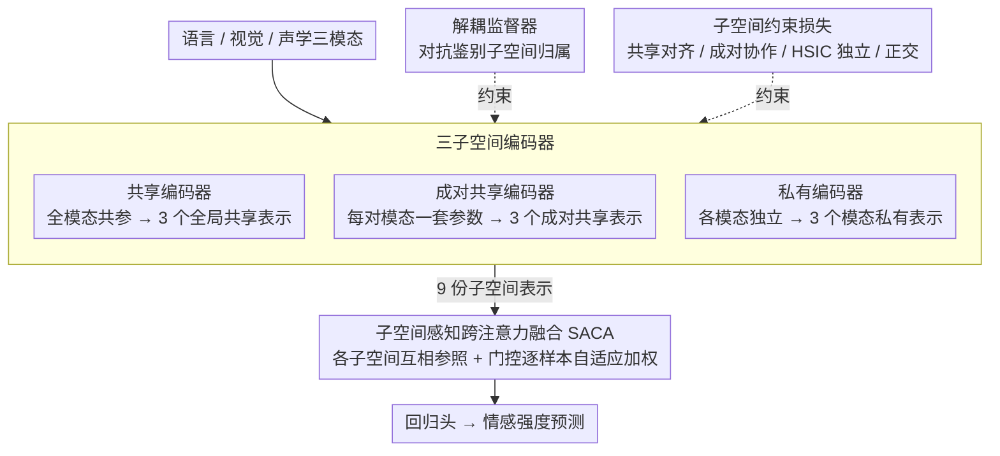

# Tri-Subspaces Disentanglement for Multimodal Sentiment Analysis

**会议**: CVPR 2026  
**arXiv**: [2602.19585](https://arxiv.org/abs/2602.19585)  
**代码**: 无  
**领域**: 语音/音频  
**关键词**: 多模态情感分析, 三子空间解耦, 跨注意力融合, 成对共享, HSIC

## 一句话总结

提出 TSD 框架，将多模态特征显式分解为全局共享/成对共享/模态专属三个互补子空间，并通过子空间感知跨注意力融合模块自适应整合三层信息，在 CMU-MOSI/MOSEI 上全面 SOTA。

## 研究背景与动机

多模态情感分析整合语言/视觉/声学三模态。现有方法大多采用"共享-私有"二分法（如 MISA），将特征分为全局共享和模态专属。但人类情感中大量线索仅在部分模态对之间共享——如讽刺场景中语气和表情共同传达否定情感，但文本表达积极。这种"成对共享"信号在二分法中被忽略或错误归类。

## 方法详解

### 整体框架

TSD 想解决的是"共享-私有"二分法把成对模态信号丢掉的问题，办法是给每个模态多开一层表示。三模态特征先各自经过编码，被显式拆进三类子空间——全局共享、成对共享、模态私有，三模态合计产出 9 个子空间表示（3 共享 + 3 成对 + 3 私有）。一组解耦损失和一个对抗式监督器负责把这 9 份表示"按职责钉死"、互不串味，最后由 SACA 融合模块让每个子空间互相参照、自适应加权汇总，再送进回归头预测情感强度。

### 关键设计

**1. 三子空间编码器：给"成对共享"信号一个专属容身处**

二分法只有"所有模态都共享"和"某模态独有"两档，可现实里语气和表情这种只在两模态间共享、文本却不参与的线索无处安放。TSD 因此把编码拆成三套并行分支：共享编码器 $I(\cdot;\theta_c)$ 全模态共用一套参数，逼出模态无关的全局一致特征 $\mathbf{C}_m$；成对共享编码器 $S_{mn}(\cdot;\theta_{mn})$ 对每一对模态 $(m,n)$ 单独配一套参数，捕捉只在这两模态间流动的交互特征 $\mathbf{S}_{mn}^{(m)}$；私有编码器 $P_m(\cdot;\theta_m)$ 各模态独立，留住模态特有信息 $\mathbf{P}_m$。"参数共享粒度"正好对应"信息共享范围"——全共享参数学全局共性，成对共享参数学成对共性，独立参数学个性，结构上自然把三类信号分开。

**2. 解耦监督器：用对抗鉴别堵住子空间之间的信息泄漏**

光靠编码器结构并不能保证各子空间真的只装该装的信息——共享分支可能偷偷夹带模态私货。监督器是一个三分支鉴别器，对任意一个嵌入去预测它"本该来自哪个子空间"（共享/成对/私有），编码器则被训练得让鉴别器认得出每份表示的身份：

$$\mathcal{L}_{sup} = -\frac{1}{M}\sum_m \Big[\log D_{com}(\mathbf{c}_m) + \sum_{n \neq m}\log D_{sub}(\mathbf{s}_{mn}^{(m)}) + \log D_{pri}(\mathbf{p}_m)\Big]$$

相比 MISA 只用一个"判模态来源"的判别器，这里判的是"判子空间归属"，约束更细——它直接逼着每类子空间维持自己的可辨识统计特征，从而压住跨子空间的泄漏。

**3. 子空间约束损失：把"该靠近的靠近、该正交的正交"写成几何约束**

监督器管的是身份可辨，这组损失则正面规定各表示之间应有的几何关系，四项各管一件事。共享一致性损失 $\mathcal{L}_{com}=\sum\|\mathbf{c}_m-\mathbf{c}_n\|_2^2$ 把不同模态的共享表示往一起拉，逼出真正模态无关的公共信号；成对协作损失 $\mathcal{L}_{pair}=\sum\|\mathbf{s}_{mn}^{(m)}-\mathbf{s}_{mn}^{(n)}\|_2^2$ 让同一对模态各自抽出的成对表示彼此对齐，确认它俩谈的是同一件"成对共享"的事；私有独立损失 $\mathcal{L}_{pri}=\sum\text{HSIC}(\mathbf{p}_{m_1},\mathbf{p}_{m_2})$ 用 HSIC（一种能刻画非线性统计依赖的核度量）压低不同模态私有表示间的依赖，比单纯 L2 更彻底地保证它们互相独立；正交性损失 $\mathcal{L}_{ort}=\sum\|\mathbf{C}_m^\top\mathbf{P}_m\|_F^2+\cdots$ 再把共享与私有方向拉到正交，避免同一模态内部共享和私有内容重叠。四项合起来，等于从"对齐""独立""正交"三个角度把 9 份表示的相对位置全部约束死。

**4. 子空间感知跨注意力融合 SACA：让每个子空间先看清别人再决定自己出多少力**

九份表示若直接拼接，权重一刀切，丢了"哪类信号此刻更可信"的判断。SACA 给每个子空间构造一个包含其余子空间的上下文集，做多头跨注意力增强，使该子空间在融合前先吸收其他层的信息；随后门控网络按当前样本算出一组自适应权重 $\psi_k$，对增强后的各子空间表示 $F_{\mathcal{S}}^{(k)}$ 加权求和：

$$\mathbf{Y}_{final} = \sum_k \psi_k \cdot F_{\mathcal{S}}^{(k)}$$

关键在于权重是样本相关的——讽刺样本里成对共享子空间会被门控调高、共享子空间调低，简单拼接做不到这种逐样本的层次化取舍，消融里去掉 SACA 也是掉得最多的一项。

### 一个完整示例

以一句讽刺评论"做得真'好'啊"（文本积极、语气讽刺、表情不屑）走一遍：三套编码器先把它编成 9 份表示，其中文本-声学这一对的成对共享表示 $\mathbf{S}_{ta}$ 会强烈编码"语气否定了字面意思"，而全局共享表示因三模态各说各话、被 $\mathcal{L}_{com}$ 拉得偏弱、信息量有限；监督器和约束损失保证这份否定信号被钉在成对子空间里、不会渗进共享或私有层；进到 SACA 时，门控发现成对共享层信息最关键，给它 $\psi$ 调高、给疲软的全局共享层调低，最终融合结果偏向"负面情感"——这正是二分法因为没有成对子空间而容易误判成"正面"的场景。

### 训练策略

总损失把任务回归项和三子空间正则项相加：$\mathcal{L}_{all} = \mathcal{L}_{task} + \mathcal{L}_{TS}$，其中 $\mathcal{L}_{TS}$ 汇总了监督器损失与四项约束损失，各项权重 $\lambda_{1\text{-}4}$ 由验证集调优。

## 实验关键数据

### 主实验

| 数据集 | 指标 | TSD | EMOE (前SOTA) | 提升 |
|--------|------|-----|--------------|------|
| CMU-MOSI | MAE ↓ | **0.691** | 0.697 | -0.9% |
| CMU-MOSI | ACC7 ↑ | **49.0%** | 47.8% | +2.5% |
| CMU-MOSI | ACC2 ↑ | **86.5%** | 85.4% | +1.3% |
| CMU-MOSEI | ACC7 ↑ | **54.9%** | 54.1% | +1.5% |
| CMU-MOSEI | ACC2 ↑ | **86.2%** | 85.5% | +0.8% |

### 消融实验

| 配置 | MOSI MAE | 说明 |
|------|----------|------|
| 无成对共享 | +0.015 | 成对共享信号对情感判断重要 |
| 无解耦监督器 | +0.012 | 监督器有效防止信息泄漏 |
| 无 SACA | +0.018 | SACA 融合显著优于简单拼接 |
| HSIC 替换为 L2 | +0.008 | HSIC 更好地保证独立性 |

### 关键发现

- 三子空间在所有指标上优于二子空间（共享-私有），5 次随机种子标准差很小
- 在多模态意图识别任务上也展现了良好的迁移能力

## 亮点与洞察

1. "成对共享"子空间的显式建模——填补了共享-私有二分法的理论空白
2. SACA 的层次化融合设计——每个子空间都能"看到"其他子空间的信息再决定融合权重
3. 解耦监督器是对抗训练的自然应用，比 MISA 的模态判别器更精细

## 局限与展望

1. 三模态时成对子空间数量为 3，扩展到更多模态时组合爆炸（$C_n^2$）
2. 所有损失的权重 $\lambda_{1-4}$ 需要仔细调优
3. 未涉及时序动态建模（仅在 utterance 级别做情感分析）

## 相关工作与启发

- 相比 MISA：从 2 子空间扩展到 3 子空间，增加了成对共享维度
- HSIC 独立性约束可推广到其他需要正交化的多视图学习任务

## 评分

- 新颖性: ⭐⭐⭐⭐ 三子空间分解理论动机清晰
- 实验充分度: ⭐⭐⭐⭐ 两数据集+意图识别迁移+消融
- 写作质量: ⭐⭐⭐⭐ 数学符号规范
- 价值: ⭐⭐⭐ 提升幅度相对有限，但方向正确

<!-- RELATED:START -->

## 相关论文

- [\[AAAI 2026\] PSA-MF: Personality-Sentiment Aligned Multi-Level Fusion for Multimodal Sentiment Analysis](../../AAAI2026/audio_speech/psa-mf_personality-sentiment_aligned_multi-level_fusion_for_multimodal_sentiment.md)
- [\[AAAI 2026\] PaSE: Prototype-aligned Calibration and Shapley-based Equilibrium for Multimodal Sentiment Analysis](../../AAAI2026/audio_speech/pase_prototype-aligned_calibration_and_shapley-based_equilibrium_for_multimodal_.md)
- [\[AAAI 2026\] Improving Multimodal Sentiment Analysis via Modality Optimization and Dynamic Primary Modality Selection](../../AAAI2026/audio_speech/improving_multimodal_sentiment_analysis_via_modality_optimization_and_dynamic_pr.md)
- [\[AAAI 2026\] A Text-Routed Sparse Mixture-of-Experts Model with Explanation and Temporal Alignment for Multi-Modal Sentiment Analysis](../../AAAI2026/audio_speech/text-routed_sparse_mixture-of-experts_model_with_explanation_and_temporal_alignm.md)
- [\[CVPR 2026\] UniM: A Unified Any-to-Any Interleaved Multimodal Benchmark](unim_a_unified_any-to-any_interleaved_multimodal_benchmark.md)

<!-- RELATED:END -->
