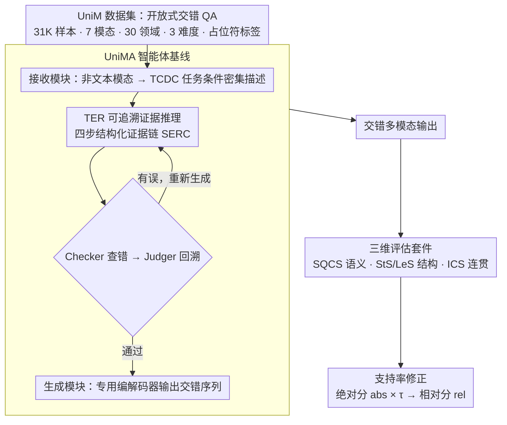

# UniM: A Unified Any-to-Any Interleaved Multimodal Benchmark

**会议**: CVPR 2026  
**arXiv**: [2603.05075](https://arxiv.org/abs/2603.05075)  
**代码**: 有（[项目页](https://any2any-mllm.github.io/unim)）  
**领域**: 音频/语音（多模态基准）  
**关键词**: 多模态基准, 任意到任意, 交错多模态, 评估套件, 智能体模型

## 一句话总结

提出首个统一的任意到任意交错多模态基准 UniM（31K 样本、7 种模态、30 个领域），配套三维评估体系和基于可追溯推理的智能体基线 UniMA，揭示现有 MLLM 在交错多模态范式下的严重不足。

## 研究背景与动机

### 1. 领域现状
多模态大语言模型（MLLM）已从早期的视觉-语言理解快速演进到同时支持理解与生成的统一框架（如 NExT-GPT、AnyGPT、MIO 等），交错多模态学习（interleaved multimodal learning）成为下一代系统的核心能力。

### 2. 痛点
现有交错多模态基准（MMIE、CoMM、ISG-Bench、OpenING 等）存在三个关键缺陷：

- **模态覆盖窄**：仅限文本+图像两种模态，无法评估音频、视频、文档、代码、3D 等更广泛的模态组合
- **能力评估单一**：每个数据实例只测试单一能力，无法反映真实场景中多能力交织的复合推理
- **领域多样性不足**：集中在通用领域，忽视自然科学、社会科学等专业场景

### 3. 核心矛盾
模型能力已扩展到多模态任意到任意转换，但缺乏与之匹配的系统性评估基准——现有基准的评估维度、模态覆盖、难度分级都远远滞后于模型发展。

### 4. 要解决什么
构建一个同时覆盖 **多模态**（7 种）、**多领域**（30 个）、**多能力**（每实例多任务）、**多难度**（3 级）的统一交错多模态基准，并设计匹配的评估方法和基线模型。

### 5. 切入角度
从真实世界数据出发（公开数据集、社交媒体、维基百科/YouTube 等知识库），构建开放式 QA 格式的大规模交错多模态数据集，输入输出均为任意模态的交错序列。

### 6. 核心 idea
三大贡献：（1）UniM 数据集——首个统一任意到任意交错多模态基准；（2）UniM 评估套件——语义正确性+结构完整性+交错连贯性三维评估；（3）UniMA——基于可追溯证据推理的智能体基线模型。

## 方法详解

### 整体框架

UniM 要回答一个被现有基准漏掉的问题：当模型可以"任意模态进、任意模态出"时，怎么衡量它生成的交错序列到底好不好？整篇工作由三块拼成——一个大规模数据集、一套三维评估指标、一个能跑出像样成绩的智能体基线。数据这一侧统一用开放式 QA 格式：输入和输出都是任意模态混排的交错序列，非文本内容用占位符标签（如 `<<image1>>`、`<<video2>>`）嵌进文本里，这样无论图、音、视频还是 3D，都能在同一套文本骨架上被引用和评估。最终落地为 31,026 个高质量实例，横跨 7 种模态（文本、图像、音频、视频、文档、代码、3D）、30 个领域（归为自然科学、社会科学、通用领域三大类），再按规则切成 Easy/Medium/Hard 三档难度。下图把数据集、智能体基线 UniMA 的推理流水线、以及三维评估+支持率修正的打分流程串成一条完整数据流：

### 关键设计

**1. 三维评估套件：把"开放式多模态生成好不好"拆成三个互不替代的维度**

传统 accuracy 这类指标在开放式生成面前失灵——同一个问题可以有无数种合理的交错回答，没法用唯一正确答案去卡。论文的办法是把"好"拆成语义、结构、连贯三个正交维度，每个维度单独打分、互相不背锅。语义这一维叫 SQCS（语义正确性与生成质量），先把所有模态输出都转成类 caption 的文本表示，用 LLM-as-Judge 评语义正确性 SC，再对每种模态做无参考的质量评估 GQ，二者按 $\text{SQCS} = \text{SC} \cdot (\eta^{\text{SQCS}} + (1 - \eta^{\text{SQCS}}) \cdot \text{GQ})$ 合成，其中 $\eta^{\text{SQCS}} = 0.7$ 让语义占主导、质量做加权调节。结构这一维拆成严格分 StS 和宽松分 LeS：StS 要求输出的模态类型和占位符数量与任务定义完全对齐，LeS 只要模态类型覆盖一致即可——这样就把"听不听话"（指令遵循）从"答得对不对"里单独拎出来量化。连贯这一维是 ICS，按 $\text{ICS} = \eta^{\text{ICS}} \cdot \text{HC} + (1 - \eta^{\text{ICS}}) \cdot \text{SH}$ 计算（$\eta^{\text{ICS}} = 0.8$），HC 度量跨模态的语义结构一致性、SH 度量写作风格与视觉美学的协调，专门捕捉那种单看每个模态都没错、合在一起却图文割裂的问题。三维解耦之后，失败原因才能定位到具体某一层，而不是混成一个糊掉的总分。

**2. 支持率修正：让"不会做"和"做不对"算两笔账**

直接给所有模型用同一套绝对分会失之公平——有的基线压根不支持音频或 3D 输出，它在这些样本上拿零分，并不说明它"推理能力差"，只说明它"模态没覆盖"。论文引入支持率 $\tau$ 作为条件修正，把绝对能力换算成相对能力：

$$\mathcal{X}^{rel} = \tau \cdot \mathcal{X}^{abs}$$

其中 $\mathcal{X}^{abs}$ 是模型在全部样本上的绝对得分，$\tau$ 反映它实际支持的模态占比。于是绝对分（abs）回答"在完整任务空间里它能拿多少"，相对分（rel）回答"在它力所能及的范围内它做得怎么样"，两个数字一起看才不会把"能力短板"和"覆盖短板"混为一谈。

**3. UniMA 智能体基线：用可追溯证据推理把交错生成拆成可检验的几步，而不是端到端硬生**

现有 MLLM 在这套基准上几乎全线崩盘，论文需要一个能跑出像样成绩、又能说清"怎么才算做对"的基线，于是搭了智能体流水线 UniMA。它先经接收模块（Receiving Module）把所有非文本模态转成任务条件密集描述（TCDC），把多模态输入压进一个统一的文本空间，后续推理就只在文本上进行。核心是可追溯证据推理模块（TER），跑一条四步的结构化证据推理链（SERC）：第一步生成 TCDC 并改写问题，对准语义正确性；第二步判断任务是否涉及数据分析，需要就调用代码解释器产出数据报告；第三步把模态内容、文本内容、工具列表分门别类组织好，分别去顶 SQCS、ICS、StS/LeS 三个维度；第四步整合所有证据，写出最终报告草稿。关键在这条链不是一次过——Checker 扫报告里的事实与逻辑错误，Judger 据此回溯做纠正推理，整体跑一个"生成→检查→回溯→重新生成"的迭代循环，每一步结论都挂着可回查的证据。最后由生成模块（Generating Module）依据这份验证过的报告，调专用编解码器吐出交错多模态输出。消融里移除 TER 让 StS/LeS 暴跌 -36.3/-60.8，正说明这条结构化证据链才是基线能站住的支柱。

### 损失函数 / 训练策略

UniMA 是智能体框架而非端到端训练的模型，不走梯度优化，能力来自 TER 的结构化推理流程加专用多模态编解码器的拼装。评估套件里的两个权重 $\eta^{\text{SQCS}} = 0.7$、$\eta^{\text{ICS}} = 0.8$ 是通过与人类评估的最优对齐标定出来的。

## 实验关键数据

### 主实验

**表1：语义正确性与生成质量（SQCS）及支持率**

| 领域 | 模型 | SC | GQ | SQCS_abs | τ | SQCS_rel |
|------|------|---:|---:|---:|---:|---:|
| 自然科学 | AnyGPT | 13.7 | 37.9 | 11.1 | 90.4 | 10.7 |
| 自然科学 | NExT-GPT | 8.4 | 23.4 | 6.2 | 62.0 | 2.9 |
| 自然科学 | MIO | 19.7 | 29.1 | 15.9 | 59.2 | 10.0 |
| 自然科学 | **UniMA** | **59.8** | **79.7** | **57.3** | **100** | **57.3** |
| 社会科学 | AnyGPT | 18.0 | 23.8 | 15.5 | 94.7 | 14.7 |
| 社会科学 | NExT-GPT | 16.8 | 31.9 | 13.3 | 89.0 | 10.8 |
| 社会科学 | MIO | 25.2 | 32.8 | 21.4 | 80.8 | 16.1 |
| 社会科学 | **UniMA** | **76.2** | **81.0** | **72.7** | **100** | **72.7** |
| 通用领域 | **UniMA** | **64.7** | **83.6** | **62.2** | **100** | **62.2** |

**表2：交错连贯性评估（ICS）**

| 领域 | 模型 | HC | SH | ICS_abs | ICS_rel |
|------|------|---:|---:|---:|---:|
| 自然科学 | AnyGPT | 39.9 | 46.3 | 41.8 | 38.5 |
| 自然科学 | NExT-GPT | 23.5 | 26.1 | 24.9 | 16.3 |
| 自然科学 | MIO | 49.4 | 63.7 | 52.1 | 31.8 |
| 自然科学 | **UniMA** | **68.4** | **71.9** | **69.1** | **69.1** |
| 社会科学 | AnyGPT | 31.3 | 35.3 | 32.1 | 29.2 |
| 社会科学 | MIO | 46.3 | 55.0 | 51.6 | 42.0 |
| 社会科学 | **UniMA** | **73.1** | **76.5** | **73.8** | **73.8** |
| 通用领域 | MIO | 68.3 | 77.7 | 60.0 | 45.7 |
| 通用领域 | **UniMA** | **68.7** | **74.3** | **69.8** | **69.8** |

### 消融实验

**表3：UniMA 消融实验**

| 配置 | SQCS | ICS | StS | LeS |
|------|---:|---:|---:|---:|
| UniMA（完整） | 85.1 | 63.4 | 52.7 | 82.6 |
| w/o TER | 72.9 (-12.2) | 56.6 (-6.8) | 16.4 (-36.3) | 21.8 (-60.8) |
| w/o TCDC | 78.4 (-6.7) | 57.7 (-5.7) | 46.2 (-6.5) | 82.1 (-0.5) |
| w/o Verification | 72.9 (-12.2) | 54.7 (-8.7) | 38.3 (-14.4) | 66.8 (-15.8) |

关键发现：移除 TER 导致 StS/LeS 最大幅度下降（-36.3/-60.8），证明可追溯推理对结构完整性至关重要；移除验证子模块导致所有指标全面下降，说明检查-回溯-重生成机制对可靠输出不可或缺。

### 关键发现

1. **现有模型表现极差**：基线模型 SQCS 大多低于 20%，NExT-GPT 和 MIO 的 StS/LeS 大多低于 5%，说明现有 MLLM 远未达到交错多模态学习的要求
2. **支持率严重限制相对性能**：AnyGPT 通用领域 StS 从 12.5% 降至 9.8%（rel），MIO 自然科学 SQCS 从 15.9% 降至 10.0%（rel），模态支持不全面是核心瓶颈
3. **领域差异显著**：社会科学 SQCS 最高（常见概念+描述性推理），通用领域 ICS 最高（开放域数据更匹配训练分布），自然科学表现最差（需精确术语+结构化逻辑）
4. **UniMA 大幅领先**：StS/LeS 比 AnyGPT 高 2-6 倍，比 NExT-GPT/MIO 高 15-40 倍
5. **难度敏感性**：只有 UniMA 表现出与难度一致的性能梯度，基线模型在最简单任务上就已失败，无法区分任务复杂度

## 亮点与洞察

- **问题定义价值大**：首次系统化定义"任意到任意交错多模态学习"并提供完整评测框架，填补了 7 模态/30 领域/多难度级别的评估空白
- **评估套件设计精巧**：SQCS/StS-LeS/ICS 三维度解耦了语义、结构、连贯性，与人类评估的 Pearson 相关系数高达 0.974/0.960
- **支持率修正机制**（$\tau$）公平处理了模型模态支持不完整的问题，兼顾绝对能力和相对能力
- **TER 模块设计**：证据可追溯 + 检查回溯机制在 agentic 框架中有效提升了结构化输出质量

## 局限与展望

- UniMA 本质是 agentic pipeline（多模块拼接），非端到端统一模型，其优势部分来自工程集成而非模型能力突破
- 7 种模态中代码（2.6%）和 3D（1.4%）占比极低，评估这两类模态的代表性存疑
- 评估强依赖 LLM-as-Judge，引入了评估模型自身的偏差
- 缺少人类基线性能（human performance），难以判断 UniMA 的 ~60% SQCS 在绝对意义上达到什么水平
- 数据扩展部分使用 GPT-5-mini 生成候选实例，可能引入合成数据偏差

## 相关工作与启发

- **与 MMIE/CoMM 的对比**：UniM 将模态从 2 种扩展到 7 种，领域从 ~10 个扩展到 30 个，交错组合从 3-4 种扩展到 41 种，是量级上的跃升
- **与 NExT-GPT/AnyGPT 的关系**：这些模型是被评估的基线，实验暴露了它们在交错场景下的严重局限
- **TER 模块的启发**：可追溯证据推理链对复杂多模态任务有显著增益，"生成→检查→回溯→重生成"的迭代范式值得借鉴
- **评估方法启发**：将多模态评估分解为语义/结构/连贯三个正交维度，比单一指标更有信息量

## 评分

⭐⭐⭐⭐ 重要的基准工作，首次系统化定义和评测任意到任意交错多模态学习，数据规模大、评估设计周到，但 UniMA 基线偏工程化，核心贡献在数据集和评估方法而非模型创新。

<!-- RELATED:START -->

## 相关论文

- [\[CVPR 2025\] Contextual AD Narration with Interleaved Multimodal Sequence](../../CVPR2025/audio_speech/contextual_ad_narration_with_interleaved_multimodal_sequence.md)
- [\[AAAI 2026\] Cross-Space Synergy: A Unified Framework for Multimodal Emotion Recognition in Conversation](../../AAAI2026/audio_speech/cross-space_synergy_a_unified_framework_for_multimodal_emotion_recognition_in_co.md)
- [\[CVPR 2026\] Tri-Subspaces Disentanglement for Multimodal Sentiment Analysis](tri-subspaces_disentanglement_for_multimodal_sentiment_analysis.md)
- [\[ACL 2026\] MSU-Bench: Musical Score Understanding Benchmark](../../ACL2026/audio_speech/musical_score_understanding_benchmark_evaluating_large_language_models39_compreh.md)
- [\[CVPR 2026\] ViDscribe: Multimodal AI for Customizing Audio Description and Question Answering in Online Videos](vidscribe_multimodal_ai_for_customizing_audio_description_and_question_answering.md)

<!-- RELATED:END -->
