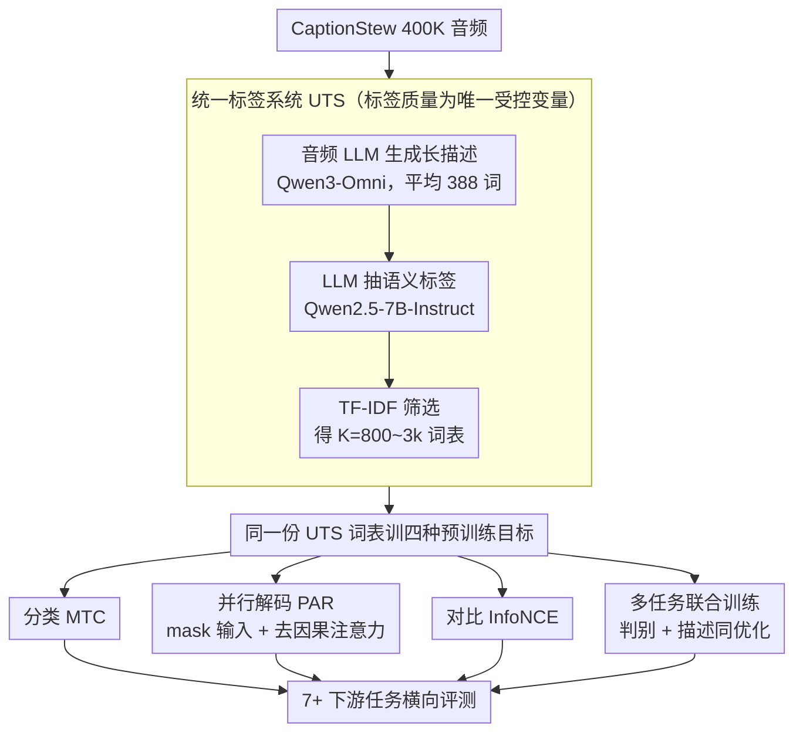

# Unlocking Strong Supervision: A Data-Centric Study of General-Purpose Audio Pre-Training Methods

**会议**: CVPR 2026  
**arXiv**: [2603.25767](https://arxiv.org/abs/2603.25767)  
**代码**: [https://github.com/AudenAI/Auden/tree/main/examples/uts](https://github.com/AudenAI/Auden/tree/main/examples/uts)  
**领域**: 音频语音  
**关键词**: 音频预训练、统一标签系统、数据中心、标签质量、跨域泛化

## 一句话总结

本文通过系统的数据中心实验证明音频预训练性能主要由标签/监督质量驱动而非模型设计，提出 Unified Tag System (UTS) 将语音、音乐、环境音统一到 800-3k 标签的高粒度词表中，UTS 训练的模型用 5 倍更少的数据在语音（VoxCeleb2）和音乐（MusicCaps）等域外任务上超越 AudioSet 基线。

## 研究背景与动机

1. **领域现状**：音频预训练主要分为两派——(1) 标签分类预训练（以 AudioSet-527 标签为标准）；(2) 音频-语言对齐预训练（如 CLAP、音频字幕）。前者依赖 AudioSet 的人工标签体系；后者依赖文本描述质量。
2. **现有痛点**：(1) AudioSet 的 527 标签主要覆盖环境音，语音和音乐标签严重不足，导致预训练模型在语音/音乐下游任务泛化差；(2) 数据规模和模型架构的改进已接近瓶颈——但标签质量的作用被严重低估。
3. **核心矛盾**：业界追求更大数据集和更大模型，但可能忽视了"标签系统本身是否足够好"这个更基础的问题——如果标签不够精细，再多数据也学不到细粒度的语义区分。
4. **本文目标**：设计统一的高质量标签系统，系统比较不同预训练目标（分类/字幕/对比/多任务）在该标签系统下的表现。
5. **切入角度**：利用 Qwen3-Omni 等强大的音频 LLM 生成高保真音频描述（平均 388 词），再用 LLM 提取语义标签，构建跨领域统一标签词表。
6. **核心 idea**：用 LLM 自动从高质量音频描述中提取标签，通过 TF-IDF 筛选构建 UTS 词表，然后在此标签体系下系统比较分类/生成/对比/多任务预训练。

## 方法详解

### 整体框架

本文要回答的问题不是"换哪种网络/哪种预训练目标更强"，而是"如果先把标签系统本身做好，预训练性能能提升多少"。为此作者搭了一条把"原始音频"变成"高质量监督信号"再喂给各种预训练目标的流水线：从 CaptionStew 400K 音频出发，先用音频 LLM 把每条音频转写成一段长描述，再从描述里抽出语义标签、用统计指标筛成一份跨领域词表（即 UTS），然后用同一份词表分别训分类、字幕、对比、多任务四种模型，最后在 7+ 个下游任务上横向比。整条 pipeline 里唯一被刻意控制的变量是"标签质量"，所以模型之间的差异能干净地归因到监督信号上。

### 关键设计

**1. 统一标签系统 UTS：用 LLM 把人工标签集换成自动挖掘的高粒度词表**

研究背景里的痛点是 AudioSet 那 527 个人工标签几乎只覆盖环境音，语音和音乐的语义被压得很粗，模型在这两类下游任务上自然学不到细粒度区分。UTS 的做法是把"定义标签"这件事整体交给 LLM：先用 Qwen3-Omni 为每条音频生成一段平均 388 词的详细描述，再用 Qwen2.5-7B-Instruct 从描述里抽语义标签——之所以用 LLM 而非传统 NLTK 词性标注，是因为现代描述句式复杂、POS 标注抽不准。抽出的候选标签按 TF-IDF 打分筛选，分数定义为

$$s(t) = df(t) \cdot \log\!\Big(\frac{N+1}{df(t)+1}\Big)$$

其中 $df(t)$ 是标签 $t$ 的文档频率、$N$ 是音频总数；这个分数既奖励出现得够多（够通用）、又惩罚到处都有的水标签，留下最有区分力的词，最终构成 $K\in\{800,1\text{k},1.5\text{k},2\text{k},3\text{k}\}$ 几档可调词表。因为词表是从跨语音/音乐/环境音的描述里统一挖出来的，它天然把三个领域的语义放进同一空间——t-SNE 分析也证实 AudioSet 的语义空间被 UTS 完全包住，说明 UTS 不是另起炉灶而是更细的超集。

**2. 并行解码目标 PAR：堵住字幕训练里"靠语言先验偷懒"的捷径**

字幕式预训练本意是逼编码器学到能被语言描述的丰富表示，但标准自回归（AR）解码有个漏洞：解码器可以靠已经生成的 token 顺着语言先验往下猜，并不需要真正榨干音频特征，编码器因此被"放水"。PAR 把这条捷径直接堵死——它先把多热标签向量拼成一个规范文本序列 $Y_i=\text{"tag\_a, tag\_d, tag\_k"}$，但在解码时 mask 掉所有输入 token 并移除因果注意力，让每个位置只能并行地、各自独立地从音频表示里预测：

$$\mathcal{L}_{\text{par}} = -\sum_{t=1}^T \log p_\phi(y_t\mid z_i^a)$$

此时解码器唯一的信息来源就是音频编码器输出 $z_i^a$，没有"看前文猜后文"的余地，编码器必须把所有需要的信息都编进 $z_i^a$ 里才能让 loss 下降。实验上 PAR 在语音任务上比 AR 高出一截（38.78 vs 29.87），印证了"削弱解码器反而强化编码器"这个看似反直觉的设计确实把表示学得更扎实。

**3. 多任务联合训练：让同一个编码器既会判别又会描述**

单看前两个目标各有偏科：纯分类（MTC）训出来的模型判别强但在字幕/检索上弱，纯生成训出来的反过来。作者把两者拼在一起联合优化

$$\mathcal{L}_{\text{MTL}} = \mathcal{L}_{\text{MTC}} + \lambda\,\mathcal{L}_{\text{gen}}$$

其中 $\mathcal{L}_{\text{MTC}}$ 是 UTS 标签上的多标签二元交叉熵（判别项），$\mathcal{L}_{\text{gen}}$ 是 AR/PAR 按 0.25/0.75 混合的字幕目标（描述项），$\lambda$ 调两者权重。这样一份编码器同时受判别和描述两路梯度约束，既要把标签分对、又要把表示编得能还原成文本，从而在下游既能做分类又能做字幕/检索，而不是顾此失彼。

### 损失函数 / 训练策略

判别项 MTC 用多标签二元交叉熵；对比学习用对称 InfoNCE；字幕用 AR/PAR 混合；多任务按上式加权组合。骨架为 Zipformer-M 音频编码器 + BERT-base 文本编码器 + BART-base 解码器。MTC 训 700k 步、其余目标训 400k 步，均在 8×V100 上以每 batch 640 音频秒训练。

## 实验关键数据

### 主实验

| 模型 | FSD-50k | VggSound | VoxCeleb2↑ | CREMA-D↑ | MTAT | NSynth |
|------|---------|----------|------------|----------|------|--------|
| MTC-AudioSet基线 | **0.656** | **56.46** | 18.84 | 67.14 | **0.407** | **67.19** |
| MTC-UTS（本文） | 0.459 | 37.70 | **37.10** | 66.01 | 0.375 | 63.62 |
| 对比学习（本文） | 0.445 | 40.78 | 33.88 | 67.29 | 0.396 | 61.40 |
| 多任务（本文） | 0.485 | 40.81 | 34.62 | 65.31 | 0.396 | 59.94 |

### 消融实验

| UTS大小 | 线性探测 | 字幕 | 检索 | 说明 |
|---------|---------|------|------|------|
| K=800 | 中等 | 中等 | 中等 | 标签太粗 |
| K=1.5k | **峰值** | **峰值** | **峰值** | 最优平衡点 |
| K=3k | 下降 | 稳健 | 略降 | 数据稀疏度增加 |

### 关键发现

- **最核心发现**：UTS-MTC 在语音任务（VoxCeleb2）上比 AudioSet-MTC 高 18.26%（37.10 vs 18.84），用 5 倍更少的数据实现了域外超越——证明监督质量 > 数据量
- AudioSet 基线在域内任务（FSD-50k、VggSound）仍然最强，说明 AudioSet 的标签体系对环境音高度优化
- PAR 解码在语音任务上优于 AR（38.78 vs 29.87），证实消除语言捷径确实推动编码器学习更丰富的音频特征
- 标签系统大小存在最优点（K=1.5k），过大导致长尾标签训练不足

## 亮点与洞察

- **"数据质量 > 数据量"的有力实证**：80k 数据量的 UTS 在域外超 2M 数据量的 AudioSet 基线——这个发现对整个预训练领域都有启示价值
- **PAR 解码消除语言捷径**：这种"通过削弱解码器来强化编码器"的设计哲学非常精妙，可迁移到视觉字幕等其他模态
- **UTS 标签系统的可扩展性**：工具链（LLM captioner → LLM tagger → TF-IDF 筛选）完全自动化，迁移到新领域零人工成本

## 局限与展望

- UTS 依赖单一"教师"模型（Qwen3-Omni）的描述质量，存在系统性偏置
- 域内任务（FSD-50k、VggSound）仍不敌 AudioSet 基线，说明大规模数据在域内仍有优势
- 最优标签大小（K=1.5k）可能因数据分布不同而变化，缺乏自适应选择机制
- 设计单一统一目标同时在所有下游任务上最优仍是开放挑战
- 后续可结合数据混合策略，在 UTS 标签体系上用更大规模数据训练

## 相关工作与启发

- **vs AudioSet-MTC**: AudioSet 标签覆盖广但语义粒度粗（仅 527 类），UTS 填补了语音和音乐语义的空白
- **vs CLAP/LAION-Audio**: 对比学习方法依赖文短配对质量，本文则通过标签系统实现更精确的语义对齐
- **vs BEATs/Audio-MAE**: 自监督方法无需标签但预训练效率低且下游需要大量标注微调

## 评分

- 新颖性: ⭐⭐⭐⭐ UTS构建流程和PAR解码设计有新意，但核心消息"数据质量重要"并非全新
- 实验充分度: ⭐⭐⭐⭐⭐ 5种预训练目标×多个标签大小×7个下游任务×线性探测+字幕+检索+QA，极为全面
- 写作质量: ⭐⭐⭐⭐ 数据中心视角的叙事逻辑清晰
- 价值: ⭐⭐⭐⭐⭐ 对音频预训练领域的"标签体系"问题提供了系统性回答，UTS工具链开源可复用

<!-- RELATED:START -->

## 相关论文

- [\[CVPR 2026\] Echoes Over Time: Unlocking Length Generalization in Video-to-Audio Generation Models](echoes_over_time_unlocking_length_generalization_in_video-to-audio_generation_mo.md)
- [\[ACL 2026\] Towards Fine-Grained and Multi-Granular Contrastive Language-Speech Pre-training](../../ACL2026/audio_speech/towards_fine-grained_and_multi-granular_contrastive_language-speech_pre-training.md)
- [\[CVPR 2026\] GEM-TFL: Bridging Weak and Full Supervision for Forgery Localization](gem-tfl_bridging_weak_and_full_supervision_for_forgery_localization_through_em-g.md)
- [\[ACL 2025\] Distilling an End-to-End Voice Assistant Without Instruction Training Data](../../ACL2025/audio_speech/distilling_an_end-to-end_voice_assistant_without_instruction_training_data.md)
- [\[ACL 2025\] SpeechWeave: Diverse Multilingual Synthetic Text & Audio Data Generation Pipeline for Training Text to Speech Models](../../ACL2025/audio_speech/speechweave_diverse_multilingual_synthetic_text_audio_data_generation_pipeline_f.md)

<!-- RELATED:END -->
