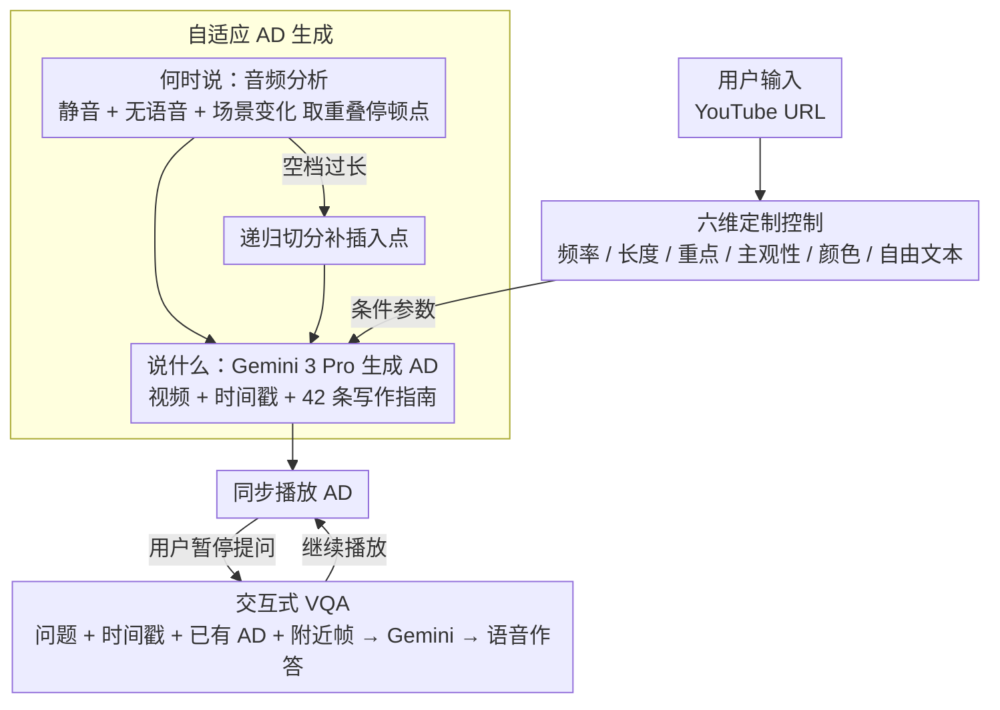

# ViDscribe: Multimodal AI for Customizing Audio Description and Question Answering in Online Videos

**会议**: CVPR 2026  
**arXiv**: [2603.14662](https://arxiv.org/abs/2603.14662)  
**代码**: [https://vidscribe.org/](https://vidscribe.org/)  
**领域**: 音频语音  
**关键词**: 音频描述, 视频无障碍, 多模态大语言模型, 用户定制化, 视觉问答

## 一句话总结

ViDscribe 是一个基于 Web 的平台，利用多模态大语言模型(Gemini 3 Pro)为盲人和低视力(BLV)用户提供可定制的 AI 生成音频描述(AD)和交互式视觉问答(VQA)功能，支持任意 YouTube 视频，通过为期一周的纵向用户研究验证了定制化 AD 在有效性、享受度和沉浸感方面均优于默认 AD。

## 研究背景与动机

1. **领域现状**：音频描述是帮助 BLV 用户理解视频视觉内容的关键辅助技术。传统人工 AD 制作昂贵、耗时且需要专业知识，导致绝大多数在线视频缺乏描述。近年来 MLLM 的进步使自动 AD 生成成为可能。
2. **现有痛点**：现有 AI-AD 系统采用"一刀切"策略，不适应 BLV 用户的多样化需求和偏好；评估通常在受控的短期实验室环境中进行，缺乏纵向使用数据。
3. **核心矛盾**：BLV 用户的需求因视力程度、观看场景和内容类型而异，但现有系统无法动态调整描述策略。
4. **本文目标**：构建支持用户定制和交互式问答的 AI-AD 平台，并通过纵向研究验证其价值。
5. **切入角度**：提供六种定制选项（频率、长度、重点、主观性、颜色、自由文本）和实时 VQA 功能。
6. **核心 idea**：将 MLLM 的能力转化为可控参数，让 BLV 用户根据个人偏好调整 AD 生成策略。

## 方法详解

### 整体框架

ViDscribe 要解决的是「自动 AD 既要质量过关、又要随每位 BLV 用户的偏好可调」这件事。系统是一个 React 前端 + AWS Lambda 后端的 Web 平台，背后由 Gemini 3 Pro 这个多模态大模型驱动，全程无需任何训练，靠的是零样本推理。整条 pipeline 是这样转的：用户粘贴一个 YouTube URL 并在界面上调好定制选项后，系统先用音频分析挑出适合插入描述的时间点，再让 Gemini 3 Pro 在这些时间点上、按用户设定的参数生成描述，最后同步播放；播放过程中用户还能随时暂停发问，让模型补充画面里没被描述到的细节。整个界面兼容屏幕阅读器和键盘操作，保证 BLV 用户全程可控。

### 关键设计

**1. 六维定制控制：把"一刀切"的 AD 拆成可调的旋钮**

现有 AI-AD 系统对所有人输出同一种描述，但 BLV 用户的视力程度、观看场景、内容类型各不相同，需要的描述风格也不同。ViDscribe 把这种差异显式地暴露成六个可调维度：频率（每 8/15/30 秒插一条）、长度（滑块控制 15–100 词/条）、重点（通用/角色/环境/教学内容）、主观性（只陈述客观事实，还是允许主观解读）、颜色（是否描述颜色属性）、以及一栏自由文本让用户写任意指令。这六个选项不是各自独立的开关，而是统一翻译成 prompt 里的条件参数喂给 Gemini 3 Pro——也就是说定制不靠多套模型或后处理规则，而是直接条件化生成本身，因此六个维度可以任意组合而不增加系统复杂度。

**2. 自适应 AD 生成：先决定"何时说"，再决定"说什么"**

一条好的 AD 不只要内容对，还得卡在合适的空档出现、不去盖住原片对话，这一点纯靠大模型生成是保证不了的，所以 ViDscribe 把它拆成时机和内容两步串联。时机这一步先从视频里提取音频，分别检测静音、无语音片段、场景变化三种信号，挑那些信号互相重叠的自然停顿点作为插入位置；如果某段空档太长、一条描述塞不满，就递归地把这段间隔继续切分、多插几条。位置定下来之后，内容这一步把视频、对应时间戳、用户的六维定制设置、再加上一份 42 条的 AD 写作指南一起交给 Gemini 3 Pro，让它在这个时间点生成一条既符合规范、又贴合用户偏好的描述。把"何时说"前置成一个独立的信号分析模块，正是为了让生成的描述天然落在不打断对话的位置上。

**3. 交互式 VQA：让被动收听变成可主动追问**

再周到的预生成描述也覆盖不了用户临时关心的细节，比如"刚进门的是谁"。ViDscribe 给用户一个快捷键，按下即暂停，然后用打字或语音问一个问题。系统会把这个问题连同当前时间戳、该视频已经生成的 AD、以及当前画面附近的代表性帧一起发给 Gemini 3 Pro，让它结合上下文作答，再通过文本转语音读出来。关键在于它把"已有的 AD"也作为上下文喂进去，所以回答能接得上前面描述过的剧情，而不是孤立地看一帧画面。

### 一个完整示例

以用户打开一段两人对话的剧情片为例：他把频率设成 8 秒、长度设成中等、主观性设成"客观"。系统先分析音频，发现第 12–18 秒两人都没说话、且正好有一次镜头切换，三种信号在这里重叠，于是把第 12 秒标记为插入点；而第 30–60 秒是一整段独白、中间没有合适空档，这段过长的间隔被递归切分后又补了一个插入点。到了第 12 秒，Gemini 3 Pro 拿到该时刻的画面、"客观 + 中等长度"的参数和 42 条指南，生成一条不带主观评价的中等长度描述并同步播报。播到一半用户好奇某个新出现的角色，按键暂停问"她是谁"——系统把这个问题、当前时间戳、之前已播过的 AD 和附近帧打包给模型，得到一条结合前文剧情的回答并读出来，随后继续播放。

### 损失函数 / 训练策略

无需训练，完全基于 Gemini 3 Pro 的零样本推理能力。

## 实验关键数据

### 主实验（纵向用户研究）

| 指标 (5分制) | 默认AD | 定制AD | 提升 |
|-------------|--------|--------|------|
| 有效性 | 4.00 | 4.32 | +0.32 |
| 享受度 | 3.45 | 3.97 | +0.52 |
| 沉浸感 | 3.72 | 4.06 | +0.34 |
| VQA 帮助程度 | - | 3.46 | - |
| SUS 可用性 | - | 70.6 | >68 基准 |

定制 AD 在所有维度上优于默认 AD，享受度提升最大。

### 消融实验（定制偏好分析）

| 定制类型 | 最常选择 | 占比 |
|---------|---------|------|
| 频率 | 8秒(频繁) | 54.9% |
| 长度 | 26-50词(中等) | 49.0% |
| 重点 | 通用内容 | 52.9% |
| 主观性 | 客观描述 | 72.5% |
| 颜色 | 包含颜色 | 80.4% |

### 关键发现

- 63% 的视频使用了定制设置，说明 BLV 用户确实需要且愿意使用定制功能
- 随时间推移，用户偏好向更短、更低频的描述转变，反映了使用熟练后的偏好演化
- VQA 共收到 66 个问题，最常见的是询问角色身份和场景细节
- 6/8 参与者表示会向 BLV 朋友推荐 ViDscribe
- VQA 评分略低(3.46)，部分因为当前实现仅使用当前帧及附近帧回答

## 亮点与洞察

- **纵向真实场景研究**：首次在为期一周的真实使用场景中评估 AI-AD 定制和 VQA，而非短期实验室实验
- **定制偏好的时间演化**：发现用户偏好随使用时间变化，这对自适应系统设计有指导意义
- **完整的可部署系统**：不仅是方法论贡献，还是一个可实际使用的无障碍工具

## 局限与展望

- 样本量小(8人)，未做统计显著性检验
- VQA 仅使用当前帧附近信息，无法回答需要全视频理解的问题
- 定制设置需要手动调整，未来可自动学习用户偏好
- 描述质量受 Gemini 3 Pro 的能力限制
- 未来可加入用户偏好记忆和跨会话学习

## 相关工作与启发

- **vs YouDescribe**: YouDescribe 依赖志愿者人工描述，无法扩展；ViDscribe 自动生成
- **vs NarrationBot**: NarrationBot 生成固定描述，无定制化
- **vs DescribePro**: DescribePro 辅助人工描述者，ViDscribe 完全自动化

## 评分

- 新颖性: ⭐⭐⭐ 系统集成为主，技术创新有限
- 实验充分度: ⭐⭐⭐ 纵向研究设计好但样本量小
- 写作质量: ⭐⭐⭐⭐ 用户研究描述详细
- 价值: ⭐⭐⭐⭐ 对无障碍社区有实际意义

<!-- RELATED:START -->

## 相关论文

- [\[ACL 2026\] Music Audio-Visual Question Answering Requires Specialized Multimodal Designs](../../ACL2026/audio_speech/music_audio-visual_question_answering_requires_specialized_multimodal_designs.md)
- [\[ACL 2026\] Retrieving to Recover: Towards Incomplete Audio-Visual Question Answering via Semantic-consistent Purification](../../ACL2026/audio_speech/retrieving_to_recover_towards_incomplete_audio-visual_question_answering_via_sem.md)
- [\[ICLR 2026\] Query-Guided Spatial-Temporal-Frequency Interaction for Music Audio-Visual Question Answering](../../ICLR2026/audio_speech/query-guided_spatial-temporal-frequency_interaction_for_music_audio-visual_quest.md)
- [\[ACL 2026\] Jamendo-MT-QA: A Benchmark for Multi-Track Comparative Music Question Answering](../../ACL2026/audio_speech/jamendo-mt-qa_a_benchmark_for_multi-track_comparative_music_question_answering.md)
- [\[AAAI 2026\] End-to-end Contrastive Language-Speech Pretraining Model For Long-form Spoken Question Answering](../../AAAI2026/audio_speech/end-to-end_contrastive_language-speech_pretraining_model_for_long-form_spoken_qu.md)

<!-- RELATED:END -->
