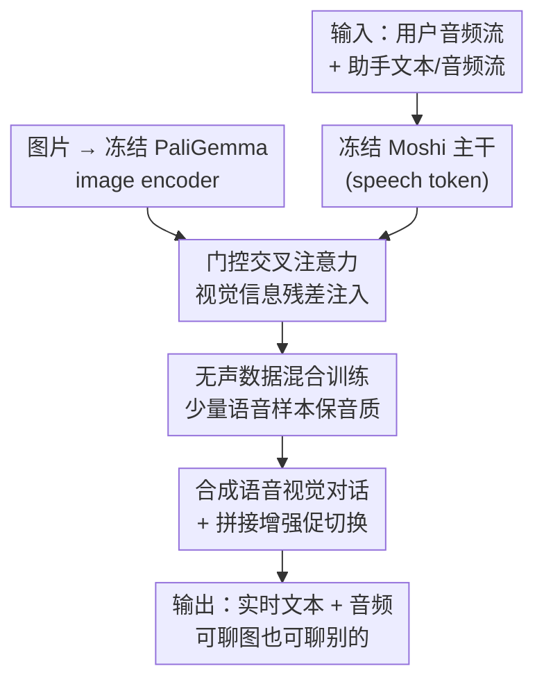

# Vision-Speech Models: Teaching Speech Models to Converse about Images

**会议**: CVPR 2026  
**论文**: [CVF Open Access](https://openaccess.thecvf.com/content/CVPR2026/html/Royer_Vision-Speech_Models_Teaching_Speech_Models_to_Converse_about_Images_CVPR_2026_paper.html)  
**领域**: 多模态VLM / 语音对话  
**关键词**: 视觉-语音模型, 门控交叉注意力, 参数高效微调, 全双工对话, 合成语音对话

## 一句话总结
这篇论文提出 MoshiVis，用一组轻量的门控交叉注意力适配模块，把一个实时全双工语音对话大模型 Moshi 改造成能"看着图片用语音聊天"的视觉-语音模型（VSM），靠"图文无声数据 + 少量图-语音数据"的单阶段混合微调把训练成本压到一天 8×H100，且推理每步只增加约 7ms 延迟。

## 研究背景与动机
**领域现状**：视觉-语言模型（VLM）这几年很成熟，靠海量图-文配对数据，把 LLM 的推理能力迁移到看图问答、看图描述等任务上。与此对应，作者想问的是：能不能同样地给一个**预训练好的语音模型**装上"看图"的能力，做成一个能自然语音对话又能聊图片的模型。

**现有痛点**：直接把 VLM 那一套搬到语音域有三个具体障碍。其一，图-语音配对数据极度稀缺，公开的几乎只有 COCO-Captions 的语音转写，远不及图-文数据丰富。其二，语音对话要求实时低延迟，模型受算力和显存约束，不能像 VLM 那样把高分辨率图片塞成一大堆 image token 占满 KV cache。其三，语音里有文本推断不出来的韵律信息（说话人语气、情绪），级联式"语音转文字→VLM→文字转语音"会丢掉这些信息、还引入明显延迟和割裂的轮流发言。

**核心矛盾**：要么走 VLM 主流的"image token 直接插入序列"路线——但它会扰乱预训练 LLM、需要专门处理 RoPE、还得多阶段训练，扩到第三个模态（视觉+语言+音频）数据和算力都爆炸；要么走级联 ASR+TTS——但它牺牲了实时性和韵律。两条路都和"低成本 + 实时 + 保留语音特性"冲突。

**本文目标**：在不动语音骨干、不重训三模态的前提下，给一个会实时对话的语音 LLM 加上看图能力，并且要能在"聊图片"和"聊别的话题"之间自然切换。

**切入角度**：作者抓住 Moshi 的一个特性——它在产生音频的同时，**显式地联合预测一条时间对齐的文本流**。虽然这条文本流的分布和标准文本不一样（夹了对齐用的 padding token、还和音频 token 相加），但作者假设：这条文本流足以充当"弱监督"通道，让纯图-文数据训练出来的视觉理解能力**透传**到语音输出。

**核心 idea**：用一组**冻结骨干、只训适配模块**的门控交叉注意力把图片信息注入语音 token 流，再用"大量无声图文数据 + 少量图-语音数据"的单阶段混合监督来训练，从而以极小代价复用现成的视觉-语言数据集。

## 方法详解

### 整体框架
MoshiVis 的整体结构是"现成图像编码器 + 冻结的 Moshi 语音骨干 + 插在每个 Transformer block 里的轻量适配模块"。图像侧用 PaliGemma 家族的现成 image encoder（约 400M）把图片编成一串 image token；语音侧用 Moshi（约 7B），它把用户和助手的音频流、助手的文本流三条时间对齐的 token 流相加成"speech token"喂进主干 Transformer，输出再被一个小的 depth transformer 解码回文本 token 和分层音频 codebook。作者要做的就是：在主干每个 block 的自注意力和前馈层之间，插一层**门控交叉注意力**，让 speech token（作 query）去查 image token（作 key/value），把视觉信息以残差形式融进来；训练时整个 image encoder 和语音 Transformer 都冻结，只训这约 206M 的适配模块。训练数据上用"无声图文数据 + 合成语音视觉对话"的混合，让模型既学会看图、又保留实时语音对话能力。

### 关键设计

**1. 门控交叉注意力适配模块：在不破坏语音骨干的前提下把图片"按需"注入**

最朴素的做法是在每个 block 里加一层交叉注意力，让 speech token 作 query、image token 作 key/value，算出一个残差更新加回 speech token。但作者发现，这样无脑注入视觉信息会损害模型原有的对话能力，尤其是话题切换——当用户已经不聊图片了，模型还在被图片信息干扰。为此他们在交叉注意力输出后加了一个**自门控**：用一个隐藏维压缩为 1/8 的两层 MLP 接 sigmoid，算出一个 $[0,1]$ 的门控值 $g$ 来调制视觉残差。整个门控交叉注意力写成：

$$x \leftarrow x + \mathrm{MHA}_{\text{self}}(x, x)$$
$$y = \mathrm{MHA}_{\text{cross}}(x, x_{\text{img}}),\quad g = \sigma(\mathrm{MLP}_{\text{gate}}(y)),\quad x \leftarrow x + g \cdot y$$

其中 $x$ 是 speech token、$x_{\text{img}}$ 是 image token，$\mathrm{MHA}(a,b)$ 表示以 $a$ 为 query、$b$ 为 key/value 的多头注意力。这个设计的妙处在于：当门控 $g$ 全为 0 时，模型**精确退化回**原始 Moshi 骨干（视觉信息完全关闭），所以注入视觉能力天然不会"污染"原有的通用对话能力；门控值变大则放开视觉信息流入。它让模型能根据对话上下文自己决定"现在要不要看图"，这正是后面话题切换鲁棒性的来源。

**2. 跨层共享 QKV 投影 + 一次性缓存图片 KV：把实时延迟约束顶住**

实时语音对话对算力和显存极敏感，所以交叉注意力不能太重。作者用两招压成本。其一，由于 image token 不随时间步变化、独立于 speech token，可以在对话开始时**一次性预计算并缓存**所有 block 的图片 KV 投影，后续每个时间步直接复用，不必每步重算。其二，他们让**每个 Transformer block 的交叉注意力共享同一套 QKV 投影权重**（实测对下游性能影响不显著），进一步压低存图片 embedding 的显存。这两招叠加冻结骨干，使得在 L4 GPU 上、448 像素图（1024 token）、8-bit 量化时，每步推理只比纯 Moshi 多约 7ms，对话开始时每步 51ms、5 分钟上下文窗口时 59ms，都稳稳低于 80ms 的实时门槛（音频 codec 频率 12.5Hz）。

**3. "无声"数据混合监督：用海量图文数据隔空教会语音模型看图**

图-语音数据稀缺，但图-文数据极多。作者的关键观察是：Moshi 本身就要预测一条文本流，于是可以拿纯图-文（"speechless"，无音频监督）数据来训适配模块——即便存在分布偏移（模型本应吃"音频+文本相加"的 speech token，而无声样本只有标准文本、没有对齐 padding token、也不给音频 codebook 任何监督信号）。具体做法是**每个 batch 混入 $p_{\text{audio}}\%$ 的语音样本 + $(100-p_{\text{audio}})\%$ 的无声样本**：语音样本与 Moshi 同分布（文本流只含助手文本、用户输入只以音频出现），无声样本则把整段对话（含用户问题）都放在文本里。令人意外的是，哪怕 batch 里只有极少量音频样本，模型也能从纯文本信号里学到视觉理解、同时保持语音输出连贯。实验显示 $p_{\text{audio}}=0\%$（全无声）训练、用语音提问时，模型在 OCR-VQA / VQAv2 / COCO 上分别能拿到 38.5% / 49.3% / CIDEr 113，远超随机；只是音质会差，但**加 1% 音频样本就能把音质拉回骨干水平**。这意味着可以直接拿现成图-文数据在专门视觉任务上微调，几乎不需要音频监督。

**4. 合成语音视觉对话 + 拼接增强：把"一问一答"撑成自然多轮、可切话题**

现有视觉对话数据只有文本形式、且多是固定长度的短问答对，不够自然。作者设计了一条**全合成**的语音视觉对话流水线：拿同一张图的文本 caption 喂给两个 Mistral-Nemo 模型，一个扮"提问的用户"、一个扮"回答的助手"，先由通用问题（"图里有什么？"）起头，再持续 8–16 轮，每轮随机注入一种指令（问整体内容、问细粒度细节如物体位置属性、甚至问图里根本没有的误导性物体），最后用开源 TTS 把文本对话转成合成音频。为进一步练话题切换，他们还另生成一批**与任何图片无关的通用对话**，训练时每条视觉对话有 $p_{\text{concat}}$ 的概率被随机拼上一段无关前缀和后缀，并随机裁剪三段对话长度，模拟真实中途换话题的场景。这条数据管线配合门控机制，正是模型能"聊着图突然聊别的、又能聊回来"的训练来源。

### 损失函数 / 训练策略
训练时冻结 image encoder 和语音 Transformer，只训约 206M 的适配模块（交叉注意力 + 门控）。视觉对话模型训练 50k 步、batch size 64，约 8×H100 一天完成。下游基准实验里系统扫了 batch 中音频样本比例 $p_{\text{audio}}\in\{0,1,5,10,25,50,75,100\}\%$，结论是 $p_{\text{audio}}=25\%$ 在下游性能和所需语音数据量之间取得最佳折中。

## 实验关键数据

### 主实验
作者在 OCR-VQA（文字识别）、VQAv2（问答）、COCO（描述）三个视觉任务上评估，且文本提问和语音提问都测；并与"stage 3 PaliGemma"（从同一 stage 2 视觉编码器出发、但**解冻**视觉编码器和 LLM 一起微调）对比。

| 训练设置 | 提问方式 | OCR-VQA Acc | VQAv2 Acc | COCO CIDEr |
|----------|----------|-------------|-----------|------------|
| $p_{\text{audio}}=0\%$（纯无声） | 语音 | 38.5% | 49.3% | 113 |
| 提升 $p_{\text{audio}}$（≈25% 折中） | 语音 | 接近 PaliGemma stage 3 | 接近 stage 3 | 接近 stage 3 |
| 双任务 10% 语音 OCR 样本 | 语音 | 60.7% | — | — |
| 双任务 0% 语音 OCR 样本 | 语音 | 36.8% | — | — |

关键现象：即便完全不给音频数据，交叉注意力也能让语音模型在所有基准上远超随机；而 $p_{\text{audio}}=100\%$（全音频）反而会拖累文本评测，说明混合监督才是正解。双任务里把某任务的少量样本换成语音形式，立刻把该任务语音评测从 36.8% 拉到 60.7%——说明**知识经由音频通道的迁移强于经由文本通道**。

### 消融实验
门控与参数共享消融（OCR-VQA，下游精度视角）：

| 配置 | 文本评测 | 语音评测 | 说明 |
|------|---------|---------|------|
| 无门控 / 无 CA 共享 | 66.1 | 63.7 | 基线 |
| 有门控(不共享) / KV 共享 | 67.7 | 66.2 | 略好 |
| 有门控(不共享) / QKV 共享 | 68.2 | 64.7 | 默认配置 |
| 有门控(共享) / QKV 共享 | 66.1 | 65.2 | 共享门控参数 |

音质（MOSNet，随音频样本比例变化）：

| $p_{\text{audio}}$ | 0% | 1% | 5% | 10% | Moshi 骨干 |
|--------------------|-----|-----|-----|-----|-----------|
| MOSNet | 2.78 | 3.59 | 3.47 | 3.56 | 3.34 |

### 关键发现
- **就下游精度而言，门控/参数共享怎么配都差不多**：各设置无明显胜者，模型对这些设计选择鲁棒——门控的真正价值不在精度，而在话题切换鲁棒性（4.2 节）。
- **音质对音频比例极敏感但极易恢复**：$p_{\text{audio}}=0\%$ 时 MOSNet 仅 2.78（语音不连贯），但只要 1% 音频样本就回到 3.59，甚至超过骨干 Moshi 的 3.34。
- **门控 + 拼接增强共同提升话题切换鲁棒性**：用图片相关对话作前缀去测 MMLU（视觉→非视觉切换）、用无关对话作前缀去测 COCO（非视觉→视觉切换），$p_{\text{concat}}>0$ 的拼接增强和门控机制都明显减小性能掉幅，尤其在无门控时拼接增强帮助最大、在 $p_{\text{concat}}=0$ 时门控帮助最大。
- **实时性达标**：相比骨干每步仅 +7ms，5 分钟上下文也只 59ms/步，远低于 80ms 实时阈值。

## 亮点与洞察
- **"门控全 0 = 精确退化回骨干"是个很干净的设计保证**：它从结构上保证了加视觉能力不会污染原有对话能力，比"训练后希望它别退化"靠谱得多——这种可证退化性的注入思路可迁移到任何"给冻结骨干加新模态"的场景。
- **用 Moshi 自带的文本流当弱监督桥梁，是这篇最聪明的一招**：明明是图-文（无声）数据，却能让视觉理解透传到语音输出，从而把整个 VLM 数据生态直接借过来用，绕开了图-语音数据稀缺的死结。
- **"知识经音频迁移 > 经文本迁移"是个反直觉的实验观察**：通常会觉得文本是更"干净"的监督，但在语音模型里把样本放成语音形式反而迁移更强，对后续设计语音多模态训练配比有直接指导意义。
- **一次性缓存图片 KV + 跨层共享 QKV 这套省显存技巧**对任何"需要把静态条件信息注入流式自回归模型"的任务都通用。

## 局限性 / 可改进方向
- **依赖合成数据**：视觉对话训练数据完全由 LLM + TTS 合成，合成对话的真实性、多样性和潜在偏见（尤其无声分支用了 VLM 生成、易含幻觉的 PixelProse caption）会直接影响模型行为，缺少大规模真人语音对话验证。
- **评测仍偏受控/人工**：话题切换鲁棒性是在"给问题加随机无关前缀"这种作者也承认"人工"的设定下测的，与真实开放对话的切换还有距离；对话质量很大程度靠定性样例展示。
- **骨干绑定 Moshi 的特殊结构**：方法吃的是"联合预测时间对齐文本流"这一 Moshi 特性，换一个没有显式文本流的语音模型，无声数据弱监督这条路能否成立存疑。
- **视频只是初步**：扩展到视频只靠"推理时即时替换交叉注意力的 KV 输入"，属于初步演示，没有系统评测。
- 改进方向：引入真实人类语音对话数据、设计更贴近真实场景的话题切换基准、把门控信号本身（何时看图）做成可解释/可控的接口。

## 相关工作与启发
- **vs token 插入式 VLM（如 PaliGemma / LLaVA 系）**：主流 VLM 把 image token 直接插进序列，本文刻意回避——因为 image token 会占满 KV cache（限制对话长度）、扰乱预训练 LLM（需改 RoPE）、还要多阶段训练。本文只训轻量交叉注意力、骨干全冻结，代价是视觉精度略逊于解冻微调的 stage 3 PaliGemma，但换来实时性和训练成本的巨大优势。
- **vs 级联 ASR + VLM + TTS**：级联方案丢韵律、有延迟、强制割裂轮流发言；本文端到端联合产文本与音频，保留语气情绪、支持全双工实时对话。
- **vs 从头联合预训练的多模态语音助手（如复刻 GPT-4o 的开源项目）**：它们需精心设计的多阶段训练和数据集平衡来兼顾三模态；本文复用现成预训练语音 LLM，只做轻量适配，门槛和成本低得多。
- **vs 早期视觉对话工作（VisDial 等）**：早期只在文本域做约 10 轮固定问答，本文用合成语音对话管线 + 拼接增强把它推到自然多轮、可切话题、且落到语音模态。

## 评分
- 新颖性: ⭐⭐⭐⭐ 把"门控交叉注意力适配 + 无声数据弱监督"组合用来造视觉-语音对话模型是新颖且实用的路子，单项技术多有渊源但整合切中真痛点。
- 实验充分度: ⭐⭐⭐⭐ 系统扫了音频比例、双任务迁移、门控/共享消融、话题切换、延迟，覆盖全面；不足是对话质量较依赖定性样例、缺真人数据评测。
- 写作质量: ⭐⭐⭐⭐⭐ 三大挑战→三个对应设计的结构非常清晰，图 1/2/3 把数据流讲得很透。
- 价值: ⭐⭐⭐⭐ 开源代码与图-语音评测基准、低成本可复现的实时语音看图对话，对开源多模态语音助手社区价值明确。

<!-- RELATED:START -->

## 相关论文

- [\[CVPR 2026\] BabyVLM-V2: Toward Developmentally Grounded Pretraining and Benchmarking of Vision Foundation Models](babyvlm-v2_toward_developmentally_grounded_pretraining_and_benchmarking_of_visio.md)
- [\[ACL 2026\] An Exploration of Mamba for Speech Self-Supervised Models](../../ACL2026/audio_speech/an_exploration_of_mamba_for_speech_self-supervised_models.md)
- [\[ACL 2026\] S2S-Arena: Evaluating Paralinguistic Instruction Following in Speech-to-Speech Models](../../ACL2026/audio_speech/s2s-arena_evaluating_paralinguistic_instruction_following_in_speech-to-speech_mo.md)
- [\[ICLR 2026\] ParaS2S: Benchmarking and Aligning Spoken Language Models for Paralinguistic-Aware Speech-to-Speech Interaction](../../ICLR2026/audio_speech/paras2s_benchmarking_and_aligning_spoken_language_models_for_paralinguistic-awar.md)
- [\[ACL 2026\] \[b\] = \[d\] − \[t\] + \[p\]: Self-supervised Speech Models Discover Phonological Vector Arithmetic](../../ACL2026/audio_speech/bd-tp_self-supervised_speech_models_discover_phonological_vector_arithmetic.md)

<!-- RELATED:END -->
