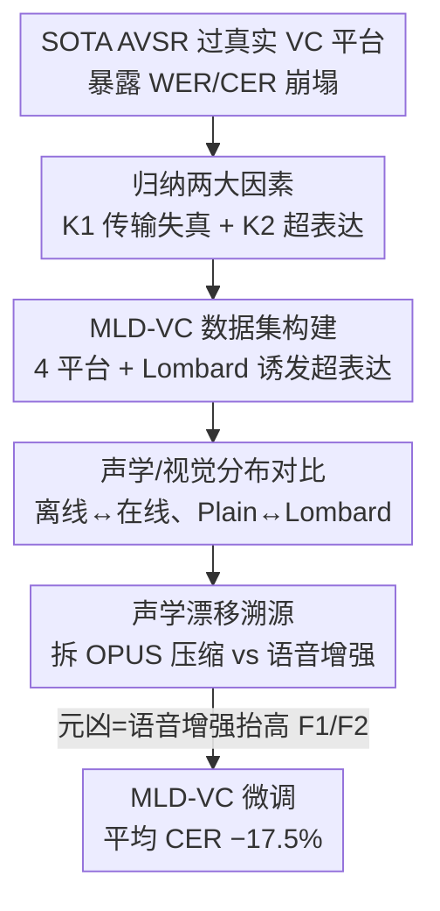

# When AVSR Meets Video Conferencing: Dataset, Degradation, and the Hidden Mechanism Behind Performance Collapse

**会议**: CVPR 2026  
**论文**: [CVF Open Access](https://openaccess.thecvf.com/content/CVPR2026/html/Huang_When_AVSR_Meets_Video_Conferencing_Dataset_Degradation_and_the_Hidden_CVPR_2026_paper.html)  
**代码/数据**: https://huggingface.co/datasets/nccm2p2/MLD-VC  
**领域**: 音视频语音识别 / 数据集与分析  
**关键词**: AVSR、视频会议、Lombard 效应、共振峰漂移、语音增强

## 一句话总结
作者第一次系统测了主流音视频语音识别（AVSR）模型在真实视频会议（VC）里的表现，发现错误率从 0.93%/0.56% 暴涨到 33% 级别，进而造了首个面向 VC 的多模态数据集 MLD-VC（31 人、22.79 小时、4 平台、显式注入 Lombard 效应），并通过解构传输流水线揪出"语音增强算法把 F1/F2 共振峰整体抬高"才是性能崩塌的隐藏元凶；在 MLD-VC 上微调可平均降 17.5% CER。

## 研究背景与动机
**领域现状**：AVSR 把音频和唇部视觉一起喂给模型，在离线、加噪、模态缺失等场景里已经做得相当好——离线 LRS3 上 Auto-AVSR 的 WER 能压到 0.93%。后疫情时代 Zoom、飞书、腾讯会议、钉钉成了远程沟通主力，会议转写、无障碍字幕都开始大量依赖 AVSR。

**现有痛点**：几乎所有"鲁棒 AVSR"研究都只针对背景噪声或模态丢失，而且用的是离线录好、严格对齐的干净数据集，再后期人工加噪来模拟鲁棒性。没有人真正把模型丢进真实视频会议的链路里测过。作者一测就发现灾难性的结果：同一个 Auto-AVSR，音视频模态在 Zoom 上的 WER 直接从 0.93% 飙到 33.09%，CER 从 0.56% 飙到 33.01%，而且这种崩塌跨平台、跨语言、跨模态一致出现。

**核心矛盾**：离线训练数据的分布和真实 VC 下的数据分布之间存在巨大鸿沟，而这个鸿沟到底由什么造成、能不能定位，此前完全是个黑箱。作者把它拆成两个被长期忽略的因素：传输链路对信号的失真（K1），以及人在受阻沟通环境下自发的"超表达"行为（K2，hyper-expression）。

**切入角度**：既然没有数据就无从研究，作者决定直接通过真实 VC 平台采集数据，并且借助 Lombard 效应（噪声环境下说话人不自觉提高音强、放慢语速、夸大发音的现象，是 hyper-expression 的典型形式）来显式诱发和放大 K2。有了带这两个因素的真实数据，才能进一步去解剖"分布到底在哪一步被改坏的"。

**核心 idea**：用一个显式建模 K1+K2 的真实 VC 数据集（MLD-VC）当显微镜，反向定位性能崩塌的根因——最终锁定是 VC 平台里的语音增强算法在系统性地抬高 F1/F2 共振峰，而 Lombard 数据之所以更鲁棒，正是因为它造成的频谱偏移恰好和语音增强很像。

## 方法详解

### 整体框架
这篇论文不是提出一个新模型，而是一项"诊断 → 建库 → 溯源 → 缓解"的系统性研究，方法部分对应的就是数据集构建与机制分析这两块工作。它先用三款 SOTA 模型（Auto-AVSR、mWhisper-Flamingo、LiPS-AVSR）把测试集真实地"过一遍 VC 平台"暴露出崩塌现象；接着归纳出 VC 区别于面对面的两大因素 K1（传输失真）与 K2（超表达），并据此显式构建多平台、含 Lombard 的 MLD-VC 数据集；然后在这个数据集上对比离线/在线、Plain/Lombard 的声学与视觉特征分布，定位漂移；再把 VC 处理流水线拆成"编解码压缩"和"语音增强"两段逐段消融，把元凶锁死在语音增强；最后用 MLD-VC 微调验证这套因素分析确实能转化为性能提升。

### 关键设计

**1. MLD-VC 数据集构建：把视频会议的两大因素显式注入采集流程**

之前所有数据集都是离线录的干净语音，再人工加噪，根本复现不了真实 VC 链路里的编解码压缩、噪声抑制、语音增强这一整套黑箱处理（K1），也捕捉不到人在 VC 里自发产生的超表达行为（K2）。作者的做法是让 31 名志愿者（15 男 16 女）戴耳机、坐在显示器和摄像头前，把语料逐句念出来，全程通过腾讯会议、飞书、钉钉、Zoom 四个真实平台传输——输入端录到的当离线数据，接收端录到的当 VC 数据，这样 K1 就被真实链路天然注入了。对于 K2，作者借鉴"Lombard 效应由环境噪声诱发、强度随噪声水平变化"的规律，给耳机里播放 Plain（无噪）、40 dB、60 dB、80 dB 四档背景噪声来主动诱发并放大超表达；语料采用 Grid 风格语法（如英文 "bin blue at A 2 please"，含 color/letter/digit 三个关键词 + 三个 filler），每人每档念 30 句（20 中文 + 10 英文）。最终得到 22.79 小时、中英双语、4 个 VC 平台的音视频 + 唇部 landmark 数据，是已有 Lombard/VC 数据集里时长和平台数都最大的（见表 2）。这一步是后续所有分析的前提：没有这个同时含 K1、K2 且离线/在线配对的语料，根本无法做"分布在哪一步变坏"的对照实验。

**2. 声学特征漂移溯源：解构 VC 流水线，把元凶锁定在语音增强**

崩塌的根因到底是 K1 还是 K2，作者用声学特征分布来判定。他们用 openSMILE 抽取五个声学特征：基频 F0、第一/第二共振峰 F1/F2、响度 loudness，以及 50–1k Hz 与 1k–5k Hz 能量之比 AlphaRatio。对比离线↔在线的概率密度峰值（表 3）发现：F0 几乎不变（音高没被动），但 F1、F2 出现显著上移（DingTalk 上 F1 约 +170 Hz），AlphaRatio 在线时更低（高频能量被增强），loudness 整体左移（能量略降）——这套频谱结构改变跨所有平台一致出现。关键判断在于：Plain 条件下即便没有 Lombard，F1/F2 的偏移幅度也明显大于单纯超表达能解释的量，说明超表达不是唯一原因。于是作者把 VC 语音处理流水线拆开——原始语音先经编解码压缩、再经语音增强——分别用广泛使用的 OPUS 编解码器模拟压缩段，用 Sepformer、NoiseReduce、DeepFilterNet 三种增强算法模拟增强段，把 MLD-VC 的离线样本分别单独过一遍再看 F1/F2 变化（图 3）。结果很干脆：OPUS 压缩对 F1/F2 几乎无影响，频率分布稳定；而语音增强让 F1/F2 整体上移，形态和真实 VC 录音里的偏移高度吻合。结论由此落地——语音增强虽然提升了可懂度，却改写了语音的频谱结构，是 AVSR 在 VC 下性能崩塌的主要声学根因。这也顺带解释了为什么 Lombard 训练的模型更鲁棒：Lombard 造成的 F1/F2 抬高与语音增强造成的偏移很像，等于模型提前"见过"了这种分布。

**3. 视觉模态的反直觉发现：landmark 几何特征稳定，崩在 image-level 表征**

直觉上 VC 的压缩和模糊应该把视觉模态也带崩，但作者用面向任务的指标重新审视：传统的 PSNR/SSIM 抓不住 AVSR 真正依赖的信息，AVSR 的本质是识别唇动，于是改用从面部 landmark 计算的唇宽、唇高、唇形圆度（高/宽之比，越接近 1 越圆）三个几何指标。分析发现 VC 对这些 landmark 级特征的影响微乎其微——几何运动在线上线下几乎一致。但这不代表视觉模态与崩塌无关：现有模型（Auto-AVSR、mWhisper-Flamingo、LiPS-AVSR）都用预训练 ResNet18 或 AVHuBERT 直接吃唇部图像，而图像在编解码压缩和传输延迟下会失真，导致 image-level 表征出现分布漂移。这个对比给出一个明确的改进方向：未来 AVSR 的视觉编码器与其依赖不稳定的图像级表征，不如转向稳定的几何（landmark）表征。

**4. MLD-VC 微调缓解：用因素分析直接换性能提升**

把上面的诊断闭环——既然崩塌来自 K1+K2 造成的分布偏移，那让模型在含这两个因素的 MLD-VC 上微调，就应该把分布对齐回来。作者用 LiPS-AVSR 在 MLD-VC 训练集上微调后跨平台评测，三平台平均 CER 相对下降 17.5%，在 MLD-VC 自身测试集上更是从 42.37% 降到 13.91%（降 67.2%），既提升了域内性能也显著增强了跨平台泛化，反向印证了 K1、K2 这套因素拆解的正确性。

### 实验关键数据

#### 主实验：SOTA 模型在 VC 下的崩塌

| 模型 | 数据集 | 模态 | 平台 | WER(%)↓ | CER(%)↓ |
|------|--------|------|------|---------|---------|
| Auto-AVSR | LRS3 | AV | Offline | 0.93 | 0.56 |
| Auto-AVSR | LRS3 | AV | Zoom | 33.09 | 33.01 |
| Auto-AVSR | LRS3 | V | Zoom | 90.26 | 74.32 |
| Auto-AVSR | Lombard-Grid | AV | Zoom | 12.36 | 9.93 |
| mWhisper-Flamingo | LRS3 | AV | Zoom | 9.22 | — |
| LiPS-AVSR | Chinese-Lips | AV | Lark | — | 18.53 |

跨语言、跨平台、跨模态一致崩塌；其中纯视觉模态最脆弱（Zoom 上 WER 高达 90%+），音视频融合最鲁棒，而 Lombard-Grid 上的退化明显最小（AV/Zoom 仅 12.36% vs LRS3 的 33.09%），印证了 Lombard 数据天然抗 VC 失真。

#### 声学特征峰值漂移（表 3，节选）

| 特征 | Offline | Zoom | DingTalk | 趋势 |
|------|---------|------|----------|------|
| F0 (Plain) | 37.28 | 37.39 | 37.66 | 基本不变 |
| F1 (Plain) | 606.90 | 687.88 | 774.61 | 显著上移（DingTalk ~+170 Hz） |
| F2 (Plain) | 1655.66 | 1727.45 | 1783.51 | 显著上移 |
| AlphaRatio (Plain) | -12.12 | -14.59 | -12.52 | 在线更低（高频被增强） |

#### 微调结果（表 4，LiPS-AVSR）

| 测试集 | 平台 | 微调前 CER(%) | 微调后 CER(%) | 相对降幅 |
|--------|------|----------------|----------------|----------|
| Chinese-Lips | 腾讯会议 | 10.97 | 9.65 | 12.0% |
| Chinese-Lips | 飞书 | 18.53 | 13.64 | 26.4% |
| Chinese-Lips | Zoom | 9.22 | 7.93 | 14.0% |
| MLD-VC | — | 42.37 | 13.91 | 67.2% |

#### 消融实验：两大因素缺一不可（表 5）

| Online | Hyper-expression | 腾讯会议 CER | 飞书 CER | Zoom CER |
|--------|------------------|--------------|----------|----------|
| ✓ | ✓ | 9.65 | 13.64 | 7.93 |
| ✗ | ✓ | 10.15 | 15.52 | 10.53 |
| ✓ | ✗ | 10.01 | 14.48 | 9.61 |

#### 关键发现
- **元凶是语音增强而非压缩**：单独过 OPUS 压缩 F1/F2 几乎不动，单独过 Sepformer/NoiseReduce/DeepFilterNet 则把 F1/F2 整体抬高，且形态和真实 VC 一致——这是全文最硬的因果证据。
- **去掉在线录制比去掉超表达掉点更多**：消融里去掉 online 数据平均 CER 涨 15.9%，去掉 hyper-expression 涨 10.5%，说明 K1（传输失真）贡献略大于 K2，但两者缺一不可。
- **视觉的脆弱不在内容而在表征方式**：landmark 几何稳定、image-level 表征崩塌，提示视觉编码器换成几何表征可能更鲁棒。

## 亮点与洞察
- **用 Lombard 效应当"可控旋钮"显式诱发超表达**：通过四档背景噪声主动放大 hyper-expression，把一个难以采集的自发行为变成可复现、可分级的变量，这个数据采集设计很聪明。
- **"解构黑箱流水线 + 逐段消融"定位根因**：VC 平台是黑箱，作者用 OPUS 近似压缩段、用三种增强算法近似增强段，分段过一遍样本看 F1/F2，干净利落地把锅扣到语音增强头上——这种把不可见处理拆成可复现子模块逐一证伪的思路可迁移到任何"端到端链路里出了问题但不知道哪一环"的诊断场景。
- **一个反直觉结论的连锁解释**：Lombard 训练为什么抗 VC？因为 Lombard 的频谱偏移≈语音增强的频谱偏移。把"现象（Lombard 鲁棒）—机制（F1/F2 抬高相似）—根因（语音增强）"三者串成一条因果链，是这篇分析最漂亮的地方。

## 局限与展望
- **依赖 Grid 风格短句语料**：每句固定结构、词表很小，和真实会议里的自由口语差距明显，结论在自然连续语音上是否成立需进一步验证。
- **平台被当黑箱近似**：用 OPUS + 三种开源增强算法去逼近真实平台的私有处理，只能说"高度相似"，无法证明真实平台用的就是这类增强，溯源结论带近似成分。
- **缓解仅靠微调，未触及根因**：既然根因是语音增强改写频谱，更彻底的方向应是在特征层做共振峰对齐/反增强，或训练对 F1/F2 漂移不敏感的声学编码器；论文已指出的"几何视觉编码器"也只是给了方向、未实现。
- **规模仍偏小**：31 名说话人且都是大学生，年龄/口音多样性有限。

## 相关工作与启发
- **vs 传统鲁棒 AVSR（加噪/模态缺失方向）**：他们在离线数据上人工加噪来提鲁棒性，本文指出真实 VC 的失真根本不是加性噪声，而是语音增强对共振峰的系统性改写，所以那套方法迁移到 VC 会严重失效——这是对整条研究路线适用性的修正。
- **vs Lombard / hyper-expression 研究（Lindblom 的 hyper/hypo 理论、Russell 对 Zoom 会议的分析）**：前人证明了 VC 里普遍存在类 Lombard 的超表达，本文进一步把这种行为层面的观察和声学层面的 F1/F2 漂移、以及语音增强这一系统根因连起来，并落成可用数据集。
- **vs 图像质量评估（PSNR/SSIM）**：本文论证这些通用指标抓不住 AVSR 真正依赖的唇动信息，改用 landmark 几何指标，提醒做任务驱动分析时要选与任务对齐的度量。

## 评分
- 新颖性: ⭐⭐⭐⭐ 首个 VC 场景 AVSR 系统评测 + 首个 VC 多模态数据集 + 把根因锁定到语音增强，问题切口新但方法本身偏分析性。
- 实验充分度: ⭐⭐⭐⭐ 三模型、四平台、双语言、声学+视觉双模态分析 + 流水线分段消融，证据链完整；自然语料缺位是短板。
- 写作质量: ⭐⭐⭐⭐ "现象→机制→根因→缓解"逻辑清晰，图表支撑到位。
- 价值: ⭐⭐⭐⭐ 数据集 + 诊断方法论对落地 VC 转写很实用，并给出几何视觉编码、特征层反增强等明确后续方向。

<!-- RELATED:START -->

## 相关论文

- [\[ICLR 2026\] The Devil behind the Mask: An Emergent Safety Vulnerability of Diffusion LLMs](../../ICLR2026/audio_speech/the_devil_behind_the_mask_an_emergent_safety_vulnerability_of_diffusion_llms.md)
- [\[CVPR 2026\] SAVE: Speech-Aware Video Representation Learning for Video-Text Retrieval](save_speech-aware_video_representation_learning_for_video-text_retrieval.md)
- [\[ACL 2026\] TellWhisper: Tell Whisper Who Speaks When](../../ACL2026/audio_speech/tellwhisper_tell_whisper_who_speaks_when.md)
- [\[ACL 2025\] ChildMandarin: A Comprehensive Mandarin Speech Dataset for Young Children Aged 3-5](../../ACL2025/audio_speech/childmandarin_a_comprehensive_mandarin_speech_dataset_for_young_children_aged_3-.md)
- [\[CVPR 2026\] PAVAS: Physics-Aware Video-to-Audio Synthesis](pavas_physics-aware_video-to-audio_synthesis.md)

<!-- RELATED:END -->
