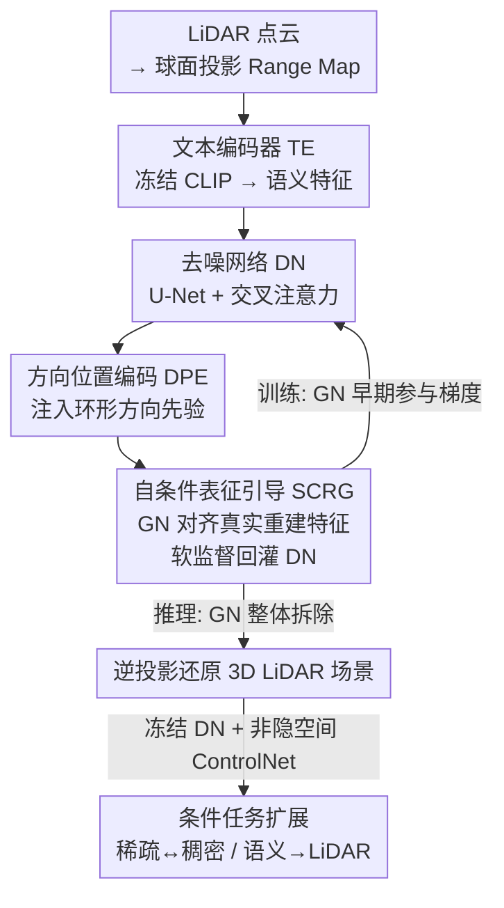

# A Self-Conditioned Representation Guided Diffusion Model for Realistic Text-to-LiDAR Scene Generation

**会议**: CVPR 2026  
**论文**: [CVF Open Access](https://openaccess.thecvf.com/content/CVPR2026/html/Qu_A_Self-Conditioned_Representation_Guided_Diffusion_Model_for_Realistic_Text-to-LiDAR_Scene_CVPR_2026_paper.html)  
**代码**: https://github.com/QWTforGithub/T2LDM  
**领域**: 扩散模型 / 自动驾驶 / 3D 场景生成  
**关键词**: 文本到LiDAR生成、扩散模型、表征引导、方向位置编码、可控性评测

## 一句话总结
T2LDM 用一个训练时辅助、推理时丢弃的"引导网络"给去噪网络注入几何重建监督（SCRG），再加一个方向位置编码（DPE）纠正环形投影带来的街道扭曲，在 Text-LiDAR 配对极度稀缺的条件下也能生成结构精细、可控的 LiDAR 场景，并配套提出可控性 benchmark T2nuScenes 和 TBR 指标。

## 研究背景与动机
**领域现状**：LiDAR 点云能精确刻画驾驶场景的几何与空间关系，但真实采集成本高、恶劣天气数据稀缺。受文生图成功的启发，研究者开始用扩散模型（DDPM）做"文本→LiDAR 场景"生成，希望用自然语言便捷地定制大规模、多样、可控的 3D 数据来喂下游感知模型。

**现有痛点**：文生图能在上亿级 Text-Image 配对上训练，而 LiDAR 采集与标注昂贵，高质量 Text-LiDAR 配对极度稀缺（nuScenes 中 < 35K 对）。训练先验不足直接导致生成结果**过度平滑、同质化**——场景里物体没有清晰结构和真实细节（图 1）。同时已有 benchmark（如 nuScenes 原始标注）文本"不自然"（如"Turn right at intersection, cross bridge, many peds"），且没有可控性评测指标。

**核心矛盾**：扩散模型要拟合 LiDAR 数据分布 $P_{RM}$ 需要充足训练先验，但 Text-LiDAR 数据天然稀缺，二者直接冲突。图像领域常用"预训练表征先验"来增强生成模型表达力，但这条路要求大规模预训练知识、还要多阶段训练，对 LiDAR 既缺数据也不划算。

**本文目标**：在不依赖外部预训练先验、不增加推理开销的前提下，让去噪网络从有限的 LiDAR 数据分布中学到丰富几何细节；同时解决 range map 环形投影导致的方向混淆，并补齐 Text-LiDAR 的可控性评测与 prompt 范式。

**切入角度**：作者观察到，扩散训练中的去噪网络本身就在多尺度地"看到"被扰动的特征；如果让另一个网络对齐到**真实坐标的重建表征**，就能把"几何细节应该长什么样"作为软监督回灌给去噪网络——而且这个辅助网络可以只在训练早期参与、推理时整体拆掉，等于"白嫖"一份正则。

**核心 idea**：用一个**自条件表征引导（SCRG）** 把数据分布里的几何重建细节蒸馏进去噪网络，配合 **方向位置编码（DPE）** 纠正环形投影方向，做端到端、推理零额外开销的 Text-to-LiDAR 扩散生成。

## 方法详解

### 整体框架
T2LDM 把 LiDAR 场景通过球面投影压成 Range Map（RM，每像素存深度 $r$ 和强度 $I$），在 RM 上做条件 DDPM 生成，再用投影逆变换还原回 3D 点云。整条 pipeline 由三个组件协同：**文本编码器 TE**（冻结的 CLIP，输出 768 维语义特征）→ **去噪网络 DN**（U-Net，决定最终生成质量，在每个 stage 用交叉注意力融合文本、并把 timestep 与 DPE 注入残差块）→ **引导网络 GN**（训练时给 DN 提供带重建细节的监督信号，推理时整体拆除）。

输入是 RM 加噪后的 $x_t$、文本条件 $c$、timestep $t$；DN 预测 $v$ 目标完成去噪，训练目标是标准的 v-prediction $L(\theta)=\mathbb{E}_{\epsilon}\lVert v - v_\theta(x_t,t,c)\rVert^2$。无条件生成被当成 $c=\varnothing$ 的特例，从而可以交替训练无条件/有条件 DDPM 实现 classifier-free guidance。SCRG 与 DPE 是挂在这条主干上的两个增强模块；此外冻结无条件 DN 后接一个非隐空间 ControlNet，还能扩展到稀疏→稠密、稠密→稀疏、语义图→LiDAR 等条件生成任务。

### 关键设计

**1. 自条件表征引导 SCRG：用可拆卸的引导网络把几何重建细节蒸进去噪网络**

针对"Text-LiDAR 数据稀缺 → 训练先验不足 → 生成过平滑"这个核心痛点。图像领域常借外部预训练表征注入正则，但需要大规模预训练 + 多阶段训练，LiDAR 用不起。SCRG 的做法是引入一个**引导网络 GN（$x_\phi$）**：它接收 DN 的多层扰动特征 $F^{v_\theta}_{noise}$，同时以**真实坐标 $x_0$** 为目标做几何重建，约束为 $L(\phi)=\lVert x_0 - x_\phi(x_0, F^{v_\theta}_{noise})\rVert^2$。这样 GN 学到的就是"在多级扰动和条件引导下、几何细节应该长什么样"的重建表征 $F^{x_\phi}_{recon}$。

随后把 DN 的扰动特征向 GN 的多尺度重建特征对齐，构成正则项

$$L_{SCRG} = l_{recon}\big(F^{x_\phi}_{recon} - F^{v_\theta}_{noise}\big),$$

其中 $l_{recon}(\cdot)$ 用余弦相似度。它之所以有效：GN 等于给 DN 提供了一份"来自数据分布本身的软监督"，逼 DN 在去噪过程中保留高频几何语义，而不是塌成平均化的平滑结果。关键工程巧思在于 **GN 只在训练早期（前 100K 步）参与梯度反传，之后冻结，推理时完全 detach**——所以既不需要外部预训练先验，又**不增加任何推理开销**，还能让 DN 早期就抓住高频细节、收敛更快更稳（见 Tab. 8 / Fig. 9）。

**2. 方向位置编码 DPE：纠正环形投影被当成矩形图带来的街道扭曲**

针对的痛点很具体：RM 是把 360° 球面投影"摊平"成 2D 图，但卷积、局部注意力这类窗口操作会把它当成普通矩形图处理，导致**方向混淆**——最明显的后果是生成场景里的**街道弯折或断裂**（图 2c），因为起始角通常定义在街道中心。

DPE 给 RM 每个像素 $(i,j)$ 显式赋予真实的水平角 $\theta$ 和垂直角 $\phi$：

$$\theta = 2\pi - 2\pi\cdot(i+0.5)/w, \qquad \phi = f_{up} - (f_{up}-f_{down})\cdot(j+0.5)/h,$$

再对角坐标做 $K$ 阶 Fourier 展开 $Fourier^K(\theta,\phi)=\bigoplus_{k=0}^{K-1}[\sin(2^k\theta),\cos(2^k\theta),\sin(2^k\phi),\cos(2^k\phi)]$，并用一个可学习门控 $\alpha$ 自适应注入特征：$x' = x + \alpha\cdot \mathrm{DPE}(\theta,\phi)$。多级 Fourier 提供多尺度方向先验，门控自适应调节各频率分量权重。效果上，模型能正确感知物体的相对朝向与位置（如 $car_A(\theta_1,\phi_1)$ 与 $car_B(\theta_2,\phi_2)$ 的真实前后左右关系），从而把弯折/断裂的街道纠正成连续真实的形态。

**3. T2nuScenes benchmark + TBR 指标 + prompt 范式：让 Text-LiDAR 生成"可控且可评"**

针对"已有 benchmark 文本不自然、且没有可控性评测"的痛点。作者基于 **3D 检测框先验**对 nuScenes 全部 34,149 帧重新标注，构建内容可组合（content-composable）的 Text-LiDAR benchmark T2nuScenes。用 3D box 标文本有三个好处：比人工标注更准（accuracy）、能泛化到任意 3D 检测数据集（generality）、能用检测器做可控性评测（evaluability）。

配套提出可控性指标 **TBR（Text-Box matching Rate）**：对 10,000 个生成样本跑检测器得到 3D box，统计这些 box 与输入文本 prompt 的匹配率，数值越高说明生成越听话。基于此作者系统对比了不同 prompt 形式（数量/位置/朝向/天气/时间/长度/句式），得到反直觉但重要的发现：**显式位置 prompt 反而效果最差、可控性最低**，而场景级（天气/时间）描述显著优于物体级；更长的同义 prompt 会轻微掉点。作者从**样本分布**角度解释：越分散的样本分布能产出越丰富的文本，但在数据稀缺时会进一步加剧训练先验不足。由此给出实用范式——prompt 应"简洁清晰且保留足够语义"，并按数据集样本分布来标注，最终采用 "weather, location" 作为基准 prompt 模板。

### 损失函数 / 训练策略
总损失为去噪损失、GN 重建损失、SCRG 正则三者相加：

$$L_{total} = L(\theta) + L(\phi) + \lambda\, L_{SCRG},$$

其中 $\lambda$ 是按 epoch 调整的权重因子。引导网络 $x_\phi$ 只在**前 100K 步**参与梯度反传，之后冻结；推理时 $x_\phi$ 整体拆除，仅用 $v_\theta$ 迭代去噪：$x_{t-1}=\frac{1}{\sqrt{\alpha_t}}\big(x_t-\frac{1-\alpha_t}{\sigma_t}[\sigma_t x_t+\sqrt{\bar\alpha_t}\,v_\theta]\big)+\tilde\sigma_t\epsilon$。timestep $t\sim U[1024]$。

## 实验关键数据

### 主实验
KITTI-360（64-beam，76,165 帧）无条件生成，FID 类指标（FSVD/FPVD）大幅领先：

| 方法 | FSVD↓ | FPVD↓ | JSD↓ | MMD↓ |
|------|-------|-------|------|------|
| LiDM | 211.68 | 230.19 | 0.35 | 4.78 |
| R2DM | 31.82 | 35.94 | 0.32 | 4.05 |
| Text2LiDAR | 51.55 | 54.82 | 0.33 | 4.11 |
| **T2LDM** | **21.12** | **25.39** | **0.30** | **3.35** |

nuScenes（32-beam，更稀疏更难）文本引导生成，质量与可控性（TBK/TBR）双双领先：

| 方法 | FSVD↓ | FPVD↓ | JSD↓ | MMD↓ | TBK(%)↑ |
|------|-------|-------|------|------|---------|
| R2DM | 91.15 | 88.55 | 0.45 | 5.11 | 15.45 |
| Text2LiDAR | 90.13 | 87.62 | 0.38 | 4.01 | 17.15 |
| **T2LDM** | **66.93** | **65.84** | **0.28** | **3.05** | **23.44** |

> ⚠️ 正文 TBR 与表格 TBK 似为同一可控性指标的不同写法，以原文为准。

### 消融实验
组件有效性（nuScenes，文本引导）。$\varnothing$=去掉 DPE+SCRG，D=只留 DPE，S=只留 SCRG：

| 配置 | FSVD↓ | FPVD↓ | JSD↓ | TBK(%)↑ | 说明 |
|------|-------|-------|------|---------|------|
| T2LDM$_\varnothing$ | 73.64 | 71.91 | 0.34 | 19.32 | 两者全去 |
| T2LDM$_D$ | 71.32 | 70.44 | 0.32 | 20.95 | 只留 DPE |
| T2LDM$_S$ | 68.45 | 67.77 | 0.30 | 22.15 | 只留 SCRG |
| **T2LDM** | **66.93** | **65.84** | **0.28** | **23.44** | 完整模型 |

端到端 vs 预训练范式（nuScenes，FSVD↓）：端到端 64.21，预训练 68.77，甚至不如只用 DPE 的 68.11——因为预训练 GN 无法感知 DN 特征、给不出自适应正则。

### 关键发现
- **SCRG 贡献大于 DPE**：单独加 SCRG（S）比单独加 DPE（D）掉点更少（FSVD 68.45 vs 71.32），说明"从数据分布学几何细节"是核心收益来源；两者叠加再进一步提升。
- **收敛加速明显**：30k 迭代时 T2LDM 的 FSVD 仅 47.29，而去掉 SCRG 的 T2LDM$_D$ 高达 91.32，R2DM 更是 175.82——SCRG 让模型早期就抓到高频语义。
- **端到端是关键**：SCRG 必须端到端联合训练，GN 要能"看到" DN 当前特征才能给出自适应正则；改成预训练反而退化。
- **反直觉的 prompt 发现**：显式位置 prompt 可控性最差（TBR 仅 12.23%），场景级天气/位置组合 prompt 更优，原因是样本分布越分散、稀缺数据下训练先验越不足。
- **零额外推理成本**：T2LDM 推理参数 30.4M，低于 R2DM 的 31.1M 和 Text2LiDAR 的 45.8M——GN 推理时被拆掉，不留负担。

## 亮点与洞察
- **"训练时辅助、推理时拆除"的引导网络**：SCRG 把外部预训练先验换成"自条件"重建监督，既省掉多阶段预训练，又零推理开销——这种"用一个可拆卸 teacher 在训练早期注入正则"的范式可迁移到其他数据稀缺的生成任务。
- **把投影几何写进位置编码**：DPE 抓住了"环形投影被窗口操作误当矩形图"这个易被忽视的细节根因，用 Fourier 角度编码 + 可学习门控直接补回方向先验，是个轻量但精准的 fix。
- **用检测器闭环评测生成可控性**：TBR 用现成 3D 检测器把"文本说有几辆车/朝向"和"生成结果里真有几个框"对齐成可量化指标，给文本到 3D 生成提供了客观的可控性评测思路。
- **反直觉结论有解释力**：作者没有止步于"显式位置 prompt 反而差"的现象，而是用样本分布把它讲圆，给出了实操的 prompt 标注原则。

## 局限与展望
- 依赖球面投影到 Range Map 的 2D 表征，DPE 也是为 RM 量身定制；换成体素/原生点云表征时方法需重新设计。
- 可控性指标 TBR 依赖外部检测器的精度，检测器误差会传导进评测；且当前主要围绕"car"等目标物展开。
- benchmark 与多数实验集中在 nuScenes / KITTI-360，对更多样传感器配置、更恶劣天气的泛化仍待验证。
- SCRG 的 100K 步早期参与、$\lambda$ 的 epoch-wise 调度等超参细节放在补充材料，复现时对训练曲线可能较敏感 ⚠️。

## 相关工作与启发
- **vs 预训练表征引导（如 REPA 类方法 [23,62]）**: 它们靠大规模预训练表征 + 多阶段训练注入正则；本文用自条件、端到端、可拆卸的 GN，省预训练、零推理开销，更适配 LiDAR 数据稀缺场景。
- **vs R2DM / Text2LiDAR**: 同为 LiDAR 扩散生成，但它们在训练先验不足下生成过平滑、复杂多物体场景细节差；T2LDM 通过 SCRG 显著拉低 FID 并提升可控性，且推理参数更少。
- **vs 基于复杂 3D box 条件的生成**: 直接喂 3D box 约束多、不灵活；本文用 3D box 先验去**标注文本**，再用更自然的文本条件生成，兼顾灵活性与可控性评测。

## 评分
- 新颖性: ⭐⭐⭐⭐ 自条件可拆卸引导 + 投影方向编码两个点都切中 LiDAR 生成的真实痛点，组合新颖。
- 实验充分度: ⭐⭐⭐⭐⭐ 无条件/文本引导/三类条件任务全覆盖，含收敛速度、端到端 vs 预训练、prompt 形式等多维消融。
- 写作质量: ⭐⭐⭐⭐ 动机清晰、图示直观；部分指标命名（TBR/TBK）和公式细节略有混用。
- 价值: ⭐⭐⭐⭐ 给数据稀缺下的可控 3D 场景生成与下游感知数据合成提供了实用方案和评测基建。

<!-- RELATED:START -->

## 相关论文

- [\[CVPR 2026\] Structure-to-Intensity Diffusion for Adverse-Weather LiDAR Generation](structure-to-intensity_diffusion_for_adverse-weather_lidar_generation.md)
- [\[ICCV 2025\] LangTraj: Diffusion Model and Dataset for Language-Conditioned Trajectory Simulation](../../ICCV2025/autonomous_driving/langtraj_diffusion_model_and_dataset_for_language-conditioned_trajectory_simulat.md)
- [\[CVPR 2026\] SparseWorld-TC: Trajectory-Conditioned Sparse Occupancy World Model](sparseworld_tc_trajectory_conditioned_sparse_occupancy_world_model.md)
- [\[CVPR 2026\] GaussianDWM: 3D Gaussian Driving World Model for Unified Scene Understanding and Multi-Modal Generation](gaussiandwm_3d_gaussian_driving_world_model_for_unified_scene_understanding_and_.md)
- [\[CVPR 2026\] CoopDiff: A Diffusion-Guided Approach for Cooperation under Corruptions](coopdiff_a_diffusion-guided_approach_for_cooperation_under_corruptions.md)

<!-- RELATED:END -->
