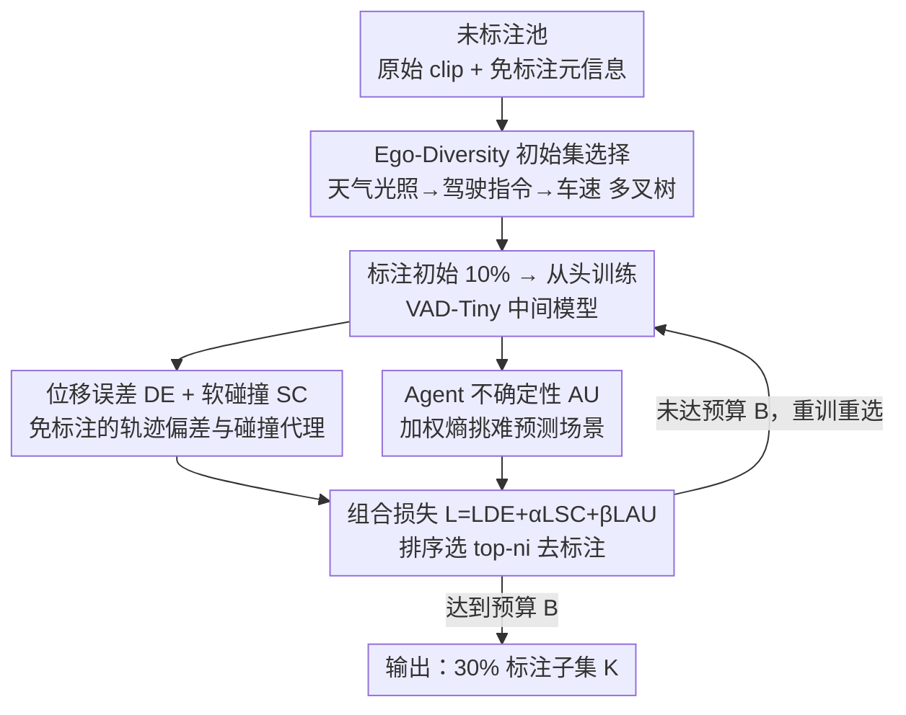

# ActiveAD: Planning-Oriented Active Learning for End-to-End Autonomous Driving

**会议**: CVPR 2026  
**论文**: [CVF Open Access](https://openaccess.thecvf.com/content/CVPR2026/html/Lu_ActiveAD_Planning-Oriented_Active_Learning_for_End-to-End_Autonomous_Driving_CVPR_2026_paper.html)  
**代码**: https://github.com/Thinklab-SJTU/ActiveAD  
**领域**: 自动驾驶  
**关键词**: 主动学习, 端到端自动驾驶, 规划导向, 数据标注效率, 长尾分布

## 一句话总结
ActiveAD 为端到端自动驾驶设计了一套"规划导向"的主动学习策略：用几乎免费的元信息（天气/光照/驾驶指令/车速）做多样性初始化解决冷启动，再用位移误差、软碰撞、Agent 不确定性三个免标注准则挑出最该标的场景，只标 30% 数据就在 nuScenes 开环和 CARLA 闭环上追平用 100% 数据训练的 SOTA。

## 研究背景与动机

**领域现状**：端到端可微分（E2E）已成为自动驾驶的主流范式，UniAD、VAD 这类方法直接从原始传感器数据回归出 ego 规划轨迹，避免了模块化系统（感知→预测→规划分开训练）的误差累积。但这些方法本质上仍是**监督学习**，需要 3D bounding box、车道/交通标志语义分割这类细粒度标注，标注成本极高。

**现有痛点**：标注是端到端方法 scaling up 的核心瓶颈，而自动驾驶数据又有严重的**长尾问题**——大部分采集到的数据是"在直路上往前开"这种平凡样本，只有少数是安全攸关的关键场景。无差别地全量标注，等于把大量预算砸在对规划没什么帮助的平凡帧上。

**核心矛盾**：到底要不要标注全部原始数据才能拿到最优性能？作者通过实证给出的答案是 **NO**——更多数据不必然带来更好性能，关键在于"标得准"而非"标得多"。

**本文目标**：在有限标注预算下，自动挑出对**规划**最有价值的 clip 去标注，分解为两个子问题：(1) 冷启动时第一批标什么（无模型可用）；(2) 有了中间模型后，后续每轮增量标什么。

**切入角度**：现有主动学习方法大多面向单模态图像分类，而自动驾驶天然带有视频流、轨迹、车速/天气/光照等多模态、几乎免费的元信息；同时 UniAD 提出的"规划导向"哲学启发作者——选样本的标准应该直接对齐规划目标，而不是感知层的信息量。

**核心 idea**：把主动学习的多样性度量和不确定性度量都重新设计成**面向规划路线**的、且尽量**免标注**的指标，让样本选择直接服务于 L2 误差和碰撞率的下降。

## 方法详解

### 整体框架

ActiveAD 套在一个端到端自动驾驶框架（以轻量版 VAD-Tiny 为基座）外面，把"标哪些数据"这件事做成一个迭代闭环。输入是一池未标注的 clip $P_u=\{X_i\}$，每个 clip 自带免标注信息 $X_i=(S_i,\tau_i,O_i)$——原始传感器流、记录下的 ego 轨迹、以及 ego 状态/天气/光照等元信息 $O_i=(e_i,w_i,l_i)$；输出是预算 $B$（实验里取 30%）内被选中去做精细标注的 clip 下标集合 $K$。

整个流程分两段。**第一段是初始集选择**：没有任何已训练模型，靠 Ego-Diversity 利用免费元信息从池子里挑出第一批（10%）去标。**第二段是增量选择**：先用当前已标数据从头训练一个中间模型，再用它在未标注池上推理，按 Displacement Error + Soft Collision + Agent Uncertainty 组合成的"总损失"给每个 clip 打分，选总损失最大（即模型最吃力、最值得标）的 top-$n_i$ 去标，标完重训、重选，循环 $M$ 轮直到用满预算。实验配置是初始 10% + 两轮各 10% = 30%。

### 关键设计

**1. Ego-Diversity 初始选择：用免费元信息替代随机初始化，破解冷启动**

主动学习的第一批样本通常只能看原始图像、没有可用特征，所以传统做法都是随机选（Random），这在长尾的驾驶数据上很吃亏——随机选大概率全是直路样本。ActiveAD 注意到采集数据时车速、轨迹、天气、光照这些信息是"顺手就记下来"的，可以拿来做多样性分层。具体是建一棵多叉树分三层切分：第一层按天气×光照分成 Day-Sunny/Day-Rainy/Night-Sunny/Night-Rainy 四个互斥子集；第二层在每个子集里按一段 clip 内左/右/直行指令的计数，用阈值 $\tau_c$ 判定为左转(L)/右转(R)/超车(O)/直行(S)四类（左右指令都 $\ge\tau_c$ 算超车）；第三层在每个二级子集内按平均车速升序排列、等间隔抽取。

关键在于各子集名额不是均分，而是用一个参数 $\gamma$ 偏向稀有类。一级权重为

$$P_x=\frac{n_x^{\gamma}}{\sum_{z\in\{DS,DR,NS,NR\}} n_z^{\gamma}},\quad x\in\{DS,DR,NS,NR\}$$

二级在此基础上再乘一层同形式权重 $P_{x,y}=P_x\cdot n_{x,y}^{\gamma}/\sum_z n_{x,z}^{\gamma}$。$\gamma=1$ 时各类按原比例均匀采，$\gamma<1$ 则把名额倾斜给样本数少的类（如 Night-Rainy、Overtake 这些既稀有又关键的场景），子集名额 $n^{(l)}_s=n_0 P_s$。这样第一批就能覆盖到长尾的危险场景，给后续训练一个更稳的起点——消融里它把初始 10% 的碰撞率从 0.67% 直接压到 0.41%。

**2. 位移误差 + 软碰撞：两个免标注的"规划吃力度"代理**

有了中间模型后，要判断一个未标注 clip 值不值得标，最直接的信号是"模型在这开得好不好"，但碰撞率依赖 3D box 标注、未标注数据上算不了。作者绕开标注设计了两个准则。**Displacement Error (DE)** 直接拿模型预测轨迹 $\tau$ 与数据采集时记录的人类真实轨迹 $\tau^*$ 的 L2 距离：$L_{DE}=\frac{1}{T}\sum_{t=1}^{T}\|\tau_t-\tau^*_t\|_2$。因为人类轨迹本来就被记录下来、零额外标注成本，DE 成为最核心、最优先的准则。

但只看 DE 会过拟合到 L2、碰撞率压不下去。于是补一个 **Soft Collision (SC)**：用预测 ego 轨迹与预测 agent 轨迹之间的最近距离做"碰撞危险系数"，

$$L_{SC}=\sum_{t=1}^{T}\exp\!\left(-\min_{a\in\text{agents}}(\tau_{t,\text{ego}}-\tau_{t,a})\right)$$

这里有两层巧思：一是 SC 只依赖模型自己的推理结果、不需要 box 标注；二是硬碰撞（预测轨迹真撞上）在 SOTA 模型上发生率 <1%，正样本太少没法选，而用连续的"最近距离"做软化版，离得越近损失越大，提供了**稠密监督**，能稳定地把高风险场景捞出来。

**3. Agent 不确定性：用加权熵挑出"周围车难预测"的场景**

DE/SC 关注 ego 自己开得对不对，但很多危险来自**周围 agent 行为的不确定性**。运动预测模块本就输出多模态轨迹及各模态置信度，作者据此度量"附近车有多难预测"。先用距离阈值 $\delta_d$ 滤掉太远的 agent，再对剩下每个 agent 的多模态预测概率算熵、并按距离加权（越近权重越大）：

$$L_{AU}=-\sum_{a\in\text{agent}}\exp(\delta_d-d_a)\sum_{i=1}^{N_m}P_i(a)\log P_i(a)$$

其中 $d_a$ 是 agent 到 ego 的预测距离、$N_m$ 是预测模态数、$P_i(a)$ 是第 $i$ 个模态的置信度。熵高说明模型对这辆车下一步会往哪开很犹豫，加权又让近处的犹豫更受重视——这类场景正是规划最容易出事、最值得标注学习的。三个准则归一化到 $[0,1]$ 后组合成总损失 $L=L_{DE}+\alpha L_{SC}+\beta L_{AU}$（实验 $\alpha=\beta=1$），每轮选总损失最大的 top-$n_i$ 去标。消融显示三者缺一不可：单用 DE 碰撞率压不下去，三者齐全才把 30% 时的碰撞率打到 0.21%。

### 损失函数 / 训练策略
基座 VAD-Tiny 用默认超参，AdamW + Cosine Annealing 训 20 epoch，weight decay 0.01，初始学习率 $2\times10^{-4}$。主动学习侧关键超参：置信度阈值 $\epsilon_a=0.5$、距离阈值 $\delta_d=3.0$m、驾驶场景阈值 $\tau_c=4$、多样性参数 $\gamma=0.5$、组合损失权重 $\alpha=\beta=1$。预算 30% = 初始 10% + 两轮各 10%，每轮从头重训中间模型再选样。

## 实验关键数据

数据集 nuScenes（1000 个 20 秒场景），评测指标为规划的 Displacement Error（L2）与 Collision Rate；闭环用 CARLA。基座为 VAD-Tiny，对比 Coreset / VAAL / KECOR / ActiveFT 四个主动学习基线及 Random。

### 主实验（规划性能，平均 L2 / 碰撞率，越低越好）

| 配置 | 数据量 | Avg. L2 (m) ↓ | Avg. Collision (%) ↓ |
|------|--------|--------------|----------------------|
| VAD-Tiny（完整训练） | 100% | 0.70 | 0.25 |
| Random | 30% | 0.78 | 0.37 |
| Coreset | 30% | 0.73 | 0.54 |
| VAAL | 30% | 0.81 | 0.35 |
| KECOR | 30% | 0.82 | 0.45 |
| ActiveFT | 30% | 0.78 | 0.39 |
| **ActiveAD (Ours)** | **30%** | **0.68** | **0.21** |

只用 30% 数据，ActiveAD 的 L2(0.68)/碰撞率(0.21%) 反而**略优于用 100% 数据训练**的 VAD-Tiny(0.70/0.25)，且在 10%/20%/30% 三档预算下全面碾压其他主动学习基线（传统方法相比 Random 几乎没有优势）。作者还报告 40%/50% 时性能已饱和，印证了数据的长尾本质。

### 消融实验（初始化 + 三准则组合，平均 L2 / 碰撞率，30% 列）

| ID | 配置 | L2@30% | CR@30% |
|----|------|--------|--------|
| 1 | RA（随机初始 + 随机选） | 0.78 | 0.37 |
| 2 | ED（仅 Ego-Diversity 初始化） | 0.74 | 0.34 |
| 3 | ED + DE | 0.70 | 0.35 |
| 4 | ED + DE + SC | 0.73 | 0.26 |
| 5 | RA + DE + SC + AU | 0.71 | 0.26 |
| 6 | **ED + DE + SC + AU（完整）** | **0.68** | **0.21** |

### 关键发现
- **Ego-Diversity 对冷启动贡献巨大**：初始 10% 的碰撞率从随机的 0.67% 降到 0.41%（−0.26），给后续迭代一个明显更好的起点（对比 ID 5 用随机初始化、其余相同，最终 CR 0.26% 仍逊于完整的 0.21%）。
- **单准则会偏科**：只加 DE（ID 3）能把 L2 压到 0.70，但碰撞率反而没改善、甚至出现"30% 比 20% 还差"的过拟合；加上 SC 后碰撞率才掉到 0.26%，再加 AU 进一步到 0.21%——三准则互补、缺一不可。
- **分场景鲁棒**：在 Day/Night、Sunny/Rainy、直行/左转/右转/超车各切片上（Table 3，30% 数据），ActiveAD 的综合 L2/CR(0.68/0.21) 基本全面优于 Random、Coreset、VAAL、ActiveFT，在夜间/雨天等长尾切片也保持优势。

## 亮点与洞察
- **"规划导向选数据"这个视角本身**：以往主动学习在自动驾驶里都用在感知（3D 检测、点云），ActiveAD 第一个把它对齐到端到端规划目标，选样准则直接服务于 L2 和碰撞率，而不是感知层的信息量——这是它能打过通用基线的根因。
- **把昂贵指标做成免标注代理**：碰撞率要 box 标注、硬碰撞正样本又太稀疏，作者用"预测轨迹间最近距离的指数"做软碰撞，既不需要标注又提供稠密信号，这种"用模型自身推理结果构造无标注准则"的思路可迁移到任何标注昂贵的主动学习任务。
- **"少而精胜过多而杂"的实证**：30% 选得好的数据 > 100% 全量，挑战了"数据越多越好"的惯性，提示数据治理（去噪、去平凡样本）和模型结构同等重要。

## 局限与展望
- 实验只在 VAD-Tiny 一个基座 + nuScenes/CARLA 上验证，是否在 UniAD 这类更重的端到端框架、或更大规模真实数据上同样成立，未充分展开。
- $\gamma$、$\alpha$、$\beta$、$\tau_c$、$\delta_d$ 等超参数较多且部分凭经验设定（如 $\alpha=\beta=1$ 的等权组合），跨数据集的可迁移性存疑；Ego-Diversity 的天气/光照分层依赖 nuScenes 提供的现成标签，换数据集需要自己造这些元信息。⚠️
- 性能在 30% 即饱和虽说明长尾，但也意味着该策略对"已被中间模型覆盖良好"的尾部增益有限；如何在闭环里持续发现真正的新分布样本（而非已知难例）是更难的开放问题。

## 相关工作与启发
- **vs Coreset / VAAL / ActiveFT（通用主动学习）**: 它们基于图像特征多样性或预测概率的对抗判别，输入多是单模态图像、面向分类；ActiveAD 利用驾驶特有的多模态免标注信息并把准则对齐规划，因此在同等预算下大幅领先（30% 时 L2 0.68 vs 0.78~0.84）。
- **vs KECOR / CRB（自动驾驶主动学习）**: 它们面向 LiDAR 3D 检测、以最大化核编码率等感知信息量为目标；ActiveAD 转向端到端规划，证明"为规划选数据"和"为感知选数据"是不同的优化方向。
- **vs UniAD / VAD（端到端 AD 基座）**: ActiveAD 不改模型结构，而是继承 UniAD 的规划导向哲学、在数据侧做文章，与这些方法正交、可叠加。

## 评分
- 新颖性: ⭐⭐⭐⭐ 首个面向端到端规划的主动学习，准则设计（软碰撞、加权熵 AU、Ego-Diversity）契合任务且免标注。
- 实验充分度: ⭐⭐⭐⭐ 开环+闭环、多预算档、逐准则消融、分场景分析齐全；但仅单基座单数据集。
- 写作质量: ⭐⭐⭐⭐ 动机—公式—消融链路清晰，符号定义完整。
- 价值: ⭐⭐⭐⭐ 30% 数据追平 100% 的结论对降低自动驾驶标注成本有直接现实意义。

<!-- RELATED:START -->

## 相关论文

- [\[CVPR 2026\] GuideFlow: Constraint-Guided Flow Matching for Planning in End-to-End Autonomous Driving](guideflow_constraint-guided_flow_matching_for_planning_in_end-to-end_autonomous_.md)
- [\[CVPR 2026\] Scaling-Aware Data Selection for End-to-End Autonomous Driving Systems](scaling-aware_data_selection_for_end-to-end_autonomous_driving_systems.md)
- [\[CVPR 2026\] ResAD: Normalized Residual Trajectory Modeling for End-to-End Autonomous Driving](resad_normalized_residual_trajectory_modeling_for_end-to-end_autonomous_driving.md)
- [\[CVPR 2026\] DriveMoE: Mixture-of-Experts for Vision-Language-Action Model in End-to-End Autonomous Driving](drivemoe_mixture-of-experts_for_vision-language-action_model_in_end-to-end_auton.md)
- [\[CVPR 2026\] CausalVAD: De-confounding End-to-End Autonomous Driving via Causal Intervention](causalvad_de-confounding_end-to-end_autonomous_driving_via_causal_intervention.md)

<!-- RELATED:END -->
