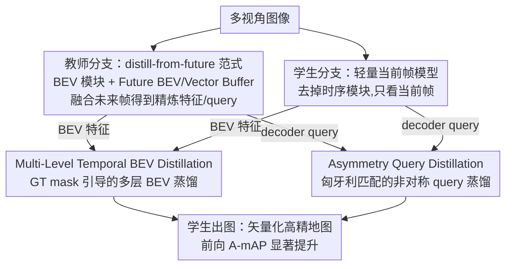

# AMap: Distilling Future Priors for Ahead-Aware Online HD Map Construction

**会议**: CVPR 2026  
**论文**: [CVF Open Access](https://openaccess.thecvf.com/content/CVPR2026/html/Li_AMap_Distilling_Future_Priors_for_Ahead-Aware_Online_HD_Map_Construction_CVPR_2026_paper.html)  
**代码**: [项目页](https://buaa-rickyli.github.io/AMap/)  
**领域**: 自动驾驶 / 在线高精地图 / 知识蒸馏  
**关键词**: 在线高精地图, 前向感知, 未来先验蒸馏, BEV 蒸馏, 时序建模

## 一句话总结
AMap 指出现有时序高精地图方法「只增强已驶过的后方、对关键的前方道路几乎无改善」这一安全隐患，提出「从未来蒸馏」范式——用能看到未来帧的教师隐式地把前向先验灌进只看当前帧的轻量学生，在零推理开销下显著提升前向（A-mAP）建图精度。

## 研究背景与动机
**领域现状**：在线高精地图（HD Map）构建直接从车载相机/传感器实时推断车道线、人行道、道路边界等矢量化要素，是自动驾驶规划的基石。当前 SOTA 普遍引入**历史时序融合**（MapTracker、StreamMapNet 等），通过累积过去帧来缓解遮挡、提升时序一致性，整体 mAP 很漂亮。

**现有痛点**：作者发现这套「历史融合」范式有个被忽视的致命缺陷——它在**空间上是「向后看」的**。历史帧来自车辆已经驶过的区域，所以增益几乎都堆在后方；而车前那段**还没见过的道路**，时序融合几乎帮不上忙。论文用新指标量化后发现，MapTracker 在 ResNet-18/50 下的 A-mAP（前方）与 R-mAP（后方）差距都超过 8 个点。

**核心矛盾**：这种偏置与自动驾驶的真实需求**完全错配**。规划/决策严重依赖对**前方道路几何**的准确理解，对已驶过区域则没那么敏感。论文用下游轨迹预测做了对照实验（见下）：遮挡前方地图会让 minADE/minFDE 单调恶化（100% 遮挡 minADE 涨 9.73%、minFDE 涨 13.95%），而遮挡后方几乎无影响、甚至略有改善（70% 遮挡 MR 从 0.0854 降到 0.0807）。也就是说，大家拼命优化的后方精度，对下游边际收益很低。

**本文目标**：能否设计一个**轻量、即插即用**的模块，专门补齐前向感知短板，又**不增加任何架构改动和推理成本**？

**切入角度**：训练阶段其实**能拿到未来帧**（数据集里整段视频都在），只是部署时拿不到。那就把「未来」当成一种**特权信息（privileged information）**，训练时用它当监督信号，推理时学生完全不需要未来/历史帧。

**核心 idea**：「distill-from-future」——先训一个能访问未来时序上下文的强教师，再把它蕴含的前向先验**蒸馏**进一个只看当前帧的轻量学生，让学生在零推理开销下获得「预判」能力。

## 方法详解

### 整体框架
AMap 是一个**即插即用**的师生蒸馏框架，目标是修补现有时序建图模型「增益偏后方」的问题。它由两部分组成：(1) 一个注入了**未来时序信息**的教师模型，(2) 一个只吃当前帧的**轻量学生模型**。论文以 MapTracker 代码库为载体实例化这对师生。关键点在于：教师里的「未来」在推理时**没有物理意义**（车上拿不到真实未来传感器输入），它只是一个**承载前向知识的特权信息容器**；真正部署的是学生，未来知识已经被隐式蒸馏进它的静态 query 里，所以学生**不引入任何额外时空开销**。

整条 pipeline 是：多视角图像 →（教师/学生各自的）图像 backbone → BEV 模块得到当前帧 BEV → 教师额外用 Future BEV/Vector Memory Buffer 融合未来缓存得到「精炼」特征，学生因为去掉了时序模块只有当前帧特征 → 两条分支在 **BEV 层**和 **Query 层**做两路蒸馏，把教师的前向先验灌进学生 → 学生用过滤后的高置信 query 出图。训练分两阶段：先单独预训教师，再**冻结教师、只更新学生**做联合训练。

### 关键设计

**1. distill-from-future 范式：把训练时可得的「未来」当特权信息灌进当前帧学生**

痛点直接对准动机：历史融合只能增强后方，因为它喂的就是已驶过区域的信息；要补前方，得有「看过前面」的知识源。作者的做法是构造一个**教师**，它含 4 个组件——BEV Module、Future BEV Memory Buffer、Vector Module、Future Vector Memory Buffer。教师先把未来 BEV「记忆」$B_{t+1}$ 按位姿变换到当前帧坐标系，用类似 BEVFormer 的空间可变形交叉注意力得到基础 BEV $B^{t,\text{basic}}_T$，再把 buffer 里 4 帧缓存的未来 BEV 融进来得到精炼特征 $B^{t,\text{refined}}_T$；Vector Module 则从 Future Vector Buffer 取出未来 query 记忆 $Q^{t+1}_T$，经 MLP 对齐后与新候选拼成当前帧初始 query $Q^{t,\text{basic}}_T = [\,Q^{t+1\,\text{prop}}_T,\ Q^{t,\text{new}}_T\,]$，其中 $Q^{t+1\,\text{prop}}_T$ 是来自 $t{+}1$ 帧的「跟踪」要素、$Q^{t,\text{new}}_T$ 是 100 个新候选。学生则是 MapTracker 去掉 BEV 和 Query 两个维度的时序融合模块后的当前帧版本，只有可学习 query $Q^{t,\text{new}}_S$。这样设计的好处是：未来知识全部压进训练，推理时学生只跑单帧——既拿到了「预判」能力，又保住了单帧推理的速度（FPS 与纯学生一致）。

**2. Multi-Level Temporal BEV Distillation：用分割 GT 掩码把 BEV 蒸馏聚焦到前景，避免背景噪声**

光蒸 BEV 特征有两个坑：一是直接对整张特征图做全局蒸馏会**引入大量背景噪声**，二是前景语义稀疏导致**优化失衡**。作者的关键改动有两处：其一，不止蒸传统做法关注的**初始 BEV**，还把蒸馏范围扩到**精炼 BEV**（即后续用于辅助分割任务的那层），形成「basic + refined」多层蒸馏；其二，用分割 GT 生成一个二值空间掩码 $M$，只在信息量大的前景区域算 loss：

$$L_{\text{feat}} = \frac{1}{\sum_{i,j} M_{i,j}} \sum_{i=1}^{H}\sum_{j=1}^{W} M_{i,j}\,\big\| F^{(i,j)}_S - F^{(i,j)}_T \big\|^2$$

其中 $F_T, F_S \in \mathbb{R}^{C\times H\times W}$ 分别是教师/学生的 BEV 特征，$M_{i,j}\in\{0,1\}$ 由分割 GT 导出，对蒸馏 loss 做空间重加权。消融显示单用某一层 BEV 蒸馏增益有限，basic+refined 两层一起用才有明显提升——说明「精炼特征也值得蒸」是这个设计的关键。

**3. Asymmetry Query Distillation：用匈牙利匹配解决师生 query 数目/语义不对齐的非对称蒸馏难题**

矢量化建图是**集合式、动态跟踪**的预测，教师（未来感知）和学生（当前帧）跑在不同上下文里，query 在**数目和语义上都对不齐**（教师 116 个、学生 100 个，且 MapTracker 的 query 还会随时序漂移）。MapDistill 那种要求 query 一一硬对齐的方法在这里直接失效，朴素地把固定静态 query 集去蒸也不行。借鉴 DETRDistill，作者用**基于匹配的动态 query 蒸馏**：先用匈牙利算法在学生 $N_S$ 个 query 与教师 $N_T$ 个 query 之间求一对一最优匹配 $\hat{\sigma}$，再**只在匹配对上**算 logits 蒸馏：

$$L_{\text{logitsKD}} = \sum_{i=1}^{N_S} L_{\text{KL}}\big(\text{Logits}_S[i]\ \|\ \text{Logits}_T[\hat{\sigma}(i)]\big)$$

即对每个学生 query $i$，把它的输出与最优分配到的教师 query $\hat{\sigma}(i)$ 的 logits 做 KL 散度。这一步精准化解了 MapTracker 这类模型固有的「时序 query 不一致」问题。消融（表 8）很有说服力：MapDistill 的 dummy/Top-K 匹配会让 mAP 从 63.25 崩到 57.63；换成匈牙利匹配但用 MSE/Cosine 距离也只有 62.99/62.43；只有本文这套匈牙利匹配 + 仅匹配对 KL 的组合才到 63.63。

### 损失函数 / 训练策略
两阶段训练：① 单独预训教师；② 联合训练时**完全冻结**教师（加载预训权重），只更新学生。总损失 = 任务原本的建图损失 + BEV 蒸馏 $L_{\text{feat}}$ + query logits 蒸馏 $L_{\text{logitsKD}}$。教师沿用 MapTracker 默认设置，时序采样从 10 个连续帧里按时间顺序随机取 4 帧。优化器 AdamW，初始学习率 5e-4、weight decay 0.01，cosine 调度衰减到 1.5e-6，8 张 H20 训练。

## 实验关键数据

### 下游敏感性（动机实验）
用 MapTR 出图、HiVT 做轨迹预测，对前/后方矢量地图分别按比例遮挡：

| 遮挡区域 | 遮挡比例 | minADE↓ | minFDE↓ | MR↓ |
|----------|----------|---------|---------|-----|
| 前方 | 100% | 0.4231 (+9.73%) | 0.9024 (+13.95%) | 0.1033 (+20.96%) |
| 后方 | 70% | 0.3870 (+0.36%) | 0.7932 (+0.16%) | 0.0807 (-5.50%) |
| 后方 | 100% | 0.3882 (+0.67%) | 0.7971 (+0.66%) | 0.0816 (-4.45%) |

结论：前方地图质量是下游性能的主要决定因素，后方精度边际收益很低甚至有害（过拟合无关细节）。

### 主实验（nuScenes val，与非 KD 相机方法对比）

| 方法 | 时序 | Backbone | mAP↑ | A-mAP↑ | R-mAP↑ | FPS↑ |
|------|------|----------|------|--------|--------|------|
| MapTracker（时序）| ✓ | R50 | 72.93 | 70.03 | 78.92 | 15.6 |
| MapTracker（当前帧）| ✗ | R50 | 68.30 | 69.30 | 69.47 | 20.1 |
| **AMap（Ours）** | ✗ | R50 | **69.26** | **70.19** | 69.61 | 20.1 |
| MapTracker（当前帧）| ✗ | R18 | 62.81 | 64.63 | 64.04 | 31.5 |
| **AMap（Ours）** | ✗ | R18 | **64.49** | **66.28** | 65.11 | 31.5 |

亮点：R50 下 AMap 的 A-mAP 70.19 **反超**了带 5 帧时序融合的 MapTracker（70.03），却保持单帧推理的 20.1 FPS；与其他时序模型一味抬高 R-mAP 不同，AMap 的增益**明显落在前方**。

### 与其他 KD 方法对比（nuScenes val，Future→Static 设置）

| 方法 | mAP↑ | A-mAP↑ | R-mAP↑ |
|------|------|--------|--------|
| 学生 baseline（R18）| 62.81 | 64.63 | 64.04 |
| BEVDistill* | 57.97 (-4.84) | 60.08 (-4.55) | 60.06 |
| MapDistill* | 57.82 (-5.61) | 59.97 (-4.66) | 59.87 |
| **AMap（Ours）** | **64.49 (+1.68)** | **66.28 (+1.65)** | 65.11 |

现成的 BEVDistill/MapDistill 是为「当前帧→当前帧」设计的，硬搬到时序蒸馏上**反而掉点 5~6 个 mAP**，凸显非对称蒸馏的难度与本文方法的必要性。

### 消融实验

| BEV-basic | BEV-refined | Query | mAP↑ | A-mAP↑ | R-mAP↑ |
|-----------|-------------|-------|------|--------|--------|
| ✗ | ✗ | ✗ | 62.81 | 64.63 | 64.04 |
| ✓ | ✗ | ✗ | 62.66 | 64.33 | 64.31 |
| ✗ | ✓ | ✗ | 62.72 | 64.68 | 64.78 |
| ✓ | ✓ | ✗ | 63.47 | 65.20 | 65.54 |
| ✗ | ✗ | ✓ | 63.57 | 64.61 | 64.91 |
| ✓ | ✓ | ✓ | **64.49** | **66.28** | 65.11 |

### 关键发现
- **单层 BEV 蒸馏几乎没用**：单开 basic 或 refined 提升有限，basic+refined 同开才有明显增益（63.47），说明「把精炼层也纳入蒸馏」是 BEV 蒸馏起效的关键。
- **BEV + Query 互补**：query 层单独贡献也不小（63.57），与 BEV 层叠加才到最佳 64.49，两路蒸馏缺一不可。
- **A-mAP/R-mAP 与全局 mAP 不严格正相关**：只用 refined BEV 监督时，A-mAP/R-mAP 都涨但 mAP 反降，作者归因于区域划分策略（细节在附录）。
- **泛化性强**：套到 MapTR 上 A-mAP 暴涨 +14.95（36.34→51.29，逼近教师 57.01）；在 Argoverse 2 上前向 A-mAP 也涨 2.52，验证即插即用能力。

## 亮点与洞察
- **问题发现本身就很有价值**：第一个系统性指出时序融合建图的「向后看」偏置，并用下游轨迹预测的非对称敏感性给出**安全层面的论证**——不是「指标涨了多少」，而是「涨在了不该涨的地方」。配套提出 A-mAP/R-mAP 把这个偏置量化出来，是后续工作的可复用基准。
- **「未来当特权信息」的巧思**：把训练集里天然存在的未来帧当成 privileged information 蒸馏，推理零成本，比堆历史帧/堆参数的路线更优雅，且可迁移到任何「训练时可得、部署时不可得」的信息（如更多视角、更高分辨率、激光雷达）。
- **非对称 query 蒸馏的工程化**：识别出矢量建图 query 在数目/语义上对不齐这个真实痛点，用匈牙利匹配 + 仅匹配对 KL 干净解决，消融把各种朴素替代方案（dummy/Top-K/MSE/Cosine）一一打掉，论证扎实。

## 局限与展望
- 教师必须能稳定访问对齐的未来帧，依赖数据集整段视频标注；真实未来传感器在部署时不可得，框架价值完全押在「训练时未来可用」这一前提上。
- A-mAP/R-mAP 与全局 mAP 出现不一致（只蒸 refined 时 mAP 反降），作者自己也只是「假设与区域划分有关」，⚠️ 这块解释留在附录、正文未讲透。
- 增益主要在前向（A-mAP），整体 mAP 的绝对提升相对温和（R50 +0.96、R18 +1.68）；对已经很强的时序教师，学生仍有差距（如 R50 mAP 69.26 vs 教师 72.93）。
- 论文聚焦相机方案与 MapTracker/MapTR 两个载体，是否在更多架构、多模态（+LiDAR）上同样稳健有待更多验证。

## 相关工作与启发
- **vs 历史时序融合（MapTracker / StreamMapNet）**：它们靠累积过去帧提升整体一致性，但增益集中在后方、且时序模块带来参数与延迟开销；AMap 反其道把「未来」蒸进单帧学生，专补前方且零推理开销。
- **vs 通用 KD（BEVDistill / MapDistill）**：这些为当前帧→当前帧或跨模态设计，要求 query 直接对齐，搬到非对称时序蒸馏上反而崩盘；AMap 用匈牙利匹配的动态 query 蒸馏专门解决师生上下文不对称。
- **vs 运动预测里的「用未来」工作**：它们用未来去预测动态智能体轨迹；AMap 第一次把未来信息用于增强**静态环境（道路几何）**的感知，视角新颖。

## 评分
- 新颖性: ⭐⭐⭐⭐⭐ 首次揭示时序建图「向后看」偏置并提出「从未来蒸馏」范式，问题与方法都新
- 实验充分度: ⭐⭐⭐⭐ nuScenes/Argoverse 2 双数据集 + MapTracker/MapTR 双载体 + 多组 KD 对比与消融，较扎实
- 写作质量: ⭐⭐⭐⭐ 动机论证（下游敏感性）清晰有力，A-mAP 与 mAP 不一致处解释略仓促
- 价值: ⭐⭐⭐⭐⭐ 前向感知直接关乎行车安全，零推理开销 + 即插即用，工程落地价值高

<!-- RELATED:START -->

## 相关论文

- [\[CVPR 2026\] MapGCLR: Geospatial Contrastive Learning of Representations for Online Vectorized HD Map Construction](mapgclr_geospatial_contrastive_learning_of_represe.md)
- [\[ECCV 2024\] Stream Query Denoising for Vectorized HD-Map Construction](../../ECCV2024/autonomous_driving/stream_query_denoising_for_vectorized_hd-map_construction.md)
- [\[NeurIPS 2025\] SDTagNet: Leveraging Text-Annotated Navigation Maps for Online HD Map Construction](../../NeurIPS2025/autonomous_driving/sdtagnet_leveraging_text-annotated_navigation_maps_for_online_hd_map_constructio.md)
- [\[AAAI 2026\] PriorDrive: Enhancing Online HD Mapping with Unified Vector Priors](../../AAAI2026/autonomous_driving/priordrive_enhancing_online_hd_mapping_with_unified_vector_p.md)
- [\[ICCV 2025\] DAMap: Distance-aware MapNet for High Quality HD Map Construction](../../ICCV2025/autonomous_driving/damap_distance-aware_mapnet_for_high_quality_hd_map_construction.md)

<!-- RELATED:END -->
