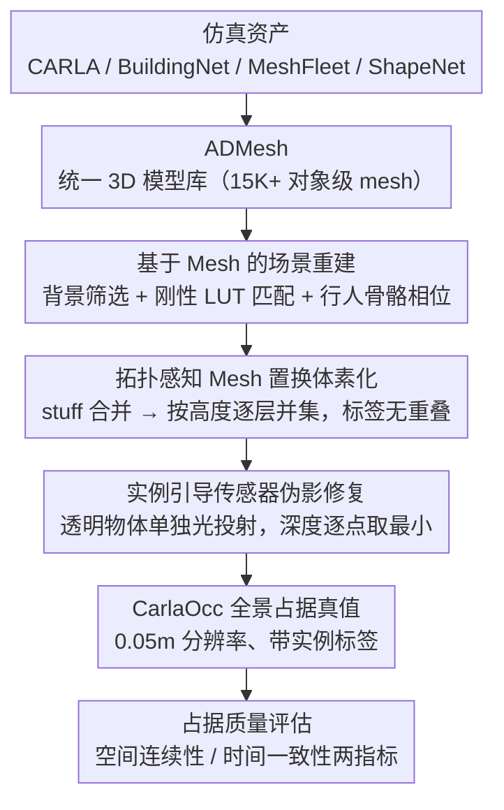

# An Instance-Centric Panoptic Occupancy Prediction Benchmark for Autonomous Driving

**会议**: CVPR 2026  
**arXiv**: [2603.27238](https://arxiv.org/abs/2603.27238)  
**代码**: [https://mias.group/CarlaOcc](https://mias.group/CarlaOcc)  
**领域**: 自动驾驶  
**关键词**: 全景占据预测, 3D Mesh库, CARLA仿真, 实例级标注, 占据数据集质量

## 一句话总结
提出ADMesh（15K+高质量3D模型库）和CarlaOcc（10万帧、0.05m精度的全景占据数据集），首次为自动驾驶3D全景占据预测提供实例级标注和物理一致的地面真值，并引入占据质量评估指标和系统基准测试。

## 研究背景与动机

**领域现状**：3D占据预测正从纯语义占据向细粒度的全景占据（语义+实例联合预测）发展。SparseOcc、PanoOcc等方法已提出，但受限于数据集质量。

**现有痛点**：(1) 现有数据集缺乏实例级标注——SparseOcc/PaSCo通过启发式（3D框分组/聚类）生成伪全景标签，引入边界伪影和实例重叠；(2) 现有地面真值基于LiDAR点云聚合+体素化，分辨率粗糙(0.2-0.5m)、几何不完整（仅传感器可见面）、物理不一致（空洞和断裂）；(3) 缺乏统一的高质量3D模型库——现有资源碎片化、平台绑定。

**核心矛盾**：全景占据预测需要精确的实例级几何标注，但现有数据集的生成管线（LiDAR聚合→体素化）从根本上无法提供物理一致且完整的地面真值。

**切入角度**：从3D mesh出发而非点云——mesh蕴含完整几何，可在任意分辨率下体素化。

**核心idea**：构建统一的3D模型库(ADMesh)→CARLA仿真重建完整场景mesh→拓扑感知体素化生成物理一致的全景占据标签。

## 方法详解

### 整体框架
这篇论文要解决的是全景占据预测「无好数据可用」的问题：现有地面真值由 LiDAR 点云聚合后体素化得到，分辨率粗、几何残缺、还缺实例标注。作者换了一条生成路线——从 3D mesh 出发，因为 mesh 本身蕴含完整几何，可以在任意分辨率下体素化。整条管线分两步走：先把散落在各仿真平台里的资产整理成一个统一的 3D 模型库 ADMesh，再用 CARLA 仿真逐帧重建完整的场景 mesh，经拓扑感知体素化和传感器伪影修复，产出物理一致、带实例标签的全景占据真值（即数据集 CarlaOcc），最后配上一套衡量数据集质量的指标和基准测试。

### 关键设计

**1. ADMesh：把碎片化的仿真资产整理成统一模型库**

要从 mesh 生成数据，前提是手里有一批干净、标注一致的 3D 模型，但现实是仿真平台的资产高度碎片化、命名和坐标系各异、还绑死在各自平台上。ADMesh 整合了 CARLA、BuildingNet、MeshFleet、ShapeNet 四个来源、共 15K+ 模型，关键是一套自动化的 mesh 导出工具链：遍历 CARLA 场景提取组件级 mesh 资产，通过 UE 编辑器接口查询每个组件的层级与变换，并集成 CARLA 原生的语义标注系统，最后按层级把零件组装回完整的对象级 mesh。统一的数据组织框架保证命名、坐标系、语义层级三者一致，这样后续大规模数据集构建才能直接复用，而不必每次重新对齐。

**2. 基于 Mesh 的场景重建：用完整几何取代稀疏点云**

LiDAR 点云聚合的根本问题是稀疏采样加遮挡，物体背面和被挡部分天然缺失。这里改成逐帧直接用 mesh 重建整张全景场景 mesh，分三类处理：静态背景筛出与占据区域相交的背景 mesh $\mathcal{S}_{bg}$；刚性前景（车辆等）用查找表（LUT）从 ADMesh 匹配出对应模型 $\mathcal{S}_{fg}^r$；非刚性前景（行人）最棘手，因为姿态在变，作者设计了骨骼运动分析器——把步行动画预处理成 $D$ 个离散相位的模板 mesh，运行时把当前骨骼状态 $\delta_k$ 通过测地线距离匹配到最近的相位 $d_k = \arg\min_d \mathcal{G}(\delta_k, \delta_d)$，从而用模板拼出当前帧的行人形状。三类合并即得到该帧的全景 mesh $\mathcal{M}^{pano} = \mathcal{S}_{bg} \cup \mathcal{S}_{fg}^r \cup \mathcal{S}_{fg}^n$。因为每个对象都来自完整 mesh，重建出的几何不再有 LiDAR 那种空洞和断裂。

**3. 拓扑感知 Mesh 置换策略：从场景 mesh 干净地体素化出无重叠标签**

有了全景 mesh 还不能直接逐 mesh 独立体素化——那样既费算力，多个 mesh 落进同一体素时又会标签打架。作者的做法是先按语义类别把 stuff（背景类）mesh 合并，消除冗余的内部边界；再把实例按世界坐标高度排序，从低到高逐层体素化并集成，保证低层结构（如地面）不会被高层物体的体素覆盖掉。这样一遍下来，每个体素只归属一个语义/实例，输出天然无重叠。

**4. 实例引导的传感器伪影修复：纠正透明物体的深度/语义错误**

CARLA 渲染透明或半透明物体（如车窗、玻璃）时，深度和语义会错误地穿透到背后的不透明物体上，直接体素化会把这些错误写进真值。修复思路是单独构建一张「只含透明物体」的场景 mesh，对它做光线投射得到这些物体的准确深度，再与原始深度逐点取最小值——离相机更近的透明表面深度就这样被找回来，覆盖掉穿透误差。

**5. 占据质量评估指标：给「数据集好不好」一个可量化的标准**

过去比较占据数据集多靠分辨率等表层数字，作者补了两个直接刻画标签质量的指标。空间连续性分数 $s_{sc}$ 衡量同一语义类别的占据体素在空间上是否连成片（碎裂、空洞会拉低它，值越高越好）；时间一致性分数 $s_{tc}$ 衡量相邻帧之间占据标签是否稳定、不抖动（值越高表示时序越平滑）。两个指标共同把「几何完整 + 时序稳定」这件原本主观的事变成可对比的数字，也正是后面 CarlaOcc 远超现有数据集的量化依据。

> ⚠️ 两个指标的具体计算公式以原文为准。

## 实验关键数据

### 数据集质量对比

| 数据集 | 合成 | 分辨率(m) | 实例标注 | $s_{sc}$↑ | $s_{tc}$↑ |
|--------|------|-----------|----------|-----------|-----------|
| SemanticKITTI | 否 | 0.2 | 无 | 0.353 | 0.023 |
| Occ3D-nuScenes | 否 | 0.4 | 无 | 0.721 | 0.431 |
| SurroundOcc | 否 | 0.5 | 无 | 0.878 | 0.589 |
| CarlaSC | 是 | 0.4 | 无 | 0.887 | 0.775 |
| **CarlaOcc (Ours)** | 是 | **0.05** | **有** | **0.996** | **0.873** |

### 基准模型测试（语义占据mIoU）

| 模型 | 关键发现 |
|------|----------|
| 多种SOTA方法 | 在CarlaOcc上训练的模型受益于更精细的地面真值 |
| 全景占据任务 | 首次可以在真实实例级标注上评估 |

### 关键发现
- CarlaOcc的空间连续性(0.996)和时间一致性(0.873)远超所有现有数据集
- 0.05m分辨率是现有最精细数据集(SemanticKITTI 0.2m)的4倍
- 实例引导修复流程有效纠正了透明物体的渲染伪影
- 基于mesh的生成管线完全避免了LiDAR聚合的信息丢失

## 亮点与洞察
- **从点云到Mesh的范式转变**：mesh蕴含完整几何信息，从根本上解决了LiDAR聚合管线的分辨率和完整性限制。这对合成数据集构建方法论有重大启发
- **骨骼运动分析器**：为非刚性物体(行人)的精确重建提供了优雅方案——预处理动画相位+运行时测地线匹配
- **质量评估指标**：首次定义了空间连续性和时间一致性的定量标准来评估占据数据集质量

## 局限与展望
- 合成数据的sim-to-real gap——在CarlaOcc上训练的模型能否迁移到真实驾驶场景？
- ADMesh资产主要来自CARLA，多样性仍受仿真平台限制
- 0.05m分辨率的体素量巨大，模型训练和推理的内存/计算开销需要考虑
- 行人动画仅覆盖步行循环，更复杂的人体动作（如弯腰、蹲下）需要扩展

## 相关工作与启发
- **vs Occ3D/SurroundOcc**: 基于LiDAR聚合的真实数据，几何不完整。CarlaOcc从mesh生成，物理一致但sim-to-real gap
- **vs CarlaSC**: 同为CARLA合成数据集，但缺乏实例标注且分辨率粗（0.4m vs 0.05m）
- **vs SparseOcc/PanoOcc**: 模型方法层面的创新，本文提供数据集层面的基础设施

## 评分
- 新颖性: ⭐⭐⭐⭐ 首个实例级全景占据基准，ADMesh和mesh重建管线有创新
- 实验充分度: ⭐⭐⭐⭐ 数据集质量评估全面，但下游模型benchmark可更丰富
- 写作质量: ⭐⭐⭐⭐⭐ 管线描述清晰完整，数据集统计详细
- 价值: ⭐⭐⭐⭐⭐ 为3D全景占据研究提供基础设施，推动领域发展

<!-- RELATED:START -->

## 相关论文

- [\[CVPR 2026\] PanDA: Unsupervised Domain Adaptation for Multimodal 3D Panoptic Segmentation in Autonomous Driving](panda_unsupervised_domain_adaptation_for_multimodal_3d_panoptic_segmentation_in_.md)
- [\[CVPR 2026\] Panoramic Multimodal Semantic Occupancy Prediction for Quadruped Robots](panoramic_multimodal_semantic_occupancy_prediction.md)
- [\[CVPR 2026\] M²-Occ: Resilient 3D Semantic Occupancy Prediction for Autonomous Driving with Incomplete Camera Inputs](m2-occ_resilient_3d_semantic_occupancy_prediction_for_autonomous_driving_with_in.md)
- [\[ICCV 2025\] UniOcc: A Unified Benchmark for Occupancy Forecasting and Prediction in Autonomous Driving](../../ICCV2025/autonomous_driving/uniocc_a_unified_benchmark_for_occupancy_forecasting_and_prediction_in_autonomou.md)
- [\[CVPR 2026\] DLWM: Dual Latent World Models enable Holistic Gaussian-centric Pre-training in Autonomous Driving](dlwm_dual_latent_world_models_enable_holistic_gaussian-centric_pre-training_in_a.md)

<!-- RELATED:END -->
