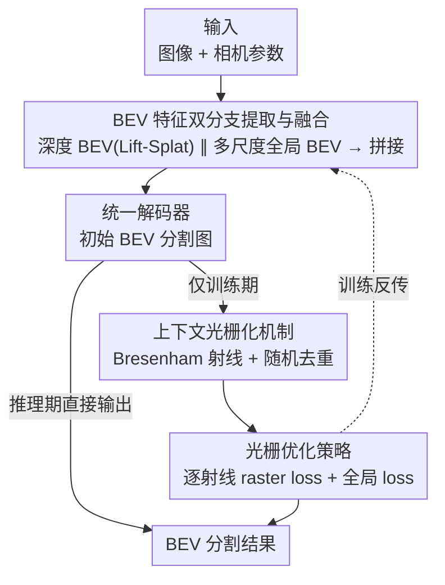

# BEV-CAR: Enhancing Monocular Bird's Eye View Segmentation with Context-Aware Rasterization

**会议**: CVPR 2026  
**论文**: [CVF Open Access](https://openaccess.thecvf.com/content/CVPR2026/html/Xiong_BEV-CAR_Enhancing_Monocular_Birds_Eye_View_Segmentation_with_Context-Aware_Rasterization_CVPR_2026_paper.html)  
**代码**: https://github.com/BEV-DAR/BEV-DAR  
**领域**: 自动驾驶 / BEV 感知  
**关键词**: 单目 BEV 分割, 上下文光栅化, 遮挡推理, 射线监督, 深度感知

## 一句话总结
BEV-CAR 用一个「训练时才开、推理时移除」的上下文光栅化机制，把解码器输出沿视线方向重排成一条条射线、按 Bresenham 算法离散采样后逐射线监督，再叠加深度+全局双分支 BEV 特征融合，在 nuScenes（mIoU 31.5%）和 Argoverse（29.9%）上拿到 SOTA，且推理零额外开销、43.1 FPS 实时。

## 研究背景与动机
**领域现状**：单目图像做 BEV 语义分割是自动驾驶里取代 lidar/radar 的低成本路线。主流方法分两类——一类在笛卡尔坐标系下用 transformer 编解码 + 类 GAN 解码器直接预测 BEV 图（部署友好但缺几何先验），另一类把 BEV 特征转到极坐标系（更贴近真实视角、深度建模更好，但要付出坐标变换的计算开销）。

**现有痛点**：笛卡尔方法没有沿视线方向的显式几何监督，对被前景物体遮挡的区域束手无策——这些区域不可见，靠先验做视角变换会让物体在 BEV 图上被「摊大」成异常大的区域，造成形变甚至内容缺失。极坐标方法虽然贴近视角，但把笛卡尔栅格直接转极坐标会反复重采样近端点（近大远小），导致远端被遮挡的不可见区域反而分不准，而且坐标变换本身有额外算力成本。

**核心矛盾**：笛卡尔「部署友好但缺视线方向几何监督」与极坐标「深度结构建模好但有变换开销且表示不兼容」之间存在二选一的取舍——想要遮挡感知的几何监督，似乎就得吞下坐标变换的代价。

**本文目标**：在保留标准笛卡尔 BEV 表示（推理零延迟、全兼容）的前提下，引入极坐标式的逐射线语义一致性监督，专门解决前景物体遮挡导致的分割失真。

**切入角度**：作者观察到——遮挡的本质是「沿同一条视线、近处物体挡住远处」，这是一个一维（沿射线深度方向）的结构问题，根本不需要把整张图转到极坐标。只要在训练阶段把 BEV 平面重新看成「从本车出发的一束离散射线」，沿射线把像素重排成 1D 序列（索引天然编码相对距离），就能在不做坐标变换、不破坏笛卡尔栅格的情况下注入「深度连续性 / 遮挡过渡 / 物体边界」这些几何先验。

**核心 idea**：用「训练期临时光栅化 + 逐射线损失」代替「推理期坐标变换」，把遮挡推理塞进损失函数而非网络结构，从而既拿到极坐标的几何监督、又保住笛卡尔的零开销部署。

## 方法详解

### 整体框架
BEV-CAR 的输入是单目（环视）图像 + 相机参数，输出是 BEV 语义分割图。整条流水线分三段：先用**双分支编码器**并行抽取深度 BEV 特征和多尺度全局 BEV 特征并融合，得到一张更完整鲁棒的 BEV 表示；统一解码器在此基础上产出初始 BEV 分割图；最后在训练阶段用**上下文光栅化机制**把解码器输出沿射线重排、随机去重，配合**光栅优化策略**（逐射线 raster loss + 全局 loss）做监督。关键在于：光栅化这一段只在训练时启用，推理时整段移除，因此推理就是「双分支特征融合 + 解码器」的标准笛卡尔流程，零额外开销。

### 关键设计

**1. BEV 特征双分支提取与融合：补上 lift-splat 固定深度投影的短板**

针对单目抬升（lift-splat）对远处小目标深度估计不准、物体边界糊的痛点，BEV-CAR 设计了一个分叉（bifurcation）编码器，让隐式深度与全局信息互补建模。深度分支沿用 LSS 的 lift-splat，把图像特征按隐式深度预测投到 BEV 空间，但它「难产出精确物体边界、抓不住长程空间关系」；于是再加一条全局分支做多尺度融合，关键 trick 是**按距离分配分辨率**——高分辨率特征图负责建模远处区域（远物体占像素少、需要更精细的特征），低分辨率图负责近处区域。每个尺度经 densetransformer 转成各自的 BEV 特征 $G_k \in \mathbb{R}^{C_k \times Z_k \times X_k}$，再做空间对齐的拼接：

$$G_{BEV} = \mathrm{Concat}_{k=0}^{K} G_k$$

把多尺度全局特征和隐式深度特征拼到一起，学到的 BEV 表示对前景物体深度更敏感、边界更清晰，这也是相比传统 lift-splat 固定深度投影的核心增益（消融里单加全局分支让 Object IoU 从 13.8% 跳到 23.7%）。

**2. 上下文光栅化机制：把遮挡当成沿射线的一维结构问题**

常规 BEV 把场景建模成均匀笛卡尔栅格，忽略了透视成像固有的「各向异性分辨率 + 遮挡结构」。本设计把 BEV 平面重新看成一束从本车光心出发的离散射线，沿每条射线按深度递增采样，形成一个 1D 序列、索引隐式编码相对距离，从而能在每条射线内部局部建模上下文（深度连续性、遮挡过渡、边界一致性），而不必动用昂贵的全局注意力或稠密邻域聚合。

具体怎么把一条射线落到离散栅格上？作者用 **Bresenham 直线算法**保证拓扑连续、无空隙。每条射线由光心 $(x_0,y_0)$ 与「视线方向交图像边界」的端点 $(x_1,y_1)$ 定义；在 $0\le m\le 1$、$x_0<x_1$ 的情形（其余八分圆用对称处理）下，决策变量初始化为 $d=2(y_1-y_0)-(x_1-x_0)$，然后迭代推进：$d\le 0$ 时取 $(x+1,y)$、否则取 $(x+1,y+1)$，并相应更新 $d$。这样产出一条 8-连通、保持深度序的像素路径。把这些射线重排成光栅图后，近端点会被反复重采样——这帮近处分割但伤远处。由于存的是每段射线的笛卡尔像素坐标，作者顺手做一个**随机去重**（类似删除操作）把部分重采样点去掉，让近端、远端都分得准。

**3. 光栅优化策略：逐射线 + TOP-K 硬样本挖掘的 raster loss，且训练专用**

光栅化只是重排，真正注入几何监督的是这条损失。损失分两部分：逐射线的 raster loss 和直接对全局 logits 算的 global loss。算 raster loss 前先做 **Random De-duplication**——给定分割图 $P\in\mathbb{R}^{B\times C\times W\times H}$、标签 $T$ 和射线集 $R$，对每条射线上的点 $p=(p_x,p_y)$ 取出 $l_r, t_r$，再以 dropout 式的概率 $p_{drop}=0.5$ 随机移除重复点，逼优化聚焦到「唯一点」、减少近端冗余、缓解过拟合。单射线的 raster loss 是二元交叉熵：

$$L_r(l_r, t_r) = -\sum_{r=1}^{N}\big[t_r\log(l_r) + (1-t_r)\log(1-l_r)\big]$$

多射线则套 **TOP-K**，只回传误差最大的 $k$ 条射线 $L_{raster} = \frac{1}{k}\sum_{r=1}^{k}\mathrm{topk}(L(l_r,t_r))$——相当于在有限射线里做在线难样本挖掘，专门盯遮挡、光照、远距离这些硬区域。全局损失用带类别权重 $w_i$ 的加权交叉熵 $L_{global}$（平衡类别不均衡）。总损失为 $Loss = \lambda L_{raster} + L_{global}$，$\lambda=10$。这套机制是即插即用的（plug-and-play），能挂到别的 BEV 分割方法上，且因为只在训练期存在，推理时整条光栅化分支移除，不引入任何额外参数或延迟。

### 损失函数 / 训练策略
总损失 $Loss=\lambda L_{raster}+L_{global}$，$\lambda=10$，$p_{drop}=0.5$。BEV 视野固定为车前 50m、两侧各 25m，分辨率 25cm/像素，输出 $200\times198$ groundtruth。单卡 A100，Adam，初始学习率 0.00018，weight decay 0.01，batch size 12；评估时忽略 lidar 打不到、无 groundtruth 的不可见栅格。

## 实验关键数据

### 主实验
nuScenes 验证集（IoU %，均沿用 PON 的数据划分）：

| 数据集 | 指标 | BEV-CAR | 之前最好 | 说明 |
|--------|------|---------|----------|------|
| nuScenes | Mean IoU | **31.5** | OEBEV 29.3 / TaDe 29.2 | 全类平均 SOTA |
| nuScenes | Crossing | **48.3** | GitNet 41.6 | 人行横道大幅领先 |
| nuScenes | Walkway | **49.2** | TaDe 42.3 | 人行道大幅领先 |
| nuScenes | Drivable | 70.9 | FTVP 75.7 | 可行驶区域次优 |
| nuScenes | Bus | **38.9** | TaDe 38.5 | 大目标检测强 |
| Argoverse | Mean IoU | **29.9** | HFT 29.7 | 新 SOTA |
| Argoverse | Drivable | 81.2 | FTVP 83.5 | 道路结构强 |
| Argoverse | Vehicle | **43.1** | TIM 35.8 | 车辆分割明显领先 |

计算开销（nuScenes，1024×1024，RTX 4090）：

| 方法 | FLOPs | Params | FPS |
|------|-------|--------|-----|
| **BEV-CAR** | 125.82G | 34.54M | **43.1** |
| HFT | 122.02G | 43.97M | 34.6 |
| PON | 135.67G | 37.42M | 35.3 |

CAR 机制不增加任何参数与推理开销，仅 BEV 特征融合分支带来极小参数量，仍跑到 43.1 FPS 实时。

### 消融实验
组件消融（nuScenes，DB=深度 BEV 分支，GB=全局 BEV 分支，RL=raster loss）：

| DB | GB | RL | Layout | Objects | Mean |
|----|----|----|--------|---------|------|
| ✓ | | | 41.2 | 13.8 | 27.5 |
| ✓ | ✓ | | 44.8 | 23.7 | 34.4 |
| ✓ | ✓ | ✓ | **50.6** | 23.9 | **37.3** |

> ⚠️ 正文叙述里 baseline mean 写作 21.8%、加全局后 28.1%、最终 31.5%，与表 7 的 27.5/34.4/37.3 数值不一致（疑似正文与表格统计口径不同，如是否含不可见栅格）——以原文表格为准。

$p_{drop}$ 敏感性（nuScenes val）：

| $p_{drop}$ | 0.0 | 0.3 | **0.5** | 0.7 |
|------------|-----|-----|---------|-----|
| Layout IoU | 51.5 | 50.9 | 50.6 | 48.5 |
| Object IoU | 21.0 | 22.9 | **23.9** | 22.1 |

即插即用泛化（挂到 PYVA / PON 上，Mean IoU）：PYVA 22.13 → +CAR 27.99；PON 23.08 → +CAR 25.47。恶劣条件：雨天 mIoU 32.4 → 35.8，夜间 30.3 → 33.6。

### 关键发现
- **全局分支贡献最大**：加 GB 让 Object IoU 从 13.8 跳到 23.7（+9.9），说明前景物体分割主要靠多尺度全局上下文补足，而非单靠 lift-splat 深度分支。
- **raster loss 主攻 layout**：加 RL 让 Layout 从 44.8→50.6（+5.8）、Object 几乎不动（+0.2），印证逐射线监督主要在规整布局类的空间一致性、增强被遮挡布局的推理。
- **$p_{drop}=0.5$ 是甜点**：太低（≤0.4）会过拟合近端点（layout 高、object 低），太高（>0.5）丢点过多两边都掉；0.5 取得 layout/object 的最佳平衡。
- **远距离与遮挡场景增益明显**：30–56m 远端在 Construction Vehicle、Trailer 等难类上持续领先，作者归因于 raster loss 提升了深度相关上下文的敏感度。

## 亮点与洞察
- **「训练期监督、推理期移除」是最巧的一招**：把遮挡推理做成损失函数而不是网络模块，既吃到极坐标射线的几何先验，又完全不碰推理图的笛卡尔结构，做到零额外参数/延迟——这是「鱼与熊掌兼得」的典型范式，值得迁移到其他「想加结构先验又怕拖慢部署」的任务。
- **用 Bresenham 算法把极坐标射线落进笛卡尔栅格**：避免了整图坐标变换，又保证 8-连通无空隙、深度有序，是个轻量又干净的工程实现。
- **随机去重 = 沿射线的 dropout**：近端被重采样多次本是 Bresenham 的副作用，作者反手用 dropout 式随机去重把它变成正则化手段，平衡近/远端，思路很顺。
- **即插即用得到验证**：CAR 挂到 PYVA/PON 上都涨点，说明这是个可复用的训练侧增强，而非和特定 backbone 绑死。

## 局限性 / 可改进方向
- **正文与表格数值口径不一致**（baseline 21.8 vs 27.5 等），论文未明确解释，读者复现时需注意对齐评估设置。
- **可行驶区域等大类反而次优**（Drivable 在 nuScenes/Argoverse 都没拿第一），方法的增益偏向遮挡/小目标/远端难类，对本就好分的大面积布局帮助有限。
- **射线建模假设光心出发的直线视线**，对鱼眼/强畸变相机或多相机重叠区的射线定义可能要额外处理，论文未展开。
- **raster loss 只在训练生效**意味着推理时模型完全靠内化的特征——若训练数据遮挡分布与部署场景差异大，这种「软监督」能否泛化值得进一步验证。
- 作者提到可延伸到端到端自动驾驶等任务，但本文未给出该方向的实验。

## 相关工作与启发
- **vs 极坐标方法（TIM / TaDe / GitNet / PCBEV）**：它们把 BEV 真转到极坐标来建模深度，代价是变换开销 + 近端重采样 + 表示不兼容；BEV-CAR 只在训练时用极坐标式射线采样做监督，推理仍是纯笛卡尔，拿到几何先验却不付变换代价。
- **vs 笛卡尔生成式解码（MonoLayout / PYVA / VPN）**：它们缺几何先验、物体易被预测得过近/摊大；BEV-CAR 用逐射线 raster loss 显式补上视线方向的几何监督，且能即插即用地挂到 PYVA/PON 上涨点。
- **vs lift-splat（LSS）**：LSS 固定深度投影对远处小目标边界糊；BEV-CAR 在其上加多尺度全局分支（按距离分配分辨率）做融合，提升前景深度与边界精度。

## 评分
- 新颖性: ⭐⭐⭐⭐ 「训练期光栅化监督、推理期移除」+ Bresenham 射线 + 随机去重的组合很巧，首次用上下文光栅化解单目 BEV 遮挡。
- 实验充分度: ⭐⭐⭐⭐ 两数据集 SOTA + 组件/超参/泛化/恶劣条件/距离分段多角度消融，但正文与表格数值口径不一致是瑕疵。
- 写作质量: ⭐⭐⭐⭐ 动机推导清晰、公式给全；个别统计口径未对齐、图依赖文字描述。
- 价值: ⭐⭐⭐⭐ 零推理开销 + 即插即用 + 实时 43.1 FPS，对实际部署很友好。

<!-- RELATED:START -->

## 相关论文

- [\[CVPR 2026\] BEV-SLD: Self-Supervised Scene Landmark Detection for Global Localization with LiDAR Bird's-Eye View Images](bev-sld_self-supervised_scene_landmark_detection_for_global_localization_with_li.md)
- [\[CVPR 2026\] CycleBEV: Regularizing View Transformation Networks via View Cycle Consistency for Bird's-Eye-View Semantic Segmentation](cyclebev_regularizing_view_transformation_networks_via_view_cycle_consistency_fo.md)
- [\[CVPR 2026\] Spe-BEVHead: Rethinking the Detection Head Design for Bird's-Eye-View Object Detection](spe-bevhead_rethinking_the_detection_head_design_for_birds-eye-view_object_detec.md)
- [\[CVPR 2026\] MTA: Multimodal Task Alignment for BEV Perception and Captioning](mta_multimodal_task_alignment_for_bev_perception_and_captioning.md)
- [\[CVPR 2026\] Monocular Open Vocabulary Occupancy Prediction for Indoor Scenes (LegoOcc)](monocular_open_vocabulary_occupancy_prediction_for_indoor_scenes.md)

<!-- RELATED:END -->
