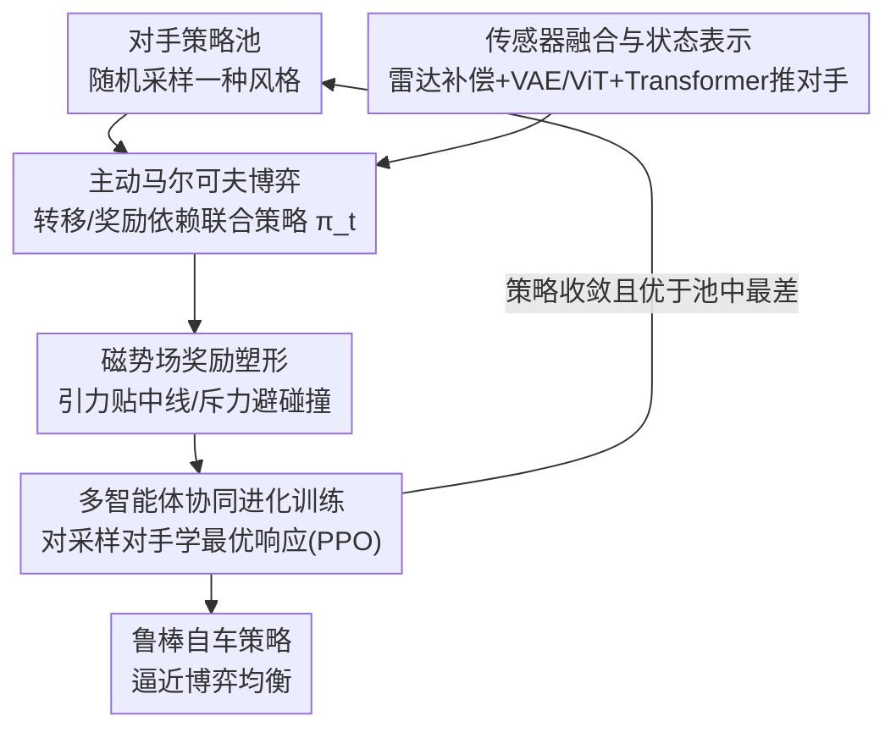

# Beyond Rule-Based Agents: Active Markov Games for Realistic Multi-Agent Interaction in Autonomous Driving

**会议**: CVPR 2026  
**论文**: [CVF Open Access](https://openaccess.thecvf.com/content/CVPR2026/html/Gui_Beyond_Rule-Based_Agents_Active_Markov_Games_for_Realistic_Multi-Agent_Interaction_CVPR_2026_paper.html)  
**代码**: 无  
**领域**: 自动驾驶  
**关键词**: 自动驾驶决策, 多智能体, 主动马尔可夫博弈, 协同进化训练, 势场奖励塑形  

## 一句话总结
把驾驶环境建模成"状态转移和奖励都依赖各智能体当前策略"的主动马尔可夫博弈（AMG），再用多智能体协同进化训练让自车策略和一池子风格各异的对手策略互相博弈、共同进化，从而在 CARLA 无信号灯路口和长尾场景里学到鲁棒的交互式决策，碰撞率压到 0.02、成功率到 98%。

## 研究背景与动机

**领域现状**：复杂城市场景（尤其是无红绿灯的路口、环岛）下的自动驾驶决策，主流走两条路——一是用大规模真实驾驶数据集做行为克隆/条件分布拟合，二是在 CARLA / SUMO 这类仿真平台里用深度强化学习（DRL）做试错学习。

**现有痛点**：真实数据集大多采自交通设施完善、驾驶守规的地区，几乎拍不到"恶意加塞、违规超车、行人突然窜出"这类长尾交互，分布外场景一来模型就因样本稀疏、因果信息不足而失效。仿真这条路看似能造极端场景，但**周围车辆几乎都被简化成 rule-based agent**——轨迹预设、遇障碍就停，根本不会对自车的策略做出反应。

**核心矛盾**：rule-based 对手是"非响应"的，它不会因为你变激进就变保守、也不会因为你犹豫就抢行。这就抹掉了真实交通里司机之间的**策略耦合**——而恰恰是这种"你来我往"的博弈才是路口决策的难点所在。即便上了 MARL，多智能体同时更新又带来环境非平稳，训练不稳、难收敛到合作均衡。

**本文目标**：(1) 给环境一个能显式表达"我的对手会随我而变"的数学框架；(2) 让自车在训练时真正见到多样且会进化的对手行为，而不是一成不变的木头桩子。

**核心 idea**：用**主动马尔可夫博弈（AMG）**把状态转移核与奖励函数写成依赖联合策略 $\pi_t$ 的函数，再用**多智能体协同进化**——每个智能体维护一个策略池，对手每局从池中随机采样一个风格去和自车博弈，自车学对该混合对手的最优响应，收敛后把新策略塞回池子，逐步逼近博弈均衡。

## 方法详解

### 整体框架

系统要解决的是"如何让自车在仿真里见到真实、多样、会反应的对手"。整体分两层：底层是**AMG 环境抽象**，把环境从被动物理系统变成会随策略响应的博弈实体；上层是**协同进化训练**，让自车与一池对手策略交替学习、互相适应。

单步决策的数据流是：多源传感器（雷达做运动补偿+聚类、前视相机过 VAE 与 ViT、高精地图、车辆状态）融合成统一观测 → 经 Transformer 隐式推断对手策略并提取上下文特征 → 由高斯策略采样出动作（油门/刹车/转向）→ 送入 CARLA → 用磁势场公式算出稠密奖励。训练侧则是自车池与对手池各自维护、交替学习（alternating learning），每当某智能体策略收敛、其表现优于池中最差策略且池未满/可替换时，就把新策略加入池中扩充多样性。

### 关键设计

**1. 主动马尔可夫博弈（AMG）：让对手的策略真正改写环境**

针对"rule-based 对手不响应、策略耦合被抹掉"这一根本痛点。传统马尔可夫博弈（MG）假定状态转移核与奖励函数是平稳的，AMG 则让二者显式依赖所有智能体的联合策略 $\pi_t = (\pi_t^1,\dots,\pi_t^N)$：

$$s_{t+1} \sim P_U(s_{t+1} \mid s_t, a_t, \pi_t), \qquad r_t^i = R_U(s_t, a_t, \pi_t)$$

其中 $a_t=(a_t^1,\dots,a_t^N)$ 是联合动作。直观含义：同一个控制动作 $a_t$，在不同对手策略分布下会导向完全不同的结果。论文以汇入（merging）为例——自车采取一个低加速度，若对手是谨慎策略 $\pi_t^{\text{safe}}$ 则双方减速、进入安全状态 $s_{t+1}^{\text{safe}}$ 且 $r_t^i>0$；若对手是激进策略 $\pi_t^{\text{agg}}$ 则它可能加速封堵、撞上 $s_{t+1}^{\text{crash}}$ 且 $r_t^i<0$，形式化为：

$$P_U(s_{t+1}^{\text{safe}} \mid s_t, a_t, \pi_t^{\text{safe}}) > P_U(s_{t+1}^{\text{safe}} \mid s_t, a_t, \pi_t^{\text{agg}})$$

这一步的价值在于：它把"对手会因我而变"写进了环境动力学本身，给后面的交互学习提供了数学地基，而不只是在 reward 上打补丁。

**2. 传感器融合与状态表示：给博弈一个物理可信的观测，并隐式推断对手**

针对"决策要可靠就得有干净、物理意义明确的状态，同时还要能预判对手意图"。雷达走一条物理感知多级流水线：先做**自运动补偿**（扣掉传感器平移/旋转速度引起的表观运动，使雷达只反映周围物体真实运动）→ 丢弃低置信检测（修正径向速度过低或落在感兴趣区外）→ 对强运动候选用中位数绝对偏差（MAD）做鲁棒运动阈值抑噪 → 地平面聚类合并同一物体的多次反射 → 多帧门控确认（在方位、距离、速度上连续 $k$ 帧一致才确认）维护轻量时序航迹。前视相机图像并行过 **VAE + ViT** 提取高维视觉特征，再与雷达、车辆状态（速度/角度/加速度/历史轨迹）和地图融合成统一观测向量。融合后的特征喂给 **Transformer 模块隐式推断对手策略**并输出上下文，最终由高斯策略采样动作。把感知物理先验和决策紧耦合，是为了让后续博弈式 RL 拿到的输入是"可信的真实运动"而非被自车运动污染的假象。

**3. 多智能体协同进化训练：用策略池+最优响应消灭"非响应对手"**

针对"固定对手训练导致自车只学会保守慢行、学不到博弈行为"。每个智能体维护策略池 $P_i=\{\pi_1^i,\pi_2^i,\dots,\pi_K^i\}$，每个元素是某一训练阶段学到的策略。每局开始时对手从池中（随机或按分布）采样，给自车造一个多样、自适应的交互环境，防止过拟合到单一对手。采样得到的混合策略写作：

$$\bar\pi^{-i} = \sum_k w_k \pi_k^{-i}, \quad \text{s.t.} \ \sum_k w_k = 1$$

自车的目标是对该对手混合学一个最优响应策略 $\pi_{\text{BR}}^i$，在随机多智能体转移动力学下最大化期望回报：

$$\max_{\theta_i} \ \mathbb{E}_{s_t,a_t \sim (\pi_{\text{BR}}^i,\bar\pi^{-i})} \left[ \sum_{t=0}^{T} \gamma^t r^i(s_t,a_t) \right]$$

连续控制下用 **PPO** 稳定训练；自车策略一旦收敛就把新策略加入池中扩充多样性，自车池与对手池**交替学习**（各自有 RL buffer）。这个"学→入池→再采样博弈"的迭代过程，让系统逐步被推向博弈均衡（论文称逼近纳什均衡 ⚠️ 以原文为准，文中未给收敛性证明），自车因此间接吸收了各种驾驶风格。

**4. 磁势场奖励塑形：用引力/斥力给稀疏奖励灌入稠密信号**

针对"路口交互的奖励天然稀疏，训练难稳"。把自车-道路交互视为**引力势**（鼓励贴合导航中线），把自车-对手交互视为**斥力势**（避免碰撞），奖励对相邻时刻的势差求和：

$$r_{\text{shape}} = w_{\text{int}}\big(\Phi_{\text{int}}(t_n)-\Phi_{\text{int}}(t_{n-1})\big) + w_{\text{lane}}\big(\Phi_{\text{lane}}(t_n)-\Phi_{\text{lane}}(t_{n-1})\big)$$

交互势同时吃进安全距离与碰撞时间（TTC）：

$$\Phi_{\text{int}} = w(d)\,(\alpha U_d(d) + \beta U_{\text{TTC}}), \quad U_d(d)=\frac{1}{d^{k_d}}, \quad \text{TTC}=\frac{d}{\max(c,\varepsilon)}$$

车道势则惩罚偏离中线与航向偏差 $\Delta\psi$：

$$\Phi_{\text{lane}} = \frac{1}{2}\left( \Big(\frac{d}{d_{\max}}\Big)^2 + \Big(\frac{|\Delta\psi|}{\psi_{\max}}\Big)^2 \right)$$

势差形式保证奖励稠密又不破坏最优策略（势函数塑形的经典性质），让智能体稳定地学会保持安全距离、贴合中线。

### 一个完整示例：一局无信号灯汇入

训练开始，对手从其策略池里随机采到一个"激进"风格 $\pi^{\text{agg}}$。自车前视相机经 VAE/ViT 拿到视觉特征，雷达做完运动补偿、MAD 去噪、多帧确认后给出对手车的稳定航迹，融合成观测后 Transformer 推断"这个对手大概率不让"。在 AMG 下，自车若沿用低加速度的保守动作，转移核会高概率把它带向碰撞态 $s^{\text{crash}}$，磁势场的斥力项立刻给出强负奖励；自车于是在 PPO 更新中学会先让后抢或调整时序，TTC 项把它从危险时刻拉开。几万步后自车策略收敛、回报优于对手池里最差策略，新策略被加入池中；下一阶段对手又能采样到这个更强风格——双方就这样螺旋上升。

## 实验关键数据

仿真平台 CARLA（Town10HD、Town02），配置无信号灯路口、T 字口、长尾冲突路线；A100 训练，每策略约 100,000 交互步，3 个随机种子（0/45/2025），每场景 100 次评测取平均。测试集还含训练未见的环岛与汇入场景以测泛化。默认超参：交互距离 $R_{\text{int}}=17$、$k_d=2.0$、$\alpha_{\text{rep}}=0.5$、$\beta_{\text{ttc}}=0.5$、$w_{\text{int}}=0.6$、预测步长 1。

### 主实验

不同对手设定下的综合对比（节选关键指标，↓ 越低越好 / ↑ 越高越好）：

| 框架 / 对手 | 方法 | 碰撞↓ | Return↑ | 路径偏差↓ | 安全裕度↑ | OOD成功率↑ | 控制平滑↑ |
|------|------|------|---------|----------|-----------|------------|-----------|
| 单智能体·规则对手 | PPO | 0.08 | 132.98 | 0.986 | 3.65 | 0.92 | 0.44 |
| 单智能体·规则对手 | DDPG | 0.13 | 120.43 | 1.120 | 2.76 | 0.85 | 0.35 |
| 单智能体·多样对手 | PPO | 0.60 | 68.33 | 0.932 | 0.41 | 0.40 | 0.32 |
| 多智能体·规则对手 | IPPO | 0.03 | 132.51 | 0.876 | 2.13 | 0.97 | 0.42 |
| **多智能体·规则对手** | **Ours** | **0** | **138.93** | **0.865** | 3.17 | **1.0** | **0.45** |
| 多智能体·多样对手 | IPPO | 0.29 | 126.30 | 0.942 | 1.15 | 0.71 | 0.39 |
| **多智能体·多样对手** | **Ours** | **0.02** | **133.74** | **0.882** | 2.12 | **0.98** | 0.43 |

关键对比：单智能体方法一旦把规则对手换成多样对手，安全指标崩盘（PPO 碰撞从 0.08→0.60、OOD 成功率 0.92→0.40），暴露其只是过拟合到确定性运动模式。IPPO 在面对多样对手时同样退化（碰撞 0.03→0.29）。本文方法在两种对手下都稳，多样对手下仍保持碰撞 0.02、OOD 成功率 0.98。

### 策略多样性

用动作序列两两余弦相异度 $1-\frac{a_i^\top a_j}{\|a_i\|\|a_j\|}$ 的平均衡量策略多样性，动作空间覆盖率则是被选不同动作数占动作空间的比例：

| 算法 | 策略多样性↑ | 动作空间覆盖↑ |
|------|------------|--------------|
| Rule-based | 0.1023 | 0.1547 |
| 单智能体训练 | 0.3278 | 0.4125 |
| 交互训练（Ours） | **0.5841** | **0.6394** |

交互训练把多样性从规则的 0.10 拉到 0.58、覆盖率从 0.15 拉到 0.64，说明协同进化确实造出了行为更丰富的策略空间。

### 消融实验

多智能体设定下逐模块移除：

| 配置 | OOD成功率↑ | 碰撞↓ | 说明 |
|------|-----------|------|------|
| Full Model (Ours) | 0.98 | 0.02 | 完整模型 |
| w/o 策略推断模块 | 0.84 | 0.15 | Transformer 推对手，掉 0.14、碰撞翻 7 倍 |
| w/o 策略池模块 | 0.81 | 0.17 | 没了对手多样性，泛化最受伤 |
| w/o 地图模块 | 0.62 | 0.23 | 缺地图先验，感知与避碰大跌 |
| w/o 完美感知模块 | 0.54 | 0.46 | 感知质量最关键，碰撞飙到 0.46 |

### 关键发现
- **感知与地图是底座**：去掉"完美感知"碰撞率从 0.02 暴涨到 0.46、去掉地图到 0.23，说明再好的博弈策略也撑不住糟糕的状态输入——感知/地图模块的边际贡献最大。
- **策略池与策略推断撑起泛化**：二者分别贡献 OOD 成功率约 0.17 / 0.14 的下降，正好对应"见过多样对手"和"能预判对手"这两件协同进化的核心能力。
- **超参要适中**：交互半径 $R$ 在 15–17m、$k_d$ 在 1.5–2.0、$w_{\text{int}}$ 在 0.4–0.6、$\beta$ 在 0.5–0.6 时回报与 OOD 成功率最佳；$\beta\approx0.9$ 会让自车避碰过度激进、甚至冲出车道，回报与安全双降——稠密奖励的强度需要克制。

## 亮点与洞察
- **AMG 把"对手非响应"这个老问题数学化了**：以往大家靠加规则、加场景来缓解，本文直接把转移核/奖励写成 $\pi_t$ 的函数，从环境定义层面承认"对手会因我而变"，这是最干净的抽象。
- **策略池 + 自我博弈在自动驾驶语境的落地很自然**：把围棋/星际里的 self-play 思路移植到交通，对手池采样直接造出多样且会进化的交互对象，解决了仿真长尾覆盖不足的痛点——这套"维护历史策略池、概率采样、收敛即入池"的范式可迁移到任何需要对抗多样对手的具身交互任务。
- **磁势场奖励是物理直觉与势函数塑形的巧妙结合**：引力贴中线、斥力避碰，且用相邻时刻势差保证不改变最优策略，给路口稀疏奖励问题一个稠密又安全的解。

## 局限与展望
- **作者侧**：测试全是两车设定，密集多车（>2）的强耦合场景未验证；"逼近纳什均衡"只在叙述层面提出，没有给出收敛性分析或均衡度量。
- **自己发现的**：消融里去掉"完美感知"碰撞率到 0.46，反过来说全套结果可能依赖较理想的感知输入，真实噪声下的鲁棒性存疑；对手池的策略数量 $K$、混合权重 $w_k$ 怎么取、池满后如何淘汰，正文交代得较粗（仅"优于池中最差则替换"），复现细节不足。⚠️ 部分超参定义（如安全因子、$c,\varepsilon$ 取值）需以原文为准。
- **改进思路**：把两车扩到 $N$ 车、引入按对手强度自适应的采样分布（优先采样能打败自车的对手，类似 prioritized fictitious self-play）、并在带感知噪声/延迟的闭环里重测安全裕度。

## 相关工作与启发
- **vs 数据驱动/模仿学习**：行为克隆受限于真实数据集的分布，长尾交互几乎拍不到；本文用仿真+博弈主动造出激进、违规等极端交互，覆盖了数据拍不到的尾部。
- **vs 单智能体 DRL（DQN/PPO/DDPG）**：它们在静态环境优化单一策略、对手是非响应的，换成多样对手立刻退化（PPO 碰撞 0.08→0.60）；本文让对手会进化、自车学最优响应，多样对手下仍稳。
- **vs MARL（IPPO）**：IPPO 虽是 CTDE、能建交互，但对手行为多样性不足、常退化为"停车让行"的单一保守模式，自车靠慢行就能刷高成功率、学不到真博弈；本文用策略池强制注入多样性，逼自车学出更复杂的交互行为。

## 评分
- 新颖性: ⭐⭐⭐⭐ 把 AMG（策略依赖的转移/奖励）+ self-play 策略池系统性落到自动驾驶路口交互，框架抽象干净。
- 实验充分度: ⭐⭐⭐ CARLA 下对比/消融/超参/多样性四类实验齐全，但全是两车、缺密集多车与真实感知噪声验证。
- 写作质量: ⭐⭐⭐⭐ 动机与 AMG 公式讲得清楚，图 3 流水线信息量大；部分符号与超参定义偏简。
- 价值: ⭐⭐⭐⭐ 对"仿真对手太木"这一行业痛点给了可迁移的博弈式训练范式，安全指标提升明显。

<!-- RELATED:START -->

## 相关论文

- [\[CVPR 2026\] DriveCombo: Benchmarking Compositional Traffic Rule Reasoning in Autonomous Driving](drivecombo_benchmarking_compositional_traffic_rule_reasoning_in_autonomous_drivi.md)
- [\[CVPR 2026\] RLFTSim: Realistic and Controllable Multi-Agent Traffic Simulation via Reinforcement Learning Fine-Tuning](rlftsim_realistic_and_controllable_multi-agent_traffic_simulation_via_reinforcem.md)
- [\[CVPR 2026\] Unsupervised Multi-agent and Single-agent Perception from Cooperative Views](unsupervised_multi-agent_and_single-agent_perception_from_cooperative_views.md)
- [\[CVPR 2026\] ActiveAD: Planning-Oriented Active Learning for End-to-End Autonomous Driving](activead_planning-oriented_active_learning_for_end-to-end_autonomous_driving.md)
- [\[CVPR 2026\] F3DGS: Federated 3D Gaussian Splatting for Decentralized Multi-Agent World Modeling](f3dgs_federated_3d_gaussian_splatting_for_decentralized_multi-agent_world_modeli.md)

<!-- RELATED:END -->
