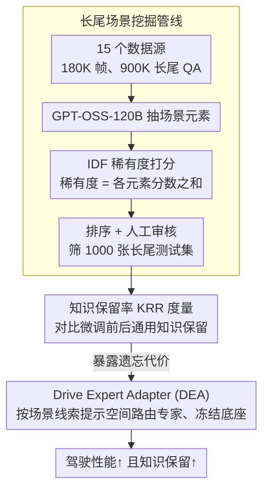

# The Blind Spot of Adaptation: Quantifying and Mitigating Forgetting in Fine-tuned Driving Models

**会议**: CVPR 2026  
**arXiv**: [2604.04857](https://arxiv.org/abs/2604.04857)  
**代码**: [FidelityDrivingBench](https://github.com/FidelityDrivingBench)  
**领域**: LLM安全  
**关键词**: catastrophic forgetting, VLM, autonomous driving, benchmark, expert adapter

## 一句话总结

系统研究 VLM 微调到自动驾驶场景时的灾难性遗忘问题，构建 180K 场景大规模基准 FidelityDrivingBench，并提出 Drive Expert Adapter (DEA) 通过提示空间路由在不腐蚀基础参数的前提下增强驾驶任务性能。

## 研究背景与动机

VLM 在自动驾驶中的应用日益增多，但存在根本性悖论：用于适配驾驶数据的微调过程恰恰会侵蚀预训练世界知识，而这些知识正是使用 VLM 的核心动机。微调导致的灾难性遗忘会使模型在长尾场景中忽略障碍物（如路沿、岩石），造成不安全轨迹。

现有基准无法检测此类退化——训练集和测试集保持相似分布，掩盖了真实的知识丢失。该论文首次系统调查 VLM 自动驾驶中的灾难性遗忘，提出专门设计的基准来量化遗忘程度。

## 方法详解

### 整体框架

论文先造了一个能照出“遗忘”的尺子，再给一个不伤基础参数的适配办法。具体是构建 FidelityDrivingBench（180K 场景、900K 长尾 QA 对、15 个数据源）来量化微调带来的灾难性遗忘，数据管线用 GPT-OSS-120B 从语言标注里抽场景元素、按 IDF 稀有度自动挖长尾场景；在此之上提出 DEA，把知识适配从权重空间挪到提示空间，按场景动态路由专家、不动基础参数。

### 关键设计

**1. 长尾场景挖掘管线：用 IDF 稀有度自动挖出会暴露遗忘的场景**

普通基准的训练集和测试集分布相似，遗忘被掩盖了、根本测不出来。作者从语言标注中提取关键场景元素（路况、交通参与者等），给每个元素算 IDF（逆文档频率）稀有度分数，场景总稀有度 = 各元素分数之和，据此从 180K 候选场景里排序、再加人工审核，筛出 1000 张代表性长尾图像作为遗忘测试集。稀有场景（路沿、岩石这类长尾障碍物）正是微调后最容易被“忘掉”的，专挑它们才能把退化照出来。

**2. 知识保留率 (KRR) 度量：给“忘了多少”一个标准化指标**

光有难场景还不够，得有个可比的数字。KRR 量化微调前后模型在非驾驶通用知识上的保留程度，在识别路沿、岩石等长尾障碍物这类通用能力上对比微调前后的表现，提供标准化的遗忘评估指标，让不同适配策略的“遗忘代价”可以直接比大小。

**3. Drive Expert Adapter (DEA)：在提示空间路由专家，绕开权重腐蚀**

全微调能提驾驶性能却严重遗忘，根子在于它改的是权重、把预训练世界知识也覆盖掉了。DEA 把适配从权重空间转移到提示空间：根据场景特定线索（可见度、交通密度）和提示语义，动态路由到不同的驾驶专家，基础参数保持不变。这样驾驶适配和知识保留被解耦——既拿到专家带来的驾驶增益，又不腐蚀底座知识。

### 损失函数 / 训练策略

DEA 只训练轻量的路由和提示参数。作者对比了全微调、冻结层、LoRA 等策略，发现全微调遗忘最重、LoRA 能缓解遗忘但驾驶性能不够，且 LoRA 易受任务诱导的注意力偏差影响——这也是 DEA 选择不碰底座权重的依据。

## 实验关键数据

### 主实验

| 方法 | 驾驶任务性能 | KRR | 说明 |
|------|-----------|-----|------|
| 全微调 | 高 | 低 | 严重遗忘 |
| LoRA | 中 | 高 | 性能不够 |
| DEA (Ours) | 高 | 高 | 两者兼顾 |

FidelityDrivingBench 覆盖 3 个核心驾驶任务（场景理解、运动分析、轨迹规划），15 个数据源（nuScenes、WOD-E2E 等），共 180K 帧和 900K 长尾 QA 对。长尾测试集通过 IDF 稀有度分数自动挖掘 + 人工审核筛选 1000 张代表性图像。KRR 在非驾驶通用知识（如识别路沿、岩石等长尾障碍物）上评估微调前后的保留程度。

### 关键发现

- 多源数据训练比单数据集训练遗忘程度低、KRR 更高
- 现有基准过于关注 QA 数量而忽视场景多样性
- LoRA 不足以完全弥合领域差距，且易受任务诱导的注意力偏差影响
- DEA 通过在提示层面路由不同知识专家，有效解耦驾驶适配和知识保留

## 亮点与洞察

- 首次系统揭示 VLM 自动驾驶微调中的遗忘问题，有重要安全意义
- IDF-based 长尾场景挖掘管线可自动化大规模发现稀有场景
- DEA 的提示空间路由思路优雅地回避了权重修改带来的遗忘

## 局限与展望

- DEA 的路由策略需要场景分类能力，可能受限于分类准确度
- 遗忘测试集仅 1000 张图像，覆盖的场景类型仍有限
- 在 RecogDrive + InternVL3-8B 上的可视化分析显示遗忘导致忽视路沿、岩石等长尾障碍物
- 未探索多专家路由间的动态平衡机制
- 灵感度分析显示即使等量规模的单源数据也比多源训练遗忘更严重

## 评分

- 新颖性：⭐⭐⭐⭐⭐ — 首次系统研究驾驶VLM遗忘
- 技术深度：⭐⭐⭐⭐ — 基准+分析+方法一体化
- 实验充分度：⭐⭐⭐⭐⭐ — 180K场景大规模验证
- 实用价值：⭐⭐⭐⭐⭐ — 直接关乎自动驾驶安全

<!-- RELATED:START -->

## 相关论文

- [\[CVPR 2026\] VGGDrive: Empowering Vision-Language Models with Cross-View Geometric Grounding for Autonomous Driving](vggdrive_empowering_vision-language_models_with_cross-view_geometric_grounding_f.md)
- [\[CVPR 2026\] Learning Vision-Language-Action World Models for Autonomous Driving](vla_world_learning_vision_language_action_world_models_for_autonomous_driving.md)
- [\[AAAI 2026\] DriveFlow: Rectified Flow Adaptation for Robust 3D Object Detection in Autonomous Driving](../../AAAI2026/autonomous_driving/driveflow_rectified_flow_adaptation_for_robust_3d_object_detection_in_autonomous.md)
- [\[CVPR 2026\] DLWM: Dual Latent World Models enable Holistic Gaussian-centric Pre-training in Autonomous Driving](dlwm_dual_latent_world_models_enable_holistic_gaussian-centric_pre-training_in_a.md)
- [\[CVPR 2026\] Plant Taxonomy Meets Plant Counting: A Fine-Grained, Taxonomic Dataset for Counting Hundreds of Plant Species](plant_taxonomy_meets_plant_counting_a_fine-grained_taxonomic_dataset_for_countin.md)

<!-- RELATED:END -->
